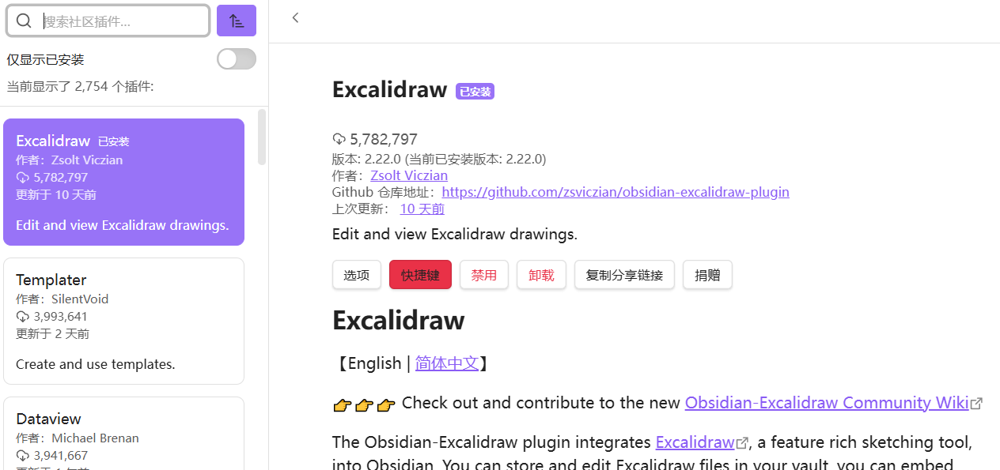
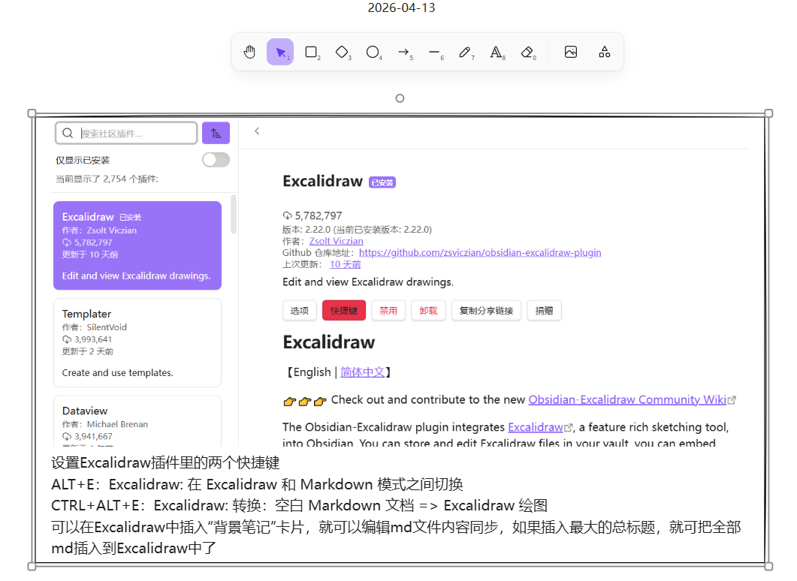

### 正式开始学习Obsidian

#### 在B站上关注了一个博主：枸杞加水，学习Obsidian的一些使用技巧。

#### 安装✅Calendar日历之后，在Obsidian的视图中仍旧不能显示出来

#### 安装绘图插件Excalidraw
	

	设置Excalidraw插件里的两个快捷键
		ALT+E：Excalidraw: 在 Excalidraw 和 Markdown 模式之间切换
		CTRL+ALT+E：Excalidraw: 转换：空白 Markdown 文档 => Excalidraw 绘图
	可以在Excalidraw中插入“背景笔记”卡片，就可以编辑md文件内容同步，如果插入最大的总标题，就可把全部md插入到Excalidraw中了


==⚠  Switch to EXCALIDRAW VIEW in the MORE OPTIONS menu of this document. ⚠== You can decompress Drawing data with the command palette: 'Decompress current Excalidraw file'. For more info check in plugin settings under 'Saving'


# Excalidraw Data

## Text Elements
## Element Links
QXhLRpQe: [[2026-04-13.md#安装绘图插件Excalidraw]]

%%
## Drawing
```compressed-json
N4KAkARALgngDgUwgLgAQQQDwMYEMA2AlgCYBOuA7hADTgQBuCpAzoQPYB2KqATLZMzYBXUtiRoIACyhQ4zZAHoFAc0JRJQgEYA6bGwC2CgF7N6hbEcK4OCtptbErHALRY8RMpWdx8Q1TdIEfARcZgRmBShcZQUebR44gAYaOiCEfQQOKGZuAG1wMFAwYogSbggARQANSQAZACU4CqR+EthEcvTNBGJiXE1glOLITG5nAHYADgA2bQBWcYBmHkWA

TgBGRPXxnnWAFlbIGDHx9bntafHp1dXxvem98amDgsgKEnVuPcnEi8m91bTHgLb6JNaHKQIQjKaRfHirbSrSaLfb7VaLOaPDEQ6zKQZoRIQ5hQUhsADWCAAwmx8GxSOUAMSJZksoYlTS4bBk5SkoQcYjU2n0iQk6zMOC4QJZNmQABmhHw+AAyrB8ehJJyNIEZRBiaSKQB1D6SbjrIkk8kIFUwNW6mllCG8mEccI5NBm14QNgS7BqY7u5mO4T8l3M

N2oDhCRVEhA9bjwvaLaYQxgsdhcNCJuYppisTgAOU4YlNe0ee0SmMm2c9QjgfSgcfdT2miR2ixmiVuEMIzAAImkG8RuLKCGEITzhHAAJLEcO5AC6EM0weIAFFghksnPF56iBwyeVcrkeIkeNNnIk9s51ottPpiAzAJHagFGIwAbfoA/tUAS8aAN7lVzgCCQ5AUPO846rSXKNqgI74GOnqyuQGQztwkbRp6GrMAAKlgUC1IQ+7DqOCBEu44ioPkwx

gB6FHrK8O7DBA2BCMSBi9rgUTcEU9H3gACqScgca8JRMQgADy9gkE4/YjlG2QETBRGCZAHJchOfLEAAsmx2CSJS1j0KEcmwRRSmctyvL8ppUDaeu6SZFA3AkkICnGRAylmSugp0oyso+TK7Kmap/IiT6frcC2hzsnSxBMJZ1kbnZDmkE5EVKVFTCecK6AMj5sp+alpDRaQwWcqFBIpRA8rBBwuAZAAaj2hADKR0FhIJAC+rxtd2/JYOUuDJAUHVg

HREC4HAcAqmxpGcdAki2eURAwvZrQMIQCAUAAQgF5kCjSXkSNlOW+StjGkFKUBTg2+gqvqVJ7ZlEAMusCDPc9bIMSI52XekW0qTtGXlKKHDipKCUnZ9dnffoABiCrKqqpF2h472nV9V03ZaRrEJ8aB8AUH1nZD6MWhS1q2oIyPg4TWRQ/UwjOq6ppU2j6TFb6sCmoG+Oo0T6TQ5wUDQzVCr+qg1YlDzNNXfzWRKoQRikSezO8/oWGYFAACCi0Zug

wSyst3MQ1L6STaQmtnWwFBzbgQ5oCh+DK8b+irvyGsW1bIS2+gkqklQjsXVdbu+xh8CIztKNGwHfMIQgdNqvbK3MNgpKKlU3CTHc2jMms6y7Nckw3C8JRJyn+AAJphUsWePNM0z/HXyyTJMK1GGwBgCfR+m+KR6zaOMWzoqsg3+7TK6huGEDhytPIkHLCvxoS+Mz8QKoIHA3Di5Ay/qWw0Uu/0wRey1zlb6QJAA2gnGQBtNJe5PygcgAFLs4zULw

2xvy/b+/HMACUOr1AQMoKMkpyikAfrgZ+ixCS8GgZ/OBqAf7/2HobamUAMYUmClAdM4YE743gjVWOmRCp4WUB3EomQD6QUcifSA2AiDrzQDQiE1UMiJWSp6YQUA9ykWYZ6fQkoKSkHzIQ9htCIACNIEI/eTUvY0JQSUOwAArBA2BshKmqnAHee9qqyMMifUaajCCMAwm3fA5DIDtERmEYIRjOA6kYsxVWodkJRgdruNgEEj6EQhPBAwSo0h2J1sf

CE+BQiayMSYsxrjFQKMgI4ZgVDqRZGwupTIQh9ErU0HhRwHBlC8QQLKJgmRiwSEoXolaPYNo5NITIw+YjKnMHUiQOAbA8LoM0XAWpuj6lMKSgY5cmAAm2OwZwbRiM9BZFwHhCA4Aup0EquEDiHU2pAA=
```
%%