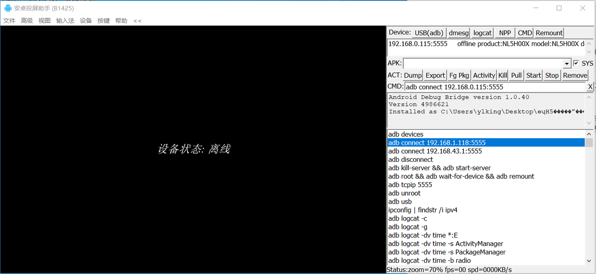

# 项目地址

https://gitcode.com/open-source-toolkit/f2956/?utm\_source=tools\_gitcode\&index=top\&type=card&

## 简介

本仓库提供了一个名为“ARDC安卓投屏助手(B1425)”的资源文件下载。该工具是一款在Windows系统下非常好用的安卓投屏助手，专门用于解决ADB相关的各类问题。通过该工具，用户可以远程可视化地对安卓设备进行管理，并且能够远程安装APK包，极大地简化了安卓设备的管理和操作流程。

## 功能特点

* **远程可视化管理**：通过ARDC安卓投屏助手，用户可以在Windows系统上远程可视化地管理安卓设备，无需直接接触设备即可进行操作。

* **解决ADB问题**：该工具专门针对ADB相关的各类问题进行了优化和解决，确保用户在使用过程中不会遇到常见的ADB连接问题。

* **远程安装APK**：用户可以通过该工具远程给安卓设备安装APK包，方便快捷，无需手动操作设备。

## 使用说明

1. **下载资源文件**：点击仓库中的下载链接，获取ARDC安卓投屏助手(B1425)的资源文件。

2. **安装与配置**：按照提供的安装指南进行安装和配置，确保工具能够正常运行。

3. **连接安卓设备**：使用工具连接您的安卓设备，确保设备与电脑在同一网络环境下。

4. **远程管理与安装**：通过工具界面进行远程可视化管理，并根据需要远程安装APK包。

## 注意事项

* 请确保您的安卓设备已开启开发者模式，并允许USB调试。

* 在使用过程中，如遇到任何问题，请参考工具自带的帮助文档或联系技术支持。

