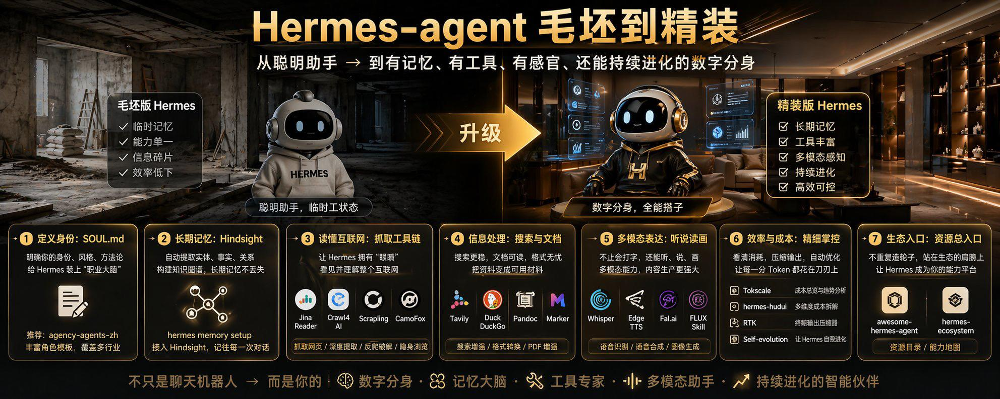

## 1 定义身份:SOUL.md
明确你的身份、风格、方法论
给 Hermes 装上“职业大脑”
推荐: agency-agents-zh
丰富角色模板,覆盖多行业

## 2 长期记忆：Hindsight
自动提取实体、事实、关系
构建知识图谱，长期记忆不丢失
hermes memory setup
接入 Hindsight，记住每一次对话

## 3 读懂互联网：抓取工具链
让 Hermes 拥有“眼睛”
看见并理解整个互联网
- Jina Reader
- Crawl4 AI
- Scrapling
- CamoFox
抓取网页/深度提取/反爬破解/隐身浏览

## 4 信息处理：搜索与文档
搜索更稳，文档可读，格式无忧
把资料变成可用材料
- Tavily
- Duck DuckGo
- Pandoc
- Marker
搜索增强/格式转换/PDF 增强

## 5 多模态表达:听说读画
不止会打字，还能听、说、画
多模态能力，内容生产更强大
- Whisper
- Edge TTS
- Fal.ai
- FLUX Skill
语音识别/语音合成/图像生成

## 6 效率与成本：精细掌控
看清消耗，压缩输出，自动优化
让每一分 Token 都花在刀刃上
- Tokscale 成本总览与趋势分析
- hermes-hudui 多维度成本拆解
- RTK 终稿输出压缩器
- Self - evolution 让 Hermes 自我进化

## 7 生态入口：资源总入口
不重复造轮子，站在生态的肩膀上
让 Hermes 成为你的能力平台
- awesome-hermes-agent
- hermes-ecosystem
资源目录/能力地图