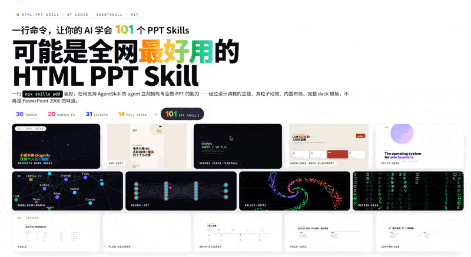
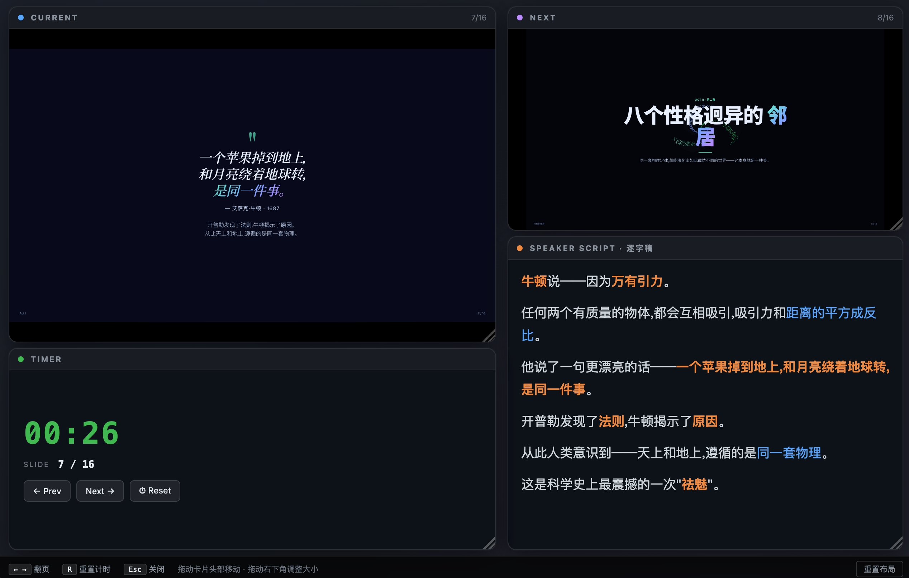
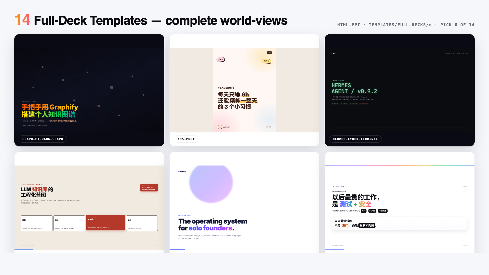
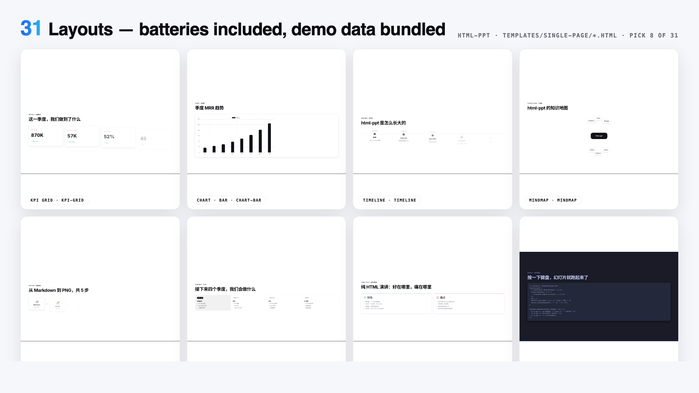
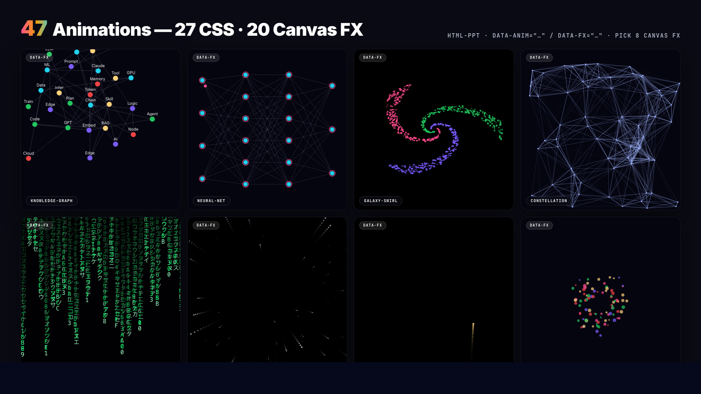

#开源地址：[lewislulu/html-ppt-skill: HTML PPT Studio — AgentSkill with 24 themes, 31 layouts, 20+ animations for building professional HTML presentations](https://github.com/lewislulu/html-ppt-skill)

中文说明：[html-ppt-skill/README.zh-CN.md at main · lewislulu/html-ppt-skill](https://github.com/lewislulu/html-ppt-skill/blob/main/README.zh-CN.md)
## html-ppt · HTML PPT 工作室

> 一款专业级的 AgentSkill，让 AI 做出真正能打的 HTML 演示文稿。 **36 套主题** 、 **15 套完整 deck 模板** 、 **31 种页面布局** 、 **47 个动效** (27 个 CSS + 20 个 Canvas FX)，加上全新的 **演讲者模式** —— 像素级 完美预览 + 逐字稿提词器 + 计时器。纯静态 HTML/CSS/JS，无需构建。

**作者：** lewis < [sudolewis@gmail.com](mailto:sudolewis@gmail.com) > **协议：** MIT **English docs:** [README.md](https://github.com/lewislulu/html-ppt-skill/blob/main/README.md)

> 一行命令装好 **36 主题 × 20 Canvas FX × 31 布局 × 15 完整 deck + 演讲者模式** 。 上图里的每一个预览都是真实的 iframe 加载真实模板文件 —— 不是截图，不是色卡。
## 🎤 演讲者模式（全新）
在任何 deck 里按 `S` 键，弹出一个独立的演讲者窗口，包含 4 个 **可拖拽、 可调整大小的磁吸卡片** ：当前页预览、下一页预览、逐字稿、计时器。两个窗口 通过 `BroadcastChannel` 双向同步翻页。

**为什么预览是像素级完美的：** 每个卡片是一个 `<iframe>` ，加载的是 **同一 份 deck HTML 文件** ，只是 URL 多了 `?preview=N` 参数。runtime 检测到这个 参数后，只渲染第 N 页并隐藏所有 chrome —— 所以预览使用 **和观众视图完全相 同的 CSS、主题、字体、viewport** ，颜色和排版保证 100% 一致。

**丝滑翻页（零闪烁）：** 翻页时演讲者窗口通过 `postMessage({type:'preview-goto', idx:N})` 通知 iframe，iframe 只是切换 `.is-active` class —— **不重新加载、 不白屏、不闪烁** 。

**逐字稿 3 条铁律：**
1. **提示信号，不是讲稿** — 关键词加粗，过渡句独立成段
2. **每页 150–300 字** — 约 2–3 分钟/页的节奏
3. **用口语，不用书面语** — "所以" 不是 "因此"，"这个" 不是 "该"

详见 [`references/presenter-mode.md`](https://github.com/lewislulu/html-ppt-skill/blob/main/references/presenter-mode.md) ，或直接复制 `templates/full-decks/presenter-mode-reveal/` 这个现成模板 —— 每一页都带完整 150–300 字的示例逐字稿。

## 一行命令安装
```
npx skills add https://github.com/lewislulu/html-ppt-skill
```
装好后，任何支持 AgentSkill 的 agent（Claude Code / Codex / Cursor / OpenClaw 等） 都能用这套能力做 PPT。对 agent 说：

> "做一份 8 页的技术分享 slides，用 cyberpunk 主题" "把这段 outline 变成投资人 pitch deck" "做一个小红书图文，9 张，白底柔和风" "做一份带演讲者模式的产品分享，我想要有逐字稿"

## Skill 内容一览

|  | 数量 | 位置 |
| --- | --- | --- |
| 🎤 **演讲者模式** | **新增** | `S` 键 / `?preview=N` |
| 🎨 **主题** | **36** | `assets/themes/*.css` |
| 📑 **完整 deck 模板** | **15** | `templates/full-decks/<name>/` |
| 🧩 **单页布局** | **31** | `templates/single-page/*.html` |
| ✨ **CSS 动画** | **27** | `assets/animations/animations.css` |
| 💥 **Canvas FX 动画** | **20** | `assets/animations/fx/*.js` |
| 🖼️ **Showcase deck** | 4 | `templates/*-showcase.html` |
| 📸 **验证截图** | 56 | `scripts/verify-output/` |

### 36 套主题

`minimal-white` 、 `editorial-serif` 、 `soft-pastel` 、 `sharp-mono` 、 `arctic-cool` 、 `sunset-warm` 、 `catppuccin-latte` 、 `catppuccin-mocha` 、 `dracula` 、 `tokyo-night` 、 `nord` 、 `solarized-light` 、 `gruvbox-dark` 、 `rose-pine` 、 `neo-brutalism` 、 `glassmorphism` 、 `bauhaus` 、 `swiss-grid` 、 `terminal-green` 、 `xiaohongshu-white` 、 `rainbow-gradient` 、 `aurora` 、 `blueprint` 、 `memphis-pop` 、 `cyberpunk-neon` 、 `y2k-chrome` 、 `retro-tv` 、 `japanese-minimal` 、 `vaporwave` 、 `midcentury` 、 `corporate-clean` 、 `academic-paper` 、 `news-broadcast` 、 `pitch-deck-vc` 、 `magazine-bold` 、 `engineering-whiteprint`

每个主题都是一份纯 CSS token 文件 —— 只需要换一行 `<link>` 就能给整份 deck 换皮。在 `templates/theme-showcase.html` 里可以浏览全部（每一页用独立 iframe 渲染，避免样式互相污染）。

### 15 套完整 deck 模板

8 个从真实作品提炼的视觉语言，7 个通用场景脚手架：

**提炼款**

- `xhs-white-editorial` — 小红书白底杂志风
- `graphify-dark-graph` — 暗底 + 力导向知识图谱
- `knowledge-arch-blueprint` — 蓝图 / 架构图风
- `hermes-cyber-terminal` — 终端 cyberpunk 风
- `obsidian-claude-gradient` — 紫色渐变卡
- `testing-safety-alert` — 红 / 琥珀警示风
- `xhs-pastel-card` — 柔和马卡龙图文
- `dir-key-nav-minimal` — 方向键极简

**场景款**

- `pitch-deck` — 投资人 pitch
- `product-launch` — 产品发布会
- `tech-sharing` — 技术分享
- `weekly-report` — 周报
- `xhs-post` — 小红书图文（9 页 3:4）
- `course-module` — 教学模块
- **`presenter-mode-reveal`** 🎤 — 完整分享模板， **每一页都带 150-300 字 的示例逐字稿** ，围绕 `S` 键演讲者模式专门设计

每个模板都是自包含的文件夹，用 scoped `.tpl-<name>` CSS，所以多个模板可以 同时加载不会互相污染。在 `templates/full-decks-index.html` 可以看全套 gallery。

### 31 种单页布局

cover · toc · section-divider · bullets · two-column · three-column · big-quote · stat-highlight · kpi-grid · table · code · diff · terminal · flow-diagram · timeline · roadmap · mindmap · comparison · pros-cons · todo-checklist · gantt · image-hero · image-grid · chart-bar · chart-line · chart-pie · chart-radar · arch-diagram · process-steps · cta · thanks

每个布局都带真实的示例数据，拖进 deck 立即看得到效果。

*大 iframe 直接加载 `templates/single-page/<name>.html` 文件，每 2.8 秒 自动切换到下一个布局。*

### 27 个 CSS 动画 + 20 个 Canvas FX

**CSS 动画（轻量）** — 方向性淡入、 `rise-in` 、 `zoom-pop` 、 `blur-in` 、 `glitch-in` 、 `typewriter` （打字机）、 `neon-glow` （霓虹光晕）、 `shimmer-sweep` （流光）、 `gradient-flow` （渐变流动）、 `stagger-list` （列表错开入场）、 `counter-up` （数字滚动）、 `path-draw` （路径绘制）、 `morph-shape` 、 `parallax-tilt` 、 `card-flip-3d` 、 `cube-rotate-3d` 、 `page-turn-3d` 、 `perspective-zoom` 、 `marquee-scroll` 、 `kenburns` 、 `ripple-reveal` 、 `spotlight` 、…

**Canvas FX（电影级）** — `particle-burst` （粒子爆发）、 `confetti-cannon` （彩带）、 `firework` （烟花）、 `starfield` （星空）、 `matrix-rain` （代码雨）、 `knowledge-graph` （力导向知识图谱）、 `neural-net` （神经网络 脉冲）、 `constellation` （星座连线）、 `orbit-ring` （轨道环）、 `galaxy-swirl` （星系漩涡）、 `word-cascade` 、 `letter-explode` 、 `chain-react` 、 `magnetic-field` 、 `data-stream` 、 `gradient-blob` 、 `sparkle-trail` 、 `shockwave` 、 `typewriter-multi` 、 `counter-explosion` 。 每一个都是手写的 canvas 模块，进入 slide 时由 `fx-runtime.js` 自动初始化。

## 快速开始（手动 / 安装后 / git clone 后）

```
# 从 base 模板新建一个 deck
./scripts/new-deck.sh my-talk

# 浏览所有内容
open templates/theme-showcase.html         # 全部 36 主题（iframe 隔离）
open templates/layout-showcase.html        # 全部 31 布局
open templates/animation-showcase.html     # 全部 47 动效
open templates/full-decks-index.html       # 全部 15 个完整 deck

# 用 headless Chrome 导出 PNG
./scripts/render.sh templates/theme-showcase.html
./scripts/render.sh examples/my-talk/index.html 12
```

## 键盘快捷键

```
← → Space PgUp PgDn Home End   翻页
F                               全屏
S                               打开演讲者窗口（磁吸卡片模式）
N                               底部 notes 抽屉
R                               重置计时器（演讲者窗口内）
O                               slide 总览网格
T                               切换主题（自动同步到演讲者窗口）
A                               在当前 slide 循环演示一个动画
#/N (URL)                       深链到第 N 页
?preview=N (URL)                预览模式（只显示单页，隐藏 chrome）
```

## 项目结构

```
html-ppt-skill/
├── SKILL.md                      agent 入口
├── README.md                     英文 README
├── README.zh-CN.md               本文件
├── references/                   详细文档
│   ├── themes.md                 36 主题 + 使用场景
│   ├── layouts.md                31 布局
│   ├── animations.md             27 CSS + 20 FX 目录
│   ├── full-decks.md             15 完整 deck 模板
│   ├── presenter-mode.md         🎤 演讲者模式 + 逐字稿指南
│   └── authoring-guide.md        完整工作流
├── assets/
│   ├── base.css                  共享 tokens + 基础组件
│   ├── fonts.css                 web 字体引入
│   ├── runtime.js                键盘导航 + 演讲者模式 + 总览
│   ├── themes/*.css              36 主题 token 文件
│   └── animations/
│       ├── animations.css        27 个命名 CSS 动画
│       ├── fx-runtime.js         进入 slide 自动初始化 [data-fx]
│       └── fx/*.js               20 个 Canvas FX 模块
├── templates/
│   ├── deck.html                 最小起步模板
│   ├── theme-showcase.html       iframe 隔离的主题 tour
│   ├── layout-showcase.html      全部 31 布局
│   ├── animation-showcase.html   47 动画 slide
│   ├── full-decks-index.html     15 deck gallery
│   ├── full-decks/<name>/        15 个 scoped 多页 deck 模板
│   └── single-page/*.html        31 个布局文件（带示例数据）
├── scripts/
│   ├── new-deck.sh               脚手架
│   ├── render.sh                 headless Chrome → PNG
│   └── verify-output/            56 张自测截图
└── examples/demo-deck/           完整可运行的示例 deck
```

## 设计理念

- **Token 驱动的设计系统。** 所有颜色、圆角、阴影、字体决策都在 `assets/base.css` + 当前主题文件里。改一个变量，整份 deck 优雅地重排。
- **Iframe 隔离预览。** 主题 / 布局 / 完整 deck 的 showcase 都用 `<iframe>` ， 确保每个预览都是真实、独立的渲染结果。
- **零构建。** 纯静态 HTML/CSS/JS。只有 webfont / highlight.js / chart.js (可选) 走 CDN。
- **资深设计师的默认值。** 字号规律、间距节奏、渐变、卡片处理都有态度 —— 绝不是 "PowerPoint 2006" 那种味道。
- **中英双语一等公民。** 预导入了 Noto Sans SC / Noto Serif SC。