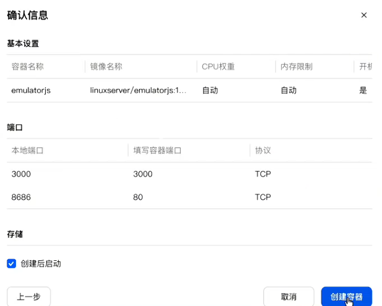

---
up:
  - "[[../Home|Home]]"
tags:
  - NAS
  - 群晖
  - 游戏
  - docker
  - Container_Manager
---
# Docker/Container Manager部署
`linuxserver/emulatorjs`
[[NAS的Container Manager访问受限解决方案【暂未成功】]]

# 创建容器

# 搜索镜像，上传ROM
