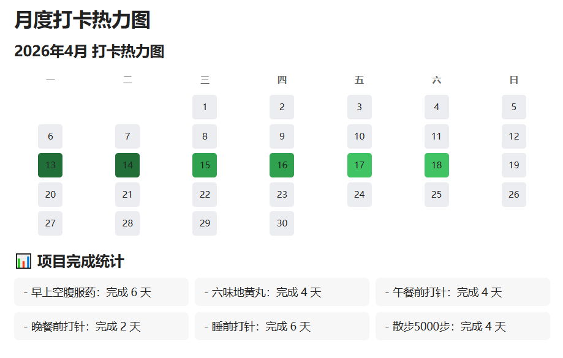
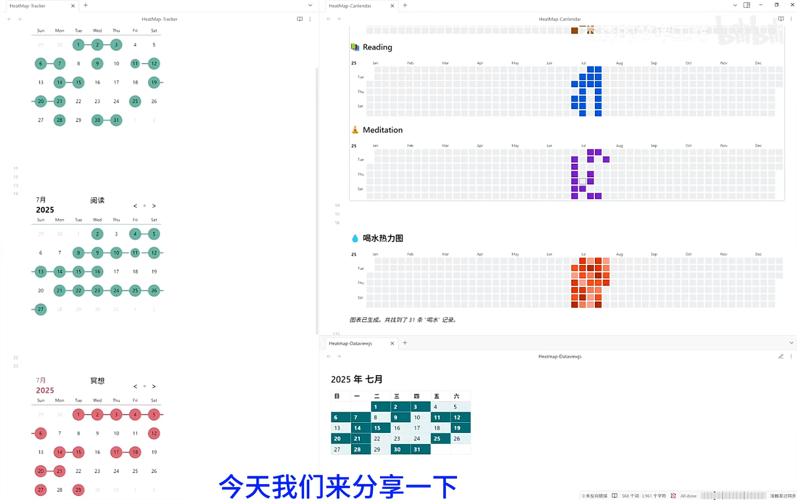
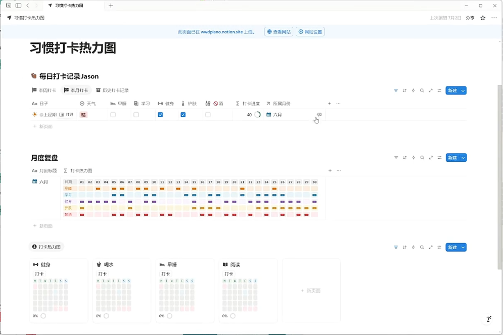
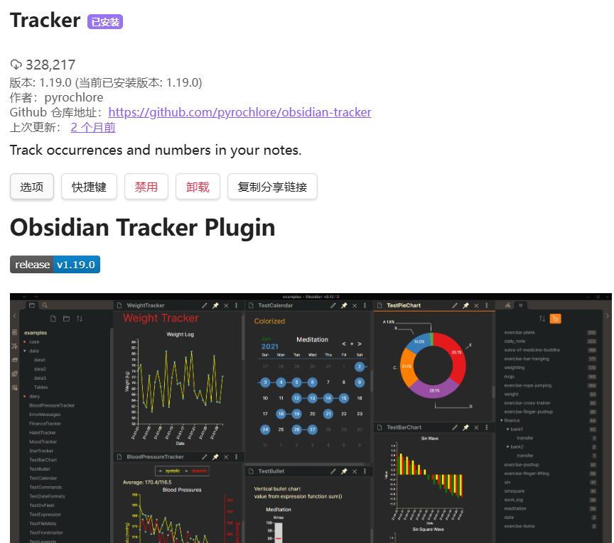
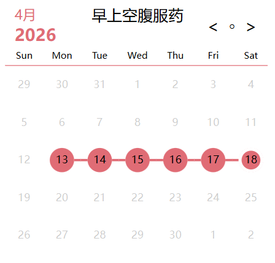
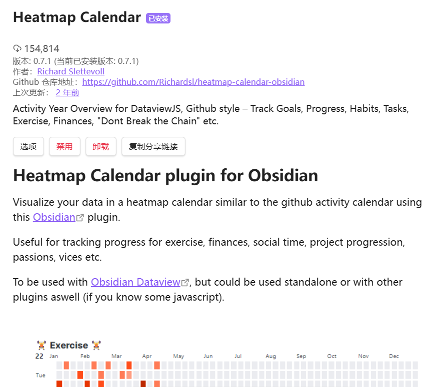
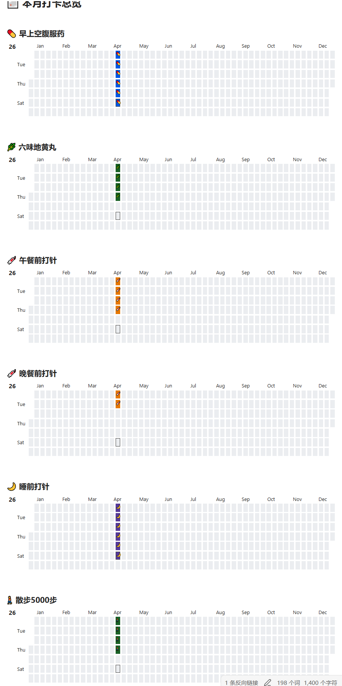
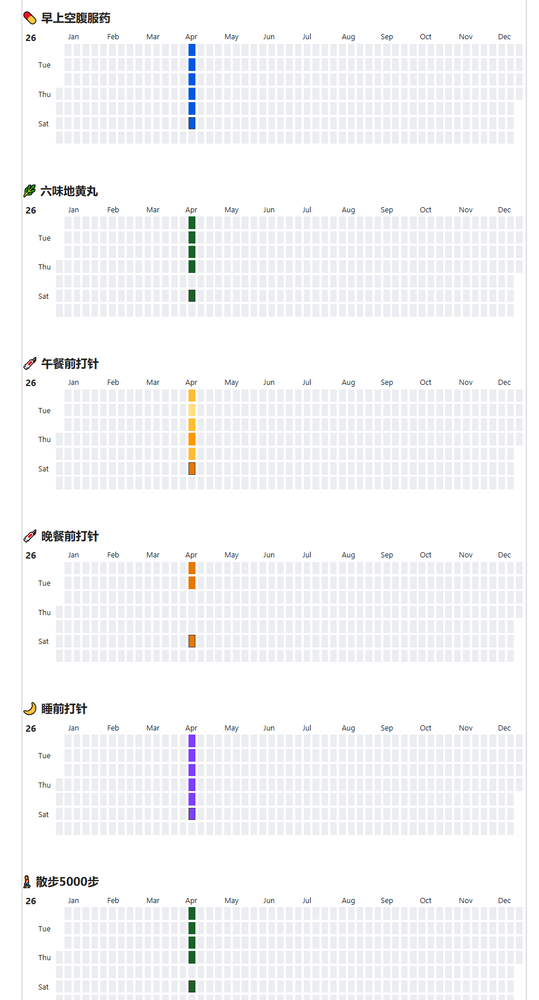

---
tags:
  - 热力图
  - OBsidian
  - ContributionGraph
  - checkbox
  - dataview
  - Calendar
  - Tracker
---
# 最初的基础样式


# 基础样式的实现
## 日历模板中代码
使用Markdown的任务列表（checkbox）来记录
```Markdown
## 📅 今日打卡 
- [ ] 早上空腹服药 
- [ ] 六味地黄丸 
- [ ] 午餐前打针 
- [ ] 晚餐前打针 
- [ ] 睡前打针 
- [ ] 散步5000步
```
## 显示页面中代码
```Markdown
```dataviewjs
// 配置区
const diaryFolder = "Calendar";
const taskList = [
  "早上空腹服药",
  "六味地黄丸",
  "午餐前打针",
  "晚餐前打针",
  "睡前打针",
  "散步5000步"
];
const weekLabels = ["一", "二", "三", "四", "五", "六", "日"];
const colors = ["#ebedf0", "#9be9a8", "#40c463", "#30a14e", "#216e39"];

// 自动获取当前年月
const now = new Date();
const currentYear = now.getFullYear();
const currentMonth = now.getMonth();
const daysInMonth = new Date(currentYear, currentMonth + 1, 0).getDate();
const firstDayOfMonth = (new Date(currentYear, currentMonth, 1).getDay() || 7) - 1;

// 清空容器，防止旧元素残留
dv.container.innerHTML = "";

// 加载日记数据
const pages = dv.pages(`"${diaryFolder}"`)
  .where(p => p.file.day)
  .sort(p => p.file.day, "asc");

// 构建每日打卡数据
const dayData = {};
for (let day = 1; day <= daysInMonth; day++) {
  const dateStr = `${currentYear}-${String(currentMonth + 1).padStart(2, '0')}-${String(day).padStart(2, '0')}`;
  const page = pages.find(p => p.file.day.toFormat("yyyy-MM-dd") === dateStr);
  if (!page) {
    dayData[day] = { done: 0, total: 0, ratio: 0 };
    continue;
  }
  const tasks = page.file.tasks;
  const total = tasks.length;
  const done = tasks.filter(t => t.completed).length;
  const ratio = total > 0 ? done / total : 0;
  dayData[day] = { done, total, ratio };
}

// 热力图标题
const title = document.createElement("h4");
title.textContent = `${currentYear}年${currentMonth + 1}月 打卡热力图`;
title.style.margin = "0 0 12px 0";
title.style.padding = "0";
dv.container.appendChild(title);

// 网格容器
const grid = document.createElement("div");
grid.style.display = "grid";
grid.style.gridTemplateColumns = "repeat(7, 1fr)";
grid.style.gap = "6px";
grid.style.margin = "8px 0 20px 0";
dv.container.appendChild(grid);

// 星期表头
weekLabels.forEach(label => {
  const el = document.createElement("div");
  el.textContent = label;
  el.style.textAlign = "center";
  el.style.fontSize = "12px";
  el.style.fontWeight = "600";
  el.style.color = "#666";
  el.style.padding = "4px 0";
  grid.appendChild(el);
});

// 补全月初空白格子
for (let i = 0; i < firstDayOfMonth; i++) {
  const empty = document.createElement("div");
  empty.style.visibility = "hidden";
  grid.appendChild(empty);
}

// 绘制日期格子
for (let day = 1; day <= daysInMonth; day++) {
  const { ratio } = dayData[day];
  let color = colors[0];
  if (ratio > 0) color = colors[1];
  if (ratio >= 0.3) color = colors[2];
  if (ratio >= 0.6) color = colors[3];
  if (ratio >= 1) color = colors[4];

  const cell = document.createElement("div");
  cell.textContent = String(day);
  cell.style.width = "32px";
  cell.style.height = "32px";
  cell.style.background = color;
  cell.style.borderRadius = "4px";
  cell.style.display = "flex";
  cell.style.alignItems = "center";
  cell.style.justifyContent = "center";
  cell.style.fontSize = "12px";
  cell.style.cursor = "pointer";
  cell.style.margin = "0 auto";
  cell.onclick = () => {
    const fname = `${currentYear}-${String(currentMonth + 1).padStart(2, '0')}-${String(day).padStart(2, '0')}.md`;
    app.workspace.openLinkText(fname, "", false);
  };
  grid.appendChild(cell);
}

// 统计面板标题
const statsTitle = document.createElement("h4");
statsTitle.textContent = "📊 项目完成统计";
statsTitle.style.margin = "16px 0 8px 0";
statsTitle.style.padding = "0";
dv.container.appendChild(statsTitle);

// 统计容器
const statsContainer = document.createElement("div");
statsContainer.style.display = "grid";
statsContainer.style.gridTemplateColumns = "repeat(auto-fit, minmax(180px, 1fr))";
statsContainer.style.gap = "8px";
dv.container.appendChild(statsContainer);

// 统计卡片
taskList.forEach(item => {
  const count = pages.filter(p =>
    p.file.tasks.some(t => t.text.trim() === item && t.completed)
  ).length;
  const card = document.createElement("div");
  card.textContent = `- ${item}：完成 ${count} 天`;
  card.style.background = "#f7f7f7";
  card.style.padding = "8px 12px";
  card.style.borderRadius = "6px";
  card.style.fontSize = "14px";
  statsContainer.appendChild(card);
});
```
```
```

## 使用说明
1. 日记必须放在 Calendar 文件夹
2. 日记文件名必须是 2026-04-18.md 这种日期格式
3. 每天勾选 - [x] 即可
4. 打开本页自动显示当前月，不用改任何代码
5. 格子颜色越深 = 打卡完成率越高
6. 点击数字可直接跳转到当天日记
7. Dataview（必须开 Enable JavaScript queries）
8. Templater（可选，用于自动新建日记）
9. 不需要 Tasks 插件，原生 - [ ] 即可

# 优化样式
教程参考：[Obsidian：习惯打卡热力图_哔哩哔哩_bilibili](https://www.bilibili.com/video/BV1orubzJEi7/?spm_id_from=333.337.search-card.all.click&vd_source=b00ffc87d2f4365faf01741e93e463bb)


## 第一种：Tracker插件
项目开源地址：[pyrochlore/obsidian-tracker: A plugin tracks occurrences and numbers in your notes](https://github.com/pyrochlore/obsidian-tracker)

### 使用方法
使用Tracker代码块
```Markdown
```tracker
searchType: task.done #备注
searchTarget: 早上空腹服药 #查询的名称
datasetName: "早上空腹服药" #热力图的标题
folder: Calendar #查询的数据所在的文件夹
endDate: 2026-04-30 #最终的日期
month: #显示的形式：年月日
	color: "#e06c75" #显示的颜色
```
```
```
在其Github站点上有很多示例可以参考，其中关于日历的在这里[obsidian-tracker/examples/TestCalendar.md at master · pyrochlore/obsidian-tracker](https://github.com/pyrochlore/obsidian-tracker/blob/master/examples/TestCalendar.md)

## 第二种 使用heatmap calendar插件

开源仓库地址：[Richardsl/heatmap-calendar-obsidian: An Obsidian plugin for displaying data in a calendar similar to the github activity calendar](https://github.com/Richardsl/heatmap-calendar-obsidian) 网站说明文档中有示例代码。
Heatmap calendar的原理是基于**Date view**
它只有一种视图类型——**全年视图**，没有办法单独显示某一个月的视图
### 示例代码及显示效果

```Markdown
```dataviewjs
// 6 合一 健康打卡仪表盘
dv.span("### 📅 本月打卡总览")
dv.span("<br>")

// 配置项
const config = [
  { name: "早上空腹服药", icon: "💊", color: "blue" },
  { name: "六味地黄丸", icon: "🌿", color: "green" },
  { name: "午餐前打针", icon: "💉", color: "orange" },
  { name: "晚餐前打针", icon: "💉", color: "orange" },
  { name: "睡前打针", icon: "🌙", color: "purple" },
  { name: "散步5000步", icon: "🚶", color: "green" },
]

const now = new Date()
const year = now.getFullYear()
const month = now.getMonth() + 1

for (const task of config) {
  dv.span(`**${task.icon} ${task.name}**`)
  
  const calendarData = {
    year,
    month,
    colors: {
      blue:   ["#e0ebff","#8cb9ff","#69a3ff","#1872ff","#0058e2"],
      green:  ["#e6f7d2","#c6e48b","#7bc96f","#49af5d","#196127"],
      orange: ["#fff2cc","#ffdf80","#ffbd33","#ff9800","#e67700"],
      purple: ["#f0e6ff","#c9adff","#9f7aea","#775ac4","#553999"],
    },
    showCurrentDayBorder: true,
    defaultEntryIntensity: 4,
    entries: []
  }

  // 遍历日记，匹配任务
  for (let page of dv.pages('"Calendar"').where(p => p.file.day)) {
    const done = page.file.tasks.some(t =>
      t.text.trim() === task.name && t.completed
    )
    if (done) {
      calendarData.entries.push({
        date: page.file.name,
        intensity: 100,//强度，比如健身40分钟或者60分钟对应不同的颜色
        content: task.icon,//注释掉这一行在打卡色块里就不会出现图标了
        color: task.color
      })
    }
  }

  renderHeatmapCalendar(this.container, calendarData)
  dv.span("<br><br>")
}
```



## 进阶设置：打卡强度功能
我需要对热力图的颜色进行强度的区分，比如中午打针从10个单位到20个单位进行不同的颜色由浅入深的显示。
### 日记里的写法（确保格式正确）
你需要用标准的 Obsidian 内联属性格式，用两个冒号：
### 热力图代码调整
```Markdown
```dataviewjs
dv.span("### 📅 本月打卡总览")
dv.span("<br>")

// 配置：自动区分 任务勾选 / 数字计量
const config = [
  { name: "早上空腹服药", type: "task", icon: "💊", color: "blue" },
  { name: "六味地黄丸", type: "task", icon: "🌿", color: "green" },
  { name: "午餐前打针", type: "dose", key: "午餐前打针", icon: "💉", color: "orange" },
  { name: "晚餐前打针", type: "task", icon: "💉", color: "orange" },
  { name: "睡前打针", type: "task", icon: "🌙", color: "purple" },
  { name: "散步5000步", type: "task", icon: "🚶", color: "green" },
]

const now = new Date()
const year = now.getFullYear()
const month = now.getMonth() + 1

for (const item of config) {
  dv.span(`**${item.icon} ${item.name}**`)

  const calendarData = {
    year, month,
    colors: {
      blue:   ["#e0ebff","#8cb9ff","#69a3ff","#1872ff","#0058e2"],
      green:  ["#e6f7d2","#c6e48b","#7bc96f","#49af5d","#196127"],
      orange: ["#fff2cc","#ffdf80","#ffbd33","#ff9800","#e67700"],
      purple: ["#f0ebff","#d9c4ff","#b78cff","#9f6aff","#7e3fff"],
      red:    ["#ffe6e6","#ffb3b3","#ff8080","#ff4d4d","#cc0000"],
	  cyan:   ["#e6ffff","#99ffff","#4dffff","#00cccc","#009999"],
      gray:   ["#f0f0f0","#cccccc","#999999","#666666","#333333"],
      pink:   ["#ffe6f2","#ffb3d9","#ff80bf","#ff4da6","#cc0066"],
    },
    showCurrentDayBorder: true,
    intensityScaleStart: item.type === "dose" ? 10 : 1,
    intensityScaleEnd:   item.type === "dose" ? 20 : 1,
    entries: []
  }

  for (let page of dv.pages('"Calendar"').where(p => p.file.day)) {
    let valid = false
    let intensity = 1

    // --------------------------
    // 处理勾选任务（你其他项目都是这个）
    // --------------------------
    if (item.type === "task") {
      valid = page.file.tasks.some(t =>
        t.text.trim() === item.name && t.completed
      )
    }

    // --------------------------
    // 处理剂量（午餐前打针）
    // --------------------------
    if (item.type === "dose") {
      const v = page[item.key]
      if (v) {
        const d = Number(v)
        if (!isNaN(d)) {
          valid = true
          intensity = Math.max(10, Math.min(20, d))
        }
      }
    }

    if (!valid) continue

    calendarData.entries.push({
      date: page.file.name,
      intensity: intensity,
      color: item.color
    })
  }

  renderHeatmapCalendar(this.container, calendarData)
  dv.span("<br><br>")
}
```

