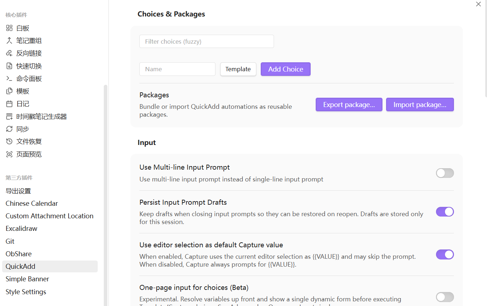

## 使用 QuickAdd 插件（最推荐，最灵活）
这是目前 Obsidian 社区解决此问题的最佳方案。
**步骤：**
1. **安装并启用 QuickAdd 插件**（社区插件市场搜索）
2. **为每个核心目录创建一个“捕获”命令**
    - 打开设置 → QuickAdd    
    - 在「Capture」旁边点击 `Manage` → `Add Capture` → 命名为“新建日记” → 点击闪电图标⚡️使其出现在命令面板
    - 点击刚创建的项目旁的齿轮⚙️进入设置：
        - `File Name`：输入 `{{DATE}}` 或其他命名规则
        - `Folder`：选择你对应的核心目录（如 `日记/`）
        - `Create if not exist`：打勾
3. **重复以上步骤**，为每个核心目录（项目笔记、人物笔记、会议记录等）都创建一个 Capture
4. **使用方法**：
    - `Ctrl/Cmd + P` 打开命令面板
    - 输入“新建日记” → 自动在 `日记/` 文件夹创建文件
    - 输入“新建项目笔记” → 自动在 `项目/` 文件夹创建文件
**优点**：最干净、完全自动化、可自定义模板和文件名格式