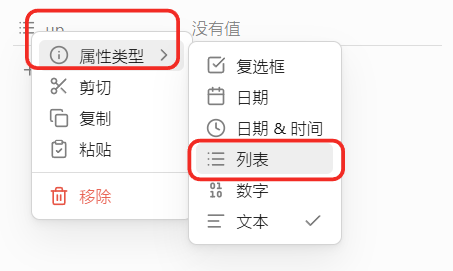

---
up:
  - "[[OBsidian攻略]]"
date: 2026-04-20
---
**Obsidian原生里，同一个笔记里只能有一个up属性（属性名唯一），但up属性可以改成「列表/多值类型」，支持填多篇文章（多个内部链接）；默认是文本单值，只能一篇**。

### 一、核心规则（原生属性）
1. 属性名唯一：每个笔记里，**up这个属性名只能出现一次**，不能写两行up: [[A]]、up: [[B]]，YAML会报错。
2. 类型决定值数量：
   - 默认是「文本（Text）」：只能填1个值（1篇[[笔记链接]]）
   - 改成「列表（List）」：可以填**多个值（多篇文章）**，每行一个- [[笔记名]]

### 二、怎么让up支持多篇文章（多值）
1. 打开笔记，点顶部属性区的up字段左边的图标（类型切换）
2. 把类型从「文本」改成**列表（List）**
3. 输入多个链接，格式（YAML）：
```yaml
---
up:
- [[父笔记1]]
- [[父笔记2]]
- [[父笔记3]]
---
```
4. 界面上会显示成多行列表，每个都是可跳转的内部链接


### 三、插件影响（比如Breadcrumb）
你说的up，大概率是Breadcrumb（面包屑）插件用的up/down/next/prev属性：
- Breadcrumb默认**支持up为多值列表**，会把所有up链接都当成父节点显示
- 插件本身不限制up数量，只看你属性的类型是不是列表

一句话总结：**up属性名只能一个，但可以改成列表类型，放任意多篇文章链接**。
