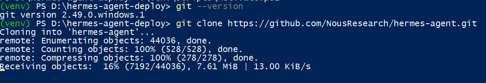
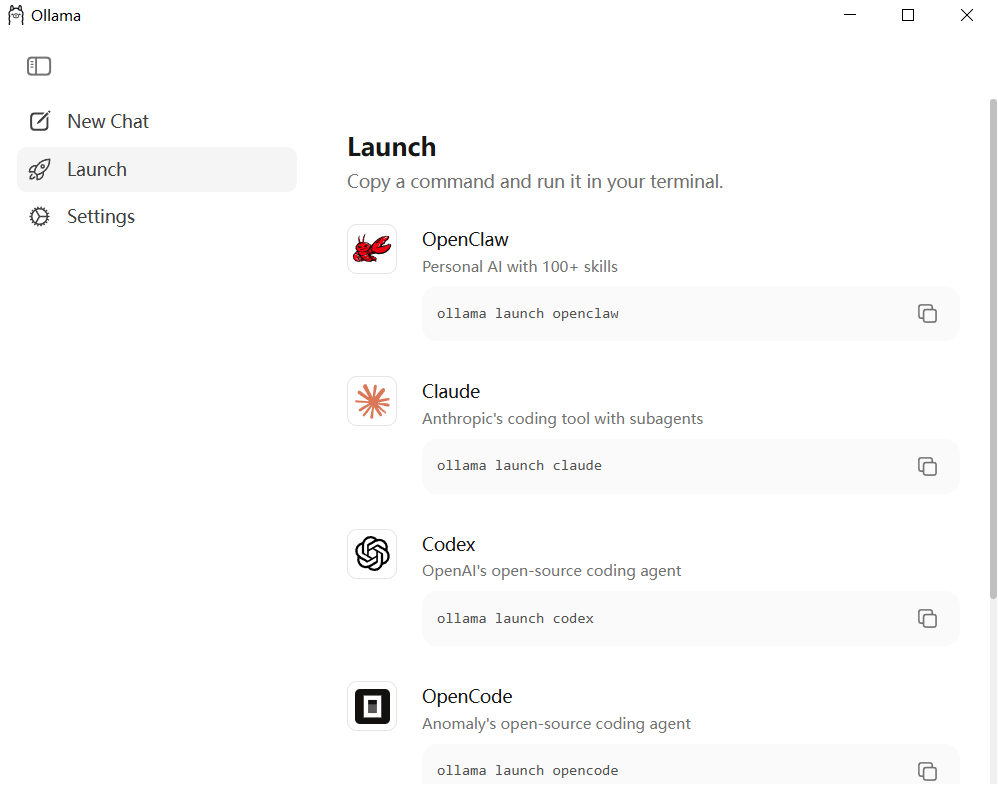

---
tags:
  - Hermes
  - OBsidian
---
## 1、Windows的虚拟环境
打开 “启用或关闭 Windows 功能”
找到并勾选：
-[*] 适用于 Linux 的 Windows 子系统
-[*] 虚拟机平台
确定 → 重启电脑
以管理员身份打开 PowerShell：`wsl --set-default-version 2`（把默认设为 WSL2）

## 2、尝试启动 Ubuntu 子系统
```Powershell
wsl --shutdown
```
我先关闭所有的虚拟机，然后再打开Ubuntu
```
wsl -d Ubuntu
```

期间会要求输入密码，然后进入到这个提示符下。
## 3、在D盘新建hermes-agent-deploy目录
我在D盘新建了hermes-agent-deploy目录，并在这个目录下打开了Powershell窗口
先检查 Python 版本是否符合要求（hermes-agent 要求 Python 3.8 及以上）
```
C:\Users\ylking\AppData\Local\Programs\Python\Python312\python.exe --version
```
#### 执行创建独立虚拟环境的命令
```
& "C:\Users\ylking\AppData\Local\Programs\Python\Python312\python.exe" -m venv .\venv
```
命令说明：-m venv 是 Python 内置的创建虚拟环境模块，.\venv 表示在当前hermes-agent-deploy目录下创建名为venv的虚拟环境文件夹；
执行后，你的D:\hermes-agent-deploy目录下会新增一个venv文件夹，无报错即代表虚拟环境创建成功。
#### 执行激活虚拟环境的命令
```
.\venv\Scripts\Activate.ps1
```
执行成功的标识：PowerShell 窗口左侧会出现 (venv) 前缀（比如 (venv) PS D:\hermes-agent-deploy>），说明虚拟环境已激活，后续所有 Python/pip 操作都会局限在这个独立环境中，不会污染系统 Python

## 4、检查 Git 版本（确认是否安装）
```bash
git --version
```
输出显示git version 2.49.0.windows.1，如果没有需要先安装Git
## 5、克隆 hermes-agent 代码仓库
```bash
git clone https://github.com/NousResearch/hermes-agent.git
```
这个步骤可能需要等待很长时间

执行后预期表现：PowerShell 会显示克隆进度（比如 “Cloning into 'hermes-agent'...”），最终无报错则代表仓库克隆成功，你的D:\hermes-agent-deploy目录下会新增hermes-agent文件夹；
会在D:\hermes-agent-deploy目录下生成hermes-agent文件夹，包含项目所有源码
克隆不成功，我直接从Github上下载最新的版本到D:\hermes-agent-deploy目录下hermes-agent文件夹
#### 进入 hermes-agent 项目目录
```
cd .\hermes-agent\
```
PowerShell 路径变为 (venv) PS D:\hermes-agent-deploy\hermes-agent>
## 6、安装项目 Python 依赖
优先用清华 PyPI 镜像源，解决国内下载慢的问题
```bash
pip install -r requirements.txt -i https://pypi.tuna.tsinghua.edu.cn/simple
```
## 7、配置项目环境变量（核心步骤）
hermes-agent 依赖 API 密钥、服务配置等环境变量，需要创建 .env 文件来配置，步骤如下：
### 1. 在项目目录创建 .env 文件
在 D:\hermes-agent-deploy\hermes-agent 目录下，新建一个名为 .env 的文本文件（注意文件名以.开头，无后缀）
```
Copy-Item .env.example -Destination .env -Force
```
### 安装Ollama
下载地址`https://ollama.com/download/windows`

Ollama 是独立的本地模型服务（安装后会在后台运行服务进程），不是 Python 依赖，所以不受虚拟环境 / 工作目录限制。只要 Ollama 安装成功，任何 PowerShell 窗口都能调用 ollama 命令。
```
ollama pull llama3
```
拉取模型测试一下
查看安装了哪些大模型
在命令行输入：`ollama list`

