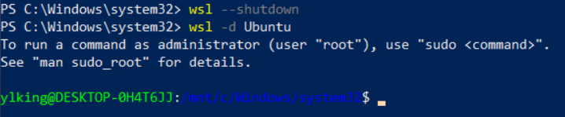
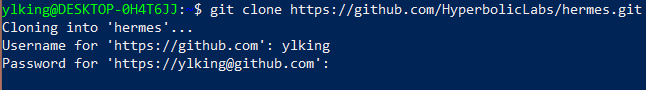

---
tags:
  - Hermes
  - OBsidian
---
## 1、Windows的虚拟环境
打开 “启用或关闭 Windows 功能”
找到并勾选：
-[*] 适用于 Linux 的 Windows 子系统
-[*] 虚拟机平台
确定 → 重启电脑
以管理员身份打开 PowerShell：`wsl --set-default-version 2`（把默认设为 WSL2）

## 2、尝试启动 Ubuntu 子系统
```Powershell
wsl --shutdown
```
我先关闭所有的虚拟机，然后再打开Ubuntu
```
wsl -d Ubuntu
```

期间会要求输入密码，然后进入到这个提示符下。
## 3、先回到你的主目录
你现在在 Windows 的 system32 目录下，不适合在这里操作，先切回 Ubuntu 主目录：
运行
```bash
cd ~
```
## 4、更新系统并安装基础依赖
```bash
sudo apt update && sudo apt upgrade -y
sudo apt install -y git python3 python3-pip python3-venv
```
## 5、克隆 Hermes 项目并准备虚拟环境
```bash
# 克隆官方仓库 
git clone https://github.com/HyperbolicLabs/hermes.git 
cd hermes 
# 创建并激活虚拟环境 
python3 -m venv venv 
source venv/bin/activate
```
激活成功后，终端提示符前会出现 (venv) 标识。
克隆的时候遇到了问题，提示：
```
ylking@DESKTOP-0H4T6JJ:~$ git clone https://github.com/HyperbolicLabs/hermes.git
Cloning into 'hermes'...
fatal: unable to access 'https://github.com/HyperbolicLabs/hermes.git/': Failed to connect to github.com port 443 after 126930 ms: Couldn't connect to server
```
这是WSL 里连不上 GitHub 的网络问题，国内常见
直接在你当前的 Ubuntu 终端里复制运行这两行命令，立刻解决：
```
git config --global --unset http.proxy 
git config --global --unset https.proxy
```
执行之后重新克隆，就进去了，要求输入用户名（ylking）设置密码Yl741023

这里等待很长的时间
如果上面不行，试试这个GitHub国内加速地址
```
git clone https://ghproxy.net/https://github.com/HyperbolicLabs/hermes.git
```
尝试失败，究其原因是WSL 里完全无法访问外网，不是 GitHub 的问题，是系统网络不通。
现在**用下载方式获取源码**
```
wget https://ghproxy.net/https://codeload.github.com/HyperbolicLabs/hermes/zip/refs/heads/main -O hermes.zip
```


## 6、安装 Hermes 依赖
```bash
pip install --upgrade pip
pip install -r requirements.txt
```
