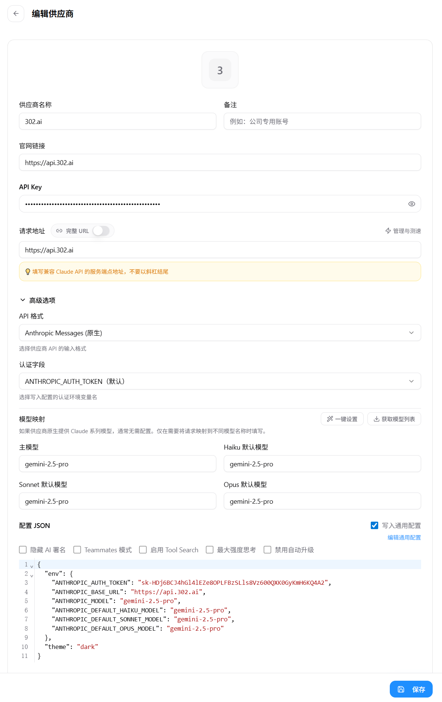

>[!hongse] 我们需要**一个链接、一个密钥、一个模型名字**

## 中转站配置
### 官网地址
[企业级AI资源平台 - 302.AI | 按用量付费，全模型API接入，应用在线使用](https://302.ai/)
### 注册


### 登录

### 控制台
[302.ai/dashboard/overview](https://302.ai/dashboard/overview)

## 密钥管理

```
sk-HDj6BCJ4hGl4lEZe8OPLFBzSLls8Vz600QXK0GyKmH6KQ4A2
```
## 创建配置文件
### 创建settings.json 配置文件
windows 创建 settings.json 配置文件需要进入到当前用户的 .claude 目录下
`C:\Users\%username%\.claude`
如果没有该文件夹可以先在终端输入claude启动一次claude生成文件夹后退出再进入
接着创建一个settings.json文件
填写下列内容
复制代码
```
{
    "env": {
      "ANTHROPIC_BASE_URL": "https://api.302.ai",
      "ANTHROPIC_AUTH_TOKEN":"sk-HDj6BCJ4hGl4lEZe8OPLFBzSLls8Vz600QXK0GyKmH6KQ4A2",
      "ANTHROPIC_MODEL": "kimi-k2-0711-preview"
    }
}
```
其中ANTHROPIC_AUTH_TOKEN 填写在后台获取以sk-的APIKEY,
ANTHROPIC_MODEL填写需要使用的模型。
目前我们支持了所有模型使用claude格式进行调用。
例如需要调用gemini-2.5-pro,只需将kimi-k2-0711-preview替换为gemini-2.5-pro即可，不局限于Claude的模型。
完成上述操作后,切到到您的项目文件启动claude即可使用


## 在cc Switch中添加
