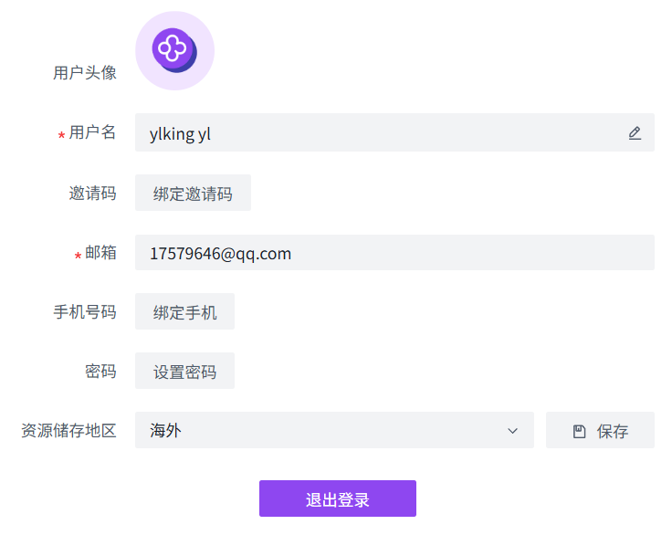
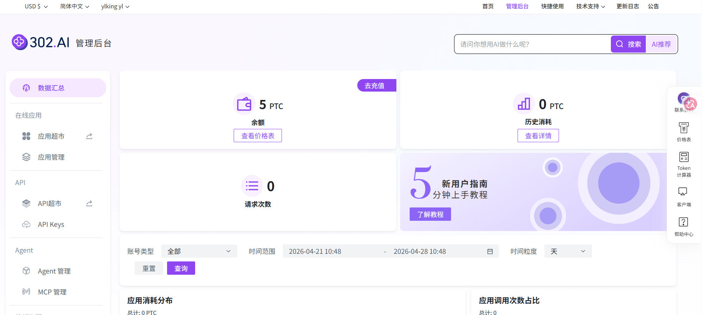
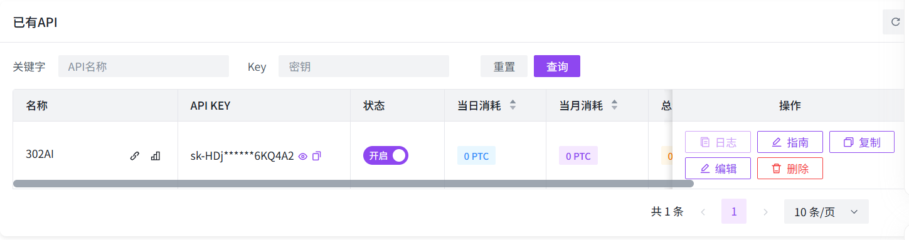
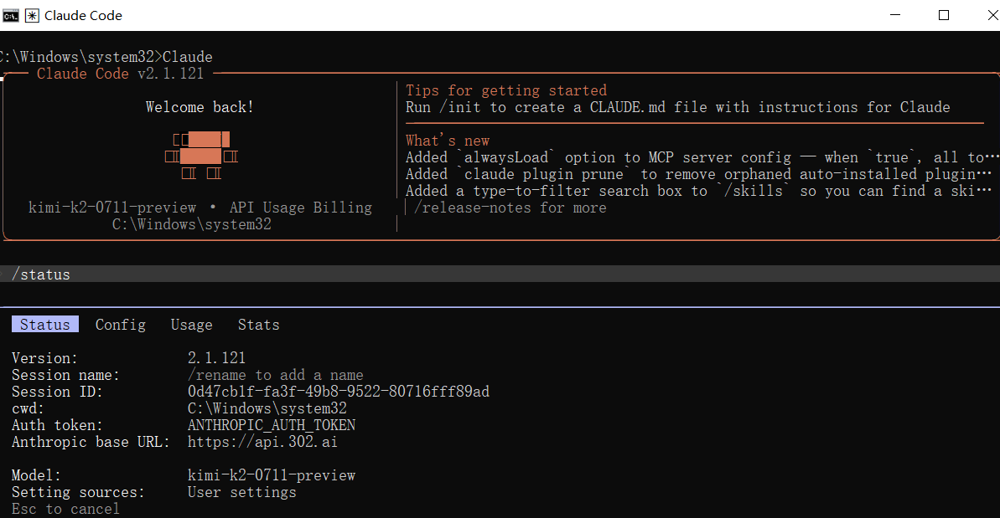
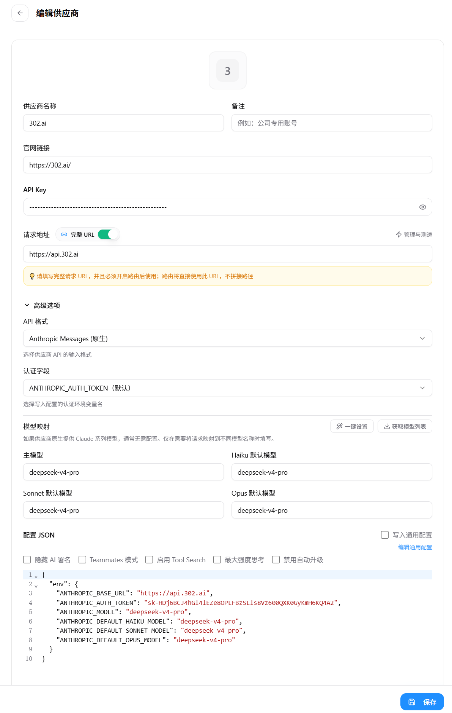
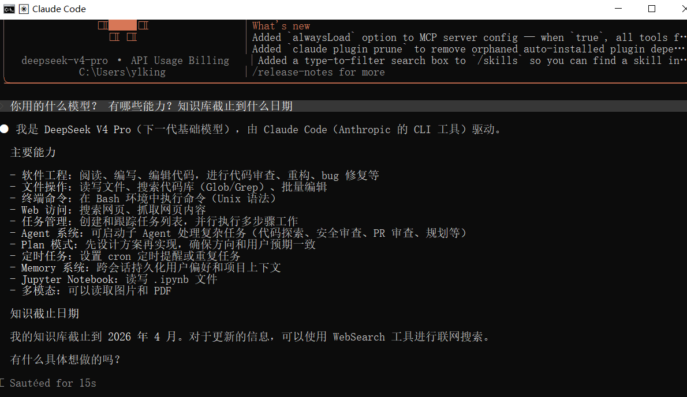
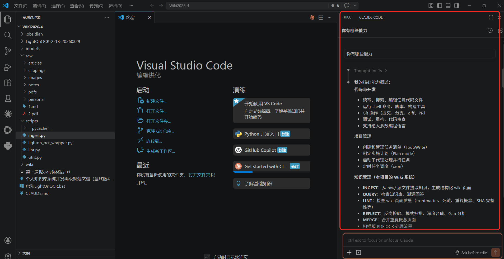
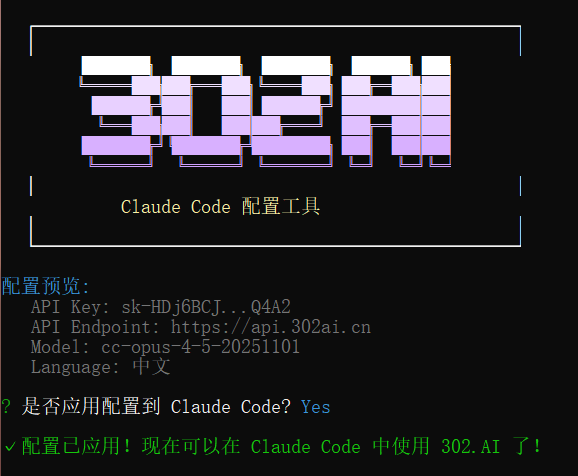

>[!hongse] 我们需要**一个链接、一个密钥、一个模型名字**
```
国际https://302.ai/
国内https://302ai.cn/
17579646@qq.com
Yl@741023
```
## 中转站配置
### 官网地址
[企业级AI资源平台 - 302.AI | 按用量付费，全模型API接入，应用在线使用](https://302.ai/)
国际节点 (api.302.ai) - International
国内节点 (api.302ai.cn) - Domestic
### 注册


### 登录

### 控制台
[302.ai/dashboard/overview](https://302.ai/dashboard/overview)

## 密钥管理

```
sk-HDj6BCJ4hGl4lEZe8OPLFBzSLls8Vz600QXK0GyKmH6KQ4A2
```
## 创建配置文件
### 创建settings.json 配置文件
windows 创建 settings.json 配置文件需要进入到当前用户的 .claude 目录下
`C:\Users\%username%\.claude`
如果没有该文件夹可以先在终端输入claude启动一次claude生成文件夹后退出再进入
接着创建一个settings.json文件
填写下列内容
复制代码
```
{
  "env": {
    "ANTHROPIC_BASE_URL": "https://api.302ai.cn",
    "ANTHROPIC_API_KEY": "sk-HDj6BCJ4hGl4lEZe8OPLFBzSLls8Vz600QXK0GyKmH6KQ4A2",
    "ANTHROPIC_MODEL": "gemini-3-pro-preview",
    "ANTHROPIC_DEFAULT_HAIKU_MODEL": "gemini-3-flash-preview",
    "ANTHROPIC_DEFAULT_SONNET_MODEL": "gemini-2.5-pro-search",
    "ANTHROPIC_DEFAULT_OPUS_MODEL": "gemini-3-pro-preview"
  },
  "theme": "dark"
}

```
其中ANTHROPIC_AUTH_TOKEN 填写在后台获取以sk-的APIKEY,
ANTHROPIC_MODEL填写需要使用的模型。
目前我们支持了所有模型使用claude格式进行调用。
例如需要调用deepseek-v4-pro,只需将模型名称替换为deepseek-v4-pro即可，不局限于Claude的模型。
完成上述操作后,切到到您的项目文件启动claude即可使用


## 在cc Switch中添加

他会自动修改配置文件settings.json
在命令行调用

在VS Code中调用

## 使用302cc设置
### 全局安装
```
npm install -g 302cc 
302cc
```
全局安装，在任何目录下都可以运行302cc，按照中文提示进行到结束
```
> 1. 配置 API Key
  2. 配置 API 节点
  3. 配置模型
  4. 配置界面语言
  5. 清空当前配置
  6. 应用配置并退出
  7. 直接退出
```

302cc跟cc Switch配置可能会产生冲突，在settings.json中增加不需要的代码，请仔细查看