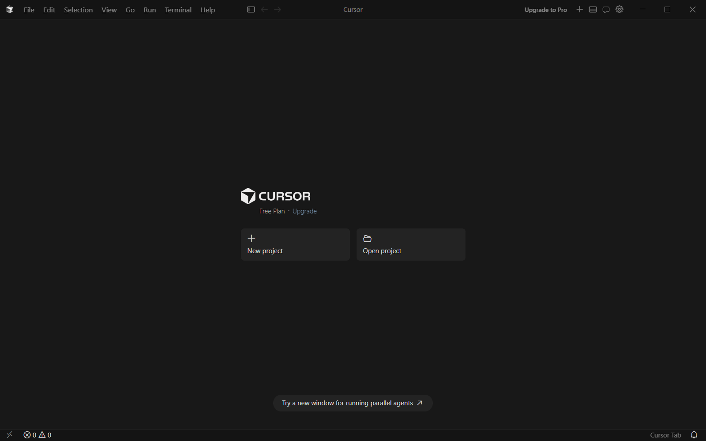
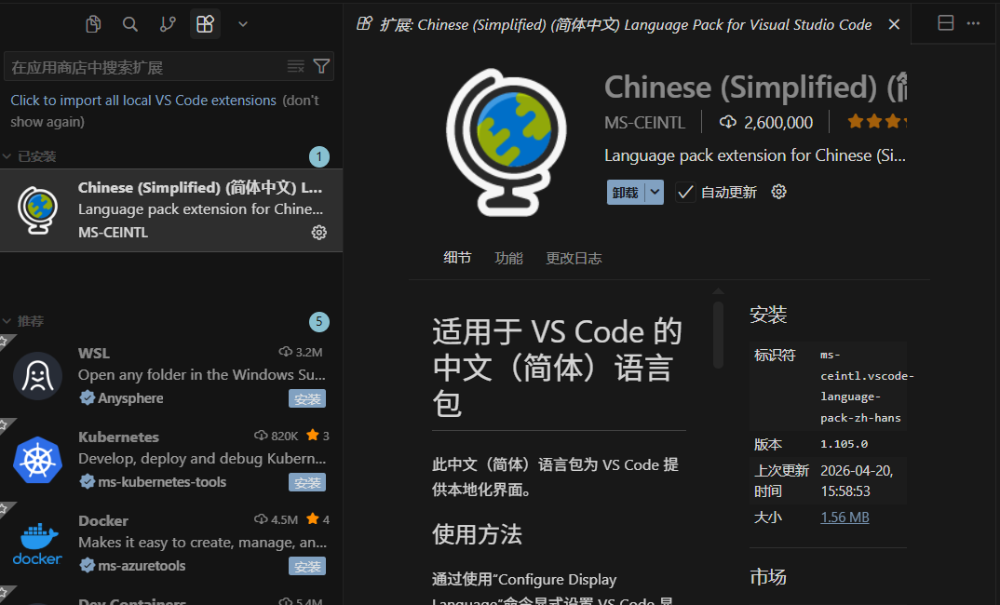
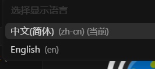
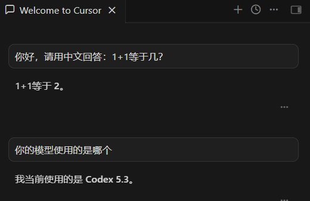

# Step1 建立知识库

把你所有的文件夹全部都放进RAW里
可以使用不同的文件夹进去分类管理
也可以按照ACE法则管理
## Typeless（与本主题无关）

识别准确率很高，  [[../Atlas/语音输入法Typeless]]

## 安装obsidian浏览器插件（与本主题无关）
[[../Atlas/Obsidian/Obsidian-安装浏览器 Obsidian 插件|Obsidian-安装浏览器 Obsidian 插件]]
它能把网页一键转换成md文件保存到你的文件夹下

# Step2 关联AI命令行工具

这才是重点需要突破的地方

# Step3 提问
---

带有启发的视频：[LLM+Obsidian+本地知识库=能进化的第二大脑_哔哩哔哩_bilibili](https://www.bilibili.com/video/BV1DXQ7BhE9t/?spm_id_from=333.337.search-card.all.click&vd_source=b00ffc87d2f4365faf01741e93e463bb)
 带有启发的视频2：[Obsidian+AI构建个人知识库_哔哩哔哩_bilibili](https://www.bilibili.com/video/BV1c6XDBCEfw/?spm_id_from=333.337.search-card.all.click&vd_source=b00ffc87d2f4365faf01741e93e463bb)

## 下载安装Cursor，使用Github登录
下载地址：[Cursor · Download](https://cursor.com/cn/download)
 使用的是17579646@qq.com邮箱和13801408965收验证码
 
 ### 修改为中文界面
 可以用快捷键Ctrl + Shift + X（我的快捷键跟截图软件冲突），或者直接点菜单：
- 顶部菜单栏点 View（视图）
- 选择 Extensions（扩展）
- 左侧就会打开扩展面板
- 搜索语言包，点安装install
	- 搜索：Chinese (Simplified) Language Pack for Visual Studio Code发布者一般是 Microsoft

- 打开命令面板（按 Ctrl + Shift + P）
- 搜索并执行， 输入 Configure Display Language
- 选简体中文
- 
### 测试提问
快捷键Ctrl+L打开/关闭对话窗口
提问测试

