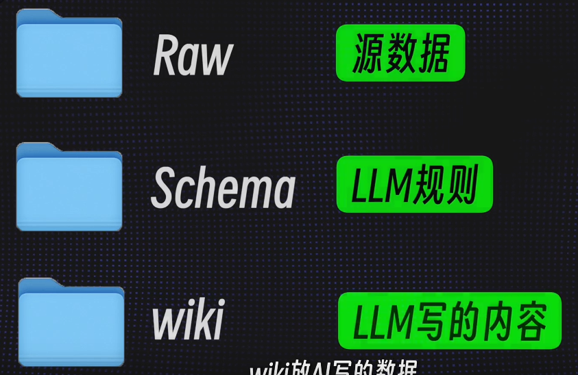
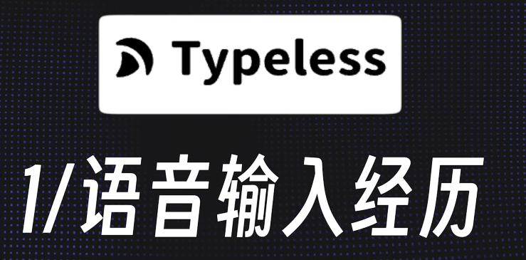
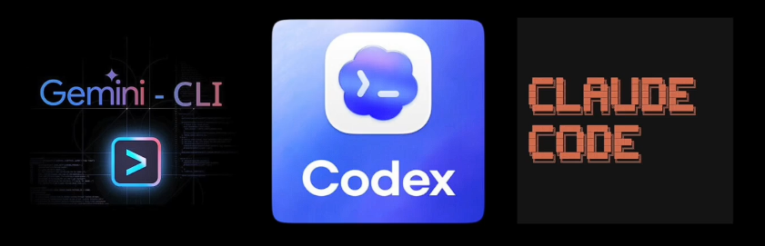
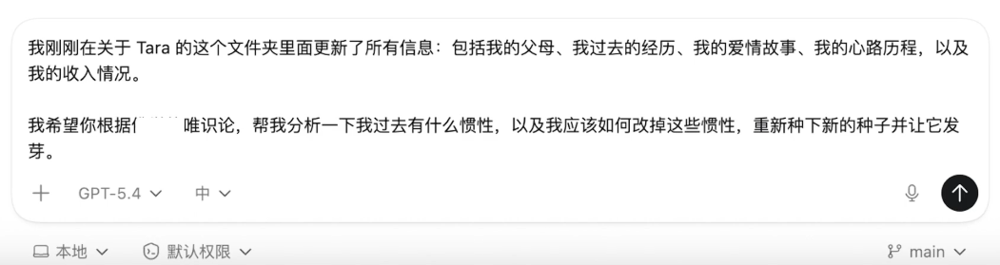

Step1 建立知识库

把你所有的文件夹全部都放进RAW里
可以使用不同的文件夹进去分类管理
也可以按照ACE法则管理
## Typeless

识别准确率很高，  [[../语音输入法Typeless]]

## 安装obsidian浏览器插件
[[../Obsidian/obsidian浏览器插件]]
它能把网页一键转换成md文件保存到你的文件夹下

# Step2 关联AI命令行工具

这才是重点需要突破的地方

# Step3 提问
