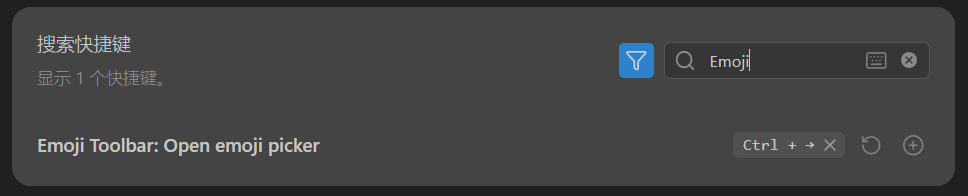
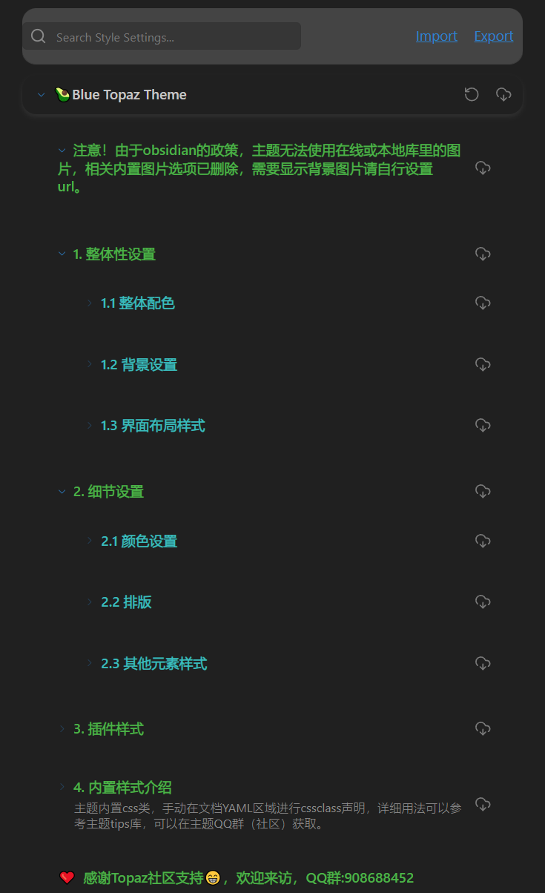

# Step1 建立知识库

把你所有的文件夹全部都放进RAW里
可以使用不同的文件夹进去分类管理
也可以按照ACE法则管理
## Typeless

识别准确率很高，  [[../Atlas/语音输入法Typeless]]

## 安装obsidian浏览器插件
[[../Atlas/Obsidian/Obsidian-安装浏览器 Obsidian 插件|Obsidian-安装浏览器 Obsidian 插件]]
它能把网页一键转换成md文件保存到你的文件夹下

# Step2 关联AI命令行工具

这才是重点需要突破的地方

# Step3 提问
---

带有启发的视频：[LLM+Obsidian+本地知识库=能进化的第二大脑_哔哩哔哩_bilibili](https://www.bilibili.com/video/BV1DXQ7BhE9t/?spm_id_from=333.337.search-card.all.click&vd_source=b00ffc87d2f4365faf01741e93e463bb)

 带有启发的视频2：[Obsidian+AI构建个人知识库_哔哩哔哩_bilibili](https://www.bilibili.com/video/BV1c6XDBCEfw/?spm_id_from=333.337.search-card.all.click&vd_source=b00ffc87d2f4365faf01741e93e463bb)
 ## 使用的插件
 
### Advanced Tables
 ##### ✅作用
- 自动格式是Markdown表格
- 自动列宽
- Tab键快速编辑表格

### Claudian
#### 作用
Claude AI 在 Obsidian 里的入口
- 调用 Claude (类似 ChatGPT)
- 写作、总结、润色
#### 用法
- 选中一段文字 -> 让 AI 改写/总结
- 写论文草稿

### Dataview ★ (核心插件)
#### 作用
把 Obsidian 变成数据库
查询笔记
自动生成表格
动态数据展示
#### 用法 (核心! )
table author, year
from "论文"
自动列出所有论文
适合你(重点)
#### 做:
文献管理
实验数据索引
项目管理

### Emoji Toolbar
#### 作用
- 插入表情📰
- 快速美化笔记
#### 用法
输入：`CTRL`+`→`(自定义)选择 emoji

## Excalidraw⭐ (强烈推荐)
#### 作用
在 Obsidian 里画图
思维导图
结构图
流程图
手绘本稿
适合你
#### 画:
模型结构图 (你做CV的)
系统架构图
论文插图

### Kanban
#### 作用
看板管理(类似Trello)
待做→进行中→已完成
#### 用法
拖拽任务卡片
适合你
#### 管:
- 科研任务
- 项目进度
- 论文进度

### PDF++
#### 作用
👉增强PDF阅读
- 标红PDF
- 双向链接笔记
- 引用段落
#### 适合你(非常关键)
👉看论文神器

### Style Settings
#### 作用
- 调整主题样式
- 改字体/颜色/间距
#### 本质:UI美化

### Terminal
#### 作用
在 Obsidian 里开终端
运行命令
git 操作
启动项目
#### 适合你