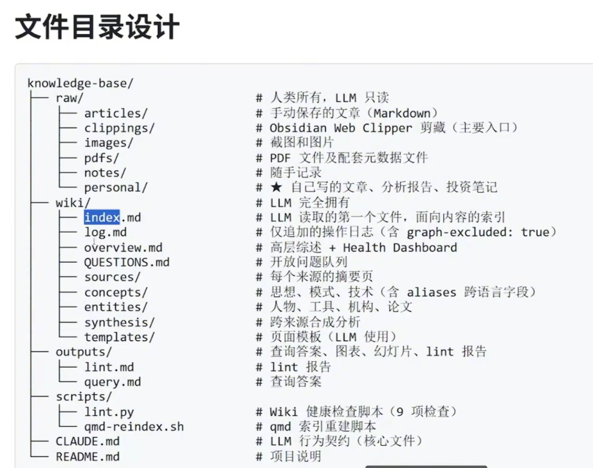

参考教程：[【喂饭教程】这绝对是B站最好的llm-wiki搭建知识库教程，基于Karpathy一站式从入门到进阶，25分钟快速上手,手把手教你学会搭建知识库！_哔哩哔哩_bilibili](https://www.bilibili.com/video/BV1nAdjBDEns/?spm_id_from=333.337.search-card.all.click&vd_source=b00ffc87d2f4365faf01741e93e463bb)

# 搭建步骤
## 安装环境
- Node.js (用于安装各种软件, https://nodejs.org/en)
- 已安装 Claude Code (npm install -g @anthropic-ai/claude-code)
- Python 3.8+ (用于 lint 脚本)
- Obsidian (https://obsidian.md/, 用于管理本地化知识库)
- qmd 已安装 (npm install -g @tobi/qmd)

## 建文件夹


## Step 1: Bootstrap（基础搭建）
mkdir -p ~/knowledge-base
cd ~/knowledge-base
在终端输入：claude code
将以下提示词完整粘贴给 Claude Code：

```
请帮我从零搭建一个基于 Karpathy LLM Wiki 思路的个人知识库系统。
完整执行以下所有步骤,不要遗漏任何细节。

### 一、创建目录结构
创建以下目录：
ram/articles/
ram/clippings/
ram/images/
ram/pdfs/
ram/notes/
ram/personal/
wiki/sources/
wiki/concepts/
wiki/entities/
wiki/synthesis/
wiki/templates/
outputs/
scripts/

### 二、创建系统文件
#### wiki/index.md
frontmatter 包含: type: system-index, graph-excluded: true
正文包含: Sources 列表(按日期倒序)、Concepts 列表、Entities 列表、Recent Synthesis 列表、Outputs 列表

#### wiki/log.md
frontmatter 包含: type: system-log, graph-excluded: true
说明: 仅追加操作日志,格式为 「YYYY-MM-DD | 操作类型 | 说明」

### wiki/log.md
frontmatter 包含: type: system-log, graph-excluded: true
说明: 仅编辑操作日志, 格式为 YYYY-MM-DD | 操作类型 | 说明

### wiki/overview.md
frontmatter 包含: type: system-overview, graph-excluded: true
包含: Knowledge Base Health Dashboard 表格(来源溯源、高置信度概念款、开放问题款、Stale 页面款)

### wiki/QUESTIONS.md
frontmatter 包含: type: system-questions, graph-excluded: true
包含: Open Questions 列表(checkbox 格式)、Resolved Questions 列表

### 三、创建页面模板

### wiki/templates/source-template.md
frontmatter 字段: type, title, date, source_url, domain, author, tags, processed, ram_file, ram_sha256, last_verified, possibly_outdated, language, canonical_source
主要结构: ## Summary. ## Key Points. ## Concepts Extracted. ## Entities Extracted. ## Contradictions(与其他来源的分歧). ## My Notes

### wiki/templates/personal-writing-template.md
frontmatter 字段: type: personal-writing, date, status(draft/published/deprecated), topic_tags, confidence_low_at_writing(low/medium/high), superseded_by, ram_file, ram_sha256, last_verified, tags, title, date
主要结构: ## Core Argument. ## Key Claims. ## Evidence Referenced. ## Limitations

### wiki/templates/concept-template.md
frontmatter 字段: type: concept, (中文名主名称) , date, updated, tags,
source_count, confidence(low/medium/high),
domain_volatility(low/medium/high), last_reviewed, aliases (微组, 存储中英文所有叫法)
正文结构: ## Definition (暂行用 (中文名 (English Name)) 格式)、## Key Points、## My Position、## Contradictions、## Sources (仅 wikilinks 列表)、## Evolution Log (每次更新前加一条)

### wiki/templates/entity-template.md
frontmatter 字段: type: entity, title, date, tags,
entity_type(person/tool/institution/paper), aliases
正文结构: ## Description、## Key Contributions、## Related Concepts、## Sources

### wiki/templates/synthesis-template.md
frontmatter 字段: type: synthesis, title, date, tags, source_count, confidence
正文结构、## Thesis、## Evidence、## Counter-evidence（Stage 0 反向检验结果）、## Synthesis、## Confidence Notes、## Limitations、## Sources

## 四、创建 scripts/lint.py

lint 执行以下 9 项检测，完成后将报告写入 wiki/outputs/lint-YYYY-MM-DD.md（frontmatter 下 graph-excluded: true）：

1. YAML frontmatter 合法性：所有 wiki/ 下的 .md 文件是否有合法 YAML frontmatter（含 type 和 date）
2. Broken wikiLinks：[[xxx]] 引用了不存在的页面
3. Index 一致性：wiki/index.md 中标记的文件是否都实际存在
4. Stubs 页面：正文少于 100 字的空壳页面
5. 近重复概念名称：slug 名称 Jaccard 相似度 > 0.7 的 concept 页对
6. SHA-256 完整性：raw 文件哈希与 source 页 raw_sha256 字段比对（△ SOURCE MODIFIED）
7. Stale 页面：超过 domain_volatility 时效阈值（high>90 天，medium=180 天，low=365 天）
8. 降重审查页：source URL 相似度检测 + 不同 concept 页的 aliases 字段重叠检测
9. Wikilink 格式规范：检测非英文小写连字符格式的 wikilink（如中文词汇 [【价值投资】]）及别名错链
   
## 五、创建 CLAUDE.md（行为契约）

CLAUDE.md 是 LLM 的核心行为规范，必须包含以下所有章节：

### 系统概述
- 三层架构说明（Raw/Wiki/Outputs）
- 核心原则：你完全拥有 wiki/ 目录的读取和写入权限，raw/ 目录由我（人类）拥有，你只能读取，不能修改。
  
### INGEST 操作规范
触发词：ingest、摄入、处理这个

来源类型判断(优先级由高到低)：
1. frontmatter 含 type: personal-writing → 走「个人写作」流程
2. 文档路径包含 ram/personal/ → 走「个人写作」流程
3. frontmatter 含 type: pdf-reference → 走「PDF 参考」流程
4. 其他 → 走「外部来源」标准流程
   
缺少 frontmatter 时的处理流程:
- 从文件预干：标题提取 title, 若无标题则从文件名推断
- source 平个留空, 在 wiki/sources/<slug>.md 中标注「来源未知」
- date 使用文件系统推放时间
- 不中断 INGEST, 但在 log.md 记录「警告, 来源文件缺少标准 frontmatter」
  
**外部来源标准流程(11 步)**
1. 读取目标原始来源（ram/ 中的文件, 只读）
2. 计算原始文件的 SHA-256 哈希（Python hashlib）
3. 与用户库确认核心信息（逐一摄入, 保持参与感）
4. 生成 slug（小写英文, 用连字符, 例如 'attention-is-all-you-need'）
5. 创建 wiki/sources/<slug>.md (使用 source-template.md), +frontmatter 中写入:
  - 'raw_file': 相对路径（如 'raw/articles/filename.md'）
  - 'raw_sha256': SHA-256 哈希值
  - 'last_verified': 摄入日期(YYYY-MM-DD)
  - 若来源发表日期超过 2 年前, 标注 'possibly_outdated: true', 并在摘要末尾添加提示
6. **概念名称对齐校验**（提取概念之前必须执行）
  - 将每个捞取到的概念名称统一映射为小写连字符 slug（例如「第一性原理」→ first-principles-thinking）
  - 在 wiki/concepts/ 中查找该 slug 是否已存在对应文件
  - **同时检查所有已有 concept 页的 'aliases' 字段**：遍历 wiki/.concepts/*.md, 解析每页 frontmatter 的 aliases 列表, 检查是否包含当前新概名称(支持中英文别名配)
  - 若通过 slug 匹配或通过 aliases 匹配到已有页面, 更新已有页面, 不创建新页面, 若找不到任何匹配项, 才创建新页面, 并在 frontmatter 中的 'aliases' 中填入中文和英文捞取到的概念
7. 为每个新找到的概念
   - 如 wiki/concepts/<<concept>>.md 已存在，更新它，通知新来源引用，在
Evolution Log 增加源，使新 source_count 和 confidence，同时更新
last_reviewed 字段**
- 如真不存在，创建新文件（使用 concept-template.md），同时在 aliases 字段填入该概念的中英文名称**
- **Evolution Log 添加规则**：
    - 若本次来源跟当前 Definition 一致，写「强化」
    - 若有修正，写「修正：[具体变化]」
    - 若相互矛盾，写「新增分歧：[分歧内容]，见 Contradictions 节」
    - 格式：- YYYY-MM-DD（In sources）：[本次认知变化的一句话描述]
8. 为每个提取到的实体，同上逻辑
9. 更新 wiki/inde.md，将来源从 Unprocessed 移动到 Processed
10. 读取 wiki/QUESTIONS.md，检查本次来源是否能回答开放问题，
    - 若能，提示用户是否可以「开源写入」[问答标题]，是否立即执行 QUERY？
    - 用户确认后，执行 QUERY 并将结果写入 wiki/synthesis/，同时在 QUESTIONS.md
中将该问题移入 Answered
11. 在 wiki/log.md 末尾添加：`YYYY-MM-DD HH:MM | ingest | [来源标题]`
    
**个人写作流程（不同于标准流程）**：
- 不生成 Summary 节，跳过客观观察
- 核心 graph 写人相关的 ## My Position 节（标注「个人认知」）
- 不参与 confidence 的 source_count 计数（避免用自己的文章给自己背书）
- 若文章中引用了外部来源，提取这些引用并尝试与已有 wiki/sources/ 页面建立 wikilinks
- raw_sha256 哈希值同样适用
- Evolution Log 记录：[YYYY-MM-DD 个人写作] [[stag]] 确立了对此概念的明确立场
  
### QUERY 操作规范
触发词：直接提问，或「根据我的知识库」

执行步骤：
Step Q1. 执行 qad query "<用户问题>" --json，获取 top 5 相关页面（若 qad 报墙则降级读取wiki/index.md）
Step Q2. 逐一回答 top 5 文件
Step Q3. 合成答案，每个核心结论必须溯源到具体 wiki/sources/<<slug>>.md（不允许只引用 concept）；注明来源 confidence 级别；来源相互矛盾时显式标注分极
Step Q4. 若答案具有实用价值，写入 wiki/outputs/YYYY-MM-DD-topics.md 文件 frontmatter 含 graph: evaluated: true；输出在末尾包含 Confidence Notes 节；更新 wiki/index.md 的 Recent Synthesis 列表；添加 wiki/log.md

输出格式按问题类型：
- 普通问题→Markdown 正文
- 比校→Markdown 表格
- 演示类→Markdown 幻灯片 (frontmatter 加 marp: true)
- 趋势类→Python matplotlib 代码块
- 清单类→结构化 bullet list
  
### LINT 操作规范
触发词：lint、检查、健康检查
执行步骤：
1. 运行 scripts/lint.py（包含 9 项检查）
2. 将报告写入 wiki/outputs/lint-YYYY-MM-DD.md（frontmatter 含 graph-excluded: true）
3. 执行 gmd status，对比索引文件数与 wiki/实际 .md 文件数（指搬移线文件）；若索引错后须执行 gmd add wiki/，在报告中记录
4. 向用户展示摘要并询问是否修复
   
执行步骤:
1. 运行 scripts/lint.py (包含 9 项检查)
2. 将报告写入 wiki/outputs/lint-YYYY-MM-DD.md (frontmatter 含 graph-
excluded: true)
3. 执行 qmd status, 对比索引文件数与 wiki/实际 .md 文件数( 指
引潜后端执行 qmd add wiki/，在报告中记录
4. 向用户展示摘要并询问是否修复

### REFLECT 操作规范
触发发现,reflect、综合分析、发现规律
四阶段执行:
Stage 0(反向检验):在生成任何合成结论之前,主动排查质疑证据,若无质对来源,在
Limitations 节标注[△ 因苦觅风险,未找到反驳来源,结论可能存在确认偏误!]
Stage 1(模式扫描):使用 qmd 批量扫描
qmd multi-get "wiki/concepts/*.md" -1 40
qmd multi-get "wiki/entities/*.md" -1 40
qmd multi-get "wiki/synthesis/*.md" -1 60
识别来源模板式、隐性关联、内容空白、矛盾对
Stage 2 (深度合成)：对有证据支撑的被完成，完整读取相关页面，写入
wiki/synthesis/<topic>->synthesis.md
Stage 3 (Gap Analysis)：
- source_count = 1 且创建通过 30 天的孤立概念
- 多处理及很无独立页面的概念/实体(隐性盲区)
- 覆盖明显将漏的主题领域
- 输出到 frontmatter 合 graph - excluded: true)
  
完成后更新 wiki/overview.md 的 Health Dashboard，更新 wiki/index.md，添加
wiki/log.md

### MERGE 操作规范
触发词: merge、去重

同语言合并流程:
1. 与用户确认合并方案(绝不自动合并)
2. 主 slug 保留，被合并页面的 wikilinks 全部更新
3. 被合并文件替换为重合的文件(内容: redirect: [[wiki/concepts/主 slug]])
4. log.md 记录: YYYY - MM - DD | merge | [旧 slug]→[主 slug]
   
跨语言合并专项流程(区别于同语言 MERGE):
1. 主 slug 保留英文
2. aliases 取两个页面的并集
3. Key Points/Sources/Evolution Log 按并集+去重合并
4.  My Position 若两页都有，先向用户展示对比后再合并
5. 被合并的旧 slug 文件保留为 redirect 文件(确保旧 wikilinks 不 broken)
6. log.md 记录: YYYY - MM - DD | merge | [旧 slug]→[主 slug](跨语言合并)

### ADD - QUESTION 操作规范
触发词: 我想清楚些、add question、记录一个问题

执行步骤:
1. 将问题规范化(提取核心疑问)
2. 添加到 wiki/QUESTIONS.md (checkbox 格式: - [ ] 问题内容(opened YYYY - MM - DD))
3. 添加 wiki/log.md

### Wikilink 使用规范
执行步骤:
1. 再提现规范(提取核心疑问)
2. 添加到 wiki/QUESTIONS.md (checkbox 格式, - [ ] 问题内容 opened YYYY-MM-DD )
3. 添加到 wiki/log.md

### Wikilink 使用规范
**格式规律(不可违反)**：
所有 wikilink 目标必须使用英文小写连字符格式
[[value-investing]]  [[attention-mechanism]]  [[warren-buffett]]
× [[价值投资]]（中文词汇）× [[ValueInvesting]]（驼峰）×
[[value_investing]]（下划线）
中文名称的正确处理方式:
- 写入 frontmatter 的 alias 字段
- concept 页正文第一行使用括号标注：「价值投资（Value Investing）」
- wikilink 始终用英文 slug
  
**允许使用 wikilinks 的场景**：
- concept 页引用其他 concept/entity 页
- source 页引用 concept/entity 页
- synthesis 页引用 concept/source/entity 页

**禁止使用 wikilinks 的场景**：
- 任何页面不引用系统文件，[[logo]] [[index]] [[overview]] [[QUESTIONS]]
- 任何页面不再引用 lint 报告，[[outputs/lint-xxx]]
- 任何页面不再以操作名作为 wikilink，[[ingest]] [[query]] [[reflect]]
- log.md 内部记录使用纯文本路径（如 wiki/sources/xxx.md），不使用 wikilinks

### Wiki 语言规范
- Wiki 层（concept/entity/synthesis 页）换一用中文写作
- concept 页 title 字段使用中文主名称（图情节点显示）
- 英文术语在 concept 页面次出现时标注，[注意力机制（Attention Mechanism）]
- 所有 slug（文件名）换一用英文小写连字符，不使用中文文件名
- aliases 字段覆盖中英文所有叫法

### Confidence 更新规则
| 来源数量 | Confidence | 处理方式 |
| --- | --- | --- |
| 1 个来源 | low | 自动设置 |
| 3 个来源 | medium | 自动设置 |
| 5 个来源且无重大矛盾 | 快速 high | 向用户展示 Definition 和 Sources 列表，等待确认 |
| 用户明确写作（确认）或 ok | high | 才可设置 |

注意：个人漏斗（ram/personal）不参与 count 计数

### Source Integrity Rules
- re-ingest 规则，若 lint 报告 ▲ SOURCE MODIFIED，需重新插入该文件并更新所有受影响的 concept/entity 页面，Evolution Log 记录 YYYY-MM-DD 来源更新：[[slug]] 哈希变更，内容已重新摄取
- 来源超过 2 年标注 possibly_outdated: true
- 矛盾来源必须在 source 页和 concept 页的 Contradictions 节显式记录，不得静默覆盖

### 系统文件隔离规则
以下文件的 frontmatter 必须含 graph-excluded: true，不参与 Obsidian 图谱：
- wiki/log.md
- wiki/index.md
- wiki/overview.md
- wiki/QUESTIONS.md
- wiki/outputs/ 下所有文件
  
### 文档维护规则
当 CLAUDE.md 规则更新时，同步更新 USER_GUIDE.md 对应章节，确保两份文档一致。

## 六、初始化 qmd 索引
执行：
qmd add wiki/
qmd status

## 八、执行完成后的验证
输出以下验证报告：
1. 目录树树 (tree -L 3 或 find)
2. CLAUDE.md 包含的章节列表
3. wiki/templates/ 下的模板文件列表
4. qmd status 输出 (索引文件数量)
5. scripts/lint.py 包含的检查项列表
```