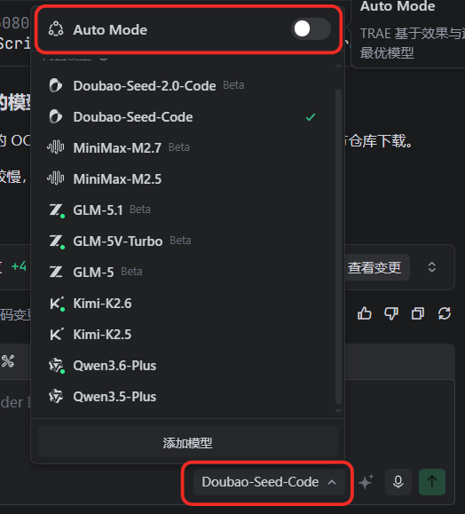

## 中文免费
## 规则
在 Trae 中配置开发习惯主要通过「规则」功能实现，分为**个人规则（全局生效）和项目规则（仅当前项目生效）** 两类。
不用每次都告诉AI哪些事不要做，你可以在这里制订好你的开发习惯、项目规则。
以下是具体步骤：
### 配置个人规则（全局开发习惯）
##### 进入规则页面
在 IDE 模式或 SOLO 模式中，点击右上角「设置」图标 → 选择「规则和技能」。
##### 新建个人规则
在「个人规则」区域点击「+ 创建」，输入规则内容（例如：代码风格、语言偏好、交互方式等）。
##### 推荐示例：
- 代码风格：使用 snake_case 命名，4 个空格缩进。
- 语言偏好：优先使用 Python 3.10，禁止使用 eval()。
- 交互方式：直接输出代码，无需解释。
```
### 全局规则
1. 请保持对话语言为中文
2. 我的系统为Windows
3. 不要太多的注解，除了方法，其它任何代码不要空一行，保持代码的整洁
4. 不需要验证结果，只需返回代码
5. 不要你调试，我每次都已经运行过了，你只需要找到我报错的地方
6. 不要你执行任何npm run命令，有需要的通知我手动执行
7. 重点，我手动删除或则修改过的代码，不要再修改，也不要再改回来！！！！重点！！！！不要再修改
```
##### 保存规则
点击「保存」后，规则会自动应用于所有项目。

## Auto模式vs自定义大模型


## 新建任务功能
建议每次修改新版的功能点时新建任务
以免上下文超过长度，AI忘记之前的要求
杜绝一半AI乱改代码的习惯
## 不想排队接入火山引擎
[[火山引擎]]

## 开源项目功能的精准移植。
第一步：定位核心代码将开源项目源码下载后导入项目目录，使用 Trae **分析指定目录**，AI 可快速定位核心文件与代码，且支持反复分析直至精准匹配需求。
第二步：验证功能基于 AI 分析结果，**生成简易 demo.html** 测试功能效果，给他提示词生成，然后即可测试。
第三步：**适配项目**。让 AI 将核心代码复刻修改为适配自身项目的调用方式，视频中演示将代码转为 ts 类文件。该方法适用于复杂业务逻辑，可显著提升开发效率。


TRAE 功能详解：上下文 - 规则 通过制定规则来规范 AI 在 TRAE IDE 内的行为 #TRAE #上下文 #规则 #Rules

二、配置项目规则（针对当前项目）
进入项目规则页面
同样通过右上角「设置」→「规则和技能」，在「项目规则」区域操作。
新建项目规则
点击「+ 创建」，系统会在项目目录下生成 .trae/rules 文件夹，并打开 project_rules.md 文件。
推荐示例：

项目代码规范
禁止使用全局变量，所有函数必须有类型注解。
数据库操作统一使用 SQLAlchemy 框架。
日志必须记录时间戳和调用栈。
3. **设置规则生效方式**  
- **文件匹配模式**：通过通配符指定规则作用的文件（例如 `*.py`、`src/**/*.ts`）。  
- **描述**：填写规则的适用场景（例如“仅在后端接口开发时使用”）。
4. **保存并应用**  
- 保存后，规则仅在当前项目生效。若需临时调用，可在对话中输入 `#Rule 规则名称`。

TRAE 功能详解：上下文 - 规则 通过制定规则来规范 AI 在 TRAE IDE 内的行为 #TRAE #上下文 #规则 #Rules

三、注意事项
规则优先级：
用户输入 > 自定义智能体提示词 > 个人规则 > 项目规则。
避免频繁修改：
规则配置完成后尽量保持稳定，修改前建议在团队内达成共识。
结合 AGENTS.md：
若需更复杂的智能体行为约束，可在项目根目录创建 AGENTS.md 文件，并在「设置」中开启「将 AGENTS.md 包含在上下文中」开关。
通过以上步骤，你可以将个人开发习惯（如代码风格、语言偏好）和项目规范（如框架限制、团队约定）统一配置在 Trae 中，减少重复沟通，提升开发效率。
