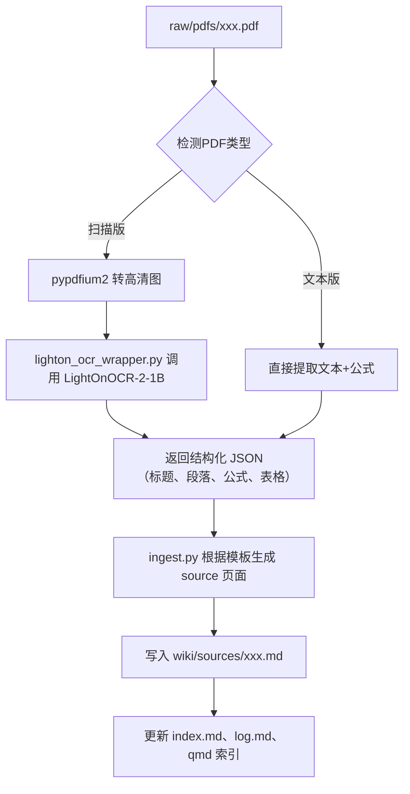

**基于 Karpathy LLM Wiki 思路 + LightOnOCR-2-1B 高精度扫描版 PDF 处理**

## 1. 项目目标

构建一个完全离线、可离线运行、GPU 加速的个人知识库系统，具备业界顶尖的扫描版 PDF（含复杂数学公式）处理能力，自动生成结构清晰、公式完美、完全兼容 Obsidian 的 Markdown 知识网络。

## 2. 核心能力

- 扫描版 PDF → 高质量 OCR + 公式识别（LightOnOCR-2-1B）
- 文本型 PDF → 精准提取 + 公式保留
- 自动生成标准化 source / concept / entity / synthesis 页面
- 完整的前置检查脚本（lint.py 10项检查）
- 严格的行为契约（CLAUDE.md）
- qmd 向量索引
- 100% 离线、数据本地、隐私安全

## 3. 项目目录结构（最终版）

```
WIKI2026-4/
├── raw/                    # 原始文件（永不修改）
│   ├── articles/
│   ├── clippings/
│   ├── images/
│   ├── pdfs/               # 放入任何 PDF（扫描版/文本版）
│   ├── notes/
│   └── personal/
├── wiki/                   # Obsidian 主库
│   ├── sources/            # 自动生成的 source 页面
│   ├── concepts/           # 概念页
│   ├── entities/           # 人、机构、工具、论文等
│   ├── synthesis/          # 综合分析页
│   ├── templates/          # 模板
│   ├── outputs/            # lint 等报告
│   ├── index.md            # 系统主页
│   ├── log.md              # 操作日志
│   ├── overview.md         # 健康仪表盘
│   ├── QUESTIONS.md        # 开放问题
│   └── CLAUDE.md           # 行为契约（核心！）
├── scripts/
│   ├── ingest.py               # 主入口
│   ├── lighton_ocr_wrapper.py  # LightOnOCR-2-1B 包装器（关键）
│   ├── lint.py                 # 10项健康检查
│   └── utils.py
├── LightOnOCR-2-1B-20260329/   # 原始项目目录（保留完整环境）
│   ├── ckpt/                   # 模型权重
│   └── aiyy.info/              # 原始 conda 环境
└── README.md
```

## 4. 核心技术栈（最终选型）

| 类别             | 技术选型                     | 说明                              |
|------------------|------------------------------|-----------------------------------|
| OCR & 公式识别   | LightOnOCR-2-1B              | 当前最强开源文档理解模型          |
| PDF → 图像       | pypdfium2                    | 速度快、渲染质量高                |
| 深度学习框架     | PyTorch + CUDA 12.x          | GPU 加速                          |
| Markdown 处理    | Python 自研重构引擎          | 严格遵循模板                      |
| 向量索引         | qmd                          | 轻量、纯 Python、离线             |
| 知识库前端       | Obsidian                     | 原生支持 wikilink、LaTeX、图谱    |

## 5. 系统文件与模板（必须 100% 一致）

### 5.1 系统文件（graph-excluded: true）

| 文件路径                    | 主要用途        | frontmatter 必含字段       |
| ----------------------- | ----------- | ---------------------- |
| wiki2026-4/index.md     | 系统主页        | type: system-index     |
| wiki2026-4/log.md       | 操作日志        | type: system-log       |
| wiki2026-4/overview.md  | 健康仪表盘       | type: system-overview  |
| wiki2026-4/QUESTIONS.md | 开放问题追踪      | type: system-questions |
| wiki2026-4/CLAUDE.md    | 行为契约（最高优先级） | type: system-contract  |

### 5.2 模板文件（wiki/templates/）

已全部统一，包含以下 5 个模板（字段与第一份文档完全一致）：

1. source-template.md → 来源页
2. personal-writing-template.md → 个人写作
3. concept-template.md → 概念页（核心）
4. entity-template.md → 实体页
5. synthesis-template.md → 综合页

**所有 wikilink 必须使用英文小写连字符格式，中文名写入 aliases 字段**

## 6. 扫描版 PDF 处理流程（最终方案）



**LightOnOCR-2-1B 集成方式（关键）**：

- 不迁移模型、不重装环境
- 通过 `lighton_ocr_wrapper.py` 生成临时脚本，在原始 `LightOnOCR-2-1B-20260329` 项目的 conda 环境中执行
- 保证 100% 与原作者效果一致

## 7. scripts/lint.py 最终检查项（10项，不可增删）

1. YAML frontmatter 合法性检查
2. Broken wikilinks 检查
3. index.md 一致性检查
4. Stubs 页面（<100字）
5. 近重复概念名称（Jaccard > 0.7）
6. raw 文件 SHA256 完整性校验
7. Stale 页面检测（依 domain_volatility）
8. 来源降重 + aliases 重叠检测
9. Wikilink 命名规范（必须小写连字符）
10. LaTeX 公式闭合检查

执行后输出：`wiki/outputs/lint-YYYYMMDD.md`

## 8. CLAUDE.md 行为契约（必含章节）

必须包含以下所有章节（顺序不限）：

- 系统概述（三层架构）
- INGEST 操作规范（含扫描版 PDF 详细流程）
- QUERY / LINT / REFLECT / MERGE / ADD-QUESTION 规范
- Wikilink & 别名使用规范
- Confidence 更新规则
- Source Integrity Rules（不可篡改 raw）
- 系统文件隔离规则
- 公式处理终极规范
- 扫描版 PDF 处理终极规范

## 9. 初始化与验证命令（一键执行）

```bash
# 1. 创建 qmd 索引
python -m qmd collection create --collection wiki_collection

# 2. 添加系统文件
python -m qmd document add --collection wiki_collection --document-id index --markdown-file wiki/index.md
python -m qmd document add --collection wiki_collection --document-id log --markdown-file wiki/log.md
python -m qmd document add --collection wiki_collection --document-id overview --markdown-file wiki/overview.md
python -m qmd document add --collection wiki_collection --document-id questions --markdown-file wiki/QUESTIONS.md

# 3. 处理 PDF
python scripts/ingest.py raw/pdfs/your-paper.pdf

# 4. 运行检查
python scripts/lint.py
```

## 10. 最终交付物清单

| 交付物                                | 状态  |
| ---------------------------------- | --- |
| 完整项目目录结构                           |     |
| 5个标准化模板                            |     |
| 4个系统文件（含 CLAUDE.md）                |     |
| ingest.py + lighton_ocr_wrapper.py |     |
| lint.py（10项检查）                     |     |
| LightOnOCR-2-1B 成功集成               |     |
| 扫描版 PDF + 复杂公式完美处理                 |     |
| qmd 索引初始化                          |     |
| 一键部署脚本与验证流程                        |     |
