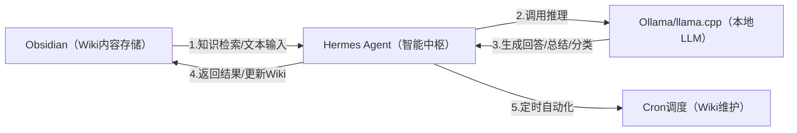

---
tags:
  - OBsidian
  - Hermes-agent
---
# Hermes Agent的打开
## 1、Ollama 是否自动启动？
- 如果之前设置了开机自启，可能会自动运行
- 没有的话，手动开：`ollama serve`；`ollama run qwen3:14b`
Ollama是全局的，任意CMD窗口都可以运行，保持窗口不关闭
检查Ollama是否在运行
```cmd
# curl检查
curl http://localhost:11434/api/tags
# 任务管理器查看
Ctrl + Shift + Esc 打开任务管理器，搜索 ollama，看到 ollama.exe 在运行就说明已启动
# 检查端口
netstat -ano | findstr :11434
```
## 2、打开监控WebUI
```cmd
hermes dashboard
```
## 3、打开命令界面
```cmd
d: 
cd D:\hermes-agent-deploy\hermes-agent 
.venv\Scripts\activate 
hermes
```
# 4、打开对话WebUI
```cmd
d:  
cd D:\hermes-agent-deploy\hermes-agent  
.venv\Scripts\activate 
hermes-web-ui start
```




聚焦「LLM 相关内容」结构化存储，建议分类：
1. 模型库：各 LLM 模型（Qwen 2/Llama 3）的参数、部署命令、适配场景；
2. 部署笔记：Ollama/llama.cpp 的安装、调参、问题排查；
3. Hermes Agent：命令、配置、技能开发；
4. 实战案例：LLM Wiki 的使用场景（如词条生成、检索示例）。
---

## 1、Windows的虚拟环境
打开 “启用或关闭 Windows 功能”
找到并勾选：
- [x] 适用于 Linux 的 Windows 子系统
- [x] 虚拟机平台
确定 → 重启电脑
以管理员身份打开 PowerShell：`wsl --set-default-version 2`（把默认设为 WSL2）

## 2、尝试启动 Ubuntu 子系统
```Powershell
wsl --shutdown
```
我先关闭所有的虚拟机，然后再打开Ubuntu
```
wsl -d Ubuntu
```

期间会要求输入密码，然后进入到这个提示符下。
## 3、在D盘新建hermes-agent-deploy目录
我在D盘新建了hermes-agent-deploy目录，并在这个目录下打开了Powershell窗口
先检查 Python 版本是否符合要求（hermes-agent 要求 Python 3.8 及以上）
```
C:\Users\ylking\AppData\Local\Programs\Python\Python312\python.exe --version
```
#### 执行创建独立虚拟环境的命令
```
& "C:\Users\ylking\AppData\Local\Programs\Python\Python312\python.exe" -m venv .\venv
```
命令说明：-m venv 是 Python 内置的创建虚拟环境模块，.\venv 表示在当前hermes-agent-deploy目录下创建名为venv的虚拟环境文件夹；
执行后，你的D:\hermes-agent-deploy目录下会新增一个venv文件夹，无报错即代表虚拟环境创建成功。
#### 执行激活虚拟环境的命令
```
.\venv\Scripts\Activate.ps1
```
执行成功的标识：PowerShell 窗口左侧会出现 (venv) 前缀（比如 (venv) PS D:\hermes-agent-deploy>），说明虚拟环境已激活，后续所有 Python/pip 操作都会局限在这个独立环境中，不会污染系统 Python

## 4、检查 Git 版本（确认是否安装）
```bash
git --version
```
输出显示git version 2.49.0.windows.1，如果没有需要先安装Git
## 5、克隆 hermes-agent 代码仓库
```bash
git clone https://github.com/NousResearch/hermes-agent.git
```
这个步骤可能需要等待很长时间（比下载模型时间短）

执行后PowerShell 会显示克隆进度（比如 “Cloning into 'hermes-agent'...”），最终无报错则代表仓库克隆成功，你的D:\hermes-agent-deploy目录下会新增hermes-agent文件夹，包含项目所有源码。
克隆不成功，我直接从Github上下载最新的版本到D:\hermes-agent-deploy目录下hermes-agent文件夹
#### 进入 hermes-agent 项目目录
```
cd .\hermes-agent\
```
PowerShell 路径变为 (venv) PS D:\hermes-agent-deploy\hermes-agent>
## 6、安装项目 Python 依赖
优先用清华 PyPI 镜像源，解决国内下载慢的问题
```bash
.\venv\Scripts\Activate
pip install -r requirements.txt -i https://pypi.tuna.tsinghua.edu.cn/simple
```
## 7、配置项目环境变量（核心步骤）
hermes-agent 依赖 API 密钥、服务配置等环境变量，需要创建 .env 文件来配置，步骤如下：
### 1. 在项目目录创建 .env 文件
在 D:\hermes-agent-deploy\hermes-agent 目录下，新建一个名为 .env 的文本文件（注意文件名以.开头，无后缀）
```
Copy-Item .env.example -Destination .env -Force
```
### 安装Ollama
下载地址`https://ollama.com/download/windows`
### 安装之后拉取模型文件
Ollama 是独立的本地模型服务（安装后会在后台运行服务进程），不是 Python 依赖，所以不受虚拟环境 / 工作目录限制。只要 Ollama 安装成功，任何 PowerShell 窗口都能调用 ollama 命令。
```
ollama pull qwen2:7b
```
拉取模型后查看安装了哪些大模型，可以在命令行输入：ollama list
你刚拉取的 qwen2:7b 模型，默认存放在 Windows 这个路径：
C:\Users <你的用户名>.ollama\models
地址栏粘贴：`%USERPROFILE%\.ollama\models` 回车，直接进入
里面有两个核心文件夹，Ollama 的模型存储结构是：
`blobs/`：存所有文件的哈希副本（模型权重、配置、元数据）（qwen2:7b 约 4.4GB）
`manifests/`：存放模型清单 / 索引文件（记录模型版本、哈希）

---
qwen2:7b模型在Hermes下报错，重新下载测试Qwen3:14b(9.3Gb)
使用**阿里云镜像加速**（如果可用）：
```
set OLLAMA_REGISTRY_MIRROR=https://ollama.mirrorz.org 
ollama pull qwen3:14b
```
模型	显存需求	你能跑吗？
qwen3:8b	~6GB	✅ 轻松
qwen3:14b	~10GB	✅ 完美
qwen3:32b	~20GB	✅ 可以（内存补充）
qwen3:72b	~45GB	⚠️ 太大，跑不动

## [[第一次使用的配置]]

### Hermes Agent 的 .env 配置
```
# --- 核心模型配置 ---
# 使用的模型名称，必须与你 ollama list 中显示的名称一致
MODEL_NAME=qwen3-hermes:latest

# Ollama 的 API 地址 (Ollama 提供兼容 OpenAI 的接口)
# 注意：最后一定要带 /v1
OPENAI_API_BASE=http://localhost:11434/v1

# Ollama 本地调用不需要真正的 Key，但程序通常要求必填，填随便什么都可以
OPENAI_API_KEY=ollama

# --- 代理行为设置 (可选，根据 hermes-agent 版本可能需要) ---
# 这里的配置取决于 hermes-agent 的具体实现，通常以下是通用的：
TEMPERATURE=0.7
STREAM=True

# 如果你的 hermes-agent 需要指定特定的提供商
LLM_PROVIDER=openai

# 运行日志级别（可选，方便调试）
LOG_LEVEL=INFO
```
进入虚拟环境测试
```
.\venv\Scripts\Activate
cd .\hermes-agent\
hermes
```
能跑但是速度很慢，在Ollama下秒回，在Hermes下需要等待很久甚至不出结果，这个问题以后还要深入研究解决。


## 安装Node
官网下载安装https://nodejs.org/zh-cn/download/

验证安装
```
node -v
npm -v
```

```
C:\Users\ylking>node -v
v24.15.0

C:\Users\ylking>npm -v
11.8.0
```

# hermes-web-ui
开源地址：https://github.com/EKKOLearnAI/hermes-web-ui
## 创建WebUI
```
npm install -g hermes-web-ui
```

## 使用WebUI启动
```
hermes-web-ui start
```
停止WebUI
```
hermes-web-ui stop
```

# 升级到最新版
```
Hermes update
```

# 官方WebUI（管理）
```
hermes dashboard
```
