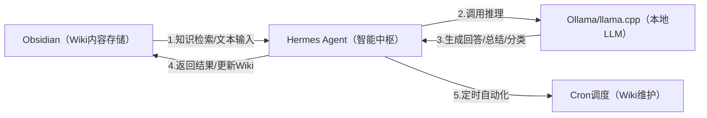

---
tags:
  - OBsidian
  - Hermes-agent
---
# Hermes Agent的打开
## 1、Ollama 是否自动启动？
- 如果之前设置了开机自启，可能会自动运行
- 没有的话，手动开：`ollama serve`；`ollama run qwen3-hermes`
Ollama是全局的，任意CMD窗口都可以运行
检查Ollama是否在运行
```cmd
# curl检查
curl http://localhost:11434/api/tags
# 任务管理器查看
Ctrl + Shift + Esc 打开任务管理器，搜索 ollama，看到 ollama.exe 在运行就说明已启动
# 检查端口
netstat -ano | findstr :11434
```
## 2、打开监控WebUI
```cmd
d:
cd D:\hermes-agent-deploy\hermes-agent
.venv\Scripts\activate
set HERMES_WEB_DIST=D:\hermes-agent-deploy\hermes-agent\hermes_cli\web_dist
hermes dashboard
```
## 3、打开命令界面
```cmd
d: 
cd D:\hermes-agent-deploy\hermes-agent 
.venv\Scripts\activate 
hermes
```
# 4、打开对话WebUI
```cmd
d:  
cd D:\hermes-agent-deploy\hermes-agent  
.venv\Scripts\activate 
hermes-web-ui start
```




聚焦「LLM 相关内容」结构化存储，建议分类：
1. 模型库：各 LLM 模型（Qwen 2/Llama 3）的参数、部署命令、适配场景；
2. 部署笔记：Ollama/llama.cpp 的安装、调参、问题排查；
3. Hermes Agent：命令、配置、技能开发；
4. 实战案例：LLM Wiki 的使用场景（如词条生成、检索示例）。
---

## 1、Windows的虚拟环境
打开 “启用或关闭 Windows 功能”
找到并勾选：
- [x] 适用于 Linux 的 Windows 子系统
- [x] 虚拟机平台
确定 → 重启电脑
以管理员身份打开 PowerShell：`wsl --set-default-version 2`（把默认设为 WSL2）

## 2、尝试启动 Ubuntu 子系统
```Powershell
wsl --shutdown
```
我先关闭所有的虚拟机，然后再打开Ubuntu
```
wsl -d Ubuntu
```

期间会要求输入密码，然后进入到这个提示符下。
## 3、在D盘新建hermes-agent-deploy目录
我在D盘新建了hermes-agent-deploy目录，并在这个目录下打开了Powershell窗口
先检查 Python 版本是否符合要求（hermes-agent 要求 Python 3.8 及以上）
```
C:\Users\ylking\AppData\Local\Programs\Python\Python312\python.exe --version
```
#### 执行创建独立虚拟环境的命令
```
& "C:\Users\ylking\AppData\Local\Programs\Python\Python312\python.exe" -m venv .\venv
```
命令说明：-m venv 是 Python 内置的创建虚拟环境模块，.\venv 表示在当前hermes-agent-deploy目录下创建名为venv的虚拟环境文件夹；
执行后，你的D:\hermes-agent-deploy目录下会新增一个venv文件夹，无报错即代表虚拟环境创建成功。
#### 执行激活虚拟环境的命令
```
.\venv\Scripts\Activate.ps1
```
执行成功的标识：PowerShell 窗口左侧会出现 (venv) 前缀（比如 (venv) PS D:\hermes-agent-deploy>），说明虚拟环境已激活，后续所有 Python/pip 操作都会局限在这个独立环境中，不会污染系统 Python

## 4、检查 Git 版本（确认是否安装）
```bash
git --version
```
输出显示git version 2.49.0.windows.1，如果没有需要先安装Git
## 5、克隆 hermes-agent 代码仓库
```bash
git clone https://github.com/NousResearch/hermes-agent.git
```
这个步骤可能需要等待很长时间（比下载模型时间短）

执行后PowerShell 会显示克隆进度（比如 “Cloning into 'hermes-agent'...”），最终无报错则代表仓库克隆成功，你的D:\hermes-agent-deploy目录下会新增hermes-agent文件夹，包含项目所有源码。
克隆不成功，我直接从Github上下载最新的版本到D:\hermes-agent-deploy目录下hermes-agent文件夹
#### 进入 hermes-agent 项目目录
```
cd .\hermes-agent\
```
PowerShell 路径变为 (venv) PS D:\hermes-agent-deploy\hermes-agent>
## 6、安装项目 Python 依赖
优先用清华 PyPI 镜像源，解决国内下载慢的问题
```bash
.\venv\Scripts\Activate
pip install -r requirements.txt -i https://pypi.tuna.tsinghua.edu.cn/simple
```
## 7、配置项目环境变量（核心步骤）
hermes-agent 依赖 API 密钥、服务配置等环境变量，需要创建 .env 文件来配置，步骤如下：
### 1. 在项目目录创建 .env 文件
在 D:\hermes-agent-deploy\hermes-agent 目录下，新建一个名为 .env 的文本文件（注意文件名以.开头，无后缀）
```
Copy-Item .env.example -Destination .env -Force
```
### 安装Ollama
下载地址`https://ollama.com/download/windows`
### 安装之后拉取模型文件
Ollama 是独立的本地模型服务（安装后会在后台运行服务进程），不是 Python 依赖，所以不受虚拟环境 / 工作目录限制。只要 Ollama 安装成功，任何 PowerShell 窗口都能调用 ollama 命令。
```
ollama pull qwen2:7b
```
拉取模型后查看安装了哪些大模型，可以在命令行输入：ollama list
你刚拉取的 qwen2:7b 模型，默认存放在 Windows 这个路径：
C:\Users <你的用户名>.ollama\models
地址栏粘贴：`%USERPROFILE%\.ollama\models` 回车，直接进入
里面有两个核心文件夹，Ollama 的模型存储结构是：
`blobs/`：存所有文件的哈希副本（模型权重、配置、元数据）（qwen2:7b 约 4.4GB）
`manifests/`：存放模型清单 / 索引文件（记录模型版本、哈希）

---
qwen2:7b模型在Hermes下报错，重新下载测试Qwen3:14b(9.3Gb)
使用**阿里云镜像加速**（如果可用）：
```
set OLLAMA_REGISTRY_MIRROR=https://ollama.mirrorz.org 
ollama pull qwen3:14b
```
模型	显存需求	你能跑吗？
qwen3:8b	~6GB	✅ 轻松
qwen3:14b	~10GB	✅ 完美
qwen3:32b	~20GB	✅ 可以（内存补充）
qwen3:72b	~45GB	⚠️ 太大，跑不动

## 第一次使用的配置
  How would you like to set up Hermes?
(●) 1. Quick setup — provider, model & messaging (recommended)
(○)  2. Full setup — configure everything
Select provider:
 Select by number, Enter to confirm.
  (●)1. Nous Portal (Nous Research subscription)
  (○)  2. OpenRouter (100+ models, pay-per-use)
  (○)  3. Vercel AI Gateway (200+ models, $5 free credit, no markup)
  (○)  4. Anthropic (Claude models — API key or Claude Code)
  (○)  5. OpenAI Codex
  (○)  6. Xiaomi MiMo (MiMo-V2.5 and V2 models — pro, omni, flash)
  (○)  7. NVIDIA NIM (Nemotron models — build.nvidia.com or local NIM)
  (○)  8. Qwen OAuth (reuses local Qwen CLI login)
  (○)  9. GitHub Copilot (uses GITHUB_TOKEN or gh auth token)
  (○) 10. GitHub Copilot ACP (spawns `copilot --acp --stdio`)
  (○) 11. Hugging Face Inference Providers (20+ open models)
  (○) 12. Google AI Studio (Gemini models — native Gemini API)
  (○) 13. Google Gemini via OAuth + Code Assist (free tier supported; no API key needed)
  (○) 14. DeepSeek (DeepSeek-V3, R1, coder — direct API)
  (○) 15. xAI (Grok models — direct API)
  (○) 16. Z.AI / GLM (Zhipu AI direct API)
  (○) 17. Kimi Coding Plan (api.kimi.com) & Moonshot API
  (○) 18. Kimi / Moonshot China (Moonshot CN direct API)
  (○) 19. StepFun Step Plan (agent/coding models via Step Plan API)
  (○) 20. MiniMax (global direct API)
  (○) 21. MiniMax China (domestic direct API)
  (○) 22. Alibaba Cloud / DashScope Coding (Qwen + multi-provider)
  (○) 23. Ollama Cloud (cloud-hosted open models — ollama.com)
  (○) 24. Arcee AI (Trinity models — direct API)
  (○) 25. Kilo Code (Kilo Gateway API)
  (○) 26. OpenCode Zen (35+ curated models, pay-as-you-go)
  (○) 27. OpenCode Go (open models, $10/month subscription)
  (○) 28. AWS Bedrock (Claude, Nova, Llama, DeepSeek — IAM or API key)
  (○) 29. Custom endpoint (enter URL manually)
  (○) 30. Configure auxiliary models...
  (○) 31. Leave unchanged

- 国内直连、网络稳定、不用代理、编码能力强、适配中文开发
选18. Kimi / Moonshot China (Moonshot CN direct API)
- 如果你主要用通义千问、阿里系模型
选 22. Alibaba Cloud / DashScope Coding
- 如果你本地装了 Ollama 本地大模型，连 Ollama 官方云
选 23. Ollama Cloud / 或者后续填本地地址
- 想用免费 Gemini 无需 API 密钥
选 13. Google Gemini via OAuth + Code Assist
- 只想临时用、不想改配置
选 31. Leave unchanged 保持原有配置
- 连你自己电脑上的**本地 Ollama**
选29. Custom endpoint (enter URL manually)
连接对象：你自己电脑里跑的 Ollama（127.0.0.1:11434）
网络：完全本地 / 离线，不走外网，国内稳定
模型：用你本地 ollama pull 下载的模型，占本地显存
费用：完全免费、无额度限制
隐私：数据只在你电脑里，最安全

Custom OpenAI-compatible endpoint configuration:
API base URL [e.g. https://api.example.com/v1]: http://127.0.0.1:11434/v1
API key [optional]: 不需要 API Key，空白留空就行
Verified endpoint via http://127.0.0.1:11434/v1/models (4 model(s) visible)
  Available models:
    1. default:latest
    2. qwen2:7b
    3. qwen3-hermes:latest
    4. qwen3:14b
  Select model [1-4] or type name:
  输入你准备用的模型编号：3

Context length in tokens [leave blank for auto-detect]:
常见本地模型参考值：
7B 小模型：8192
14B 编码模型：16384
30B + 长上下文：32768 / 65536

Display name [Local (127.0.0.1:11434)]:
直接回车，默认名称保留就行。
如果想自定义，输入简单好记的名字，比如：本地 Ollama，再回车。

Default model set to: qwen3-hermes:latest (via http://127.0.0.1:11434/v1)
  💾 Saved to custom providers as "Local (127.0.0.1:11434)" (edit in config.yaml)
  完美配置完成 ✅
当前已成功绑定你的本地 Ollama，默认模型：qwen3-hermes:latest
后续想切换本地其他模型（deepseek-coder、llama3、glm 等），直接在工具内切换即可
全程纯本地调用、无外网、无 API 密钥、完全离线
如需修改接口 / 名称 / 上下文限制，可编辑提示里的 config.yaml

◆ Text-to-Speech Provider (optional)
 Current: Edge TTS
  Select TTS provider:
Select by number, Enter to confirm.
  (○)  1. Edge TTS (free, cloud-based, no setup needed)
  (○)  2. ElevenLabs (premium quality, needs API key)
  (○)  3. OpenAI TTS (good quality, needs API key)
  (○)  4. xAI TTS (Grok voices, needs API key)
  (○)  5. MiniMax TTS (high quality with voice cloning, needs API key)
  (○)  6. Mistral Voxtral TTS (multilingual, native Opus, needs API key)
  (○)  7. Google Gemini TTS (30 prebuilt voices, prompt-controllable, needs API key)
  (○)  8. NeuTTS (local on-device, free, ~300MB model download)
  (○)  9. KittenTTS (local on-device, free, lightweight ~25-80MB ONNX)
  (●) 10. Keep current (Edge TTS)
Edge TTS 国内能用、免费、无需配置、中文语音自然，完全够用。
如果想要纯本地离线、不上网，就选 9 KittenTTS，轻量无依赖。
日常使用无脑保留当前 Edge TTS 就好。

  Select terminal backend:
Select by number, Enter to confirm.
  (○)  1. Local - run directly on this machine (default)
  (○)  2. Docker - isolated container with configurable resources
  (○)  3. Modal - serverless cloud sandbox
  (○)  4. SSH - run on a remote machine
  (○)  5. Daytona - persistent cloud development environment
  (●) 6. Keep current (local)
直接输入 6 回车，保持默认本地终端即可。
解释：
本地模式：直接调用你电脑的 PowerShell、CMD、终端，权限正常、操作本地文件 / 命令完全没问题
Docker / 云端 / SSH 对你纯本地 Ollama 开发完全用不上，反而增加冗余和故障
保持第 6 项，最优选择。

 Skipped (keeping current)
 Keeping current backend: local
◆ Agent Settings
Guide: https://hermes-agent.nousresearch.com/docs/user-guide/configuration
 Maximum tool-calling iterations per conversation.
Higher = more complex tasks, but costs more tokens.
Press Enter to keep 90. Use 90 for most tasks or 150+ for open exploration.
直接回车，默认保留 90 就行。
简单说明
90：日常编码、查错、写脚本完全够用，不会冗余消耗本地模型性能
只有做超复杂多步骤长任务，才需要改 150+
你是本地 Ollama 部署，默认数值最均衡，不用修改

Tool Progress Display
Controls how much tool activity is shown (CLI and messaging).
 off     — Silent, just the final response
 new     — Show tool name only when it changes (less noise)
 all     — Show every tool call with a short preview
 verbose — Full args, results, and debug logs
日常使用推荐输入：new
兼顾简洁，不会刷屏杂乱，又能看到关键工具调用。
追求极简安静：填 off
需要排错、调试问题：填 all
深度排查报错：填 verbose
直接回车默认一般是 new，无脑回车也行。

◆ Context Compression
Automatically summarizes old messages when context gets too long.
Higher threshold = compress later (use more context). Lower = compress sooner.
33mCompression threshold (0.5-0.95) [0.5]:
本地 Ollama 场景，推荐设置：
输入 0.75 回车
参数说明
0.5（默认）：压缩触发太早，容易丢失历史上下文
0.75：均衡方案，兼顾上下文完整度与显存占用，适合日常编码、项目开发
0.9~0.95：很晚才压缩，保留全部对话，但小显存设备容易卡顿溢出
直接填 0.75 即可，适配你本地模型使用。

Select by number, Enter to confirm.
  (●)1. Inactivity + daily reset (recommended - reset whichever comes first)
  (○)  2. Inactivity only (reset after N minutes of no messages)
  (○)  3. Daily only (reset at a fixed hour each day)
  (○)  4. Never auto-reset (context lives until /reset or context compression)
  (○)  5. Keep current settings
 Choice [default 1]: 
 直接回车，默认选 1 即可。
简要说明
闲置 + 每日自动重置：官方推荐，防止本地上下文无限堆积、占用显存，适配 Ollama 本地运行
选 4 永不重置：长期对话会越来越卡、上下文爆炸，本地模型不推荐
日常使用保持默认 1 就足够舒服。

Inactivity timeout (minutes) [1440]: 
默认 1440 分钟 =24 小时，太久了，本地 ollama 容易堆积上下文占显存。
推荐直接输入：30 回车
闲置 30 分钟自动清空会话，轻量又够用。
想要久一点就填：60
无脑省心就直接回车保留默认也行。
个人根据情况选择

Daily reset hour (0-23, local time) [4]: 
推荐改为 3 或者直接回车保留默认 4 点。
凌晨 4 点属于深夜，完全不影响白天使用，自动重置清理上下文、释放本地 Ollama 资源，非常适合本地部署。
直接回车，保持默认 4 即可。

Messaging Platforms
Connect to messaging platforms to chat with Hermes from anywhere.
Toggle with Space, confirm with Enter.
Select platforms to configure:
Toggle by number, Enter to confirm.
  [ ]  1. Telegram
  [ ]  2. Discord
  [ ]  3. Slack
  [ ]  4. Signal
  [ ]  5. Email
  [ ]  6. SMS (Twilio)
  [ ]  7. Matrix
  [ ]  8. Mattermost
  [ ]  9. WhatsApp
  [ ] 10. DingTalk
  [ ] 11. Feishu / Lark
  [ ] 12. WeCom (Enterprise WeChat)
  [ ] 13. WeCom Callback (Self-Built App)
  [ ] 14. Weixin (WeChat)
  [ ] 15. BlueBubbles (iMessage)
  [ ] 16. QQ Bot
  [ ] 17. Webhooks (GitHub, GitLab, etc.)
Toggle # (or Enter to confirm):
想接微信现在选 **14** ，后续随时能启用 / 关闭，不冲突。
后续会引导配置微信接入参数，不想立刻配置也可以先空着跳过，**只勾选不填参数不会生效，不影响你现在本地 Ollama 使用**。

─── 💬 Weixin / WeChat Setup ───
 1. Hermes will open Tencent iLink QR login in this terminal.
 2. Use WeChat to scan and confirm the QR code.
 3. Hermes will store the returned account_id/token in ~/.hermes/.env
 4. This adapter supports native text, image, video, and document delivery.
接下来终端会弹出微信扫码二维码，用你日常微信扫码登录、确认授权，就绑定完成。
这是网页微信协议登录，安全合规，令牌存在本地 .hermes 文件夹，只有你本机能用
绑定后：微信私聊 / 群里都能调用你本地 Ollama 大模型
后续不想用了，随时进配置取消 14 号勾选，或清空 token 即可关闭
等待二维码出现 → 微信扫码 → 登录完成即可。
Start QR login now? [Y/n]: 
请使用微信扫描以下二维码：
https://liteapp.weixin.qq.com/q/7GiQu1?qrcode=43aab892dd7397af745ac6397e40dc2d&bot_type=3
（终端二维码渲染失败: No module named 'qrcode'，请直接打开上面的二维码链接）
微信连接成功，account_id=cf2bfbad252c@im.bot


### Hermes Agent 的 .env 配置
```
# --- 核心模型配置 ---
# 使用的模型名称，必须与你 ollama list 中显示的名称一致
MODEL_NAME=qwen3-hermes:latest

# Ollama 的 API 地址 (Ollama 提供兼容 OpenAI 的接口)
# 注意：最后一定要带 /v1
OPENAI_API_BASE=http://localhost:11434/v1

# Ollama 本地调用不需要真正的 Key，但程序通常要求必填，填随便什么都可以
OPENAI_API_KEY=ollama

# --- 代理行为设置 (可选，根据 hermes-agent 版本可能需要) ---
# 这里的配置取决于 hermes-agent 的具体实现，通常以下是通用的：
TEMPERATURE=0.7
STREAM=True

# 如果你的 hermes-agent 需要指定特定的提供商
LLM_PROVIDER=openai

# 运行日志级别（可选，方便调试）
LOG_LEVEL=INFO
```
进入虚拟环境测试
```
.\venv\Scripts\Activate
cd .\hermes-agent\
hermes
```
能跑但是速度很慢，在Ollama下秒回，在Hermes下需要等待很久甚至不出结果，这个问题以后还要深入研究解决。


## 安装Node
官网下载安装https://nodejs.org/zh-cn/download/

验证安装
```
node -v
npm -v
```

```
C:\Users\ylking>node -v
v24.15.0

C:\Users\ylking>npm -v
11.8.0
```

# hermes-web-ui
开源地址：https://github.com/EKKOLearnAI/hermes-web-ui
## 创建WebUI
```
npm install -g hermes-web-ui
```

## 使用WebUI启动
```
hermes-web-ui start
```
停止WebUI
```
hermes-web-ui stop
```

# 升级到最新版
```
Hermes update
```

# 官方WebUI（管理）
```
hermes dashboard
```
