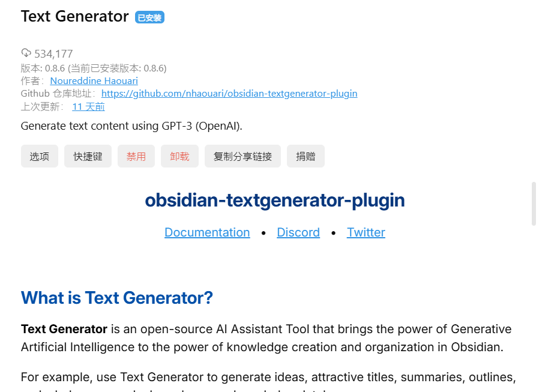
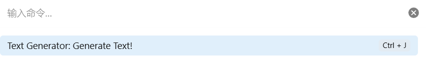

## 启动Ollama及模型
使用时Ollama必须在运行的状态下
```
ollama run default
```
## 安装Text Generator插件
开源地址[nhaouari/obsidian-textgenerator-plugin: Text Generator is a versatile plugin for Obsidian that allows you to generate text content using various AI providers, including OpenAI, Anthropic, Google and local models.](https://github.com/nhaouari/obsidian-textgenerator-plugin)

## 配置Text Generator插件
1、Provider Profile 服务提供商配置 选择Ollama
2、Base URL / 地址栏： http://localhost:11434
（这是 Ollama 在你电脑上的默认服务地址）
3、Model / 模型栏：default
（也就是你之前设置好的默认模型，会自动加载 qwen3:14b）

## 基础使用
输入文字，并选中这句话，按 Ctrl + J即可调用
如果快捷键没有定义或者是其他的，可以使用 Ctrl + P查看


