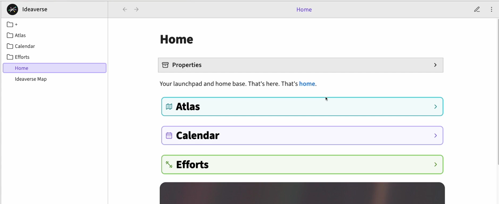
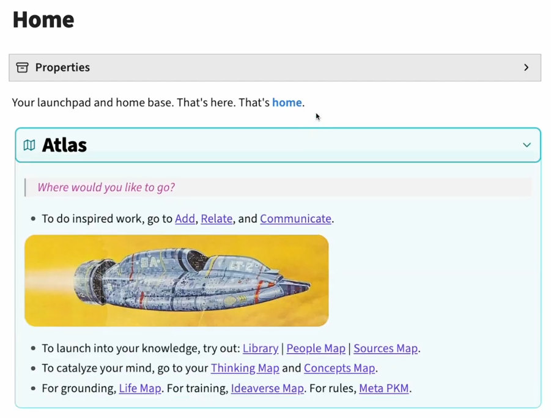

### 🛠️ 


### 📄 Obsidian 原生 Callout（提示框）+ 自定义 CSS 美化
无需额外社区插件（仅需 Obsidian 1.0+ 原生支持），核心是：
1. 用原生 `> [!note]` 等 Callout 语法创建可折叠面板
2. 用 CSS 自定义每个面板的**背景色、边框色、图标、圆角、箭头样式**
3. 实现点击按钮展开 / 收起内容，完全匹配你截图的效果
#### 步骤 1：在 Home 笔记中插入 Callout 代码（直接复制）
```markdown
> [!note]- Atlas
> Where would you like to go?
> 
> - To do inspired work, go to [[Add]], [[Relate]], and [[Communicate]].
> 
>  <!-- 替换为你的图片链接 -->
> 
> - To launch into your knowledge, try out: [[Library]] | [[People Map]] | [[Sources Map]].
> - To catalyze your mind, go to your [[Thinking Map]] and [[Concepts Map]].
> - For grounding, [[Life Map]]. For training, [[Ideaverse Map]]. For rules, [[Meta PKM]].

> [!tip]- Calendar
> 你的日历内容（可放 Dataview 日程、任务等）

> [!warning]- Efforts
> 你的努力追踪、习惯打卡等内容
```
#### 步骤 2：添加 CSS 片段（1:1 还原截图样式）
1. 打开 Obsidian → 左下角「设置」→「外观」→「CSS 片段」→「打开片段文件夹」
2. 新建文件 custom-callout-buttons.css，粘贴以下完整代码：
3. 回到 Obsidian，刷新 CSS 片段，启用 custom-callout-buttons.css
```CSS
/* 全局 Callout 基础样式：统一按钮圆角、内边距、边框 */
.callout {
  border-radius: 12px !important;
  border-width: 2px !important;
  margin: 16px 0 !important;
  padding: 12px 16px !important;
  background-color: transparent !important;
  transition: all 0.2s ease;
}

/* 折叠状态的 Callout 按钮样式（匹配你第一张截图的按钮效果） */
.callout.is-collapsed {
  padding: 16px 20px !important;
  background-color: var(--background-primary) !important;
}

/* 自定义 Atlas 面板（青蓝色） */
.callout[data-callout="note"] {
  --callout-color: #2dd4bf !important;
  --callout-icon: lucide-book-open !important; /* 对应截图的书本图标 */
  border-color: #2dd4bf !important;
  background-color: rgba(45, 212, 191, 0.05) !important;
}

/* 自定义 Calendar 面板（淡紫色） */
.callout[data-callout="tip"] {
  --callout-color: #a78bfa !important;
  --callout-icon: lucide-calendar !important; /* 对应截图的日历图标 */
  border-color: #a78bfa !important;
  background-color: rgba(167, 139, 250, 0.05) !important;
}

/* 自定义 Efforts 面板（淡绿色） */
.callout[data-callout="warning"] {
  --callout-color: #65a30d !important;
  --callout-icon: lucide-dumbbell !important; /* 对应截图的哑铃图标 */
  border-color: #65a30d !important;
  background-color: rgba(101, 163, 13, 0.05) !important;
}

/* 自定义标题文字样式：放大字号、加粗 */
.callout-title {
  font-size: 24px !important;
  font-weight: 600 !important;
  color: #000000 !important;
  display: flex;
  align-items: center;
  gap: 12px;
}

/* 自定义图标样式：放大、匹配颜色 */
.callout-icon {
  width: 28px !important;
  height: 28px !important;
  color: var(--callout-color) !important;
}

/* 自定义折叠箭头样式：匹配截图的 > / ↓ */
.callout-fold {
  margin-left: auto !important;
  font-size: 24px !important;
  color: var(--callout-color) !important;
}

/* 展开后内容区域样式 */
.callout-content {
  font-size: 18px !important;
  line-height: 1.6 !important;
  padding-top: 12px !important;
  border-top: 1px solid var(--callout-color) !important;
  margin-top: 8px !important;
}

/* 适配深色模式（可选） */
.theme-dark .callout-title {
  color: #ffffff !important;
}
.theme-dark .callout[data-callout="note"] {
  background-color: rgba(45, 212, 191, 0.1) !important;
}
.theme-dark .callout[data-callout="tip"] {
  background-color: rgba(167, 139, 250, 0.1) !important;
}
.theme-dark .callout[data-callout="warning"] {
  background-color: rgba(101, 163, 13, 0.1) !important;
}
```
#### 📝 关键自定义指南（按需调整）
##### 1. 颜色自定义（精准匹配截图）
直接修改对应面板的 `--callout-color` 和 `background-color`：
- Atlas 青蓝色：`#2dd4bf`（可改为 `#06b6d4` 等）
- Calendar 淡紫色：`#a78bfa`（可改为 `#8b5cf6` 等）
- Efforts 淡绿色：`#65a30d`（可改为 `#22c55e` 等）
- `background-color` 用 `rgba(颜色值, 透明度)` 实现淡色背景
##### 2. 图标自定义（替换为你想要的图标）
Obsidian 原生支持 **Lucide 图标库**，直接修改 `--callout-icon` 即可，无需 SVG：
- 书本图标：`lucide-book-open`
- 日历图标：`lucide-calendar`
- 哑铃图标：`lucide-dumbbell`
- 完整图标列表：[https://lucide.dev/icons/](https://lucide.dev/icons/)
- 示例：把 Atlas 图标换成文件夹：`--callout-icon: lucide-folder !important;`
##### 3. 字号 / 圆角 / 内边距调整

- 标题字号：修改 `.callout-title` 中的 `font-size: 24px`
- 按钮圆角：修改 `.callout` 中的 `border-radius: 12px`
- 按钮高度：修改 `.callout.is-collapsed` 中的 `padding: 16px 20px`
- 内容字号：修改 `.callout-content` 中的 `font-size: 18px`

#### ⚙️ 新增更多面板

