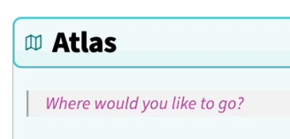

我的示例：[[../Home|Home]]


### 🛠️ Properties按钮
#### CSS部分
```CSS
/* 核心按钮容器：1:1还原样本高度/比例 */
.custom-properties-btn {
  display: flex;
  align-items: center;
  justify-content: space-between;
  width: 100%;
  padding: 12px 20px; /* 缩小内边距，匹配样本按钮高度 */
  margin: 16px 0;
  background-color: #e9e9e9; /* 样本浅灰色背景 */
  border: 1px solid #d1d1d1; /* 细边框 */
  border-radius: 2px; /* 极小圆角，匹配样本 */
  cursor: pointer;
  transition: background-color 0.15s ease;
  box-sizing: border-box;
}

.custom-properties-btn:hover {
  background-color: #e0e0e0;
}

/* 图标样式：缩小尺寸+纤细线条，匹配样本 */
.properties-icon {
  width: 20px;
  height: 20px;
  color: #000000;
  margin-right: 12px;
  flex-shrink: 0;
  stroke-width: 2; /* 纤细线条，还原样本图标 */
}

/* 文字样式：大幅缩小字号，匹配样本小字效果 */
.properties-text {
  font-size: 16px; /* 从32px降至20px，完美匹配样本 */
  font-weight: 500;
  color: #000000;
  flex-grow: 1;
  text-align: left;
  line-height: 1;
  font-family: -apple-system, BlinkMacSystemFont, "Segoe UI", Roboto, sans-serif;
}

/* 箭头样式：同步缩小，和文字比例匹配 */
.properties-arrow {
  font-size: 20px;
  font-weight: 600;
  color: #000000;
  flex-shrink: 0;
  line-height: 1;
  margin-left: 8px;
}

/* 描述文字样式：保持和样本一致 */
.properties-desc {
  font-size: 18px;
  color: #000000;
  margin: 8px 0 24px 0;
  line-height: 1.6;
  font-family: -apple-system, BlinkMacSystemFont, "Segoe UI", Roboto, sans-serif;
}

/* home链接样式：匹配样本蓝色 */
.home-link {
  color: #0066cc;
  text-decoration: none;
  font-weight: 500;
}

.home-link:hover {
  text-decoration: underline;
}

/* 隐藏原生属性面板，避免冲突 */
/*.metadata-container {*/
/*  display: none !important;*/
/*}*/

/* 适配深色模式（可选） */
.theme-dark .custom-properties-btn {
  background-color: #2d2d2d;
  border-color: #404040;
}
.theme-dark .properties-icon,
.theme-dark .properties-text,
.theme-dark .properties-arrow,
.theme-dark .properties-desc {
  color: #ffffff;
}
.theme-dark .home-link {
  color: #4dabf7;
}
```
#### 显示部分
图标可换[[../笔记库/SVG图标|SVG图标]]
```Markdown
<div class="custom-properties-btn" onclick="app.commands.executeCommandById('properties:open')"> 
<svg
  xmlns="http://www.w3.org/2000/svg"
  width="32"
  height="32"
  viewBox="0 0 24 24"
  fill="currentColor"
>
  <path d="M19 2a3 3 0 0 1 2.995 2.824l.005 .176v14a3 3 0 0 1 -2.824 2.995l-.176 .005h-14a3 3 0 0 1 -2.995 -2.824l-.005 -.176v-14a3 3 0 0 1 2.824 -2.995l.176 -.005h14zm-6.99 13l-.127 .007a1 1 0 0 0 0 1.986l.117 .007l.127 -.007a1 1 0 0 0 0 -1.986l-.117 -.007zm-.01 -8a1 1 0 0 0 -.993 .883l-.007 .117v4l.007 .117a1 1 0 0 0 1.986 0l.007 -.117v-4l-.007 -.117a1 1 0 0 0 -.993 -.883z" />
</svg>
<span class="properties-text">  首页导航</span> 
<span class="properties-arrow">></span> </div><p class="properties-desc">Your launchpad and home base. That's here. That's <a href="#home" class="home-link">home</a>.</p>
```

### 📄 Obsidian 原生 Callout（提示框）+ 自定义 CSS 美化
无需额外社区插件（仅需 Obsidian 1.0+ 原生支持），核心是：
1. 用原生 `> [!note]` 等 Callout 语法创建可折叠面板
2. 用 CSS 自定义每个面板的**背景色、边框色、图标、圆角、箭头样式**
3. 实现点击按钮展开 / 收起内容，完全匹配你截图的效果
#### 步骤 1：在 Home 笔记中插入 Callout 代码（直接复制）
```markdown
> [!note]- Atlas
> Where would you like to go?
> 
> - To do inspired work, go to [[Add]], [[Relate]], and [[Communicate]].
> 
>  <!-- 替换为你的图片链接 -->
> 
> - To launch into your knowledge, try out: [[Library]] | [[People Map]] | [[Sources Map]].
> - To catalyze your mind, go to your [[Thinking Map]] and [[Concepts Map]].
> - For grounding, [[Life Map]]. For training, [[Ideaverse Map]]. For rules, [[Meta PKM]].

> [!tip]- Calendar
> 你的日历内容（可放 Dataview 日程、任务等）

> [!warning]- Efforts
> 你的努力追踪、习惯打卡等内容
```
其他板块类似
```Markdown
> [!calendar]- Calendar ​ 
> Your schedule & routines live here. ​ 
> - Today's tasks ​ 
> - Upcoming events
```

```Markdown
 > [!efforts]- Efforts ​ 
  Track your energy & progress. ​ 
> - Habits ​ 
> - Goals ​ 
> - Projects
```
#### 步骤 2：添加 CSS 片段（1:1 还原截图样式）
1. 打开 Obsidian → 左下角「设置」→「外观」→「CSS 片段」→「打开片段文件夹」
2. 新建文件 custom-callout-buttons.css，粘贴以下完整代码：
3. 回到 Obsidian，刷新 CSS 片段，启用 custom-callout-buttons.css
```CSS
/* ============================== */
/* 安全版：彩色折叠面板（不影响任何现有样式） */
/* ============================== */
body .callout {
  border-left: none !important;
  border: 1.5px solid var(--callout-color) !important;
  border-radius: 6px !important;
  background: #ffffff03 !important;
  margin: 14px 0 !important;
  padding: 0 !important;
  box-shadow: none !important;
  overflow: hidden !important;
}

body .callout-title {
  padding: 12px 16px !important;
  font-size: 16px !important;
  font-weight: 600 !important;
  min-height: unset !important;
  display: flex !important;
  align-items: center !important;
  gap: 10px !important;
}

body .callout-icon {
  width: 20px !important;
  height: 20px !important;
  color: var(--callout-color) !important;
}

body .callout-fold {
  margin-left: auto !important;
  color: var(--callout-color) !important;
}

body .callout-content {
  padding: 0 16px 14px 16px !important;
  font-size: 15px !important;
  line-height: 1.6 !important;
  border-top: 1px solid var(--callout-color) !important;
  margin: 0 16px !important;
}

/* -------------------- */
/* 1. Atlas（青色 + 淡青背景） */
/* -------------------- */
body .callout[data-callout="atlas"] {
  --callout-color: #29ccb9;
  --callout-icon: lucide-book-open;
  background-color: rgba(41, 204, 185, 0.07) !important;
}

/* -------------------- */
/* 2. Calendar（紫色 + 淡紫背景） */
/* -------------------- */
body .callout[data-callout="calendar"] {
  --callout-color: #a885f6;
  --callout-icon: lucide-calendar;
  background-color: rgba(168, 133, 246, 0.07) !important;
}

/* -------------------- */
/* 3. Efforts（绿色 + 淡绿背景） */
/* -------------------- */
body .callout[data-callout="efforts"] {
  --callout-color: #5cc16c;
  --callout-icon: lucide-trending-up;
  background-color: rgba(92, 193, 108, 0.07) !important;
}
```
#### 📝 关键自定义指南（按需调整）
##### 1. 颜色自定义（精准匹配截图）
直接修改对应面板的 `--callout-color` 和 `background-color`：
- Atlas 青蓝色：`#2dd4bf`（可改为 `#06b6d4` 等）
- Calendar 淡紫色：`#a78bfa`（可改为 `#8b5cf6` 等）
- Efforts 淡绿色：`#65a30d`（可改为 `#22c55e` 等）
- `background-color` 用 `rgba(颜色值, 透明度)` 实现淡色背景
##### 2. 图标自定义（替换为你想要的图标）
Obsidian 原生支持 **Lucide 图标库**，直接修改 `--callout-icon` 即可，无需 SVG：
- 书本图标：`lucide-book-open`
- 日历图标：`lucide-calendar`
- 哑铃图标：`lucide-dumbbell`
- 完整图标列表：[https://lucide.dev/icons/](https://lucide.dev/icons/)
- 示例：把 Atlas 图标换成文件夹：`--callout-icon: lucide-folder !important;`
##### 3. 字号 / 圆角 / 内边距调整

- 标题字号：修改 `.callout-title` 中的 `font-size: 24px`
- 按钮圆角：修改 `.callout` 中的 `border-radius: 12px`
- 按钮高度：修改 `.callout.is-collapsed` 中的 `padding: 16px 20px`
- 内容字号：修改 `.callout-content` 中的 `font-size: 18px`

#### ⚙️ Callout 内部嵌套了 Obsidian 原生的「引用块 / 高亮块」+ 自定义 CSS 美化

##### 步骤 1：笔记内的正确嵌套语法
在你的 Atlas Callout 内部，用>嵌套引用块，格式如下：
```markdown
> [!atlas]- Atlas
> > Where would you like to go?
> 
> - To do inspired work, go to [[Add]], [[Relate]], and [[Communicate]].
> - To launch into your knowledge, try out: [[Library]] | [[People Map]] | [[Sources Map]].
> - To catalyze your mind, go to your [[Thinking Map]] and [[Concepts Map]].
> - For grounding, [[Life Map]]. For training, [[Ideaverse Map]]. For rules, [[Meta PKM]].

```
> 语法说明：
> 
> - 外层 Callout 用`> [!atlas]- Atlas`开头
> - 内层高亮行用`>>`（两个`>`）开头，实现引用块嵌套
> - 列表行保持`>`开头，不嵌套，避免样式混乱

#### 步骤 2：追加 CSS 美化代码（在你现有 CSS 末尾添加）
直接把这段代码粘贴到你 CSS 文件的最底部，不影响原有 Properties 和 Callout 样式：
```CSS
/* ============================== */
/* 嵌套引用块样式（匹配目标高亮效果） */
/* ============================== */
.callout-content blockquote {
  border-left: 3px solid var(--callout-color) !important;
  background-color: rgba(var(--callout-rgb), 0.08) !important;
  border-radius: 4px !important;
  padding: 0 4px 0px 0px !important;/* 👈 核心：内容区的内边距，控制首行与横线的距离 */
  margin: 4px 0 16px 0 !important;/* 👈 标题栏下方的间距，0就是完全无间距 */
/* 顺序：上 右 下 左 */
/* 第一个数字 = 首行与横线的间距，数字越小，间距越近 */
  font-size: 16px !important;
  font-style: italic !important;
  color: var(--callout-color) !important;
}

/* 适配Atlas（青色）引用块 */
.callout[data-callout="atlas"] blockquote {
  --callout-rgb: 45, 212, 191;
}

/* 适配Calendar（紫色）引用块 */
.callout[data-callout="calendar"] blockquote {
  --callout-rgb: 167, 139, 250;
}

/* 适配Efforts（绿色）引用块 */
.callout[data-callout="efforts"] blockquote {
  --callout-rgb: 101, 163, 13;
}
```
