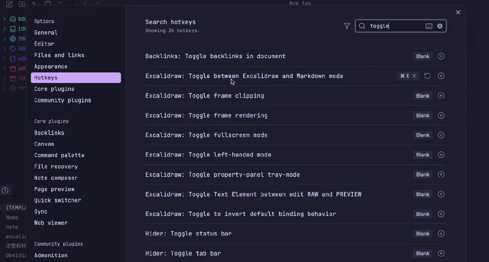

Note
今天跟大家分享一个obsidian excalidraw的超强用法，让你的笔记工作流能无比丝滑。我们知道对于很多笔记来说光拥有线性的输出是不够的，我们可能还需要画个图、发散一下思维、或者梳理个大纲，这个时候我们就会用到一个excalidraw。那么以往呢，你可能要做一个抉择，就是你要做的这个笔记，是要做成markdown的呢，还是做成一个excalidraw绘图呢。或者说你两个都需要，那你就会给这个笔记创建两个文件，一个markdown一个excalidraw，然后在md文件中引用excalidraw的链接。但这样可能有些麻烦，或者囊肿。今天我就跟大家分享一个很丝滑的方法，让一个文档可以同时是一个md又是一个excalidraw，可以随时切换，就像我们现实中的一张纸一样，又可以写，又可以随时在旁边画几张图。


第一步：创建快捷键toggle



==⚠  Switch to EXCALIDRAW VIEW in the MORE OPTIONS menu of this document. ⚠== You can decompress Drawing data with the command palette: 'Decompress current Excalidraw file'. For more info check in plugin settings under 'Saving'


# Excalidraw Data

## Text Elements
%%
## Drawing
```compressed-json
N4KAkARALgngDgUwgLgAQQQDwMYEMA2AlgCYBOuA7hADTgQBuCpAzoQPYB2KqATLZMzYBXUtiRoIACyhQ4zZAHoFAc0JRJQgEYA6bGwC2CgF7N6hbEcK4OCtptbErHALRY8RMpWdx8Q1TdIEfARcZgRmBShcZQUebR44gAYaOiCEfQQOKGZuAG1wMFAwYogSbghSAAkATUIADmVK/BTiyFhEcsDsKI5lYJaSzG5nBMTtAGYATmmANnHxgHY6ycSZ

ngBWfhKYYZ5F7QAWdcSTo4WFuZmFvgLIChJ1bgBGK+0n6cn1p6eFp7qFza3KQIQjKaTPRKTbQzE4nGZPRLjL7rNZbSDWPriVCJNEQZhQUhsADWCAAwmx8GxSOUAMRPBD0+kDSCaXDYInKQlCDjEcmU6kSAnWZhwXCBLLMiAAM0I+HwAGVYP0JIIPJL8YSSQB1B6Sbg3Vp4gnEhCKmDK9Cqsq4rlgjjhHJoJ64tii7BqHZOk64znCOAASWIjtQuQA

uripeQMoHuBwhHLcYQeVhyrhkjbhDz7cxg0VDe0seNbgBfXFhBDEbiTa51dZHcY4oGMFjsLhOg645usTgAOU4YmeK3+63G3zqieYABE0lAK9wpQQwrjNJniABRYIZLLB/KtQq3EplCTygDSAEFNAA1TRS5pokoF1OkQlUA/F27hoFCODEXCzytOucMIHJMMJ1Iiky4kQHBErG8b4FBbDsnOaALvgS5ApIoQACpYFAAAySawahi4IAUpYFHmkBHug

p4Xtet6So+Ehii+kpDGgzgHAs8Swk8owLIi/GAoanqoM4fxxOs6wLKB3EbJ8BolPcxCPGgPAnIcsK1gcIE8H8AK4pIIJglA+raIJskzGsXx1A2ywzCJJQYhajaGhqJp8lStKMgySDLmyHJcjyXkCugQocCKYqZGZEaygqSpYniFLWkCHnarq+plsaJJmhayVqhmfiSNmwbOkCrpsh6EJuSUvrfoGO6foaka4NGAGoHGCZAkmxApixTySsFxCldwV

FtPAWI8CWZYIChqBjgc4zgbpMydkw3ZtgtkFNhtrZ9hwA5oHUtbnJCCITtOwT/vOpHLquG7pDFTW4t+v43YBFyJCBYFIh2QLQcRnXwYhyEdWhGGGnAbBJtkeQHrue61a0iQHs1rSI60GljAc2l1npBlOVjFmJFZNl/PZoHrGjH7ZWKUAAEK9UmyhjQeGCbjFMYSFUtQNE0zKQPobB9eUVKaGogvSoQmAVgACjDEpoJjxTlXuYBjMciRPDTrQUYam

TEEzPIs3B3XuVEpBQGez5sBQxm4B1XUIUChs2y+DsdRArF25KQQrhQ80QwgRk4XhhEwbd6FkcU75gM13twHAip/liebQMZGTlEQpkDAwhAIBQDOBfVIUUt5Eg0lK1c13n2AiOKUD+rO+iKpqZLl2FEB0n5TJbBA9fPlzLfF+ype8p35QRVFjd1w3w/pAAYvFeVJValb94PjfN+kbcmjqql6upm/z1kO+tzlpqJeU69z0PZ8twASsIdoOs8J/303L

cAPJutVXq1QHqfL+S9OBQEXm1WUYknJAM/ufReYD5SECMFNQBW8F76Fwpga2OctoQGCFKWKBRYHbxbinK27s7aezNi7Eo6CH7pDXDySh9sQhex9lQD+pD0gsOwpNToq477cP0IvKMCBn4Wmdv3Zg2BCRygABrcCRDMCYqx3jrBOtWWsO0SgyLkfgaoSiZhQmEicC4PBJhTHrP3IwbADBs0NPQAgQgprkS4Rg5+3IRpvx5oI/unISBIJQfqQBATiC

KgQHAbgMCwkAFkRYICYbgTQwRwZ3WIWE0KDiSgMwpF7UgyhWQAAp9ILGoLwH45TSnlM1gASklI/BAyh4xik6IU3AJSGxVK6bwHpdSIBuOIfQqAe8SS/ygK2YMUjiGtQyI05MpBTZoCohgDgyTUncAJC43E2AiBRLQFskOQI1lZwOaQbZFUhBQGgliQ5uJ9BihJKQHsbVbnnKOYaB5pAnlJJSfNQ5gySh2AAFYIG6MweUay4DxL6r8jZJFo79zZBM

xg2E7HNGWUCZilo0jdFbJKeu+IDB8I6GgaZhpKRgyjpDEokYDDylxRMzg1KPklHwKEa2eLUXopoYCyAjhmDrI7lkPCsTMhCBZf3CWJtehy0CFKJgmQjroEyEKjexDCDMGNo4XocL/nvP7pq2JJBoaw0hbgJOLM9UdTucQlcmAGXBDxZwGFSU9BZFwEmAZYB9bS2CLmd8xYgA
```
%%