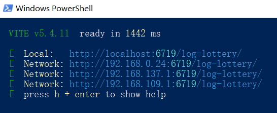

# 项目地址
[LOG1997/log-lottery: 🎈🎈🎈🎈年会抽奖程序，threejs+vue3 3D球体动态抽奖应用。](https://github.com/LOG1997/log-lottery)
## 技术

- vue3
- threejs
- indexdb
- pinia
- daisyui

## 部署
- 下载压缩代码包到D盘解压
- 在此目录下按Shift键右键鼠标打开Powershell窗口
- 执行pnpm i安装依赖
- 执行pnpm dev开发运行

- ​  执行pnpm build:file打包
- 打包完成后在dist目录中直接打开index.html即可。