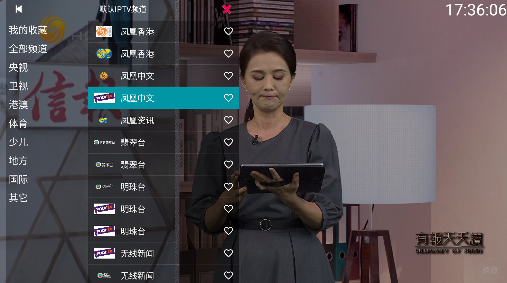
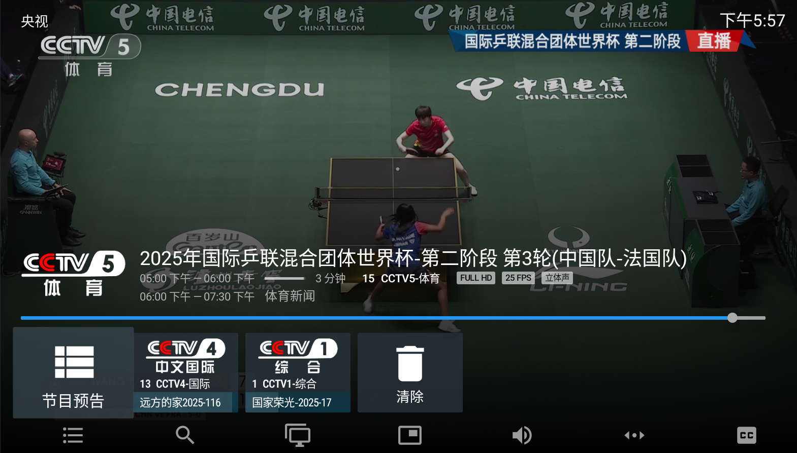

# 小飞电视-2.9.0
- 链接：[https://pan.xunlei.com/s/VOfcfFPLGmrzlF40D4w1gfloA1?pwd=awtn#](https://pan.xunlei.com/s/VOfcfFPLGmrzlF40D4w1gfloA1?pwd=awtn#)
- 链接: https://pan.baidu.com/s/1Y8uyqwoUL9TBsXSz9LLaOQ 

按退出键时选择进入设置

# 山河TV_1.0.4
- 链接：[https://pan.xunlei.com/s/VOfchKrNACgFatuCa5RgW_RbA1?pwd=iafe#](https://pan.xunlei.com/s/VOfchKrNACgFatuCa5RgW_RbA1?pwd=iafe#)
- 链接: https://pan.baidu.com/s/1PrCEXVwfXg7inJOWSdJenA 

# 你的电视yourtv_v2.0.8
- 链接：[https://pan.xunlei.com/s/VOfci7jcACgFatuCa5RgWtorA1?pwd=63tc#](https://pan.xunlei.com/s/VOfci7jcACgFatuCa5RgWtorA1?pwd=63tc#)
- 链接: https://pan.baidu.com/s/1rPWYjqtzkhIPcJXFwGU6ag 



# 我的电视my-tv-0_1.3.9.8
有时不能用
- 链接：[https://pan.xunlei.com/s/VOfcjG9BTde3nwlpyDGmPAkbA1?pwd=9f5q#](https://pan.xunlei.com/s/VOfcjG9BTde3nwlpyDGmPAkbA1?pwd=9f5q#)
- 链接: https://pan.baidu.com/s/1ik7j0fD0tv8Qb0tkPZv5BQ 


**下面是需要自行配置播放源的壳软件**
# IPTV Pro
- 链接：[https://pan.xunlei.com/s/VOfckHu4N70M0nJab9fVddSjA1?pwd=d475#](https://pan.xunlei.com/s/VOfckHu4N70M0nJab9fVddSjA1?pwd=d475#)
- 链接: https://pan.baidu.com/s/1MEdIeuQsl8TkQNrlngOvDg 
```
IPTv源   https://gh.idayer.com/https://raw.githubusercontent.com/dqtx760/1TV/refs/heads/main/index.html
```


# TiviMate  2.1.5 - Premium付费破解版
- 链接：[https://pan.xunlei.com/s/VOfcmUjkn-a8wkxd2ZUBV6hKA1?pwd=cgfp#](https://pan.xunlei.com/s/VOfcmUjkn-a8wkxd2ZUBV6hKA1?pwd=cgfp#)
- 链接: https://pan.baidu.com/s/15gplQTTSDyHImSmy17Pjvg 
```
IPTv源   https://gh.idayer.com/https://raw.githubusercontent.com/dqtx760/1TV/refs/heads/main/index.html
```



# 酷9原版64位py_1.7.6.3_20251110_1813


IPTv源
```
https://gh.idayer.com/https://raw.githubusercontent.com/dqtx760/1TV/refs/heads/main/index.html
```

```
http://47.120.41.246:8899/zb.txt
```

```
http://ax570383885.serv00.net/zy.txt
```

# IPTV
开源项目地址：[iptv-org/iptv：汇集了来自世界各地的公开 IPTV 频道 --- iptv-org/iptv: Collection of publicly available IPTV channels from all over the world](https://github.com/iptv-org/iptv)
只需将其中一个播放列表的链接粘贴到[任何支持直播的视频播放器](https://github.com/iptv-org/awesome-iptv#apps)中，然后按 _“打开”_ 即可。