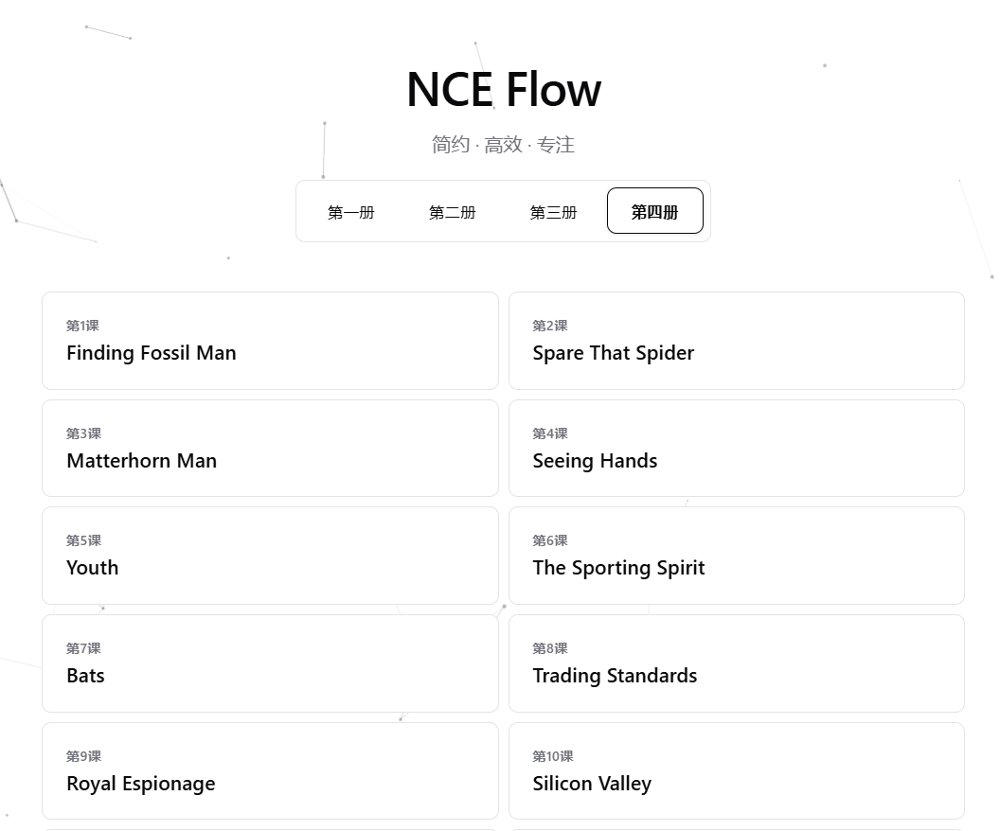

# 一、# NCE Flow
开源项目地址：[luzhenhua/NCE-Flow: 新概念英语在线点读，点句即读、连续播放，支持 EN / EN+CN / CN。](https://github.com/luzhenhua/NCE-Flow)
直接使用的网址：[NCE Flow](https://nce.luzhenhua.cn/)

# 二、极速英语
[极速英语 新概念英语在线学习 英语四六级口语 考研雅思托福笔试考试学习资料_极速英语](https://www.runtoenglish.com/)
