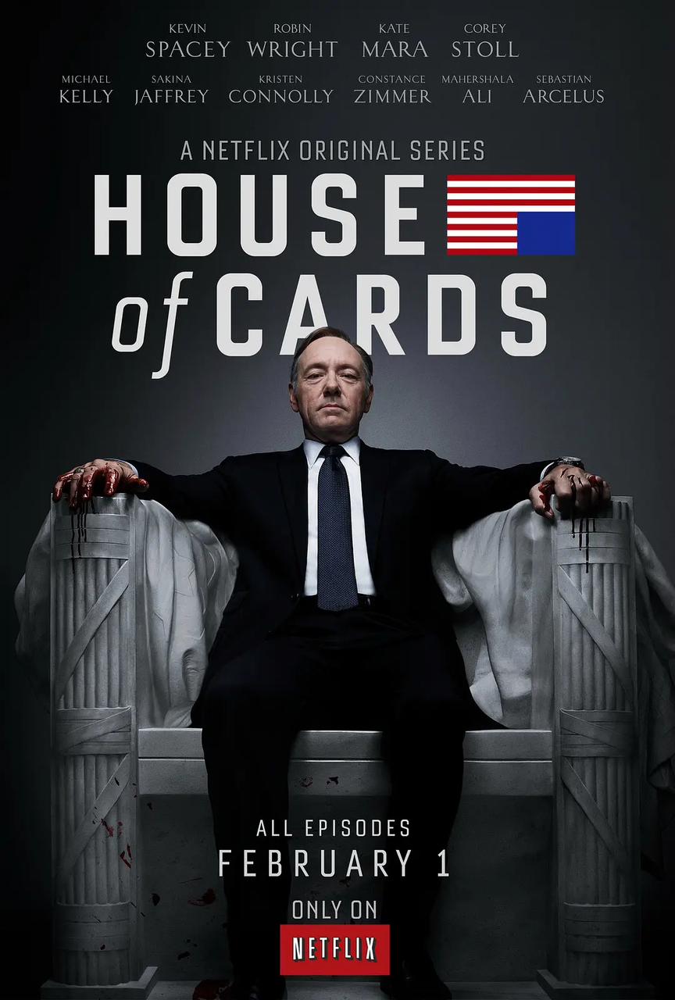

# 小狐狸
系列启蒙有声读物：《Little Fox 儿童英语动画片全集》

# 比得兔
比得兔1 Peter Rabbit (2014)共29集，学习时间一个月。

# 辛普森一家 已更新到第三十六季

# 海绵宝宝 已更新到第十六季(2025)

以上两部学习一到两个月。

# 生活大爆炸 第一季~第十二季

# 老友记 第一季~第十季
分享文件：L 老｜友记S01~S10 **【内嵌中英文字幕】** [链接](https://pan.xunlei.com/s/VOYf-xk7LlBVAw_7XSvFdt2UA1?pwd=w6rw#)

## 摩登家庭S01~S11
分享文件：M 摩登家庭 S01~S11 [链接](https://pan.xunlei.com/s/VOYep2rqYMNqGgrEuQNYKsanA1?pwd=itpq#)

# 肥伦秀/肥伦今夜秀

# 破产姐妹 第一季~第六季
链接：[https://pan.quark.cn/s/e69451843392](https://pan.quark.cn/s/e69451843392)

## 纸牌屋S01~S06
分享文件：Z 纸牌屋 S01~S06 **【内嵌中英文字幕】**[链接](https://pan.xunlei.com/s/VOYeyX2k7Bz8uc6yPwQ-tAsdA1?pwd=tqr5#)：
