## 主板
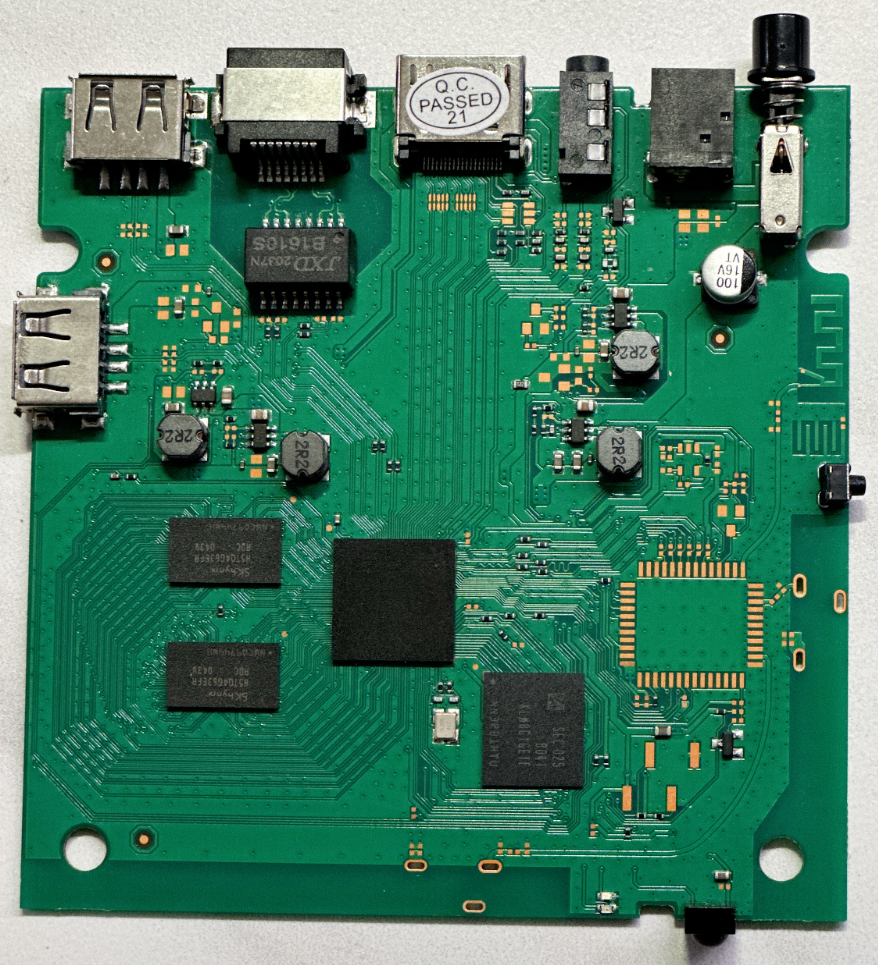
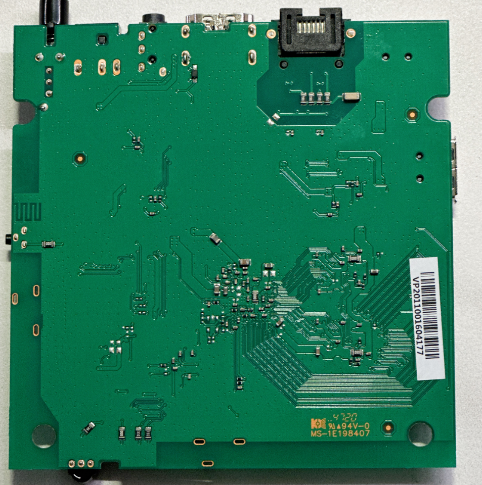
## 芯片
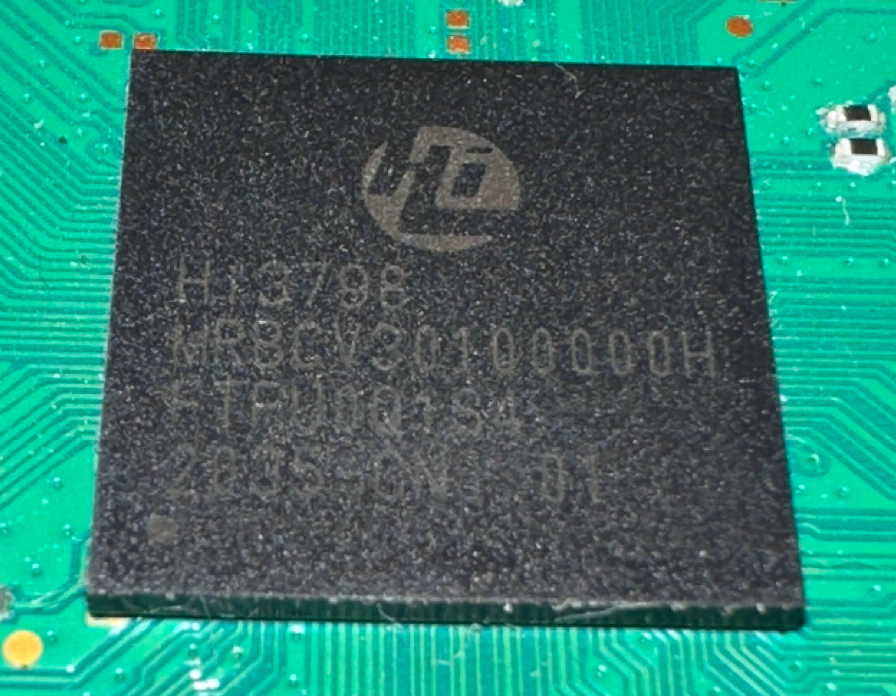

## 外壳

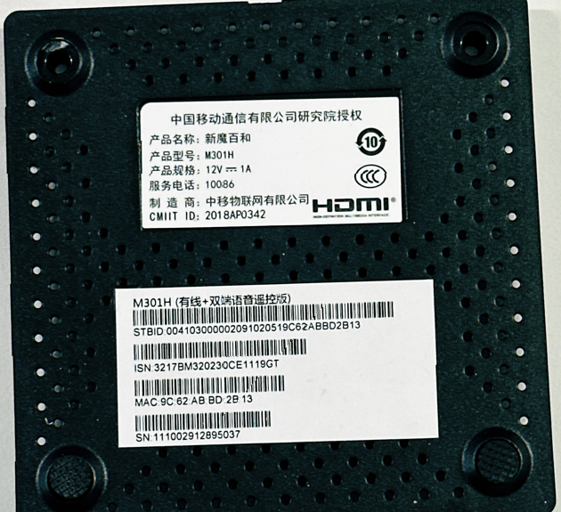

# 配置

魔百盒M301H-数码视讯SM代工-海思Hi3798MV310芯片-无WIFI蓝牙-有线网卡-双端语音遥控

## 刷机方法
1、U盘拷贝update.zip根目录  插盒子靠近网口的USB
2、断电按住机顶盒侧面RESET按键不要松，按开关盒子通电   
3、出现工厂模式选择  2    
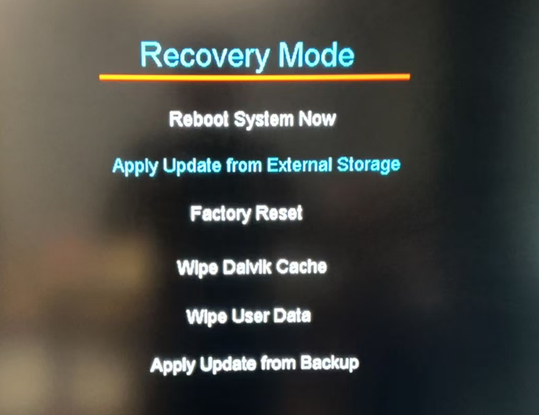
4、进度条跑完，刷机完成
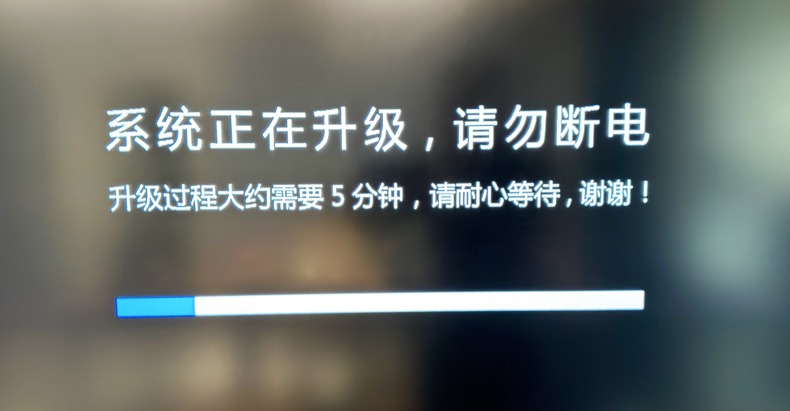
## ADB

原生设置阉割了USB调试，打开ADB需要在盒子上安装**神奇工具箱APP**，使用开心电视助手高版本打开适配性好

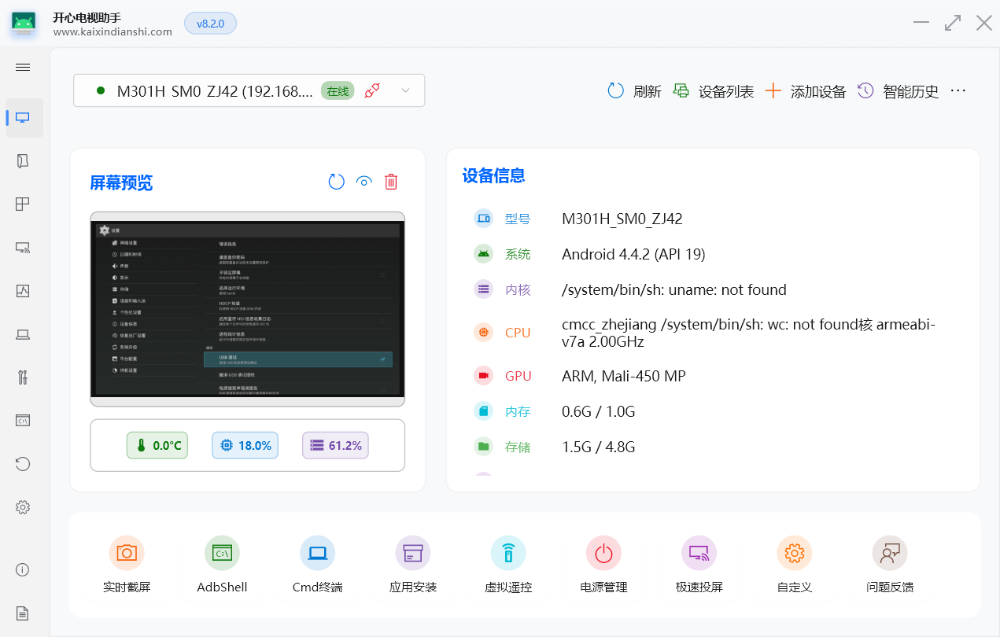

**安装的软件**

1、**小白文件管理器**（安卓4版本），可以安装局域网内电脑上的共享文件夹下的应用，免得用U盘拷贝
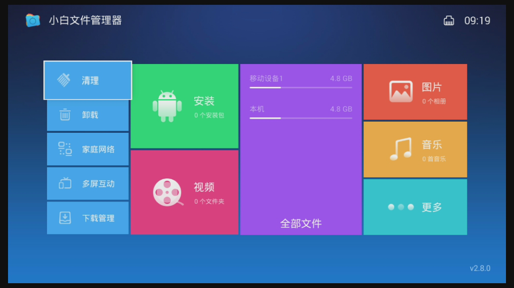
2、**野草助手**（没有口令的，在微信搜野草之类的关键字，有很多口令的小程序试试）
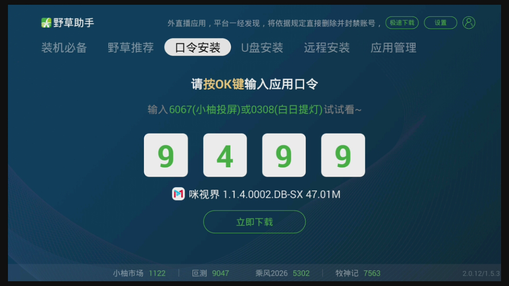
3、电视直播：**非凡TV**，有中央一套且适配安卓4.4.2比较好
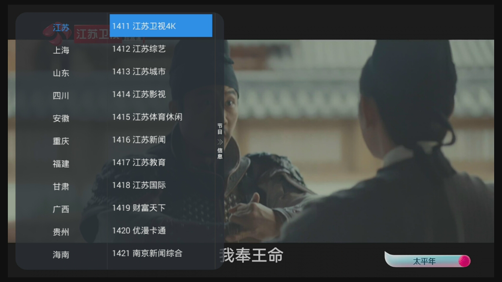

4、点播：**TVBOX**，等于影视仓等，属于鼻祖APP，已适配播放源，也可以自己改最新播放源，微信搜TVBOX，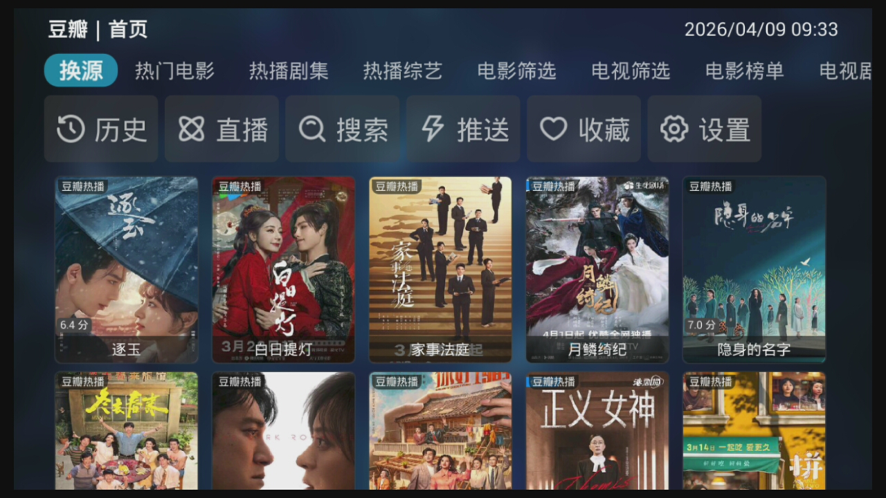
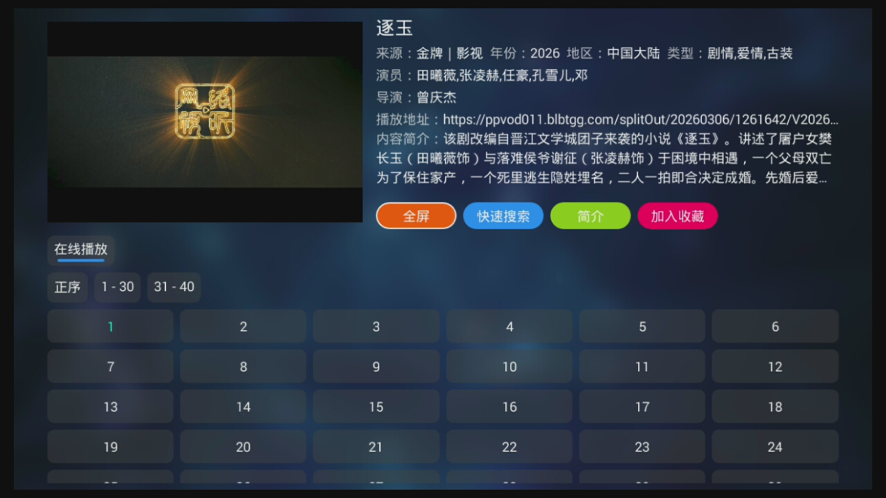有很多账号每天发布最新播放源，不能看或者不好用就换

5、体育：**咪视界**
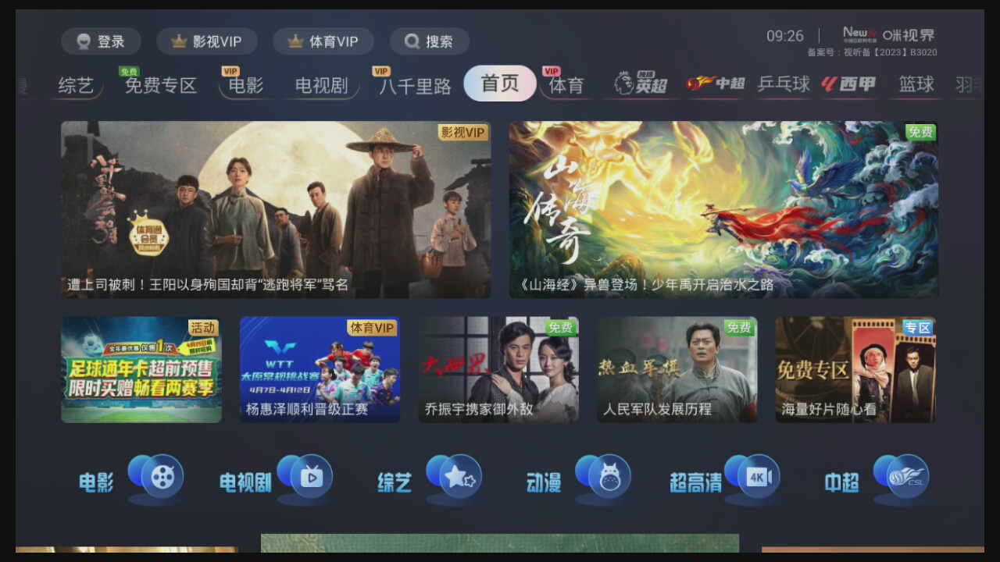
6、界面很好看的视频点播：**剧迷TV**

7、三大广告毒瘤APP：**CIBN酷喵、云视听极光、银河奇异果**，不开会员广告太多

遥控器多款机顶盒遥控器测试都适配，可**闲鱼以下测试过的款式**
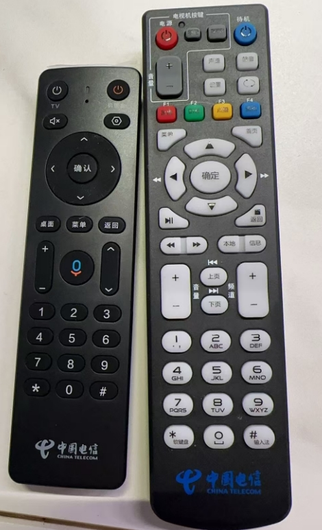

流畅度：不错# 刷机
[【新提醒】制作魔百盒M301H分区表文件及原系统备份_中国移动魔百盒_ZNDS](https://www.znds.com/tv-1168744-1-1.html)