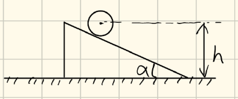

1、阐述最小作用量原理，用最小作用量原理推导Lagrange方程。 写出正则方程，正则方程的Poisson括号形式，Hamilton-Jacobi 公式
### 一、最小作用量原理
#### ✅ 1. 基本表述
在所有满足给定初末条件的可能轨道中，**真实运动轨道使作用量取驻值（通常为极小值）**。
作用量定义为：
\[ S[q] = \int_{t_1}^{t_2} L(q_i,\dot{q}_i,t)\,dt \]
其中：

- \(L(q_i,\dot q_i,t)\) —— 拉格朗日函数
- \(q_i\) —— 广义坐标
- \(\dot q_i\) —— 广义速度

---

## ✅ 2. 变分原理

考虑轨道变分：

\[
q_i(t) \to q_i(t) + \delta q_i(t)
\]

满足端点固定条件：

\[
\delta q_i(t_1) = \delta q_i(t_2) = 0
\]

作用量变分：

\[
\delta S = 0
\]

---

# 二、由最小作用量原理推导 Lagrange 方程

---

## ✅ 1. 计算作用量变分

\[
\delta S = \int_{t_1}^{t_2}
\left(
\frac{\partial L}{\partial q_i}\delta q_i
+
\frac{\partial L}{\partial \dot q_i}\delta \dot q_i
\right)dt
\]

注意：

\[
\delta \dot q_i = \frac{d}{dt}(\delta q_i)
\]

代入：

\[
\delta S =
\int_{t_1}^{t_2}
\left(
\frac{\partial L}{\partial q_i}\delta q_i
+
\frac{\partial L}{\partial \dot q_i}
\frac{d}{dt}(\delta q_i)
\right)dt
\]

---

## ✅ 2. 分部积分

\[
\int
\frac{\partial L}{\partial \dot q_i}
\frac{d}{dt}(\delta q_i)
dt
=
\left.
\frac{\partial L}{\partial \dot q_i}
\delta q_i
\right|_{t_1}^{t_2}
-
\int
\frac{d}{dt}
\left(
\frac{\partial L}{\partial \dot q_i}
\right)
\delta q_i dt
\]

由于端点变分为零，第一项消失。

因此：

\[
\delta S =
\int_{t_1}^{t_2}
\left[
\frac{\partial L}{\partial q_i}
-
\frac{d}{dt}
\left(
\frac{\partial L}{\partial \dot q_i}
\right)
\right]
\delta q_i dt
\]

---

## ✅ 3. 得到 Euler–Lagrange 方程

由于 \(\delta q_i\) 任意：

\[
\boxed{
\frac{d}{dt}
\frac{\partial L}{\partial \dot q_i}
-
\frac{\partial L}{\partial q_i}
=
0
}
\]

这就是 **Lagrange 方程**。

---

# 三、正则方程（Hamilton 方程）

---

## ✅ 1. 定义正则动量

\[
\boxed{
p_i = \frac{\partial L}{\partial \dot q_i}
}
\]

---

## ✅ 2. Hamilton函数定义

Legendre 变换：

\[
\boxed{
H(q,p,t)=\sum_i p_i \dot q_i - L
}
\]

---

## ✅ 3. 正则方程

\[
\boxed{
\dot q_i = \frac{\partial H}{\partial p_i}
}
\]

\[
\boxed{
\dot p_i = -\frac{\partial H}{\partial q_i}
}
\]

这两式构成 **Hamilton 正则方程组**

---

# 四、Poisson 括号形式

---

## ✅ 1. Poisson 括号定义

\[
\boxed{
\{f,g\}
=
\sum_i
\left(
\frac{\partial f}{\partial q_i}
\frac{\partial g}{\partial p_i}
-
\frac{\partial f}{\partial p_i}
\frac{\partial g}{\partial q_i}
\right)
}
\]

---

## ✅ 2. 正则方程的 Poisson 形式

任意动力学量 \(f(q,p,t)\) 的演化：

\[
\boxed{
\frac{df}{dt}
=
\frac{\partial f}{\partial t}
+
\{f,H\}
}
\]

特别地：

\[
\dot q_i = \{q_i,H\}
\]

\[
\dot p_i = \{p_i,H\}
\]

---

# 五、Hamilton–Jacobi 方程

---

## ✅ 1. Hamilton 主函数

定义作用量函数：

\[
S(q,t)
\]

满足：

\[
p_i = \frac{\partial S}{\partial q_i}
\]

---

## ✅ 2. Hamilton–Jacobi 方程

\[
\boxed{
\frac{\partial S}{\partial t}
+
H\left(q_i,
\frac{\partial S}{\partial q_i},
t
\right)
=
0
}
\]

---

## ✅ 3. 若 Hamilton 不显含时间

设：

\[
S = W(q) - Et
\]

则得到定态 Hamilton–Jacobi 方程：

\[
\boxed{
H\left(q_i,\frac{\partial W}{\partial q_i}\right)=E
}
\]

---

# 六、知识点归纳

| 内容 | 所属章节 | 教材对应 |
|------|----------|----------|
| 最小作用量原理 | 第一章 变分原理 | §1–3 |
| Lagrange 方程 | 第一章 | §2 |
| Hamilton 正则方程 | 第二章 正则方程 | §7–8 |
| Poisson 括号 | 第二章 | §9 |
| Hamilton–Jacobi 理论 | 第三章 | §10–11 |

---

# 七、结构总结（考试答题结构）

考试中建议按以下逻辑展开：

1. 写作用量表达式  
2. 做变分  
3. 分部积分  
4. 得 Euler–Lagrange 方程  
5. 定义正则动量  
6. 做 Legendre 变换  
7. 写正则方程  
8. 写 Poisson 括号  
9. 写 Hamilton–Jacobi 方程  

---

# 八、体系逻辑图（核心理解）

```
最小作用量原理
        ↓
Euler–Lagrange 方程
        ↓
Legendre 变换
        ↓
Hamilton 正则方程
        ↓
Poisson 括号形式
        ↓
Hamilton–Jacobi 方程
```

---

# 九、物理思想总结（朗道体系特色）

朗道体系强调：

- 力学的本质是 **变分原理**
- Hamilton 理论是更深层结构
- Hamilton–Jacobi 是经典力学的“波动形式”
- 为量子力学过渡做准备

---

如果你愿意，我可以：

- ✅ 再带你做一道 **典型考试计算题（如谐振子完整 HJ 解）**
- ✅ 或讲清楚 **Legendre 变换的几何意义**
- ✅ 或系统讲一遍 **Poisson 括号的代数结构**

你现在想加强哪一部分？
2、用以下三种方法写出一维谐振子问题的运动方程： Lagrange 方程，正则方程，Poisson 括号
3、Kepler问题 有心力 $V(r) = -\frac{1}{r}$下用等效势描述轨道何时为 双曲线、抛物线、椭圆、圆（不必求解）
5、对称陀螺、见群里埋力往年卷第5题，但是今年θ是可变的，只要讨论守恒量、写出 Lagrangian Hamiltonian
对称陀螺绕 $z$ 和 $z'$ 轴旋转运动，角速度分别为 $\omega$ 和 $\xi$。$z$ 轴和 $z'$ 轴间的可变夹角为 $\theta_0$。请讨论 $\omega, \theta_0, \xi$ 所满足的关系。
6、如图，弹簧劲度系数k，摆线长l、求解小振动近似下系统的运动

7、用Sommerfield条件推导氢原子轨道，能级量子化
8、如图，光滑地面上有质量为m的楔块，楔块上有质量M、半径R初始高度为h的圆柱。系统初始时均静止，释放圆柱后求解运动方程。圆柱无滑动滚动。
