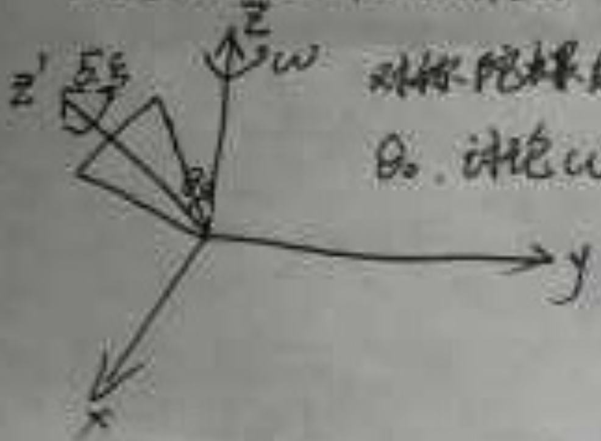
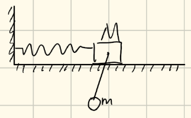

## 2025-1
1、阐述最小作用量原理，用最小作用量原理推导Lagrange方程。 写出正则方程，正则方程的Poisson括号形式，Hamilton-Jacobi 公式
### 1. 知识点所属章节归纳
根据我们使用的教材：
*   **教材一：**《力学》（朗道、栗弗席兹著，第5版）
    *   **第一章：运动方程**（§2 最小作用量原理）
    *   **第七章：正则方程**（§40 哈密顿方程；§42 泊松括号；§43 哈密顿-雅可比方程）
*   **教材二：**《朗道<力学>解读》（鞠国兴编著）
    *   **第一章：§1.2 最小作用量原理**
    *   **第七章：§7.1-§7.5 正则方程与哈密顿-雅可比理论**
### 2. 试题解答与理论阐述
#### (1) 最小作用量原理 (The Principle of Least Action / Hamilton's Principle)
**阐述：**
对于一个力学系统，其运动状态由广义坐标 $q = (q_1, q_2, \dots, q_s)$ 描述。在时间区间 $[t_1, t_2]$ 内，系统从位形 $q(t_1)$ 运动到 $q(t_2)$。系统的特征由拉格朗日函数 $L(q, \dot{q}, t)$ 决定。
最小作用量原理指出：**系统的实际运动路径使得作用量积分 $S$ 取极值（通常是极小值）。**
作用量定义为：
$$S = \int_{t_1}^{t_2} L(q, \dot{q}, t) \, dt$$
其数学表达式为：
$$\delta S = \delta \int_{t_1}^{t_2} L(q, \dot{q}, t) \, dt = 0$$
#### (2) Lagrange 方程的推导
我们通过变法运算 $\delta S = 0$ 来导出运动方程：
1.  **变分展开：**
$$\delta S = \int_{t_1}^{t_2} \sum_{i=1}^{s} \left( \frac{\partial L}{\partial q_i} \delta q_i + \frac{\partial L}{\partial \dot{q}_i} \delta \dot{q}_i \right) dt = 0$$
2.  **利用 $\delta \dot{q}_i = \frac{d}{dt} \delta q_i$ 进行分部积分：**
对第二项应用分部积分：
$$\int_{t_1}^{t_2} \frac{\partial L}{\partial \dot{q}_i} \frac{d}{dt} (\delta q_i) dt = \left[ \frac{\partial L}{\partial \dot{q}_i} \delta q_i \right]_{t_1}^{t_2} - \int_{t_1}^{t_2} \frac{d}{dt} \left( \frac{\partial L}{\partial \dot{q}_i} \right) \delta q_i dt$$
3.  **边界条件：**
由于端点固定，即 $\delta q_i(t_1) = \delta q_i(t_2) = 0$，第一项消失。
4.  **整理得到：**
$$\int_{t_1}^{t_2} \sum_{i=1}^{s} \left( \frac{\partial L}{\partial q_i} - \frac{d}{dt} \frac{\partial L}{\partial \dot{q}_i} \right) \delta q_i dt = 0$$
5.  **拉格朗日方程：**
由于 $\delta q_i$ 是任意且独立的，被积函数必须为零，得到 **Lagrange 方程**：
    $$\frac{d}{dt} \left( \frac{\partial L}{\partial \dot{q}_i} \right) - \frac{\partial L}{\partial q_i} = 0, \quad (i=1, 2, \dots, s)$$
#### (3) 正则方程 (Canonical Equations / Hamilton's Equations)

通过勒让德变换（Legendre transformation），我们从拉格朗日表述（$q, \dot{q}$）转到哈密顿表述（$q, p$）。定义广义动量 $p_i = \frac{\partial L}{\partial \dot{q}_i}$ 和哈密顿函数 $H = \sum p_i \dot{q}_i - L$。
**正则方程形式：**
$$\dot{q}_i = \frac{\partial H}{\partial p_i}, \quad \dot{p}_i = -\frac{\partial H}{\partial q_i}$$
这两个一阶微分方程组在数学上比二阶的 Lagrange 方程更具对称性。
#### (4) 正则方程的 Poisson 括号形式

引入 **Poisson 括号**（泊松括号）定义。对于任意两个动力学变量 $f(q, p, t)$ 和 $g(q, p, t)$：
$$\{f, g\} = \sum_{i=1}^{s} \left( \frac{\partial f}{\partial q_i} \frac{\partial g}{\partial p_i} - \frac{\partial f}{\partial p_i} \frac{\partial g}{\partial q_i} \right)$$
**正则方程的泊松括号形式：**
任何物理量 $f$ 的随时间演化可写为：
$$\dot{f} = \{f, H\} + \frac{\partial f}{\partial t}$$
特别地，当 $f$ 取 $q_i$ 和 $p_i$ 时：
$$\dot{q}_i = \{q_i, H\}, \quad \dot{p}_i = \{p_i, H\}$$
这是连接经典力学与量子力学（对易子）的关键桥梁。
#### (5) Hamilton-Jacobi 公式 (哈密顿-雅可比方程)

我们将作用量 $S$ 看作是终点坐标 $q$ 和时间 $t$ 的函数，即 $S = S(q, t)$。
在这种视角下，可以证明：
$$p_i = \frac{\partial S}{\partial q_i}, \quad H = -\frac{\partial S}{\partial t}$$

代入哈密顿函数 $H(q, p, t)$，得到 **Hamilton-Jacobi (H-J) 方程**：
$$H\left(q_1, \dots, q_s; \frac{\partial S}{\partial q_1}, \dots, \frac{\partial S}{\partial q_s}; t\right) + \frac{\partial S}{\partial t} = 0$$
这是一个关于主函数 $S$ 的一阶偏微分方程，它将力学问题转化为了波前传播的问题，是波动力学的先声。
希望大家不仅要记住公式，更要理解从“变分原理”到“对称性”这条逻辑主线。

---
## 2025-2
2、用以下三种方法写出一维谐振子问题的运动方程： Lagrange 方程，正则方程，Poisson 括号
同学们，大家好。我是你们的理论物理老师。
### 1. 知识点所属章节归纳
根据我们指定的教材：
*   **教材一：**《力学》（朗道著，第5版）
    *   **第一章：运动方程**（§2 最小作用量原理，§5 拉格朗日函数）
    *   **第五章：微振动**（§21 自由的一维振动 —— 确定势能形式）
    *   **第七章：正则方程**（§40 哈密顿方程，§42 泊松括号）
*   **教材二：**《朗道<力学>解读》（鞠国兴编著）
    *   **第一章：§1.3 拉格朗日方程的建立**
    *   **第五章：§5.1 简谐振动**
    *   **第七章：§7.1 哈密顿方程，§7.3 泊松括号**
### 2. 试题解答：一维谐振子的三种描述方法
#### 物理系统设定
设一维谐振子的质量为 $m$，固有频率为 $\omega$。其广义坐标为 $q$（位移），广义速度为 $\dot{q}$。
系统的动能 $T = \frac{1}{2}m\dot{q}^2$，势能 $U = \frac{1}{2}m\omega^2q^2$。
#### 方法一：使用 Lagrange 方程 (Lagrangian Method)
1.  **写出拉格朗日函数：**
$$L = T - U = \frac{1}{2}m\dot{q}^2 - \frac{1}{2}m\omega^2q^2$$
2.  **代入 Lagrange 方程：**
根据公式 $\frac{d}{dt} \left( \frac{\partial L}{\partial \dot{q}} \right) - \frac{\partial L}{\partial q} = 0$
    *   计算偏导数：
    $$\frac{\partial L}{\partial \dot{q}} = m\dot{q}$$
    $$\frac{\partial L}{\partial q} = -m\omega^2q$$
3.  **得到运动方程：**
$$\frac{d}{dt}(m\dot{q}) - (-m\omega^2q) = 0$$
$$m\ddot{q} + m\omega^2q = 0 \quad \Rightarrow \quad \ddot{q} + \omega^2q = 0$$
#### 方法二：使用正则方程 (Canonical/Hamiltonian Equations)
1.  **引入广义动量：**
$$p = \frac{\partial L}{\partial \dot{q}} = m\dot{q} \quad \Rightarrow \quad \dot{q} = \frac{p}{m}$$
2.  **写出哈密顿函数：**
哈密顿量 $H = \sum p\dot{q} - L$，对于保守系统 $H = T + U$：
$$H(p, q) = \frac{p^2}{2m} + \frac{1}{2}m\omega^2q^2$$
3.  **写出正则方程：**
系统由两个一阶微分方程描述：
*   $\dot{q} = \frac{\partial H}{\partial p} = \frac{p}{m}$
*   $\dot{p} = -\frac{\partial H}{\partial q} = -m\omega^2q$
4.  **整理得到运动方程：**
对第一个方程求导并代入第二个方程：$\ddot{q} = \frac{\dot{p}}{m} = \frac{-m\omega^2q}{m} = -\omega^2q$，即：
$$\ddot{q} + \omega^2q = 0$$
#### 方法三：使用 Poisson 括号 (Poisson Brackets)
1.  **运动演化公式：**
在哈密顿表述下，任何动力学量 $f$ 的演化遵循 $\dot{f} = \{f, H\}$（此处 $q, p$ 不显含时间）。
2.  **建立方程组：**
*   对于坐标 $q$：
$$\dot{q} = \{q, H\} = \frac{\partial q}{\partial q}\frac{\partial H}{\partial p} - \frac{\partial q}{\partial p}\frac{\partial H}{\partial q} = 1 \cdot \frac{p}{m} - 0 = \frac{p}{m}$$
*   对于动量 $p$：
$$\dot{p} = \{p, H\} = \frac{\partial p}{\partial q}\frac{\partial H}{\partial p} - \frac{\partial p}{\partial p}\frac{\partial H}{\partial q} = 0 - 1 \cdot (m\omega^2q) = -m\omega^2q$$
3.  **得到运动方程：**
结果与正则方程一致，联立消去 $p$ 得到：
$$\ddot{q} + \omega^2q = 0$$
### 3. 归纳与总结

| 方法 | 核心函数 | 变量 | 方程形式 |
| :--- | :--- | :--- | :--- |
| **Lagrange** | $L = T - V$ | $(q, \dot{q})$ | 二阶常微分方程 |
| **Hamilton** | $H = T + V$ | $(q, p)$ | 一阶对称微分方程组 |
| **Poisson** | $H$ 与 括号 $\{, \}$ | $(q, p)$ | 代数化的演化算符形式 |

---
## 2025-3
3、Kepler问题 有心力 $V(r) = -\frac{1}{r}$下用等效势描述轨道何时为 双曲线、抛物线、椭圆、圆（不必求解）
在分析力学的考试中，**有心力场（Central Field）**是一个必考的重点，而其中的**开普勒问题（Kepler Problem）**更是重中之重。朗道在书中通过极径 $r$ 的有效势能，将一个三维问题简化为一维问题，这种降维打击的思想是物理学处理对称性的精髓。
### 一、 知识点所属章节归纳

*   **教材一（朗道《力学》）**：
    *   第三章：有心力场中的运动
    *   §13：开普勒问题
    *   §14：由坐标确定随时间的变化（涉及有效势能的概念）
*   **教材二（鞠国兴《解读》）**：
    *   第三章：§3.2 质点在有心力场中的运动
    *   §3.3 开普勒问题
### 二、 试题解答：用有效势描述开普勒轨道
#### 1. 有效势能的引入
在有心力场 $V(r) = -1/r$ 中，由于角动量守恒，运动被限制在一个平面内。系统的总能量 $E$ 可以写为：
$$E = \frac{1}{2}m\dot{r}^2 + \frac{L^2}{2mr^2} + V(r)$$
其中 $L$ 为角动量，$m$ 为质量。我们将只与距离 $r$ 有关的部分定义为**有效势能 (Effective Potential)** $U_{\text{eff}}$：
$$U_{\text{eff}}(r) = V(r) + \frac{L^2}{2mr^2} = -\frac{1}{r} + \frac{L^2}{2mr^2}$$
#### 2. 有效势曲线特征

*   **离心势能项**：$\frac{L^2}{2mr^2}$，当 $r \to 0$ 时，该项趋于 $+\infty$，形成“离心屏障”。
*   **吸引势能项**：$V(r) = -1/r$，当 $r \to \infty$ 时，该项趋于 $0$。
*   **极小值点**：通过 $\frac{dU_{\text{eff}}}{dr} = 0$ 可求得有效势的最低点 $U_{\min}$。
    $$\frac{1}{r^2} - \frac{L^2}{mr^3} = 0 \implies r_0 = \frac{L^2}{m}$$
    代入得：$U_{\min} = U_{\text{eff}}(r_0) = -\frac{m}{2L^2}$。
#### 3. 轨道分类条件

根据总能量 $E$ 与有效势 $U_{\text{eff}}$ 曲线的关系，轨道形状判定如下：

1.  **双曲线轨道 (Hyperbola)**：
    *   **条件**：$E > 0$
    *   **描述**：质点有足够的能量克服引力束缚，能够运动到无穷远处，且在无穷远处的动能大于零。
2.  **抛物线轨道 (Parabola)**：
    *   **条件**：$E = 0$
    *   **描述**：这是束缚态与非束缚态的临界点。质点恰好能运动到无穷远，但在无穷远处速度为零。
3.  **椭圆轨道 (Ellipse)**：
    *   **条件**：$U_{\min} < E < 0$（即 $-\frac{m}{2L^2} < E < 0$）
    *   **描述**：质点在两个转折点 $r_{\min}$ 和 $r_{\max}$ 之间往复运动，属于束缚态。
4.  **圆轨道 (Circle)**：
    *   **条件**：$E = U_{\min} = -\frac{m}{2L^2}$
    *   **描述**：能量恰好处于有效势能槽的底部，此时 $\dot{r} = 0$，质点在恒定的半径 $r = r_0$ 处运动。
### 三、 归纳总结表

| 能量状态 | 轨道形状 | 运动性质 |
| :--- | :--- | :--- |
| $E > 0$ | **双曲线** | 非束缚态 (Unbound) |
| $E = 0$ | **抛物线** | 临界状态 (Critical) |
| $U_{\min} < E < 0$ | **椭圆** | 束缚态 (Bound) |
| $E = U_{\min}$ | **圆** | 束缚态（定径运动） |
#### 点评：
同学们在复习时请注意，朗道在 §13 中指出，轨道形状的本质取决于**离心率 $e$**。
*   $e = \sqrt{1 + \frac{2EL^2}{m k^2}}$ （本题中 $k=1$）
当你将 $E$ 的正负号代入这个公式，你会发现它与我们通过有效势能图景分析出的结果完美契合：
*   $E > 0 \implies e > 1$ (双曲线)
*   $E = 0 \implies e = 1$ (抛物线)
*   $E < 0 \implies e < 1$ (椭圆/圆)
**思考题**：如果势能变为 $V(r) = -1/r^2$，轨道还会闭合吗？请参考《力学》§14 关于轨道闭合条件的讨论。这是考研和期末考试中经常出现的深度辨析题。

## 2025-5
5、对称陀螺、见群里理力往年卷第5题，但是今年θ是可变的，只要讨论守恒量、写出 Lagrangian Hamiltonian
对称陀螺绕 $z$ 和 $z'$ 轴旋转运动，角速度分别为 $\omega$ 和 $\xi$。$z$ 轴和 $z'$ 轴间的可变夹角为 $\theta_0$。请讨论 $\omega, \theta_0, \xi$ 所满足的关系，讨论守恒量、写出 Lagrangian Hamiltonian。

**重力场中对称陀螺的稳态进动问题**。这类题目是《经典力学》或《理论力学》课程的常考考点，也是理解刚体动力学的核心。
### 1. 知识点归纳与教材索引
本题涉及的核心理论属于**刚体动力学**。
*   **朗道《力学》第5版（中译本）**：
    *   **第33节：对称陀螺**（介绍刚体张量与转动动能）。
    *   **第35节：陀螺的运动**（详细推导了重力场中陀螺的欧拉角描述和有效势能）。
*   **鞠国兴《朗道<力学>解读》**：
    *   **第6章：刚体的运动**（提供了更详细的代数步骤，特别是关于稳态进动条件的导出）。
### 2. 题目内容解读
根据图片显示，这是一个对称陀螺，其基本参数设定如下：
*   **转动惯量**：主转动惯量 $I_1 = I_2$（横向），$I_3$（沿对称轴 $z'$）。
*   **运动状态**：
    *   绕空间固定轴 $z$ 的进动角速度为 $\omega$（即欧拉角中的 $\dot{\phi}$）。
    *   绕自身对称轴 $z'$ 的自转角速度为 $\xi$（即欧拉角中的 $\dot{\psi}$）。
    *   对称轴 $z'$ 与固定轴 $z$ 的夹角（章角）保持为 $\theta_0$（稳态进动）。
*   **任务**：讨论 $\omega, \theta_0, \xi$ 的关系，确定守恒量，写出 Lagrangian 和 Hamiltonian。
### 3. 试题解答
#### (1) 建立坐标系与运动学描述
我们采用欧拉角 $(\phi, \theta, \psi)$。根据题目：
*   进动角速度：$\dot{\phi} = \omega$
*   自转角速度：$\dot{\psi} = \xi$
*   章角：$\theta = \theta_0$ （常数，故 $\dot{\theta} = 0$）
在随体坐标系 $x', y', z'$ 中，角速度的分量为：
$$ \Omega_1 = \dot{\phi} \sin \theta \sin \psi + \dot{\theta} \cos \psi = \omega \sin \theta_0 \sin \psi $$
$$ \Omega_2 = \dot{\phi} \sin \theta \cos \psi - \dot{\theta} \sin \psi = \omega \sin \theta_0 \cos \psi $$
$$ \Omega_3 = \dot{\phi} \cos \theta + \dot{\psi} = \omega \cos \theta_0 + \xi $$
#### (2) 写出 Lagrangian (L)
动能 $T = \frac{1}{2} I_1 (\Omega_1^2 + \Omega_2^2) + \frac{1}{2} I_3 \Omega_3^2$：
$$ T = \frac{1}{2} I_1 \omega^2 \sin^2 \theta_0 + \frac{1}{2} I_3 (\omega \cos \theta_0 + \xi)^2 $$
设陀螺质量为 $m$，质心距支点的距离为 $l$，势能为：
$$ V = mgl \cos \theta_0 $$
**Lagrangian** 为：
$$ L = \frac{1}{2} I_1 \omega^2 \sin^2 \theta_0 + \frac{1}{2} I_3 (\omega \cos \theta_0 + \xi)^2 - mgl \cos \theta_0 $$
#### (3) 讨论守恒量
对于一般的运动（$\theta$ 可变时），有三个主要守恒量：
1.  **能量 $E$**：由于 $L$ 不显含时间 $t$，总机械能守恒。
2.  **角动量 $z$ 分量 $M_z$**：由于 $L$ 不含 $\phi$，$\phi$ 是循环坐标。
    $$ M_z = \frac{\partial L}{\partial \dot{\phi}} = (I_1 \sin^2 \theta + I_3 \cos^2 \theta)\dot{\phi} + I_3 \dot{\psi} \cos \theta = \text{const} $$
3.  **角动量自转轴分量 $M_3$**：由于 $L$ 不含 $\psi$，$\psi$ 是循环坐标。
    $$ M_3 = \frac{\partial L}{\partial \dot{\psi}} = I_3 (\dot{\phi} \cos \theta + \dot{\psi}) = I_3 \Omega_3 = \text{const} $$
#### (4) 写出 Hamiltonian (H)
利用勒让德变换 $H = \sum p_i \dot{q}_i - L$，由于动能是速度的二次型：
$$ H = \frac{p_\theta^2}{2I_1} + \frac{(p_\phi - p_\psi \cos \theta)^2}{2I_1 \sin^2 \theta} + \frac{p_\psi^2}{2I_3} + mgl \cos \theta $$
其中广义动量为 $p_\phi = M_z, p_\psi = M_3, p_\theta = I_1 \dot{\theta}$。
#### (5) 讨论 $\omega, \theta_0, \xi$ 所满足的关系（稳态进动条件）
在稳态进动时，$\theta = \theta_0$ 是势能极小值点（或拉格朗日方程在 $\dot{\theta}=0, \ddot{\theta}=0$ 下的平衡解）。
根据朗道《力学》§35，对 $\theta$ 求导的运动方程为：
$$ I_1 \ddot{\theta} = I_1 \dot{\phi}^2 \sin \theta \cos \theta - I_3 (\dot{\phi} \cos \theta + \dot{\psi}) \dot{\phi} \sin \theta + mgl \sin \theta = 0 $$
代入题目参数 $\dot{\phi}=\omega, \dot{\psi}=\xi$：
$$ I_1 \omega^2 \sin \theta_0 \cos \theta_0 - I_3 (\omega \cos \theta_0 + \xi) \omega \sin \theta_0 + mgl \sin \theta_0 = 0 $$
若 $\sin \theta_0 \neq 0$，消去 $\sin \theta_0$ 得到：
$$ (I_1 \cos \theta_0) \omega^2 - (I_3 \Omega_3) \omega + mgl = 0 $$
这里 $\Omega_3 = \omega \cos \theta_0 + \xi$ 是总自转角速度。
**结论**：这是一个关于进动角速度 $\omega$ 的二次方程。为了使稳态进动存在，判别式必须大于零，这意味着自转角速度 $\xi$ 必须足够大（即陀螺必须转得够快才能站得稳）。
## 2025-6
6、如图，弹簧劲度系数k，摆线长l、求解小振动近似下系统的运动

高频考点：**多自由度系统的耦合小振动**。
这个题目选自典型的经典力学动力学模型，是理解简正模（Normal Modes）的绝佳案例。
### 1. 知识点归纳与教材索引
本题属于**微振动理论**章节，核心在于将复杂的动力学问题在平衡点附近二阶展开，化为线性方程组。
*   **所用教材版本**：
    1.  **《力学:第5版》** (朗道、栗弗席兹著)：**第五章：微振动**，特别是 **§23. 多自由度系统的自由振动**。
    2.  **《朗道<力学>解读》** (鞠国兴编著)：**第五章：微振动**。书中关于拉格朗日函数在平衡态附近展开的矩阵化处理（$K$ 矩阵与 $M$ 矩阵）是解题的关键。
### 2. 题目内容描述
**系统构成**：
*   质量为 $M$ 的滑块通过劲度系数为 $k$ 的弹簧与墙壁相连，可在水平面上无摩擦滑动。
*   质量为 $m$ 的质点通过长度为 $l$ 的轻杆（或不可伸长的细绳）悬挂在滑块 $M$ 的中心。
*   **求解目标**：在小振动近似下，求系统的运动方程及简正频率（固有频率）。
### 3. 试题解答
#### (1) 建立广义坐标与运动学分析
设平衡位置为原点。
*   $x$：滑块 $M$ 相对于平衡位置的水平位移。
*   $\phi$：摆球 $m$ 相对于铅垂线的转角。
**质点 $M$ 的坐标**：
$$x_M = x, \quad y_M = 0$$
**质点 $m$ 的坐标**（相对于 $M$ 进行叠加）：
$$x_m = x + l \sin\phi \approx x + l\phi$$
$$y_m = -l \cos\phi \approx -l(1 - \frac{1}{2}\phi^2)$$
（此处应用了小振动近似：$\sin\phi \approx \phi, \cos\phi \approx 1 - \phi^2/2$）
**速度分量**：
$$\dot{x}_M = \dot{x}$$
$$\dot{x}_m = \dot{x} + l \dot{\phi} \cos\phi \approx \dot{x} + l\dot{\phi}$$
$$\dot{y}_m = l \dot{\phi} \sin\phi \approx l\dot{\phi}\phi \approx 0 \text{ (二阶小量乘一阶小量，在动能项中忽略项)}$$
#### (2) 写出 Lagrangian (L)
**系统动能 $T$**：
$$T = \frac{1}{2} M \dot{x}^2 + \frac{1}{2} m (\dot{x}_m^2 + \dot{y}_m^2) = \frac{1}{2} M \dot{x}^2 + \frac{1}{2} m (\dot{x} + l\dot{\phi})^2$$
$$T = \frac{1}{2} (M+m) \dot{x}^2 + ml\dot{x}\dot{\phi} + \frac{1}{2} ml^2 \dot{\phi}^2$$

**系统势能 $V$**：
取平衡位置为势能零点，忽略常量。
$$V = \frac{1}{2} k x^2 + mg(l - l\cos\phi) \approx \frac{1}{2} k x^2 + \frac{1}{2} mgl \phi^2$$

**Lagrangian**：
$$L = T - V = \frac{1}{2} (M+m) \dot{x}^2 + ml\dot{x}\dot{\phi} + \frac{1}{2} ml^2 \dot{\phi}^2 - \frac{1}{2} k x^2 - \frac{1}{2} mgl \phi^2$$
#### (3) 运动方程
利用拉格朗日方程 $\frac{d}{dt} \frac{\partial L}{\partial \dot{q}_i} - \frac{\partial L}{\partial q_i} = 0$：
1.  **对于 $x$**：
    $$(M+m)\ddot{x} + ml\ddot{\phi} + kx = 0$$
2.  **对于 $\phi$**（消去公共项 $l$）：
    $$m\ddot{x} + ml\ddot{\phi} + mg\phi = 0 \implies \ddot{x} + l\ddot{\phi} + g\phi = 0$$
#### (4) 求解简正频率 (Secular Equation)
令 $x = A e^{i\omega t}, \phi = B e^{i\omega t}$，代入方程组得到齐次线性方程组：
$$
\begin{cases}
[k - \omega^2(M+m)]A - ml\omega^2 B = 0 \\
-\omega^2 A + (g - l\omega^2) B = 0
\end{cases}
$$
令系数行列式为零：
$$\det \begin{pmatrix} k - \omega^2(M+m) & -ml\omega^2 \\ -\omega^2 & g - l\omega^2 \end{pmatrix} = 0$$
展开行列式：
$$[k - \omega^2(M+m)](g - l\omega^2) - ml\omega^4 = 0$$
$$kg - kl\omega^2 - \omega^2(M+m)g + (M+m)l\omega^4 - ml\omega^4 = 0$$
化简得关于 $\omega^2$ 的二次方程：
$$Ml\omega^4 - [kl + (M+m)g]\omega^2 + kg = 0$$
**简正频率解**：
$$\omega^2 = \frac{[kl + (M+m)g] \pm \sqrt{[kl + (M+m)g]^2 - 4Mlkg}}{2Ml}$$
### 4. 重点归纳与复习建议
*   **物理意义**：
    *   当 $k$ 很大时，滑块几乎不动，频率退化为单摆频率 $\sqrt{g/l}$。
    *   当 $g \to 0$ 时，系统退化为滑块与摆球在水平方向通过弹簧相互作用。
*   **计算技巧**：
    *   在写动能 $T$ 时，注意 $\dot{x}_m$ 是**绝对速度**，必须包含滑块的牵连速度 $\dot{x}$。
    *   在小振动近似中，$T$ 是广义速度的二次型，其系数矩阵即为质量矩阵 $M_{ij}$；$V$ 是广义坐标的二次型，系数矩阵为刚度矩阵 $K_{ij}$。
## 2025-7
7、用Sommerfield条件推导氢原子轨道，能级量子化
**作用量-角度变量（Action-Angle Variables）与索末菲（Sommerfeld）量子化条件**。这部分内容不仅是经典力学的巅峰，也是通向量子力学的桥梁。通常作为哈密顿-雅可比理论的高阶应用来讲解。
### 1. 知识点归纳与教材索引
本题涉及的核心理论是**哈密顿-雅可比方程的碰撞与分离变量法**，以及**周期运动的作用量变量**。
*   **所用教材版本**：
    1.  **《力学:第5版》** (朗道、栗弗席兹著)：**第七章：哈密顿方程**，特别是 **§49. 作用量变量** 和 **§50. 简并**（其中探讨了开普勒问题中的作用量）。
    2.  **《朗道<力学>解读》** (鞠国兴编著)：**第七章：哈密顿力学**。鞠老师在解读中详细补充了开普勒问题在作用量-角度变量下的代数推导过程，这对理解本题至关重要。
### 2. 题目内容
**题目**：利用 Sommerfeld 量子化条件（$\oint p_i dq_i = n_i h$），结合哈密顿-雅可比理论，推导氢原子的电子轨道能量量子化公式（即波尔能级）。
### 3. 试题解答
#### (1) 建立哈密顿函数与 H-J 方程
氢原子系统（类氢离子）中，电子在原子核产生的中心力场中运动。势能为 $V(r) = -\frac{Ze^2}{r}$。
在球坐标系 $(r, \theta, \phi)$ 下，系统的 Hamiltonian 为：
$$ H = \frac{1}{2m} \left( p_r^2 + \frac{p_\theta^2}{r^2} + \frac{p_\phi^2}{r^2 \sin^2 \theta} \right) - \frac{Ze^2}{r} = E $$
对应的哈密顿-雅可比（H-J）方程为：
$$ \frac{1}{2m} \left[ \left(\frac{\partial S}{\partial r}\right)^2 + \frac{1}{r^2}\left(\frac{\partial S}{\partial \theta}\right)^2 + \frac{1}{r^2 \sin^2 \theta}\left(\frac{\partial S}{\partial \phi}\right)^2 \right] - \frac{Ze^2}{r} = E $$
#### (2) 分离变量
设 $S = S_r(r) + S_\theta(\theta) + S_\phi(\phi) - Et$，代入上式进行分离：
1.  **对于 $\phi$**：$\frac{\partial S}{\partial \phi} = p_\phi = \alpha_\phi$（常数，角动量 $z$ 分量）。
2.  **对于 $\theta$**：$\left(\frac{\partial S}{\partial \theta}\right)^2 + \frac{\alpha_\phi^2}{\sin^2 \theta} = \alpha_\theta^2$（$\alpha_\theta$ 为总角动量 $L$）。
3.  **对于 $r$**：$\frac{1}{2m} \left[ \left(\frac{\partial S}{\partial r}\right)^2 + \frac{\alpha_\theta^2}{r^2} \right] - \frac{Ze^2}{r} = E$。
由此得到各动量分量的表达式：
$$ p_\phi = \alpha_\phi $$
$$ p_\theta = \sqrt{\alpha_\theta^2 - \frac{\alpha_\phi^2}{\sin^2 \theta}} $$
$$ p_r = \sqrt{2mE + \frac{2mZe^2}{r} - \frac{\alpha_\theta^2}{r^2}} $$
#### (3) 计算作用量变量 (Action Integrals) $J_i$
根据 Sommerfeld 量子化条件 $J_i = \oint p_i dq_i = n_i h$：
1.  **$\phi$ 方向**：
$$ J_\phi = \int_0^{2\pi} \alpha_\phi d\phi = 2\pi \alpha_\phi = n_\phi h \implies \alpha_\phi = n_\phi \hbar $$
2.  **$\theta$ 方向**（利用复变函数留数定理或变量代换）：
$$ J_\theta = \oint \sqrt{\alpha_\theta^2 - \frac{\alpha_\phi^2}{\sin^2 \theta}} d\theta = 2\pi (\alpha_\theta - \alpha_\phi) = n_\theta h $$
由 $J_\theta + J_\phi = 2\pi \alpha_\theta$，令 $k = n_\theta + n_\phi$（角量子数），则总角动量 $L = \alpha_\theta = k \hbar$。
3.  **$r$ 方向**（针对束缚态 $E < 0$）：
$$ J_r = \oint \sqrt{2mE + \frac{2mZe^2}{r} - \frac{\alpha_\theta^2}{r^2}} dr $$
这是一个经典的积分（参见朗道《力学》§15 或附录），结果为：
$$ J_r = -2\pi \alpha_\theta + 2\pi Ze^2 \sqrt{\frac{m}{-2E}} = n_r h $$
#### (4) 能级量子化结果
将上述 $J_i$ 的结果相加：
$$ J_r + J_\theta + J_\phi = 2\pi Ze^2 \sqrt{\frac{m}{-2E}} $$
定义主量子数 $n = n_r + n_\theta + n_\phi$（其中 $n=1, 2, 3...$），则有：
$$ n h = 2\pi Ze^2 \sqrt{\frac{m}{-2E}} \implies n \hbar = Ze^2 \sqrt{\frac{m}{-2E}} $$
解出能量 $E$：
$$ E_n = - \frac{m Z^2 e^4}{2 \hbar^2 n^2} $$

这就是著名的**玻尔氢原子能级公式**。
### 4. 重点归纳与复习建议
*   **知识点衔接**：
    *   在经典力学中，作用量 $J$ 是绝热不变点。
    *   在旧量子理论中，Sommerfeld 假设这些作用量必须是 $h$ 的整数倍。
*   **简并性 (Degeneracy)**：
    *   注意看朗道书中的说明：对于开普勒问题（$1/r$ 势场），能量 $E$ 只取决于主量子数 $n$（即 $J_r + J_\theta + J_\phi$ 的总和），而与单独的 $n_\theta$ 或 $n_\phi$ 无关。这就是所谓的**偶然简并**，源于龙格-库仑矢量（Runge-Lenz vector）的守恒。
*   **考试提醒**：
    *   南大的理论物理考试常要求推导 $J_r$ 积分，建议大家背诵或熟练掌握利用复平面大圆积分处理 $\sqrt{A + B/r + C/r^2}$ 型积分的方法。
    *   引用教材时，注意朗道使用的是高斯单位制（没有 $4\pi\epsilon_0$），在答题时保持单位制统一。
**复习笔记建议 (Obsidian)：**
> [!TIP] 核心公式
> $J_{total} = \oint p_r dr + \oint p_\theta d\theta + \oint p_\phi d\phi = 2\pi \sqrt{\frac{mk^2}{-2E}}$ (对于引力/库仑场)

这部分内容比较抽象，建议结合鞠国兴老师的《解读》中关于开普勒轨道几何性质的部分一起看。

## 2025-8
8、如图，光滑地面上有质量为m的楔块，楔块上有质量M、半径R初始高度为h的圆柱。系统初始时均静止，释放圆柱后求解运动方程。圆柱无滑动滚动。
**受约束系统的动力学**分析“斜面楔块+滚动圆柱”的经典组合。考察的是对**牵连运动、转动能以及拉格朗日方程**的综合运用能力。
### 1. 知识点归纳与教材索引
本题属于**刚体动力学与拉格朗日力学**的综合应用。
*   **所用教材版本**：
    1.  **《力学:第5版》** (朗道、栗弗席兹著)：
        *   **第一章：运动方程**，特别是 **§6. 拉格朗日方程**。
        *   **第六章：刚体的运动**，特别是 **§31. 刚体的动能**（关于转动动能的拆分）。
    2.  **《朗道<力学>解读》** (鞠国兴编著)：
        *   **第一章：运动方程**。书中在讲解广义坐标选择时，有专门针对斜面滑块模型的变体分析。
        *   **第六章：刚体的运动**。解读中详细讨论了“无滑动滚动”作为约束条件如何引入拉格朗日函数。
### 2. 题目内容描述
**系统构成**：
*   **楔块（斜面）**：质量为 $m$，倾角为 $\alpha$，置于光滑水平地面上。
*   **圆柱体**：质量为 $M$，半径为 $R$，在斜面上由高度 $h$ 处释放。
*   **约束条件**：
    1.  地面光滑（系统水平方向动量守恒）。
    2.  圆柱与斜面间**无滑动滚动**（静摩擦力做功为零，满足能量守恒，且转动与平动存在约束关系）。
### 3. 试题解答
#### (1) 建立广义坐标
为了简化计算，我们选择以下广义坐标：
*   $X$：楔块相对于地面的水平位移（设向左为正）。
*   $s$：圆柱体中心相对于斜面沿斜坡向下的位移。
*   $\theta$：圆柱体绕自身对称轴转过的角度。
**由于无滑动滚动**，存在约束：$s = R\theta$，故 $\dot{s} = R\dot{\omega}$。我们只需 $X$ 和 $s$ 两个自由度。
#### (2) 运动学分析（速度分解）
*   **楔块的速度**：$\vec{v}_m = (\dot{X}, 0)$
*   **圆柱体中心相对于斜面的速度**：$\vec{v}_{rel} = (-\dot{s}\cos\alpha, -\dot{s}\sin\alpha)$
*   **圆柱体中心对地的绝对速度**：
$$\vec{v}_M = \vec{v}_m + \vec{v}_{rel} = (\dot{X} - \dot{s}\cos\alpha, -\dot{s}\sin\alpha)$$
*   **圆柱体中心速度的平方**：
$$v_M^2 = (\dot{X} - \dot{s}\cos\alpha)^2 + (-\dot{s}\sin\alpha)^2 = \dot{X}^2 + \dot{s}^2 - 2\dot{X}\dot{s}\cos\alpha$$
#### (3) 写出拉格朗日函数 (L)
**系统动能 $T$**：
动能包含楔块平动、圆柱平动、圆柱转动。
$$T = \frac{1}{2}m\dot{X}^2 + \frac{1}{2}Mv_M^2 + \frac{1}{2}I\dot{\theta}^2$$
圆柱体绕中心轴的转动惯量 $I = \frac{1}{2}MR^2$，代入 $\dot{\theta} = \dot{s}/R$：
$$T = \frac{1}{2}m\dot{X}^2 + \frac{1}{2}M(\dot{X}^2 + \dot{s}^2 - 2\dot{X}\dot{s}\cos\alpha) + \frac{1}{2}(\frac{1}{2}MR^2)(\frac{\dot{s}}{R})^2$$
整理得：
$$T = \frac{1}{2}(m+M)\dot{X}^2 - M\dot{X}\dot{s}\cos\alpha + \frac{3}{4}M\dot{s}^2$$
**系统势能 $V$**：
取斜面底部为势能零点，圆柱初始高度为 $h$。
$$V = Mg(h - s\sin\alpha)$$
**Lagrangian**：
$$L = T - V = \frac{1}{2}(m+M)\dot{X}^2 - M\dot{X}\dot{s}\cos\alpha + \frac{3}{4}M\dot{s}^2 + Mgs\sin\alpha$$
#### (4) 建立运动方程
利用拉格朗日方程 $\frac{d}{dt}\frac{\partial L}{\partial \dot{q}} - \frac{\partial L}{\partial q} = 0$：
1.  **对于 $X$ (循环坐标)**：
$$\frac{d}{dt} \left[ (m+M)\dot{X} - M\dot{s}\cos\alpha \right] = 0$$
这意味着系统水平动量守恒（初始静止）：
$$(m+M)\ddot{X} - M\ddot{s}\cos\alpha = 0 \implies \ddot{X} = \frac{M\cos\alpha}{m+M}\ddot{s} \quad \text{--- (式1)}$$
2.  **对于 $s$**：
$$\frac{d}{dt} \left[ -M\dot{X}\cos\alpha + \frac{3}{2}M\dot{s} \right] = Mg\sin\alpha$$
$$-M\ddot{X}\cos\alpha + \frac{3}{2}M\ddot{s} = Mg\sin\alpha \quad \text{--- (式2)}$$
### (5) 求解加速度
将 (式1) 代入 (式2)：
$$-M \left( \frac{M\cos\alpha}{m+M}\ddot{s} \right)\cos\alpha + \frac{3}{2}M\ddot{s} = Mg\sin\alpha$$
消去 $M$ 并提取 $\ddot{s}$：
$$\ddot{s} \left[ \frac{3}{2} - \frac{M\cos^2\alpha}{m+M} \right] = g\sin\alpha$$
$$\ddot{s} = \frac{2(m+M)g\sin\alpha}{3(m+M) - 2M\cos^2\alpha}$$
由此可得圆柱体相对于斜面的加速度为常数。结合 (式1) 即可得到楔块的加速度 $\ddot{X}$。
### 4. 重点归纳与复习建议
*   **易错点提醒**：
    *   **转动惯量系数**：圆柱体是 $\frac{1}{2}MR^2$，如果是球体则是 $\frac{2}{5}MR^2$。考试时看清形状。
    *   **速度合成**：绝对速度 $v_M$ 必须考虑斜面的运动。很多同学会漏掉 $-2\dot{X}\dot{s}\cos\alpha$ 这一项。
    *   **符号问题**：注意 $X$ 和 $s$ 的定义方向。如果 $X$ 定义为向右，则交叉项符号会变。
*   **朗道《力学》思维**：
    *   朗道强调利用**对称性**。由于 $L$ 不显含 $X$，直接得出水平动量守恒。这种“第一积分”的思想在解复杂动力学题时能节省大量时间。

