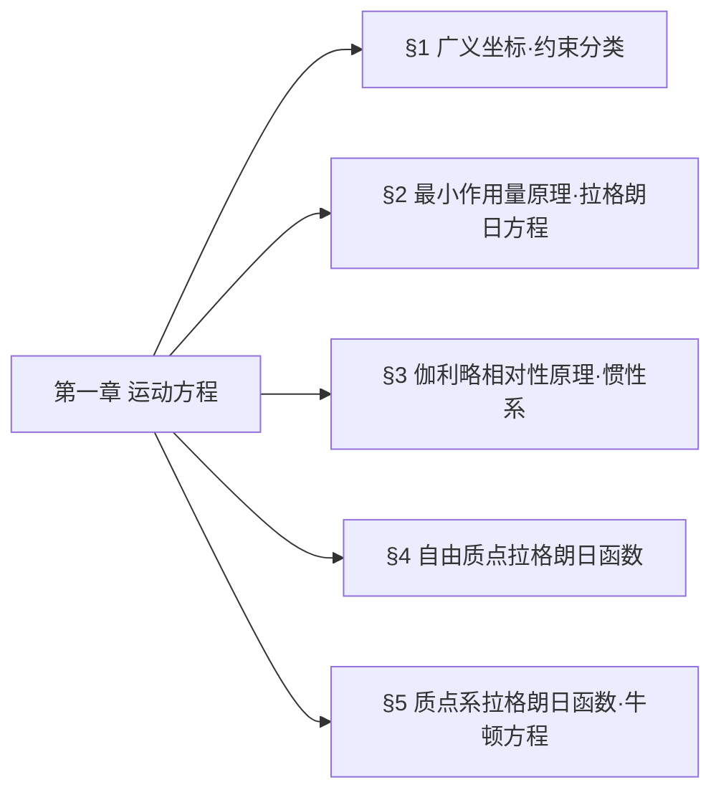
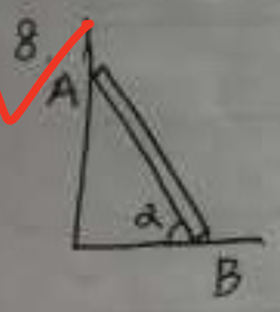
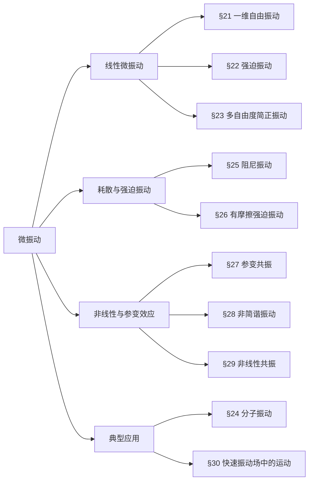
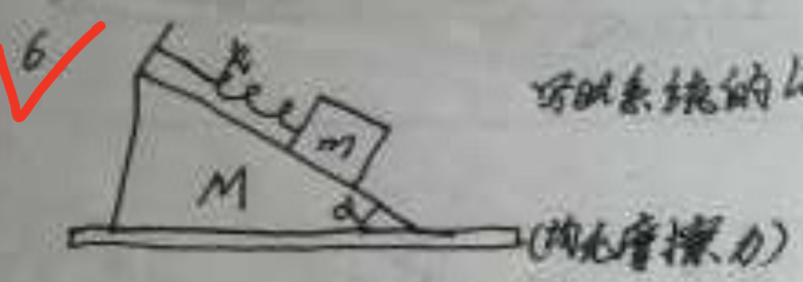
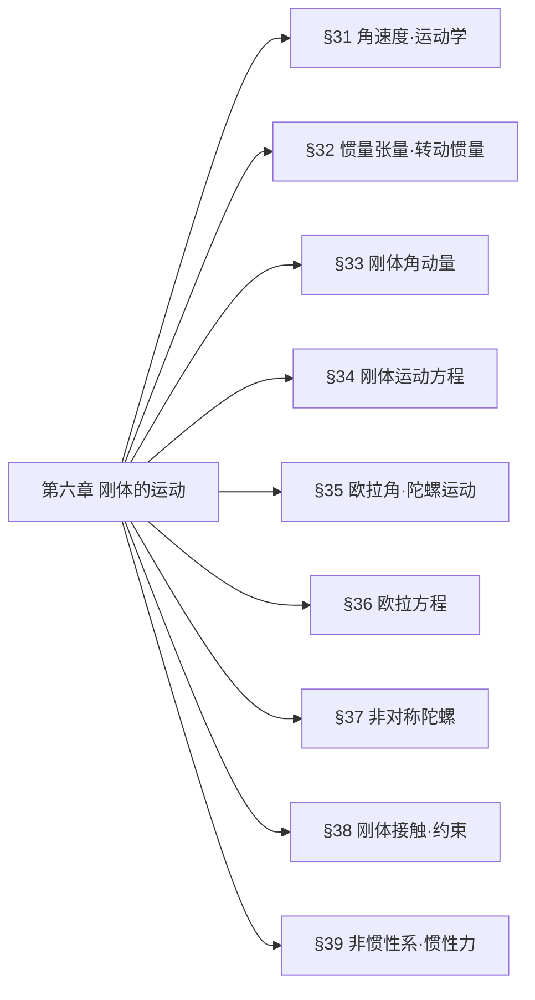
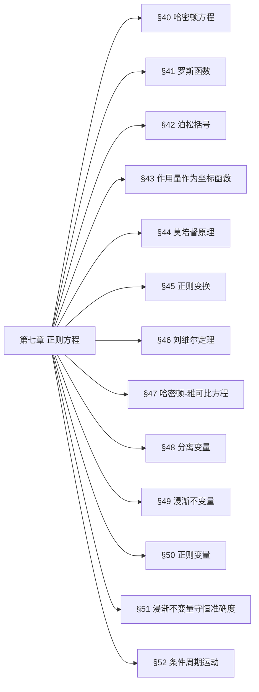

# 第一章 运动方程
## 章节总览
本章核心：**从最小作用量原理出发，建立完整约束系统的拉格朗日方程**
主线：广义坐标 → 约束分类 → 最小作用量原理 → 拉格朗日方程 → 惯性系与伽利略不变性 → 拉格朗日函数构造
## 章节思维导图

## 分章节知识点梳理
### §1 广义坐标与约束分类
#### 1. 核心定义
- **自由度$s$**：唯一确定系统位形所需的**独立变量数目**
- **广义坐标**：$q_1,q_2,\dots,q_s$（可非直角坐标）
- **广义速度**：$\dot{q}_i=\dfrac{dq_i}{dt}$
- **位形**：系统所有质点位置的集合
#### 2. 约束分类表（考试必背）
| 分类依据 | 约束类型 | 数学形式 | 核心特征 |
|----------|----------|----------|----------|
| 约束对象 | 完整约束 | $f(\boldsymbol{r}_1,\dots,\boldsymbol{r}_N,t)=0$ | 仅限制位形，可积分 |
|          | 非完整约束 | $f(\boldsymbol{r},\dot{\boldsymbol{r}},t)=0$ | 限位形+速度，不可积分 |
| 显含时间 | 定常约束 | 方程不显含$t$ | 约束不随时间变 |
|          | 非定常约束 | 方程显含$t$ | 约束随时间变化 |
| 虚功性质 | 理想约束 | $\sum\limits_{a=1}^N \boldsymbol{F}_a'\cdot\delta\boldsymbol{r}_a=0$ | 约束力总虚功为0 |
|          | 非理想约束 | $\sum\boldsymbol{F}_a'\cdot\delta\boldsymbol{r}_a\neq0$ | 含摩擦、耗散 |
#### 3. 关键结论（材料原文）
1. 广义坐标是**针对整个系统**的，不能描述单个部分
2. 理想约束常见类型：光滑接触面、刚性杆、铰链、不可伸长绳
3. 完整约束可通过广义坐标自动消去，无需额外处理
### §2 最小作用量原理 + 拉格朗日方程
#### 1、核心定义
- **作用量$S$**：拉格朗日函数对时间的积分
  $$S=\int_{t_1}^{t_2} L(q,\dot{q},t)dt$$
- **最小作用量原理（哈密顿原理）**：真实运动的轨迹是使作用量取极值的轨迹，数学表述为：
  $$\delta S = \delta \int_{t_1}^{t_2} L(q,\dot{q},t)dt = 0$$
- **边界条件**：端点固定，$\delta q(t_1)=\delta q(t_2)=0$
#### 2、拉格朗日方程完整推导（考点1号）
##### 步骤1：作用量变分展开
对作用量取变分，将$L$展开到一阶小量：
$$\delta S = \int_{t_1}^{t_2} \left( \frac{\partial L}{\partial q_i}\delta q_i + \frac{\partial L}{\partial \dot{q}_i}\delta \dot{q}_i \right)dt$$
##### 步骤2：变分与微分交换
**等时变分**下，变分与时间微分可交换：
$$\delta \dot{q}_i = \frac{d}{dt}\delta q_i$$
##### 步骤3：分部积分消去速度变分
对第二项做分部积分：
$$\int_{t_1}^{t_2} \frac{\partial L}{\partial \dot{q}_i}\delta \dot{q}_i dt = \left. \frac{\partial L}{\partial \dot{q}_i}\delta q_i \right|_{t_1}^{t_2} - \int_{t_1}^{t_2} \frac{d}{dt}\left( \frac{\partial L}{\partial \dot{q}_i} \right)\delta q_i dt$$
##### 步骤4：边界项消失
根据边界条件$\delta q(t_1)=\delta q(t_2)=0$，边界项为0，因此：
$$\delta S = \int_{t_1}^{t_2} \left( \frac{\partial L}{\partial q_i} - \frac{d}{dt}\left( \frac{\partial L}{\partial \dot{q}_i} \right) \right)\delta q_i dt = 0$$
##### 步骤5：任意变分的结论
由于$\delta q_i$是任意的，被积函数必须恒为0，得到**拉格朗日方程**：
$$\frac{d}{dt}\left( \frac{\partial L}{\partial \dot{q}_i} \right) - \frac{\partial L}{\partial q_i} = 0 \quad (i=1,2,\dots,s)$$
#### 3、拉格朗日函数的核心性质
| 性质 | 内容 | 物理意义 |
|------|------|----------|
| 可加性 | 独立子系统的拉格朗日量可叠加：$L=L_A+L_B$ | 各子系统的运动方程互不影响 |
| 常数缩放 | $L\to cL$不改变运动方程 | 仅改变单位，不改变物理规律 |
| 规范变换 | $L\to L+\dfrac{d}{dt}f(q,t)$不改变运动方程 | 作用量仅差边界项，变分后消失 |
#### 4、关键补充（解读+考点）
##### 4.1. 等时变分 vs 全变分（易错点）
| 类型 | 定义 | 变分与微分的关系 | 适用场景 |
|------|------|------------------|----------|
| 等时变分$\delta$ | 同一时刻的位形变化 | $\delta\dot{q}=\dfrac{d}{dt}\delta q$ | 哈密顿原理的标准变分 |
| 全变分$\Delta$ | 包含时间变化的位形变化 | $\Delta\dot{q}\neq\dfrac{d}{dt}\Delta q$ | 非等时的轨迹变换 |
##### 4.2. 规范变换的实例（考点）
电磁场中带电粒子的拉格朗日量：
$$L=\frac{1}{2}mv^2 - e\varphi + e\boldsymbol{A}\cdot\boldsymbol{v}$$
当势做规范变换：
$$\boldsymbol{A}\to\boldsymbol{A}+\nabla\psi, \quad \varphi\to\varphi-\frac{\partial\psi}{\partial t}$$
拉格朗日量的变化为：
$$L\to L + e\frac{d\psi}{dt}$$
这正是规范变换，运动方程不变，这就是电磁规范不变性的经典力学基础。
### §3 伽利略相对性原理
#### 1. 惯性系的定义
惯性参考系是满足以下条件的参考系：
- 空间是**均匀、各向同性**的
- 时间是**均匀**的
- 力学规律在该参考系中形式最简单
#### 2. 时空对称性的推论
在惯性系中，自由质点的拉格朗日量不能显含$\boldsymbol{r}$和$t$（否则时空不均匀），也不能显含速度的方向（否则空间各向异性），因此：
$$L=L(v^2)$$
仅依赖于速度的大小。
#### 3. 伽利略变换
两个惯性系$K$和$K'$，$K'$相对$K$以匀速$\boldsymbol{V}$运动，坐标变换为：
$$\boldsymbol{r} = \boldsymbol{r}' + \boldsymbol{V}t, \quad t = t'$$
速度变换为：
$$\boldsymbol{v} = \boldsymbol{v}' + \boldsymbol{V}$$
#### 4. 伽利略相对性原理
力学运动方程在伽利略变换下**形式不变**，即所有惯性系中力学规律完全等价，不存在绝对的惯性系。
### §4 自由质点拉格朗日函数
#### 1. 完整推导（朗道标准推导，考试必考）
##### 步骤1：无穷小伽利略变换
设$K'$相对$K$以无穷小速度$\boldsymbol{\varepsilon}$运动，则：
$$v'^2 = v^2 + 2\boldsymbol{v}\cdot\boldsymbol{\varepsilon} + \varepsilon^2$$
##### 步骤2：拉格朗日量的变换
根据伽利略不变性，变换后的拉格朗日量$L'$与原$L$仅差一个全导数项：
$$L' = L(v'^2) = L(v^2) + 2\frac{\partial L}{\partial v^2}\boldsymbol{v}\cdot\boldsymbol{\varepsilon}$$
##### 步骤3：线性条件
要让第二项是全导数，必须让$\dfrac{\partial L}{\partial v^2}$是常数（否则会依赖于速度，无法写成全导数），因此：
$$L = \frac{1}{2}mv^2$$
其中$m$是质点的质量。
#### 2. 有限伽利略变换的验证
对有限速度$\boldsymbol{V}$，变换后的拉格朗日量：
$$L' = \frac{1}{2}mv'^2 = \frac{1}{2}m(\boldsymbol{v}+\boldsymbol{V})^2 = L + \frac{d}{dt}\left(m\boldsymbol{r}\cdot\boldsymbol{V} + \frac{1}{2}mV^2 t\right)$$
确实仅差一个全导数项，不改变运动方程，符合伽利略不变性。
#### 3. 不同坐标系下的拉格朗日量
| 坐标系 | 速度平方展开 | 拉格朗日量 |
|--------|--------------|------------|
| 直角坐标 | $v^2=\dot{x}^2+\dot{y}^2+\dot{z}^2$ | $L=\dfrac{1}{2}m(\dot{x}^2+\dot{y}^2+\dot{z}^2)$ |
| 柱坐标 | $v^2=\dot{r}^2+r^2\dot{\phi}^2+\dot{z}^2$ | $L=\dfrac{1}{2}m(\dot{r}^2+r^2\dot{\phi}^2+\dot{z}^2)$ |
| 球坐标 | $v^2=\dot{r}^2+r^2\dot{\theta}^2+r^2\sin^2\theta\dot{\phi}^2$ | $L=\dfrac{1}{2}m(\dot{r}^2+r^2\dot{\theta}^2+r^2\sin^2\theta\dot{\phi}^2)$ |
#### 4. 关键结论（易错点）
- **质量不能为负**：如果$m<0$，作用量$S$可以取任意小的负值，不存在最小值，违反最小作用量原理
- **可加性**：无相互作用的质点系，拉格朗日量可叠加：$L=\sum_a \dfrac{1}{2}m_a v_a^2$
- **质量的比例是物理的**：拉格朗日量的整体缩放仅改变单位，不同质点的质量比是可观测的
### §5 质点系拉格朗日函数 + 牛顿方程 + 考试押题考点
####  1. 封闭质点系的拉格朗日量
对于有相互作用的封闭质点系，拉格朗日量为动能减势能：
$$L = \sum_a \frac{1}{2}m_a v_a^2 - U(\boldsymbol{r}_1,\boldsymbol{r}_2,\dots,\boldsymbol{r}_N)$$
其中：
- $T=\sum_a \dfrac{1}{2}m_a v_a^2$：系统的总动能
- $U$：系统的势能，仅依赖于所有质点的位置
#### 2. 牛顿方程的推导
代入拉格朗日方程：
$$\frac{d}{dt}\frac{\partial L}{\partial \boldsymbol{v}_a} = \frac{\partial L}{\partial \boldsymbol{r}_a}$$
左边：$\dfrac{d}{dt}(m_a \boldsymbol{v}_a) = m_a \dot{\boldsymbol{v}}_a$
右边：$-\dfrac{\partial U}{\partial \boldsymbol{r}_a}$
因此得到牛顿第二定律：
$$m_a \ddot{\boldsymbol{r}}_a = -\frac{\partial U}{\partial \boldsymbol{r}_a} = \boldsymbol{F}_a$$
其中$\boldsymbol{F}_a$是作用在第$a$个质点上的力。
#### 3. 广义坐标下的动能
当使用广义坐标$q_i$时，坐标变换为：
$$x_a = x_a(q_1,\dots,q_s), \quad \dot{x}_a = \sum_k \frac{\partial x_a}{\partial q_k}\dot{q}_k$$
因此动能可以写成：
$$T = \frac{1}{2}\sum_{i,k} a_{ik}(q)\dot{q}_i\dot{q}_k$$
是广义速度的二次型，系数$a_{ik}$仅依赖于广义坐标。
#### 4. 关键结论
- 经典力学中相互作用是**瞬时传递**的，这是绝对时间假设的必然结果
- 时间反演不变性：$t\to-t$时$L$不变，运动可逆
- 势能可加任意常数，不改变运动方程
## 【本章必考】押题考点：斜面滑块系统
#### 系统设定
质量为$M$的光滑斜面，倾角为$\alpha$，放在光滑水平面上；质量为$m$的滑块，通过劲度系数为$k$的弹簧连在斜面顶端，沿斜面运动。
#### 完整推导
##### 步骤1：选取广义坐标
- $X$：斜面在水平面上的位移
- $x$：滑块相对于斜面的位移
##### 步骤2：惯性系下的绝对速度
滑块的绝对速度是斜面速度与相对速度的合成：
$$v_m^2 = (\dot{X} + \dot{x}\cos\alpha)^2 + (\dot{x}\sin\alpha)^2 = \dot{X}^2 + \dot{x}^2 + 2\dot{X}\dot{x}\cos\alpha$$
##### 步骤3：总动能与势能
总动能：
$$T = \frac{1}{2}M\dot{X}^2 + \frac{1}{2}m(\dot{X}^2 + \dot{x}^2 + 2\dot{X}\dot{x}\cos\alpha)$$
势能：
$$U = \frac{1}{2}kx^2 - mgx\sin\alpha$$
##### 步骤4：拉格朗日量
$$L = T-U = \frac{1}{2}(M+m)\dot{X}^2 + \frac{1}{2}m\dot{x}^2 + m\dot{X}\dot{x}\cos\alpha - \frac{1}{2}kx^2 + mgx\sin\alpha$$
##### 步骤5：运动方程
对$X$：$(M+m)\ddot{X} + m\ddot{x}\cos\alpha = 0$（$X$是循环坐标，动量守恒）
对$x$：$m\ddot{x} + m\ddot{X}\cos\alpha + kx = mg\sin\alpha$
##### 步骤6：消元求振动频率
消去$\ddot{X}$，得到振动的微分方程，最终得到：
$$\omega = \sqrt{\frac{k(M+m)}{m(M+m\sin^2\alpha)}}$$
#### 易错提醒
- 绝对不能直接写滑块的动能为$\dfrac{1}{2}m\dot{x}^2$，必须在惯性系下计算绝对速度，这是本题的核心陷阱
- 斜面的运动必须考虑，否则会得到错误的频率
## 第一章 易错点汇总
| 易错点 | 正确结论 |
|--------|----------|
| 把全变分当成等时变分 | 哈密顿原理仅适用于等时变分，全变分下变分与微分不可交换 |
| 正则动量等于机械动量 | 电磁场中，正则动量$p=m\dot{v}+qA$，不等于机械动量 |
| 非惯性系下直接用拉格朗日方程 | 拉格朗日方程的标准形式仅在惯性系中成立 |
| 质量可以为负 | 质量为负会导致作用量无最小值，违反最小作用量原理 |

# 第二章 守恒定律
## 本章核心思维导图

## 分章节知识点梳理
### §6 能量（考试核心：推导+守恒条件）
#### 1. 基础概念
- **运动积分**：系统运动中不随时间变化、仅由初始条件决定的状态函数；**s自由度封闭系统**：独立运动积分数=$2s-1$
- **能量定义（必背推导）**
  前提：时间均匀性→$L$不显含$t$
  $$\frac{d}{dt}\left(\sum_i \dot{q}_i\frac{\partial L}{\partial \dot{q}_i}-L\right)=0 \implies \boldsymbol{E=\sum_i \dot{q}_i\frac{\partial L}{\partial \dot{q}_i}-L}$$
#### 2. 守恒条件
- 封闭系统
- 定常外场（$U$不显含$t$）→ 保守系统
#### 3. 机械能 vs 广义能量
| 条件 | 能量形式 | 守恒类型 |
|------|----------|----------|
| $T$为广义速度二次齐次函数，$L=T-U$ | $E=T+U$ | 机械能守恒 |
| 约束非定常/坐标变换含时 | $E=T^{(2)}-T^{(0)}+U$ | 广义能量守恒 |
#### 4. 考试重点
完整推导**时间均匀性→能量守恒**的全过程。
#### 考点8号、 长度为 $L$ 的杆 $AB$（质量设为 $M$），初始时刻与水平面的夹角为 $\alpha = \alpha_0$。杆的两端 $A$ 和 $B$ 分别与竖直墙面和水平地面接触，接触面均光滑（无摩擦力）。系统由静止开始下滑。（Gemini3）
**问：** 当杆离开墙面瞬间，杆与水平面的夹角 $\alpha$ 是多少？（要求使用 Lagrange 分析力学方法解答）

##### 知识点归纳与教材对应
本题属于刚体在约束下的平面运动问题。
*   **对应教材：**
    *   《朗道理论物理教程 卷1-力学》（第五版）—— **第一章：运动方程** 与 **第二章：守恒定律**。
    *   具体涉及：
        *   **§4. 拉格朗日函数**：确定广义坐标并建立 $L$。
        *   **§6. 能量守恒**：利用机械能守恒简化计算。
        *   **约束问题**：虽然朗道教材中较少直接讨论“脱离约束”的判据，但在配套的《力学》解读中，这类涉及**向心加速度与受力平衡**的技巧是考试重点。
*   **物理本质：**
    杆离开墙面的临界条件是：**墙面对杆端 $A$ 的支持力 $N_x$ 减小到零**。在运动学上，这等价于杆质心在水平方向的加速度变为零（即质心不再加速向右离开墙面）。
##### 3. 试题解答
我们将通过拉格朗日力学建立运动方程，并结合能量守恒求解。
###### 第一步：选取广义坐标与描述质心运动
设杆与水平面的夹角为 $\alpha$ 为广义坐标。
当杆与墙面和地面都接触时，质心（CM）的坐标 $(x_c, y_c)$ 为：
$$x_c = \frac{L}{2} \cos \alpha, \quad y_c = \frac{L}{2} \sin \alpha$$
质心的速度分量为：
$$\dot{x}_c = -\frac{L}{2} \sin \alpha \cdot \dot{\alpha}, \quad \dot{y}_c = \frac{L}{2} \cos \alpha \cdot \dot{\alpha}$$
质心速度的平方：
$$v_c^2 = \dot{x}_c^2 + \dot{y}_c^2 = \frac{L^2}{4} \dot{\alpha}^2$$
###### 第二步：写出系统的 Lagrange 量 $L$
1.  **动能 ($T$)：** 包括质心平动动量和绕质心的转动动能。
    杆绕质心的转动惯量为 $I = \frac{1}{12} ML^2$。
    $$T = \frac{1}{2} M v_c^2 + \frac{1}{2} I \dot{\alpha}^2 = \frac{1}{2} M \left( \frac{L^2}{4} \dot{\alpha}^2 \right) + \frac{1}{2} \left( \frac{1}{12} ML^2 \right) \dot{\alpha}^2 = \frac{1}{6} ML^2 \dot{\alpha}^2$$
2.  **势能 ($U$)：** 取地面为势能零点。
    $$U = M g y_c = \frac{1}{2} MgL \sin \alpha$$
3.  **拉格朗日量：**
    $$L = T - U = \frac{1}{6} ML^2 \dot{\alpha}^2 - \frac{1}{2} MgL \sin \alpha$$
###### 第三步：利用能量守恒
由于系统无摩擦且约束力不做功，机械能守恒。初始状态为 $\dot{\alpha}=0, \alpha=\alpha_0$。
$$\frac{1}{6} ML^2 \dot{\alpha}^2 + \frac{1}{2} MgL \sin \alpha = \frac{1}{2} MgL \sin \alpha_0$$
由此解得 $\dot{\alpha}^2$：
$$\dot{\alpha}^2 = \frac{3g}{L} (\sin \alpha_0 - \sin \alpha) \quad \text{--- (1)}$$
###### 第四步：确定离开墙面的判据
杆离开墙面的瞬间，墙对杆的水平支持力 $N_x = 0$。
根据牛顿第二定律，水平方向有 $N_x = M \ddot{x}_c$。所以离开条件是 $\ddot{x}_c = 0$。
对 $x_c = \frac{L}{2} \cos \alpha$ 求两次导：
$$\dot{x}_c = -\frac{L}{2} \sin \alpha \cdot \dot{\alpha}$$
$$\ddot{x}_c = -\frac{L}{2} (\cos \alpha \cdot \dot{\alpha}^2 + \sin \alpha \cdot \ddot{\alpha})$$
令 $\ddot{x}_c = 0$，得到：
$$\cos \alpha \cdot \dot{\alpha}^2 + \sin \alpha \cdot \ddot{\alpha} = 0 \quad \text{--- (2)}$$
###### 第五步：求角加速度 $\ddot{\alpha}$
对能量守恒式 (1) 关于时间 $t$ 求导：
$$2 \dot{\alpha} \ddot{\alpha} = \frac{3g}{L} (-\cos \alpha \cdot \dot{\alpha})$$
$$\ddot{\alpha} = -\frac{3g}{2L} \cos \alpha \quad \text{--- (3)}$$
###### 第六步：联立求解 $\alpha$
将 (1) 和 (3) 代入判据 (2)：
$$\cos \alpha \left[ \frac{3g}{L} (\sin \alpha_0 - \sin \alpha) \right] + \sin \alpha \left[ -\frac{3g}{2L} \cos \alpha \right] = 0$$
消去共有的项 $\frac{3g}{L} \cos \alpha$（此时 $\cos \alpha \neq 0$）：
$$(\sin \alpha_0 - \sin \alpha) - \frac{1}{2} \sin \alpha = 0$$
$$\sin \alpha_0 = \frac{3}{2} \sin \alpha$$
$$\sin \alpha = \frac{2}{3} \sin \alpha_0$$
##### 4. 结论与总结

**杆离开墙面时，杆与水平面的夹角 $\alpha$ 满足：**
$$\alpha = \arcsin \left( \frac{2}{3} \sin \alpha_0 \right)$$
###### 备考建议：
*   **物理直观：** 当杆下滑时，由于重心下落，它试图向右“加速”。但随着角度变小，它维持接触所需的向心力分量会减小。当它下落得足够快时，它的自然运动趋势将使其水平分速度达到最大值，此后不再需要墙提供支持力，从而脱离。
*   **易错点：**
    1.  **动能项：** 很多学生漏掉绕质心的转动动能 $\frac{1}{2}I\dot{\alpha}^2$，或者转动惯量 $I$ 记错。
    2.  **判据：** 一定要记得“脱离”意味着“正向压力消失”，在解析力学中通常通过广义力或坐标加速度来体现。
*   **拓展：** 思考一下，如果 $\alpha_0 = 90^\circ$（杆完全竖直立着，受微扰开始下滑），则离开瞬间 $\sin \alpha = 2/3$。

### §7 动量（考试核心：守恒+广义量）
#### 1. 动量定义（必背推导）
前提：空间均匀性→系统平移不变性
无穷小平移$\varepsilon$，$\delta L=0 \implies \frac{d}{dt}\sum_a \frac{\partial L}{\partial v_a}=0$
$$\boldsymbol{P=\sum_a \frac{\partial L}{\partial v_a}}$$
#### 2. 守恒条件
- 封闭系统：$\boldsymbol{P}$全分量守恒
- 有外场：势能**不显含某坐标**→该方向动量分量守恒
#### 3. 广义量
- 广义动量：$\boldsymbol{p_i=\frac{\partial L}{\partial \dot{q}_i}}$
- 广义力：$\boldsymbol{F_i=\frac{\partial L}{\partial q_i}}$
- 拉格朗日方程：$\dot{p}_i=F_i$
#### 4. 推论与习题
- 牛顿第三定律：两质点封闭系统$\boldsymbol{F_1+F_2=0}$
- 质点穿越势能分界面（课本习题）：
  平行分界面动量守恒$v_1\sin\theta_1=v_2\sin\theta_2$，结合能量守恒得：
  $$\frac{\sin\theta_1}{\sin\theta_2}=\sqrt{1+\frac{2}{mv_1^2}(U_1-U_2)}$$
### §8 质心（考试核心：质心系+能量分解）
#### 1. 质心公式
- 质心径矢：$\boldsymbol{R=\frac{\sum m_a r_a}{\sum m_a}}$
- 质心速度：$\boldsymbol{V=\dot{R}=\frac{P}{\mu}}$（$\mu=\sum m_a$为总质量）
#### 2. 质心系
- 定义：总动量$P'=0$的参考系
- 封闭系统：质心做**匀速直线运动**（动量守恒直接推论）
#### 3. 能量分解（柯尼希定理，必背）
$$\boldsymbol{E=\frac{1}{2}\mu V^2+E_{int}}$$
- $\frac{1}{2}\mu V^2$：质心动能（整体运动）
- $E_{int}$：内能（相对运动动能+相互作用势能）
#### 4. 习题考点
不同惯性系作用量变换：
$$S=S'+\mu V\cdot R'+\frac{1}{2}\mu V^2 t$$
### §9 角动量（考试核心：守恒+参考系变换+场分量）
#### 1. 角动量定义（必背推导）
前提：空间各向同性→系统转动不变性
无穷小转动$\delta\varphi$，$\delta r=\delta\varphi\times r$，$\delta L=0 \implies \frac{d}{dt}\sum_a r_a\times p_a=0$
$$\boldsymbol{M=\sum_a r_a\times p_a}$$
#### 2. 守恒条件
- 封闭系统：$\boldsymbol{M}$全分量守恒
- 有外场：绕**场对称轴**转动不变→该轴角动量分量守恒；中心对称场→$\boldsymbol{M}$全守恒
#### 3. 参考系变换
- 原点平移：$\boldsymbol{M=M'+a\times P}$（仅$P=0$时，$M$与原点无关）
- 惯性系变换：$\boldsymbol{M=M'+R\times P}$（内禀角动量+轨道角动量）
#### 4. 特殊场守恒分量（高频考点）
| 场类型 | 守恒动量分量 | 守恒角动量分量 |
|--------|--------------|----------------|
| 无限大均匀平面场 | $P_x,P_y$ | $M_z$ |
| 无限长均匀圆柱场 | $P_z$ | $M_z$ |
| 圆柱形螺旋线场 | - | $P_z\frac{h}{2\pi}+M_z=\text{常数}$ |
#### 5. 坐标表示
- 柱坐标：$M_z=mr^2\dot{\varphi}$
- 球坐标：$M_z=mr^2\dot{\varphi}\sin^2\theta$

### §10 力学相似性 + 位力定理（考试核心：齐次势+定理推导）
#### 1. 力学相似性
- 势能为**k次齐次函数**：$U(\alpha r)=\alpha^k U(r)$
- 标度变换关系：
  $$\frac{t'}{t}=\left(\frac{l'}{l}\right)^{1-k/2},\quad \frac{v'}{v}=\left(\frac{l'}{l}\right)^{k/2}$$
- 特例：
  - 简谐振动（$k=2$）：周期与振幅无关
  - 引力/库仑势（$k=-1$）：开普勒第三定律$T^2\propto a^3$
#### 2. 位力定理（有限空间运动，必背推导）
- 一般式：$\boldsymbol{2\overline{T}=\sum_a \overline{r_a\cdot\frac{\partial U}{\partial r_a}}}$
- 齐次势简化：$\boldsymbol{2\overline{T}=k\overline{U}}$
- 特例：
  - 简谐振动：$\overline{T}=\overline{U}$
  - 引力势：$2\overline{T}=-\overline{U}$，有界运动满足$E=-\overline{T}<0$
### 七、考试必背推导题清单
#### 1. 由时间均匀性推导能量守恒定律
**前提**：封闭系统，拉格朗日函数$L(q,\dot{q},t)$不显含时间$t$（时间均匀性）。
**推导步骤**：
1. 写出拉格朗日函数对时间的全微分：
$$\frac{dL}{dt} = \sum_i \left( \frac{\partial L}{\partial q_i} \dot{q}_i + \frac{\partial L}{\partial \dot{q}_i} \ddot{q}_i \right) + \frac{\partial L}{\partial t}$$
2. 由时间均匀性，$\frac{\partial L}{\partial t}=0$；由拉格朗日方程，$\frac{d}{dt}\left( \frac{\partial L}{\partial \dot{q}_i} \right) = \frac{\partial L}{\partial q_i}$，代入上式得：
$$\frac{dL}{dt} = \sum_i \left[ \frac{d}{dt}\left( \frac{\partial L}{\partial \dot{q}_i} \right) \dot{q}_i + \frac{\partial L}{\partial \dot{q}_i} \ddot{q}_i \right]$$
3. 右侧为乘积的导数形式，整理得：
$$\frac{dL}{dt} = \frac{d}{dt} \left( \sum_i \dot{q}_i \frac{\partial L}{\partial \dot{q}_i} \right)$$
4. 移项后得：
$$\frac{d}{dt} \left( \sum_i \dot{q}_i \frac{\partial L}{\partial \dot{q}_i} - L \right) = 0$$
5. 定义能量$E = \sum_i \dot{q}_i \frac{\partial L}{\partial \dot{q}_i} - L$，故$E=\text{常数}$，即能量守恒。
#### 2. 由空间均匀性推导动量守恒定律
**前提**：封闭系统，空间均匀（平移不变性），拉格朗日函数在无穷小平移下不变。
**推导步骤**：
1. 设系统整体做无穷小平移$\varepsilon$，位置矢量$r_a \to r_a + \varepsilon$，速度$v_a$不变（$\varepsilon$为常数）。
2. 拉格朗日函数的变分为：
$$\delta L = \sum_a \frac{\partial L}{\partial r_a} \cdot \delta r_a = \varepsilon \cdot \sum_a \frac{\partial L}{\partial r_a}$$
3. 由平移不变性，对任意$\varepsilon$有$\delta L=0$，故：
$$\sum_a \frac{\partial L}{\partial r_a} = 0$$
4. 由拉格朗日方程，$\frac{d}{dt}\left( \frac{\partial L}{\partial v_a} \right) = \frac{\partial L}{\partial r_a}$，代入上式得：
$$\frac{d}{dt} \sum_a \frac{\partial L}{\partial v_a} = 0$$
5. 定义总动量$P = \sum_a \frac{\partial L}{\partial v_a}$，故$P=\text{常数}$，即动量守恒。
#### 3. 由空间各向同性推导角动量守恒定律
**前提**：封闭系统，空间各向同性（转动不变性），拉格朗日函数在无穷小转动下不变。
**推导步骤**：
1. 设系统绕原点做无穷小转动$\delta\varphi$，位置矢量与速度的变分为：
$$\delta r_a = \delta\varphi \times r_a, \quad \delta v_a = \delta\varphi \times v_a$$
2. 拉格朗日函数的变分为：
$$\delta L = \sum_a \left( \frac{\partial L}{\partial r_a} \cdot \delta r_a + \frac{\partial L}{\partial v_a} \cdot \delta v_a \right)$$
3. 代入变分表达式，利用矢量混合积性质$a \cdot (b \times c) = b \cdot (c \times a)$，改写为：
$$\delta L = \delta\varphi \cdot \sum_a \left( r_a \times \frac{\partial L}{\partial r_a} + v_a \times \frac{\partial L}{\partial v_a} \right)$$
4. 由拉格朗日方程，$\frac{\partial L}{\partial r_a} = \frac{d}{dt}\left( \frac{\partial L}{\partial v_a} \right)$，代入上式：
$$\delta L = \delta\varphi \cdot \sum_a \left( r_a \times \frac{d}{dt}\left( \frac{\partial L}{\partial v_a} \right) + v_a \times \frac{\partial L}{\partial v_a} \right)$$
5. 括号内的项为时间导数形式：
$$r_a \times \frac{d}{dt}\left( \frac{\partial L}{\partial v_a} \right) + v_a \times \frac{\partial L}{\partial v_a} = \frac{d}{dt} \left( r_a \times \frac{\partial L}{\partial v_a} \right)$$
6. 由转动不变性，对任意$\delta\varphi$有$\delta L=0$，故：
$$\frac{d}{dt} \sum_a r_a \times \frac{\partial L}{\partial v_a} = 0$$
7. 定义总角动量$M = \sum_a r_a \times p_a$（其中$p_a = \frac{\partial L}{\partial v_a}$为质点动量），故$M=\text{常数}$，即角动量守恒。
#### 4. 推导柯尼希定理（质心能量分解公式）
**前提**：$N$质点系统，总质量$\mu = \sum_a m_a$，质心参考系定义。
**推导步骤**：
1. 质心径矢与速度定义：
$$R = \frac{\sum_a m_a r_a}{\mu}, \quad V = \dot{R} = \frac{\sum_a m_a v_a}{\mu}$$
总动量$P = \mu V$。
2. 第$a$个质点相对于质心的位置与速度：
$$r'_a = r_a - R, \quad v'_a = v_a - V$$
3. 系统总动能展开：
$$T = \sum_a \frac{1}{2} m_a v_a^2 = \sum_a \frac{1}{2} m_a (V + v'_a)^2$$
4. 展开平方项并拆分：
$$T = \frac{1}{2} V^2 \sum_a m_a + V \cdot \sum_a m_a v'_a + \sum_a \frac{1}{2} m_a v'^2_a$$
5. 第二项为零（质心参考系总动量为零）：
$$\sum_a m_a v'_a = \sum_a m_a (v_a - V) = \mu V - \mu V = 0$$
6. 因此动能可分解为：
$$T = \frac{1}{2} \mu V^2 + \sum_a \frac{1}{2} m_a v'^2_a$$
7. 系统总能量$E = T + U$，势能$U$仅与质点相对位置有关，与参考系无关，故：
$$E = \frac{1}{2} \mu V^2 + E_{\text{int}}$$
其中$E_{\text{int}} = \sum_a \frac{1}{2} m_a v'^2_a + U$为内能，即柯尼希定理。
#### 5. 齐次势下的位力定理（有限运动）
**前提**：系统做有限运动，势能$U(r)$为$k$次齐次函数，即$U(\alpha r) = \alpha^k U(r)$。
**推导步骤**：
1. 定义位力$G = \sum_a r_a \cdot p_a$，计算其时间导数：
$$\frac{dG}{dt} = \sum_a \dot{r}_a \cdot p_a + \sum_a r_a \cdot \dot{p}_a$$
2. 第一项化简：$\dot{r}_a \cdot p_a = v_a \cdot m_a v_a = 2T_a$，故$\sum_a \dot{r}_a \cdot p_a = 2T$。
3. 第二项由牛顿第二定律$\dot{p}_a = F_a = -\frac{\partial U}{\partial r_a}$，代入得：
$$\sum_a r_a \cdot \dot{p}_a = -\sum_a r_a \cdot \frac{\partial U}{\partial r_a}$$
4. 因此：
$$\frac{dG}{dt} = 2T - \sum_a r_a \cdot \frac{\partial U}{\partial r_a}$$
5. 对等式两边取时间平均，有限运动中$G$有界，故$\left\langle \frac{dG}{dt} \right\rangle = 0$，得：
$$2\langle T \rangle = \left\langle \sum_a r_a \cdot \frac{\partial U}{\partial r_a} \right\rangle$$
6. 由欧拉齐次函数定理，$k$次齐次函数满足$\sum_a r_a \cdot \frac{\partial U}{\partial r_a} = kU$，代入得：
$$2\langle T \rangle = k\langle U \rangle$$
即位力定理。

# 第三章 运动方程的积分
## 一、分节核心知识点
### §11 一维运动
核心是利用**能量守恒将二阶运动方程降为一阶可积分形式**

| 核心公式 | 物理含义 |
|---------|---------|
| $t=\sqrt{\frac{m}{2}}\int \frac{dx}{\sqrt{E-U(x)}}+C$ | 运动的时间隐式解，直接积分得到坐标与时间的关系 |
| $T(E)=\sqrt{2m}\int_{x_1}^{x_2}\frac{dx}{\sqrt{E-U(x)}}$ | 有界振动的周期，由两转折点之间的积分得到 |
#### 运动分类
- **转折点**：满足$E=U(x)$的位置，此处质点速度为0，是运动的边界
- **有界运动**：存在两个转折点，质点在两者之间做周期往复振动
- **无界运动**：仅存在单侧转折点，质点可运动到无穷远处
### §12 由振动周期确定势能（反问题）
这是典型的**逆散射问题**，通过实验测量的周期反推相互作用势，是实验物理重建势场的核心方法
1. 核心积分方程（Abel方程）：
$$x_2(U)-x_1(U)=\frac{1}{\pi\sqrt{2m}}\int_0^U \frac{T(E)dE}{\sqrt{U-E}}$$
2. 解的性质：
   - 一般情况下解不唯一，仅当势函数关于原点对称时，可唯一确定$U(x)$
   - 可推广到势垒的逆问题，用于实验测量重建相互作用势
### §13 二体问题与约化质量
将两体相互作用系统完全约化为单体问题，是处理相互作用系统的核心技巧
1. 运动分解：
   - 质心的匀速直线运动：整体平动，与相互作用无关
   - 相对运动：等效为质量为**约化质量**的单体在有心力场中的运动
2. 约化质量：
$$m=\frac{m_1 m_2}{m_1+m_2}$$
   - 当$m_1\gg m_2$时，$m\approx m_2$，退化为单体问题（比如行星绕太阳的运动）
### §14 有心力场的一般性质
有心力场是最常见的中心对称相互作用，具有高度可积性
1. 守恒量：
   - 角动量守恒：$M=mr^2\dot{\phi}=const$，直接导致运动限制在垂直于$M$的固定平面内
   - 机械能守恒：$E=T+U=const$，系统能量不随时间变化
2. 有效势能：
$$U_{eff}(r)=U(r)+\frac{M^2}{2mr^2}$$
   其中$\frac{M^2}{2mr^2}$是**离心势能**，将平面运动完全约化为径向的一维等效运动
3. 轨道性质：
   - 转折点：$E=U_{eff}(r)$，对应径向速度为0的位置
   - **Bertrand定理**：仅当$U\propto 1/r$（平方反比力）或$U\propto r^2$（简谐力）时，所有有界运动的轨道都是封闭的
   - 坠落条件：当$r\to0$时，若$r^2 U(r)\to -\infty$足够快，质点可坠落到力心
### §15 开普勒问题（平方反比力场）
这是有心力场最重要的特例，对应万有引力和库仑相互作用
#### 轨道类型（由能量$E$唯一决定）
| 能量范围 | 偏心率$e$ | 轨道类型 | 运动性质 |
|---------|-----------|----------|----------|
| $E<0$ | $e<1$ | 椭圆 | 有界周期运动，对应行星轨道 |
| $E=0$ | $e=1$ | 抛物线 | 无界运动，质点从无穷远来回到无穷远 |
| $E>0$ | $e>1$ | 双曲线 | 无界散射运动，对应α粒子散射 |
#### 开普勒三定律
1. 第一定律：行星沿椭圆轨道绕太阳运动，太阳位于椭圆的一个焦点
2. 第二定律：掠面速度守恒（角动量守恒的直接结果，单位时间径矢扫过的面积不变）
3. 第三定律：周期平方正比于半长轴立方：$T^2\propto a^3$
#### 特殊守恒量
Runge-Lenz矢量：平方反比力独有的运动积分，保证了轨道的封闭性，是该力场的特殊对称性的体现
## 二、【考试重点】押题考点整理
根据本次提供的考点整理，本次考试的高频重点题目如下：
1. 【必考】最小作用量原理、Lagrange方程、Hamilton正则方程的推导与三者关系
   - 核心逻辑：从变分原理导出拉格朗日方程，再通过勒让德变换得到哈密顿正则方程，完整的理论框架
2. 【必考】一维谐振子的Lagrange与Hamilton两种求解方法
   - 对比两种形式的差异：拉格朗日的二阶微分方程 vs 哈密顿的一阶微分方程组，理解两者的等价性
3. 有心力场中的Lagrange量与Hamilton量的构造
   - 利用角动量守恒简化，写出有效势能对应的等效一维问题的哈密顿量
4. 电磁场中带电粒子的哈密顿量构造
   - 注意正则动量与机械动量的差异，正确完成勒让德变换，这是后续量子力学的基础
5. 斜面滑块系统的Lagrange量、运动方程与振动频率
   - 广义坐标的选取，惯性系下动能的正确计算，约化质量的应用
6. 杆的滑落问题：约束系统的拉格朗日求解，脱离约束的判据
   - 利用能量守恒简化，结合脱离约束的临界条件（支持力为0，质心水平加速度为0）求解
## 三、指定习题详细解答
### 作业提及：§15 习题2：质点在势场$U=-\alpha/r^2(\alpha>0)$中的运动积分
#### 题目
质点在有心力场$U=-\alpha/r^2(\alpha>0)$内运动，试积分求解运动方程。
#### 详细解答
1. **等效径向运动化简**
   利用有心力场的守恒量，将平面运动约化为径向的一维等效运动，有效势能为：
   $$U_{eff}(r)=U(r)+\frac{M^2}{2mr^2}=-\frac{\alpha}{r^2}+\frac{M^2}{2mr^2}=\frac{1}{r^2}\left(\frac{M^2}{2m}-\alpha\right)$$
   令$\beta=\left|\frac{M^2}{2m}-\alpha\right|$，根据参数的符号分三种情况讨论。

2. **r与时间t的关系**
   由能量守恒：
   $$E=\frac{1}{2}m\dot{r}^2 + U_{eff}(r)$$
   整理得到径向速度：
   $$\dot{r}=\sqrt{\frac{2}{m}\left(E - U_{eff}(r)\right)}=\sqrt{\frac{2}{m}\left(E - \frac{\frac{M^2}{2m}-\alpha}{r^2}\right)}$$
   分离变量积分：
   $$t=\int \frac{dr}{\sqrt{\frac{2}{m}\left(E - \frac{\frac{M^2}{2m}-\alpha}{r^2}\right)}}=\sqrt{\frac{m}{2}}\int \frac{r dr}{\sqrt{Er^2 - \left(\frac{M^2}{2m}-\alpha\right)}}$$
   积分结果整理为：
   $$t=\frac{1}{E}\sqrt{\frac{m}{2}}\sqrt{Er^2 - \frac{M^2}{2m}+\alpha}$$
   进一步得到r与t的显式关系：
   $$r=\sqrt{\frac{2E}{m}t^2 - \frac{\alpha}{E} + \frac{M^2}{2mE}}$$

3. **轨道方程（r与φ的关系）**
   由角动量守恒$d\phi=\frac{M}{mr^2}dt$，代入dt的表达式，得到：
   $$\phi=\int \frac{M dr / r^2}{\sqrt{2m\left(E+\frac{\alpha}{r^2}-\frac{M^2}{2mr^2}\right)}}$$
   令$u=1/r$，则$du=-dr/r^2$，代入化简：
   $$\phi=-\frac{M}{\sqrt{2m}}\int \frac{du}{\sqrt{E + \left(\alpha-\frac{M^2}{2m}\right)u^2}}$$

   根据参数的不同，分三种情况：
   ##### 情况a：$E>0$且$\frac{M^2}{2m}>\alpha$
   此时$\beta=\frac{M^2}{2m}-\alpha>0$，积分结果为：
   $$\phi=\frac{M}{\sqrt{2m\beta}}\arccos\left(u\sqrt{\frac{\beta}{E}}\right)$$
   整理得到轨道方程：
   $$\frac{1}{r}=\sqrt{\frac{2mE}{M^2-2m\alpha}}\cos\left(\varphi\sqrt{1-\frac{2m\alpha}{M^2}}\right)$$
   这是Cotes螺旋线，存在转折点，质点不会坠落到力心。
   ##### 情况b：$E>0$且$\frac{M^2}{2m}<\alpha$
   此时$\beta=\alpha-\frac{M^2}{2m}>0$，积分结果为：
   $$\phi=-\frac{M}{\sqrt{2m\beta}}\text{arcsinh}\left(u\sqrt{\frac{\beta}{E}}\right)$$
   轨道方程：
   $$\frac{1}{r}=\sqrt{\frac{2mE}{2m\alpha-M^2}}\sinh\left(\varphi\sqrt{\frac{2m\alpha}{M^2}-1}\right)$$
   当$\varphi\to\infty$时，$r\to0$，质点会坠落到力心。
   ##### 情况c：$E<0$且$\frac{M^2}{2m}<\alpha$
   此时$\beta=\alpha-\frac{M^2}{2m}>0$，积分结果为：
   $$\phi=-\frac{M}{\sqrt{2m\beta}}\text{arccosh}\left(u\sqrt{\frac{\beta}{|E|}}\right)$$
   轨道方程：
   $$\frac{1}{r}=\sqrt{\frac{2m|E|}{2m\alpha-M^2}}\cosh\left(\varphi\sqrt{\frac{2m\alpha}{M^2}-1}\right)$$
   同样，当$\varphi\to\infty$时，$r\to0$，质点会坠落到力心。
# 第四章 质点碰撞
## 一、分节核心知识点
### §16 质点分裂
核心是利用动量、能量守恒，不依赖相互作用细节，直接得到分裂过程的运动学约束。

| 核心物理量 | 公式 | 物理含义 |
|-----------|------|---------|
| 分裂能 | $\varepsilon=E_{int}-E_{1int}-E_{2int}$ | 分裂过程中释放的内能，是分裂的动力 |
| 质心系速度 | $v_{10}=p_0/m_1, v_{20}=p_0/m_2$ | 质心系中两质点的速度，大小相等方向相反 |
| 参考系变换 | $tan\theta=\frac{v_0 sin\theta_0}{v_0 cos\theta_0+V}$ | 实验室系飞出角与质心系飞出角的变换 |
| 最大飞出角 | $sin\theta_{max}=v_0/V$ | 当$V>v_0$时，质点只能向前飞出，存在最大偏角 |
| 动能分布 | $\frac{dT}{2mv_0 V}$ | 实验室系中分裂后质点的动能均匀分布 |
#### 关键结论
- 多质点分裂时，单个质点的最大动能为：$T_{max}=\frac{M-m_1}{M}\varepsilon$，即所有其他质点同速运动时，该质点获得最大动能。
### §17 质点弹性碰撞
弹性碰撞：碰撞不改变质点内部状态，因此动量、机械能均守恒。
#### 参考系变换关系
| 物理量 | 质心系(C系) | 实验室系(L系，靶静止) |
|-------|-------------|------------------------|
| 碰撞前速度 | $v_{10}=\frac{m_2}{m_1+m_2}v, v_{20}=-\frac{m_1}{m_1+m_2}v$ | $v_1=v, v_2=0$ |
| 碰撞后速度 | 仅方向转动，大小不变 | $v_1'=\frac{\sqrt{m_1^2+m_2^2+2m_1m_2 cos\chi}}{m_1+m_2}v$   $v_2'=\frac{2m_1 v}{m_1+m_2}sin\frac{\chi}{2}$ |
| 偏转角关系 | 质心系偏转角$\chi$ | $tan\theta_1=\frac{m_2 sin\chi}{m_1+m_2 cos\chi}, \theta_2=\frac{\pi-\chi}{2}$ |
#### 特殊情况
| 质量关系 | 偏转角限制 | 碰撞后夹角 |
|---------|-----------|-----------|
| $m_1<m_2$ | $\theta_1$可取任意值 | $\theta_1+\theta_2>\pi/2$ |
| $m_1>m_2$ | 最大偏转角$sin\theta_{1max}=m_2/m_1$ | $\theta_1+\theta_2<\pi/2$ |
| $m_1=m_2$ | 无限制，且$\theta_1+\theta_2=\pi/2$ | 碰撞后两质点运动方向垂直 |
### §18 质点散射
散射：质点在中心力场中运动，运动方向发生偏转的过程，是微观物理中探测相互作用的核心手段。

| 核心物理量  | 公式                                                                                               | 物理含义                          |
| :----: | ------------------------------------------------------------------------------------------------ | ----------------------------- |
|  瞄准距离  | $\rho$                                                                                           | 入射质点初始运动方向到力心的垂直距离            |
|  散射角   | $\chi=\pi-2\varphi_0$                                                                            | 入射与出射方向的夹角，由瞄准距离决定            |
| 有效散射截面 | $\sigma=\pi \rho_{max}^2=\pi \cdot \frac{2\alpha}{m v_\infty^2}=\frac{2\pi\alpha}{m v_\infty^2}$ | 单位入射强度下，散射到立体角$do$的质点数对应的入射面积 |
|  坠落条件  | $U_{eff}(r\to0)\to-\infty$                                                                       | 质点可坠落到力心的条件，此时不存在转折点          |
### §19 卢瑟福公式
平方反比力场（库仑力/万有引力）散射的核心结果，是核物理的奠基性公式。

|   核心公式   |                                       表达式                                       |           含义           |
| :------: | :-----------------------------------------------------------------------------: | :--------------------: |
| 瞄准距离-散射角 |               $\rho=\frac{\alpha}{mv_\infty^2}cot\frac{\chi}{2}$                | 平方反比力下，瞄准距离与散射角的一一对应关系 |
| 卢瑟福散射截面  |  $d\sigma=\left(\frac{\alpha}{2mv_\infty^2}\right)^2\frac{do}{sin^4(\chi/2)}$   | 质心系下的微分散射截面，对引力/斥力均成立  |
|  能量损失分布  | $d\sigma=2\pi\frac{\alpha^2}{m_2 v_\infty^2}\frac{d\varepsilon}{\varepsilon^2}$ | 散射截面与能量损失的关系，能量越小，截面越大 |
### §20 小角度散射
弱场、大瞄准距离下的散射近似，此时偏转角很小，可大幅简化计算。

|  核心公式   |                                                表达式                                                 |                   含义                    |
| :-----: | :------------------------------------------------------------------------------------------------: | :-------------------------------------: |
| 小角度散射角  | $\theta_1=-\frac{2\rho}{m_1 v_\infty^2}\int_\rho^\infty \frac{dU}{dr}\frac{dr}{\sqrt{r^2-\rho^2}}$ |         实验室系下的小偏转角公式，直接由力的积分得到          |
| 小角度散射截面 |         $$d\sigma=\lvert\frac{d\rho}{d\theta_1}\rvert\frac{\rho(\theta_1)}{\theta_1}do_1$$         | 小角度下的有效截面，用$\theta_1$代替$\chi$和$sin\chi$ |
## 二、【考试重点】押题考点整理
根据本次提供的考点整理，本次考试的高频重点题目如下：
> 标记为【必考】的为最高频考点
1. 【必考】最小作用量原理、Lagrange方程、Hamilton正则方程的推导与三者关系
   - 核心逻辑：从变分原理导出拉格朗日方程，再通过勒让德变换得到哈密顿正则方程，完整的理论框架
2. 【必考】一维谐振子的Lagrange与Hamilton两种求解方法
   - 对比两种形式的差异：拉格朗日的二阶微分方程 vs 哈密顿的一阶微分方程组，理解两者的等价性
3. 有心力场中的Lagrange量与Hamilton量的构造
   - 利用角动量守恒简化，写出有效势能对应的等效一维问题的哈密顿量
4. 电磁场中带电粒子的哈密顿量构造
   - 注意正则动量与机械动量的差异，正确完成勒让德变换，这是后续量子力学的基础
5. 斜面滑块系统的Lagrange量、运动方程与振动频率
   - 广义坐标的选取，惯性系下动能的正确计算，约化质量的应用
6. 杆的滑落问题：约束系统的拉格朗日求解，脱离约束的判据
   - 利用能量守恒简化，结合脱离约束的临界条件（支持力为0，质心水平加速度为0）求解
## 三、指定习题详细解答
本次材料中仅包含§18习题4的完整内容，其余习题不在本次章节材料中，故按要求忽略：
### 作业提及：§18 习题4：坠落至场$U=-\alpha/r^2$中的质点的有效截面
#### 题目
试求"坠落"至场 $U=-\alpha / r^{2}$ 中力心的质点的有效截面。
#### 详细解答
1. **等效径向运动分析**
   对于散射问题，我们将两体问题约化为单体在中心力场中的运动，有效势能为：
   $$U_{eff}(r)=U(r)+\frac{M^2}{2mr^2}$$
   其中，角动量$M=m\rho v_\infty$，$\rho$为瞄准距离，$v_\infty$为入射质点在无穷远处的速度。

   代入本题的势能$U=-\alpha/r^2$，得到：
   $$U_{eff}(r)=-\frac{\alpha}{r^2}+\frac{(m\rho v_\infty)^2}{2mr^2}=\frac{1}{2r^2}\left(m\rho^2 v_\infty^2 - 2\alpha\right)$$

2. **坠落条件分析**
   质点能够"坠落"至力心的条件是：当$r\to0$时，有效势能$U_{eff}(r)\to-\infty$，使得质点的径向运动不存在转折点（即不存在$r_{min}$，质点可以一直运动到$r=0$）。

   这要求有效势能的系数为负：
   $$m\rho^2 v_\infty^2 - 2\alpha < 0$$
   整理得到瞄准距离的上限：
   $$\rho < \rho_{max}=\sqrt{\frac{2\alpha}{m v_\infty^2}}$$

   也就是说，只有瞄准距离小于$\rho_{max}$的质点，才会坠落到力心，而瞄准距离大于这个值的质点，会被散射，不会坠落。
3. **有效截面计算**
   总有效截面就是所有能够坠落的质点的瞄准面积，即半径为$\rho_{max}$的圆的面积：
   $$\sigma=\pi \rho_{max}^2=\pi \cdot \frac{2\alpha}{m v_\infty^2}=\frac{2\pi\alpha}{m v_\infty^2}$$

# 第五章 微振动
## 一、章节核心框架（思维导图）

## 二、分节核心考点与押题重点
### §21 一维自由振动
#### 核心公式
- 微振动近似：势能展开到二阶 $U(x)\approx\frac{1}{2}kx^2$，动能 $T=\frac{1}{2}m\dot{x}^2$
- 运动方程：$\ddot{x}+\omega^2 x=0$，通解 $x=a\cos(\omega t+\alpha)$
- 初始条件：$a=\sqrt{x_0^2+\frac{v_0^2}{\omega^2}}$，$\tan\alpha=-\frac{v_0}{\omega x_0}$
- 约化质量：双原子分子 $\omega=\sqrt{\frac{k(m_1+m_2)}{m_1m_2}}$
####  考点2号、一维谐振问题（用Lagrange方法和Hamilton方法）（豆包）
#### 一、一维谐振子模型设定
一维谐振子的系统参数：
- 质量：$m$
- 弹性系数：$k$
- 角频率：$\omega = \sqrt{\dfrac{k}{m}}$
- 广义坐标：$x$（位移），广义速度：$\dot{x} = \dfrac{dx}{dt}$

系统的动能和势能分别为：
$$
T = \frac{1}{2} m \dot{x}^2, \quad V = \frac{1}{2} k x^2 = \frac{1}{2} m \omega^2 x^2
$$
#### 二、用 Lagrange 方法求解
##### 步骤1：构造拉格朗日函数
拉格朗日函数定义为 $L = T - V$，代入动能和势能：
$$
L(x, \dot{x}) = \frac{1}{2} m \dot{x}^2 - \frac{1}{2} m \omega^2 x^2
$$

##### 步骤2：代入拉格朗日方程
拉格朗日方程为：
$$
\frac{d}{dt}\left( \frac{\partial L}{\partial \dot{x}} \right) - \frac{\partial L}{\partial x} = 0
$$

计算偏导数：
$$
\frac{\partial L}{\partial \dot{x}} = m \dot{x}, \quad \frac{\partial L}{\partial x} = -m \omega^2 x
$$

对时间求导：
$$
\frac{d}{dt}\left( \frac{\partial L}{\partial \dot{x}} \right) = m \ddot{x}
$$

代入方程得到运动微分方程：
$$
m \ddot{x} + m \omega^2 x = 0 \quad \Rightarrow \quad \ddot{x} + \omega^2 x = 0
$$

##### 步骤3：求解微分方程
方程的通解为简谐振动形式：
$$
x(t) = A \cos(\omega t + \phi)
$$
其中 $A$ 为振幅，$\phi$ 为初相位，由初始条件确定。
#### 三、用 Hamilton 方法求解
##### 步骤1：定义广义动量与哈密顿函数
广义动量定义为：
$$
p = \frac{\partial L}{\partial \dot{x}} = m \dot{x}
$$

通过勒让德变换构造哈密顿函数 $H(x,p)$：
$$
H = p \dot{x} - L
$$

将 $\dot{x} = \dfrac{p}{m}$ 代入：
$$
H = p \cdot \frac{p}{m} - \left( \frac{1}{2} m \left( \frac{p}{m} \right)^2 - \frac{1}{2} m \omega^2 x^2 \right)
$$
化简得：
$$
H = \frac{p^2}{2m} + \frac{1}{2} m \omega^2 x^2
$$
（注：该系统中 $H$ 等于总机械能 $T+V$）

##### 步骤2：代入Hamilton正则方程
正则方程为：
$$
\begin{cases}
\dot{x} = \dfrac{\partial H}{\partial p} \\[6pt]
\dot{p} = -\dfrac{\partial H}{\partial x}
\end{cases}
$$

计算偏导数：
$$
\frac{\partial H}{\partial p} = \frac{p}{m}, \quad \frac{\partial H}{\partial x} = m \omega^2 x
$$

代入方程得：
$$
\dot{x} = \frac{p}{m}, \quad \dot{p} = -m \omega^2 x
$$

##### 步骤3：消去动量得到运动方程
对第一个方程求导：
$$
\ddot{x} = \frac{\dot{p}}{m}
$$

将 $\dot{p} = -m \omega^2 x$ 代入：
$$
\ddot{x} = -\omega^2 x \quad \Rightarrow \quad \ddot{x} + \omega^2 x = 0
$$

与Lagrange方法得到的微分方程完全一致，通解同样为 $x(t) = A \cos(\omega t + \phi)$。
#### 四、两种方法对比
| 方法 | 核心方程 | 变量 | 特点 |
| :--- | :--- | :--- | :--- |
| Lagrange方法 | $\dfrac{d}{dt}\left( \dfrac{\partial L}{\partial \dot{x}} \right) - \dfrac{\partial L}{\partial x} = 0$ | $x, \dot{x}$ | 二阶微分方程，形式简洁，直接由 $L$ 导出 |
| Hamilton方法 | $\dot{x} = \dfrac{\partial H}{\partial p}, \dot{p} = -\dfrac{\partial H}{\partial x}$ | $x, p$ | 一阶微分方程组，形式对称，便于推广到量子力学 |
### 【作业提及】朗道课本第21节习题4（详细解答）
**题目**：质量为$m$的质点沿着半径为$r$的圆运动，弹簧一端连质点，另一端固定于$A$点，$A$到圆心距离为$l$，弹簧原长为$l$时受力为$F$，求微振动频率。
**解**：
1. 设质点相对平衡位置转过角度$\varphi$（$\varphi\ll1$），弹簧伸长量：
   $$\delta l=\sqrt{(l+r)^2+r^2-2r(l+r)\cos\varphi}-l\approx\frac{r(r+l)}{2l}\varphi^2+\xi_0$$
   其中$\xi_0$为平衡时弹簧伸长量，满足$F=k\xi_0$。
2. 弹性势能（忽略常数项）：
   $$U=\frac{1}{2}k(\delta l)^2\approx\frac{1}{2}k\xi_0\cdot\frac{r(r+l)}{l}\varphi^2=\frac{Fr(r+l)}{2l}\varphi^2$$
3. 质点动能：
   $$T=\frac{1}{2}mr^2\dot{\varphi}^2$$
4. 拉格朗日函数与运动方程：
   $$L=\frac{1}{2}mr^2\dot{\varphi}^2-\frac{Fr(r+l)}{2l}\varphi^2$$
   $$mr^2\ddot{\varphi}+\frac{Fr(r+l)}{l}\varphi=0$$
5. 振动频率：
   $$\omega=\sqrt{\frac{F(r+l)}{rlm}}$$
### §22 强迫振动
#### 核心结论
- 周期性外力$F=f\cos\gamma t$的通解：自由振动（暂态）+ 强迫振动（稳态）
- 共振条件：$\gamma=\omega$，振幅随时间线性增长 $x=\frac{f}{2m\omega}t\sin(\omega t+\beta)$
- 拍现象：$\gamma\approx\omega$时，振幅以频率$|\gamma-\omega|$周期变化
- 有限时间作用力后的振幅：$a=\frac{2F_0}{m\omega^2}\sin\frac{\omega T}{2}$（恒力$F_0$作用时间$T$）
### §23 多自由度系统振动
#### 核心方法
1. 建立拉格朗日函数：$L=\frac{1}{2}\sum_{i,k}(m_{ik}\dot{x}_i\dot{x}_k-k_{ik}x_i x_k)$
2. 设解$x_k=A_k e^{i\omega t}$，代入得特征方程（久期方程）：
   $$\det(-\omega^2 m_{ik}+k_{ik})=0$$
3. 求特征频率$\omega_\alpha$和本征矢量$A_\alpha$，构造简正坐标$Q_\alpha$，使$L$对角化：
   $$L=\frac{1}{2}\sum_\alpha(\dot{Q}_\alpha^2-\omega_\alpha^2 Q_\alpha^2)$$

#### 常考模型
- 耦合振子（习题1）：两个全同振子通过$\alpha xy$耦合，频率$\omega_{1,2}=\sqrt{\omega_0^2\mp\alpha}$
- 平面双摆（习题2）：两个自由度，特征方程解出两个振动频率
- 空间振子（习题3）：轨道为中心在原点的椭圆
#### 考点6号、如图所示，一个质量为 $M$ 的斜面体置于光滑水平面上，斜面倾角为 $\alpha$。在斜面上有一个质量为 $m$ 的滑块，滑块通过一根劲度系数为 $k$ 的轻质弹簧与斜面顶端相连。系统（包括水平面与斜面、斜面与滑块之间）**均无摩擦力**。（Gemini3）
**要求：**
1. 写出系统的 **Lagrange 量**；
2. 写出系统的 **运动方程**；
3. 求出系统 **振动频率** 的表达式。

##### 2. 知识点归纳与教材对应
本题涵盖了《朗道力学》中最核心的两个部分：
*   **对应教材：**
    *   《朗道理论物理教程 卷1-力学》（第五版）—— **第一章：运动方程（The Equations of Motion）**。
    *   **§4. 拉格朗日函数（The Lagrangian）**：如何选取广义坐标并写出动能与势能。
    *   **§5. 最小作用量原理**：建立欧拉-拉格朗日方程。
    *   **第五章：微振动（Small Oscillations）** —— **§23. 自由的一维振动**。
*   **物理难点：**
    滑块 $m$ 的运动是相对于一个正在运动的参考系（斜面 $M$）进行的。正确写出 $m$ 在**惯性系**中的速度是本题的关键。
##### 3. 试题解答
###### 第一步：选取广义坐标
设斜面 $M$ 在水平面上的位移为 $X$；
设滑块 $m$ 相对于斜面的位移为 $x$（以弹簧原长位置为原点，沿斜面向下为正）。
###### 第二步：写出动能 ($T$)
1.  **斜面 $M$ 的动能：** $T_M = \frac{1}{2} M \dot{X}^2$
2.  **滑块 $m$ 的动能：**
    滑块相对于地面的速度矢量 $\vec{v}_m = \vec{v}_M + \vec{v}_{rel}$。
    *   $\vec{v}_M = (\dot{X}, 0)$
    *   $\vec{v}_{rel} = (\dot{x}\cos\alpha, -\dot{x}\sin\alpha)$
    因此，滑块的速度平方为：
    $$v_m^2 = (\dot{X} + \dot{x}\cos\alpha)^2 + (-\dot{x}\sin\alpha)^2 = \dot{X}^2 + \dot{x}^2 + 2\dot{X}\dot{x}\cos\alpha$$
    $$T_m = \frac{1}{2} m (\dot{X}^2 + \dot{x}^2 + 2\dot{X}\dot{x}\cos\alpha)$$
3.  **总动能：**
    $$T = \frac{1}{2}(M+m)\dot{X}^2 + \frac{1}{2}m\dot{x}^2 + m\dot{X}\dot{x}\cos\alpha$$

###### 第三步：写出势能 ($U$)
选取弹簧原长处且 $m$ 在斜面上时的重力势能为零点：
1.  弹簧弹性势能：$\frac{1}{2}kx^2$
2.  滑块重力势能：$-mgx\sin\alpha$
    $$U = \frac{1}{2}kx^2 - mgx\sin\alpha$$
###### 第四步：Lagrange 量 ($L$)
根据 $L = T - U$：
$$L = \frac{1}{2}(M+m)\dot{X}^2 + \frac{1}{2}m\dot{x}^2 + m\dot{X}\dot{x}\cos\alpha - \frac{1}{2}kx^2 + mgx\sin\alpha$$
###### 第五步：运动方程
根据欧拉-拉格朗日方程 $\frac{d}{dt}(\frac{\partial L}{\partial \dot{q}_i}) - \frac{\partial L}{\partial q_i} = 0$：
1.  **对于 $X$ 坐标：**
    $\frac{\partial L}{\partial X} = 0$（$X$ 是循环坐标，动量守恒）
    $$\frac{d}{dt} \left[ (M+m)\dot{X} + m\dot{x}\cos\alpha \right] = 0 \implies (M+m)\ddot{X} + m\ddot{x}\cos\alpha = 0 \quad \text{--- (1)}$$

2.  **对于 $x$ 坐标：**
    $\frac{\partial L}{\partial x} = -kx + mg\sin\alpha$，$\frac{\partial L}{\partial \dot{x}} = m\dot{x} + m\dot{X}\cos\alpha$
    $$m\ddot{x} + m\ddot{X}\cos\alpha + kx = mg\sin\alpha \quad \text{--- (2)}$$
###### 第六步：求解振动频率
为了求振动频率，我们需要消去 $\ddot{X}$。由方程 (1) 得：
$$\ddot{X} = -\frac{m\cos\alpha}{M+m}\ddot{x}$$
代入方程 (2)：
$$m\ddot{x} + m\left( -\frac{m\cos\alpha}{M+m}\ddot{x} \right)\cos\alpha + kx = mg\sin\alpha$$
$$m\left( 1 - \frac{m\cos^2\alpha}{M+m} \right)\ddot{x} + kx = mg\sin\alpha$$
整理括号内的系数：
$$m \left( \frac{M+m - m\cos^2\alpha}{M+m} \right) \ddot{x} + kx = mg\sin\alpha$$
利用 $\sin^2\alpha + \cos^2\alpha = 1$，等式变为：
$$\left( \frac{m(M + m\sin^2\alpha)}{M+m} \right) \ddot{x} + kx = mg\sin\alpha$$

这是一个简谐振动方程（$mg\sin\alpha$ 仅改变平衡位置，不影响频率）。有效质量为 $\mu = \frac{m(M + m\sin^2\alpha)}{M+m}$。
##### 4. 结论：输出答案

1.  **Lagrange 量：**
    $$L = \frac{1}{2}(M+m)\dot{X}^2 + \frac{1}{2}m\dot{x}^2 + m\dot{X}\dot{x}\cos\alpha - \frac{1}{2}kx^2 + mgx\sin\alpha$$
2.  **运动方程：**
    $$ \begin{cases} (M+m)\ddot{X} + m\ddot{x}\cos\alpha = 0 \\ m\ddot{x} + m\ddot{X}\cos\alpha + kx = mg\sin\alpha \end{cases} $$
3.  **振动频率 $\omega$：**
    $$\omega = \sqrt{\frac{k(M+m)}{m(M+m\sin^2\alpha)}}$$
##### 备考建议：
*   **坐标系陷阱：** 很多同学会直接写 $T_m = \frac{1}{2}m\dot{x}^2$，这是错误的！因为 $x$ 是相对坐标。在朗道《力学》的体系中，能量必须写在惯性系下。
*   **极限检查：**
    *   若 $M \to \infty$（斜面固定），则 $\omega \to \sqrt{k/m}$，符合预期。
    *   若 $\alpha = 90^\circ$（垂直下落），则 $\omega = \sqrt{k/m}$，此时斜面水平方向不受力。
    这种通过特殊极限验证答案的方法，是咱们南大物理人必备的素养。

### §24 分子振动
#### 核心结论
- 振动自由度：$n$个原子分子，**非线性3n-6个**，**线性3n-5个**
- 约束条件（消除平动+转动）：
  1. 质心不动：$\sum m_a u_a=0$
  2. 总角动量为零：$\sum m_a r_{a0}\times u_a=0$
- 振动分类：线性分子（纵向/横向），平面分子（面内/面外）
#### 作业提及：课本第24节习题2（详细解答）
**题目**：求三角形$ABA$分子的振动频率，键长$AB=l$，键角$2\alpha$，键伸缩劲度系数$k_1$，弯曲劲度系数$k_2$。
**解**：
1. 坐标设定：$B$在原点，两个$A$原子坐标为$(±l\cos\alpha,l\sin\alpha)$，位移分别为$(x_1,y_1),(x_2,y_2),(x_3,y_3)$。
2. 约束条件：
   $$\begin{cases}
   m_A(x_1+x_3)+m_B x_2=0 \\
   m_A(y_1+y_3)+m_B y_2=0 \\
   (y_1-y_3)\sin\alpha-(x_1+x_3)\cos\alpha=0
   \end{cases}$$
3. 引入简正坐标：
   $$Q_a=x_1+x_3,\quad q_{s1}=x_1-x_3,\quad q_{s2}=y_1+y_3$$
   位移分量：
   $$\begin{cases}
   x_1=\frac{1}{2}(Q_a+q_{s1}),\ x_3=\frac{1}{2}(Q_a-q_{s1}),\ x_2=-\frac{m_A}{m_B}Q_a \\
   y_1=\frac{1}{2}(q_{s2}+Q_a\cot\alpha),\ y_3=\frac{1}{2}(q_{s2}-Q_a\cot\alpha),\ y_2=-\frac{m_A}{m_B}q_{s2}
   \end{cases}$$
4. 键长与键角变化：
   $$\delta l_1=(x_1-x_2)\sin\alpha+(y_1-y_2)\cos\alpha$$
   $$\delta l_2=-(x_3-x_2)\sin\alpha+(y_3-y_2)\cos\alpha$$
   $$\delta=\frac{1}{l}\left[(x_1-x_2)\cos\alpha-(y_1-y_2)\sin\alpha-(x_3-x_2)\cos\alpha-(y_3-y_2)\sin\alpha\right]$$
5. 拉格朗日函数化简（$\mu=2m_A+m_B$）：
   $$\begin{aligned}
   L=&\frac{m_A}{4}\left(\frac{2m_A}{m_B}+\frac{1}{\sin^2\alpha}\right)\dot{Q}_a^2+\frac{m_A}{4}\dot{q}_{s1}^2+\frac{m_A\mu}{4m_B}\dot{q}_{s2}^2 \\
   &-\frac{k_1}{4}\left(\frac{2m_A}{m_B}+\frac{1}{\sin^2\alpha}\right)\left(1+\frac{2m_A}{m_B}\sin^2\alpha\right)Q_a^2 \\
   &-\frac{1}{4}(k_1\sin^2\alpha+2k_2\cos^2\alpha)q_{s1}^2 \\
   &-\frac{\mu^2}{4m_B^2}(k_1\cos^2\alpha+2k_2\sin^2\alpha)q_{s2}^2 \\
   &+\frac{\mu}{2m_B}(2k_2-k_1)\sin\alpha\cos\alpha\cdot q_{s1}q_{s2}
   \end{aligned}$$

6. 频率求解：
   - **反对称振动（$Q_a$）**：无耦合，直接得
     $$\omega_a^2=\frac{k_1}{m_A}\left(1+\frac{2m_A}{m_B}\sin^2\alpha\right)$$
   - **对称振动（$q_{s1},q_{s2}$）**：解二次特征方程
     $$\omega^4-\omega^2\left[\frac{k_1}{m_A}\left(1+\frac{2m_A}{m_B}\cos^2\alpha\right)+\frac{2k_2}{m_A}\left(1+\frac{2m_A}{m_B}\sin^2\alpha\right)\right]+\frac{2\mu k_1k_2}{m_B m_A^2}=0$$
### §25 阻尼振动
#### 核心结论
- 运动方程：$\ddot{x}+2\lambda\dot{x}+\omega_0^2 x=0$，$\lambda=\frac{\alpha}{2m}$（阻尼系数）
- 三种运动状态：

| 状态   | 条件                 | 运动形式                                                                                       |
| ---- | ------------------ | ------------------------------------------------------------------------------------------ |
| 欠阻尼  | $\lambda<\omega_0$ | 振幅衰减振动 $x=ae^{-\lambda t}\cos(\omega t+\alpha)$ $\omega=\sqrt{\omega_0^2-\lambda^2}$ |
| 过阻尼  | $\lambda>\omega_0$ | 单调衰减，无振动                                                                                   |
| 临界阻尼 | $\lambda=\omega_0$ | 最快回到平衡位置                                                                                   |
- 能量耗散：$\frac{dE}{dt}=-2F$，小阻尼下平均能量$\overline{E}=E_0 e^{-2\lambda t}$
### §26 有摩擦的强迫振动
#### 核心公式
- 稳态解：$x=b\cos(\gamma t+\delta)$
- 振幅与相位：
  $$b=\frac{f}{m\sqrt{(\omega_0^2-\gamma^2)^2+4\lambda^2\gamma^2}},\quad \tan\delta=\frac{2\lambda\gamma}{\gamma^2-\omega_0^2}$$
- 共振特性：
  - 振幅最大值在$\gamma=\sqrt{\omega_0^2-2\lambda^2}$
  - 共振曲线半宽度为$\lambda$
  - 相位差从$0$（$\gamma\ll\omega_0$）变到$-\pi$（$\gamma\gg\omega_0$），共振时为$-\pi/2$
- 能量吸收：$I(\gamma)=\lambda mb^2\gamma^2$，共振时吸收最大
### §27 参变共振
#### 核心结论
- 定义：系统参数（如$\omega(t)$）周期性变化导致振幅指数增长
- 典型方程（马蒂厄方程）：$\ddot{x}+\omega_0^2(1+h\cos\gamma t)x=0$（$h\ll1$）
- 最强共振条件：$\gamma\approx2\omega_0$，共振区间
  $$-\frac{h\omega_0}{2}<\varepsilon<\frac{h\omega_0}{2}\quad(\varepsilon=\gamma-2\omega_0)$$
- 有摩擦时：共振区间变窄，存在阈值$h_k=\frac{4\lambda}{\omega_0}$，低于阈值无共振
### §28 非简谐振动
#### 核心结论
- 拉格朗日函数保留到三阶项：$L=\frac{1}{2}(\dot{x}^2-\omega_0^2x^2)-\frac{1}{3}\alpha x^3-\frac{1}{4}\beta x^4$
- 新现象：
  1. 组合频率：$\omega_\alpha\pm\omega_\beta$、$2\omega_\alpha$等
  2. 频率修正：固有频率与振幅有关
     $$\omega=\omega_0+\left(\frac{3\beta}{8\omega_0}-\frac{5\alpha^2}{12\omega_0^3}\right)a^2$$
- 方法：LP逐阶近似，消除共振项（久期项）
### §29 非线性振动中的共振
#### 核心结论
- 杜芬方程：$\ddot{x}+2\lambda\dot{x}+\omega_0^2x=\frac{f}{m}\cos\gamma t-\alpha x^2-\beta x^3$
- 主共振（$\gamma\approx\omega_0$）：
  - 振幅-频率曲线弯曲，存在多值性和滞后现象
  - 阈值振幅：$f_k^2=\frac{32m^2\omega_0^2\lambda^3}{3\sqrt{3}|\kappa|}$（$\kappa$为频率修正系数）
- 其他共振：亚谐波共振（$\gamma\approx\omega_0/2$）、超谐波共振（$\gamma\approx2\omega_0$）
### §30 快速振动场中的运动
#### 核心方法
- 运动分解：$x(t)=X(t)+\xi(t)$（平稳运动+高频微振动）
- 有效势能：$U_{eff}=U+\frac{1}{4m\omega^2}(f_1^2+f_2^2)$
- 经典应用：倒摆稳定（悬挂点竖直高频振动）
  - 稳定条件：$a^2\gamma^2>2gl$（$a$为悬挂点振幅，$\gamma$为振动频率）
## 三、常考题型与知识点对照表
| 题型 | 对应知识点 | 难度 | 易错点 |
|------|------------|------|--------|
| 单自由度频率计算 | §21 微振动近似、拉格朗日方程 | ★★ | 势能展开漏项 |
| 两个自由度耦合振子 | §23 特征方程、简正坐标 | ★★★ | 本征矢量归一化 |
| 分子振动频率 | §24 约束条件、简正振动 | ★★★★ | 约束条件应用错误 |
| 有摩擦强迫振动 | §26 稳态振幅、共振 | ★★★ | 相位差符号 |
| 参变共振条件 | §27 马蒂厄方程 | ★★ | 与普通共振混淆 |
| 快速场有效势能 | §30 平均法 | ★★★ | 有效势能公式记错 |
## 四、考前必背公式速记
1. 简谐振动：$\omega=\sqrt{\frac{k}{m}}$，$E=\frac{1}{2}m\omega^2a^2$
2. 有摩擦强迫振动振幅：$b=\frac{f}{m\sqrt{(\omega_0^2-\gamma^2)^2+4\lambda^2\gamma^2}}$
3. 参变共振最强条件：$\gamma\approx2\omega_0$
4. 非简谐频率修正：$\omega=\omega_0+\left(\frac{3\beta}{8\omega_0}-\frac{5\alpha^2}{12\omega_0^3}\right)a^2$
5. 快速场有效势能：$U_{eff}=U+\frac{1}{4m\omega^2}\overline{f^2}$
## 五、复习建议
1. **优先掌握**：两个自由度系统、线性ABA分子振动、有摩擦强迫振动
2. **重点突破**：21节习题4、24节习题2的完整解题步骤
3. **对比记忆**：普通共振、参变共振、非线性共振的机制和条件
4. **公式推导**：自己推导一遍特征方程、有效势能、频率修正的核心步骤

# 第六章 刚体的运动
## 一、章节思维导图

## 二、分节极简核心提纲
### §31 角速度｜运动学基础
1. 刚体任意点速度
$$\boldsymbol{v}=\boldsymbol{V}+\boldsymbol{\Omega}\times\boldsymbol{r}$$
2. 核心性质：$\boldsymbol{\Omega}$ 与刚体固连坐标系原点**无关**
3. 运动分类
- $\boldsymbol{V}\cdot\boldsymbol{\Omega}=0$：平面平行运动，存在**瞬时转动中心**
- $\boldsymbol{V}\cdot\boldsymbol{\Omega}\neq0$：螺旋运动（转动+沿轴平动）
### §32 惯量张量｜必考基础
1. 定义
$$I_{ik}=\sum m\left(x_l^2\delta_{ik}-x_ix_k\right)$$
2. 矩阵形式
$$\boldsymbol{I}=\begin{pmatrix}
\sum m(y^2+z^2) & -\sum mxy & -\sum mxz \\
-\sum myx & \sum m(x^2+z^2) & -\sum myz \\
-\sum mzx & -\sum mzy & \sum m(x^2+y^2)
\end{pmatrix}$$
3. 平行轴定理
$$I'_{ik}=I_{ik}+\mu\left(a^2\delta_{ik}-a_ia_k\right),\quad I'=I+\mu a^2$$
4. 转动动能（主轴系）
$$T_{\text{rot}}=\frac{1}{2}\left(I_1\Omega_1^2+I_2\Omega_2^2+I_3\Omega_3^2\right)$$
5. 刚体分类
- 非对称陀螺：$I_1\neq I_2\neq I_3$
- 对称陀螺：$I_1=I_2\neq I_3$
- 球陀螺：$I_1=I_2=I_3$
### §33 刚体角动量
1. 角动量与角速度关系
$$M_i=I_{ik}\Omega_k$$
主轴系：$M_1=I_1\Omega_1,\;M_2=I_2\Omega_2,\;M_3=I_3\Omega_3$
2. 关键结论：一般 $\boldsymbol{M}$ 与 $\boldsymbol{\Omega}$ **不共线**，仅沿主轴时共线
3. 对称陀螺自由转动：**规则进动**（自转+绕$\boldsymbol{M}$匀速进动）
### §34 刚体运动方程
1. 质心运动定理
$$\frac{d\boldsymbol{P}}{dt}=\boldsymbol{F},\quad \boldsymbol{P}=\mu\boldsymbol{V}$$
2. 角动量定理（相对质心）
$$\frac{d\boldsymbol{M}}{dt}=\boldsymbol{K}$$
3. 力矩平移关系
$$\boldsymbol{K}=\boldsymbol{K}'+\boldsymbol{a}\times\boldsymbol{F}$$
4. 内力性质：矢量和=0、力矩和=0、做功=0
### §35 欧拉角｜陀螺核心工具
1. 欧拉角：$\varphi$（进动）、$\theta$（章动）、$\psi$（自转）
2. 欧拉运动学方程
$$
\begin{cases}
\Omega_1=\dot{\varphi}\sin\theta\sin\psi+\dot{\theta}\cos\psi \\
\Omega_2=\dot{\varphi}\sin\theta\cos\psi-\dot{\theta}\sin\psi \\
\Omega_3=\dot{\varphi}\cos\theta+\dot{\psi}
\end{cases}
$$
3. 对称陀螺动能
$$T_{\text{rot}}=\frac{I_1}{2}\left(\dot{\varphi}^2\sin^2\theta+\dot{\theta}^2\right)+\frac{I_3}{2}\left(\dot{\varphi}\cos\theta+\dot{\psi}\right)^2$$
4. 对称重陀螺：3个守恒量（$M_Z$、$M_3$、$E$）
### §36 欧拉方程
1. 矢量导数变换
$$\frac{d\boldsymbol{A}}{dt}=\frac{d'\boldsymbol{A}}{dt}+\boldsymbol{\Omega}\times\boldsymbol{A}$$
2. 主轴系欧拉动力学方程
$$
\begin{cases}
I_1\dot{\Omega}_1+(I_3-I_2)\Omega_2\Omega_3=K_1 \\
I_2\dot{\Omega}_2+(I_1-I_3)\Omega_3\Omega_1=K_2 \\
I_3\dot{\Omega}_3+(I_2-I_1)\Omega_1\Omega_2=K_3
\end{cases}
$$
3. 自由对称陀螺：$\Omega_3=\text{const}$，$\Omega_1,\Omega_2$ 简谐变化
### §37 非对称陀螺
1. 稳定性：绕**最大/最小**主惯量轴转动**稳定**，绕中间轴**不稳定**
2. 守恒律：能量$E$、角动量大小$M$ 守恒
3. 运动描述：惯量椭球在**不变平面**无滑滚动（Poinsot 方法）
### §38 刚体接触·约束
1. 静平衡条件
$$\sum\boldsymbol{F}=0,\quad \sum\boldsymbol{r}\times\boldsymbol{F}=0$$
2. 纯滚动约束（非完整）
$$\boldsymbol{V}+\boldsymbol{\Omega}\times\boldsymbol{R}=0$$
3. 拉格朗日乘子法（约束系统）
$$\frac{d}{dt}\frac{\partial L}{\partial\dot{q}_i}-\frac{\partial L}{\partial q_i}=\sum\lambda_\alpha c_{\alpha i}$$
### §39 非惯性系·惯性力
1. 非惯性系拉格朗日量
$$L=\frac{1}{2}mv^2+mv\cdot(\boldsymbol{\Omega}\times\boldsymbol{r})+\frac{1}{2}m(\boldsymbol{\Omega}\times\boldsymbol{r})^2-m\boldsymbol{W}\cdot\boldsymbol{r}-U$$
2. 惯性力
- 科里奥利力：$\boldsymbol{F}_C=2m\boldsymbol{v}\times\boldsymbol{\Omega}$
- 离心力：$\boldsymbol{F}_f=m\boldsymbol{\Omega}\times(\boldsymbol{r}\times\boldsymbol{\Omega})$

## 三、核心公式速查表

| 物理内容 | 公式 |
|---------|------|
| 刚体速度 | $\boldsymbol{v}=\boldsymbol{V}+\boldsymbol{\Omega}\times\boldsymbol{r}$ |
| 惯量张量 | $I_{ik}=\sum m(x_l^2\delta_{ik}-x_ix_k)$ |
| 平行轴定理 | $I'=I+\mu a^2$ |
| 转动动能 | $T_{\text{rot}}=\frac{1}{2}\sum I_i\Omega_i^2$ |
| 角动量 | $M_i=I_{ik}\Omega_k$ |
| 欧拉运动学方程 | $\Omega_1=\dot{\varphi}\sin\theta\sin\psi+\dot{\theta}\cos\psi$ |
| 欧拉动力学方程 | $I_i\dot{\Omega}_i+(I_j-I_k)\Omega_j\Omega_k=K_i$ |
| 平衡条件 | $\sum\boldsymbol{F}=0,\;\sum\boldsymbol{r}\times\boldsymbol{F}=0$ |
| 科里奥利力 | $\boldsymbol{F}_C=2m\boldsymbol{v}\times\boldsymbol{\Omega}$ |
## 四、押题详细推导
## 考点5号、对称陀螺绕 $z$ 和 $z'$ 轴旋转运动，角速度分别为 $\omega$ 和 $\xi$。$z$ 轴和 $z'$ 轴间的夹角固定为 $\theta_0$。请讨论 $\omega, \theta_0, \xi$ 所满足的关系。（Gemini3）
*   **已知条件：**
    *   $z$ 轴：空间固定坐标系的轴（通常对应总角动量 $\vec{M}$ 的方向）。
    *   $z'$ 轴：陀螺的自转对称轴（对应体坐标系中的 $x_3$ 轴）。
    *   $\omega$：进动角速度（Precession rate，即 $\dot{\phi}$）。
    *   $\xi$：自转角速度（Intrinsic rotation rate，即 $\dot{\psi}$）。
    *   $\theta_0$：章动角（Nutation angle），此处为常数，表示陀螺做**等速进动**。

### 知识点归纳与教材对应
本题的核心知识点属于刚体运动学与动力学的结合，特别是关于**自由对称陀螺**的运动描述。
*   **对应教材：**
    *   《朗道理论物理教程 卷1-力学》（第五版）—— **第六章：刚体的运动（The Motion of a Rigid Body）**。
    *   具体涉及：
        *   **§33 角速度（Angular Velocity）**：欧拉角（Euler angles）与角速度分量的关系。
        *   **§35 陀螺（Tops）**：对称陀螺的自由运动，角动量分量。
*   **物理背景：**
    在没有外力矩（或力矩平衡）的情况下，对称陀螺绕其对称轴 $z'$ 旋转，同时对称轴绕空间固定方向 $z$ 旋转。我们需要建立进动速率、自转速率与几何角度之间的动力学联系。
### 3. 试题解答
我们要习惯用朗道的视角，通过分量合成与角动量守恒来解决。
#### 第一步：建立坐标系与欧拉角描述
设 $z$ 轴为空间固定轴，并取总角动量 $\vec{M}$ 沿 $z$ 轴方向。
按照欧拉角的定义（参考朗道图 47）：
*   进动角速度 $\dot{\phi} = \omega$。
*   自转角速度 $\dot{\psi} = \xi$。
*   章动角 $\theta = \theta_0$（常数），故 $\dot{\theta} = 0$。
#### 第二步：写出角速度在体坐标系（$x_1, x_2, x_3$）中的分量
根据朗道教材式 (33.5)，在体坐标系中（$x_3$ 与 $z'$ 重合）：
$$
\begin{cases}
\Omega_1 = \omega \sin \theta_0 \sin \psi \\
\Omega_2 = \omega \sin \theta_0 \cos \psi \\
\Omega_3 = \omega \cos \theta_0 + \xi
\end{cases}
$$
其中 $\Omega_3$ 是总角速度在对称轴方向的分量。
#### 第三步：建立动力学关系（角动量法）
对于对称陀螺，其转动惯量主值为 $I_1 = I_2 \neq I_3$。
角动量 $\vec{M}$ 在体坐标系中的分量为：
$$
\begin{cases}
M_1 = I_1 \Omega_1 = I_1 \omega \sin \theta_0 \sin \psi \\
M_2 = I_1 \Omega_2 = I_1 \omega \sin \theta_0 \cos \psi \\
M_3 = I_3 \Omega_3 = I_3 (\omega \cos \theta_0 + \xi)
\end{cases}
$$

由于 $M_z$ 是总角动量，根据几何关系，$\vec{M}$ 在垂直于 $z'$ 轴平面上的分量大小应为 $M \sin \theta_0$：
$$ M_{\perp} = \sqrt{M_1^2 + M_2^2} = I_1 \omega \sin \theta_0 $$
从这里我们可以得到总角动量的大小：
$$ M = \frac{M_{\perp}}{\sin \theta_0} = I_1 \omega $$

同时，角动量在对称轴 $z'$ 上的分量 $M_3$ 满足：
$$ M_3 = M \cos \theta_0 $$
#### 第四步：推导最终关系式
将上述式子联立：
$$ I_3 (\omega \cos \theta_0 + \xi) = (I_1 \omega) \cos \theta_0 $$

整理该等式：
$$ I_3 \xi = I_1 \omega \cos \theta_0 - I_3 \omega \cos \theta_0 $$
$$ I_3 \xi = (I_1 - I_3) \omega \cos \theta_0 $$

或者写成关于进动角速度 $\omega$ 的表达式：
$$ \omega = \frac{I_3 \xi}{(I_1 - I_3) \cos \theta_0} $$
### 4. 结论与总结

**该对称陀螺运动中 $\omega, \theta_0, \xi$ 所满足的关系式为：**
$$ (I_1 - I_3) \omega \cos \theta_0 = I_3 \xi $$
#### 备考建议：
1.  **物理直观：** 这个公式揭示了，对于**扁平对称陀螺**（$I_1 < I_3$），自转 $\xi$ 与进动 $\omega$ 的方向关系；对于**细长对称陀螺**（$I_1 > I_3$），情况则相反。
2.  **考试陷阱：** 很多同学容易混淆 $\Omega_3$（总角速度分量）和 $\xi$（自转速率）。在朗道的框架下，$\Omega_3 = \dot{\psi} + \dot{\phi}\cos\theta$，一定要分清。
3.  **延伸：** 如果题目给定的是重力场中的重陀螺（Heavy Top），则需要引入 $mgl$ 项，关系式会变为二次方程（参考朗道 §35 式 35.6）。但在本题未给出质量参数的情况下，我们按自由陀螺处理。

## 五、其他考点关注
### 1：惯量张量 + 平行轴定理（必考推导）
**推导目标**：证明平行轴定理 $I'_{ik}=I_{ik}+\mu\left(a^2\delta_{ik}-a_ia_k\right)$
1. 坐标变换：$x_i'=x_i+a_i$，质心条件 $\sum m x_i=0$
2. 代入惯量张量定义
$$
\begin{aligned}
I'_{ik}&=\sum m\left(x_l'^2\delta_{ik}-x_i'x_k'\right) \\
&=\sum m\left[(x_l+a_l)^2\delta_{ik}-(x_i+a_i)(x_k+a_k)\right] \\
&=I_{ik}+\mu\left(a^2\delta_{ik}-a_ia_k\right)
\end{aligned}
$$
3. 标量形式：$I'=I+\mu a^2$（两轴平行）
### 2：欧拉运动学方程（必背推导）
**推导思路**：将$\dot{\varphi},\dot{\theta},\dot{\psi}$向体轴投影
1. $\dot{\theta}$沿节线：$\Omega_{1\theta}=\dot{\theta}\cos\psi,\;\Omega_{2\theta}=-\dot{\theta}\sin\psi$
2. $\dot{\varphi}$沿固定Z轴：分解得$\Omega_{1\varphi}=\dot{\varphi}\sin\theta\sin\psi,\;\Omega_{2\varphi}=\dot{\varphi}\sin\theta\cos\psi,\;\Omega_{3\varphi}=\dot{\varphi}\cos\theta$
3. $\dot{\psi}$沿体$x_3$轴：$\Omega_{3\psi}=\dot{\psi}$
4. 分量叠加得完整方程
### 3：欧拉动力学方程（必考推导）
1. 固定系→体系导数：$\frac{d\boldsymbol{M}}{dt}=\frac{d'\boldsymbol{M}}{dt}+\boldsymbol{\Omega}\times\boldsymbol{M}$
2. 角动量定理：$\frac{d\boldsymbol{M}}{dt}=\boldsymbol{K}$
3. 主轴系代入$M_i=I_i\Omega_i$，分量展开得欧拉方程
### 4：对称陀螺规则进动关系（高频推导）
已知：$I_1=I_2\neq I_3$，进动$\omega=\dot{\varphi}$，自转$\xi=\dot{\psi}$，章动角$\theta_0$
1. 角速度分量：$\Omega_3=\omega\cos\theta_0+\xi$
2. 角动量守恒：$M_3=M\cos\theta_0,\;M=I_1\omega$
3. 联立得核心关系
$$\boxed{(I_1-I_3)\omega\cos\theta_0=I_3\xi}$$
### 5：刚体纯滚动约束（高频解析）
1. 约束条件：接触点速度$\boldsymbol{v}_c=0$
2. 公式：$\boldsymbol{V}+\boldsymbol{\Omega}\times\boldsymbol{R}=0$
3. 标量形式：$V=\Omega R$（平面纯滚动）
4. 约束性质：**非完整约束**（不可积分）
### 6：非惯性系惯性力（推导）
1. 非惯性系拉格朗日量代入拉格朗日方程
2. 导出附加惯性力：
- 科里奥利力：与速度成正比，$\boldsymbol{F}_C=2m\boldsymbol{v}\times\boldsymbol{\Omega}$
- 离心力：背离转轴，$\boldsymbol{F}_f=m\Omega^2\boldsymbol{\rho}$
### 7：对称重陀螺稳定条件（考点）
1. 小角度$\theta\approx0$，有效势能展开
$$U_{\text{eff}}\approx\left(\frac{M_3^2}{8I_1'}-\frac{\mu gl}{2}\right)\theta^2$$
2. 稳定条件：$U_{\text{eff}}''(\theta)>0$
$$\boxed{M_3^2>4I_1'\mu gl}$$
## 六、本章典型习题解答（教材+解读）
### 习题1：常见刚体主转动惯量（§32 习题2）
- 细杆（长$l$）：$I_1=I_2=\frac{1}{12}\mu l^2,\;I_3=0$
- 球体（半径$R$）：$I_1=I_2=I_3=\frac{2}{5}\mu R^2$
- 圆柱体（$R,h$）：$I_1=I_2=\frac{\mu}{4}\left(R^2+\frac{h^2}{3}\right),\;I_3=\frac{1}{2}\mu R^2$
### 习题2：对称重陀螺运动约化（§35 习题1）
1. 拉格朗日量
$$L=\frac{I_1'}{2}\left(\dot{\theta}^2+\dot{\varphi}^2\sin^2\theta\right)+\frac{I_3}{2}\left(\dot{\psi}+\dot{\varphi}\cos\theta\right)^2-\mu gl\cos\theta$$
2. 守恒量：$M_3=I_3(\dot{\psi}+\dot{\varphi}\cos\theta),\;M_Z=(I_1'\sin^2\theta+I_3\cos^2\theta)\dot{\varphi}+I_3\dot{\psi}\cos\theta$
3. 约化为$\theta$的一维运动：$E'=\frac{I_1'}{2}\dot{\theta}^2+U_{\text{eff}}(\theta)$
### 习题3：刚体纯滚动动力学（§38 习题）
均质球沿平面纯滚动，约束$\boldsymbol{V}=a(\boldsymbol{\Omega}\times\boldsymbol{n})$
运动方程：
$$\frac{dV_x}{dt}=\frac{5}{7\mu}\left(F_x+\frac{K_y}{a}\right),\quad \frac{dV_y}{dt}=\frac{5}{7\mu}\left(F_y-\frac{K_x}{a}\right)$$

# 第七章 正则方程
## 一、章节思维导图

## 二、分节极简核心提纲
### §40 哈密顿方程
1. 勒让德变换
$$H(p,q,t)=\sum_i p_i\dot{q}_i-L$$
2. 正则方程
$$\dot{q}_i=\frac{\partial H}{\partial p_i},\quad \dot{p}_i=-\frac{\partial H}{\partial q_i}$$
3. 哈密顿函数时间导数
$$\frac{dH}{dt}=\frac{\partial H}{\partial t}$$
### §41 罗斯函数
1. 定义（部分速度换动量）
$$R=p\dot{q}-L$$
2. 性质：对$q$是哈密顿型，对$\xi$是拉格朗日型
3. 循环坐标：可直接消去，简化方程
### §42 泊松括号
1. 定义
$$\{f,g\}=\sum_k\left(\frac{\partial f}{\partial p_k}\frac{\partial g}{\partial q_k}-\frac{\partial f}{\partial q_k}\frac{\partial g}{\partial p_k}\right)$$
2. 运动积分判定
$$\frac{df}{dt}=\frac{\partial f}{\partial t}+\{H,f\}=0$$
3. 基本性质：反对称、雅可比恒等式、泊松定理
### §43 作用量作为坐标函数
1. 作用量全微分
$$dS=\sum_i p_i dq_i -Hdt$$
2. 偏导数关系
$$p_i=\frac{\partial S}{\partial q_i},\quad \frac{\partial S}{\partial t}=-H$$
### §44 莫培督原理
1. 简约作用量
$$S_0=\int\sum_i p_i dq_i$$
2. 变分原理（能量守恒）
$$\delta S_0=0$$
### §45 正则变换
1. 正则条件
$$dF=\sum_i p_i dq_i-\sum_i P_i dQ_i+(H'-H)dt$$
2. 母函数关系
$$p_i=\frac{\partial F}{\partial q_i},\quad P_i=-\frac{\partial F}{\partial Q_i},\quad H'=H+\frac{\partial F}{\partial t}$$
3. 保泊松括号不变
### §46 刘维尔定理
1. 相空间体积元
$$d\Gamma=dq_1\cdots dq_s dp_1\cdots dp_s$$
2. 核心结论：正则变换下相体积不变
$$\int d\Gamma=\text{const}$$
### §47 哈密顿-雅可比方程
1. 方程形式
$$\frac{\partial S}{\partial t}+H\left(q,\frac{\partial S}{\partial q},t\right)=0$$
2. 不显含时：$S=S_0(q)-Et$，约化方程
$$H\left(q,\frac{\partial S_0}{\partial q}\right)=E$$
### §48 分离变量
1. 可分离条件：坐标与导数成独立组合
2. 解形式：$S=\sum S_i(q_i)-Et$
3. 循环坐标：$S_1=\alpha_1 q_1$
### §49 浸渐不变量
1. 浸渐条件：$T\frac{d\lambda}{dt}\ll\lambda$
2. 作用量变量
$$I=\frac{1}{2\pi}\oint p dq$$
3. 核心结论：$I=\text{const}$
## 考点7号、利用 Sommerfeld（索末菲）量子化条件讨论氢原子圆周运动下能量和轨道的量子化。（Gemini3）
### 知识点归纳与教材对应
本题的核心知识点是**作用量取离散值（作用量量子化）**。
*   **对应教材：**
    *   《朗道理论物理教程 卷1-力学》（第五版）—— **第七章：正则方程（The Canonical Equations）**。
    *   具体涉及：**§49. 绝热不变量（Adiabatic Invariants）** 与 **§50. 作用量和角度变量（Action-angle variables）**。
*   **物理背景：**
    虽然量子力学在朗道教程的第3卷中有专门论述，但在第1卷《力学》的末尾，朗道通过对**作用量 $J = \oint p dq$** 的讨论，实际上暗示了经典体系向旧量子论的演化。在圆周运动这种周期性体系中，相空间轨迹闭合，其包围的面积（作用量）是量子化的。
### 3. 试题解答
我们要讨论的是带电粒子（电子）在库仑场中做匀速圆周运动的量子化。
#### 第一步：设定物理模型
*   电子质量为 $m$，电荷量为 $-e$（原子核电荷为 $+e$）。
*   库仑力提供向心力（采用 CGS 单位制，这是朗道教程的习惯）：
$$\frac{mv^2}{r} = \frac{e^2}{r^2} \quad \text{--- (1)}$$
*   体系的总能量 $E$ 为：
$$E = T + V = \frac{1}{2}mv^2 - \frac{e^2}{r}$$
    将 (1) 式代入得：
$$E = \frac{e^2}{2r} - \frac{e^2}{r} = -\frac{e^2}{2r} \quad \text{--- (2)}$$
#### 第二步：引入 Sommerfeld 量子化条件
对于圆周运动，广义坐标是极角 $\phi$，对应的正则动量是角动量 $L = mvr$。
索末菲量子化条件（也称 Bohr-Sommerfeld 条件）指出，相积分必须是普朗克常数 $h$ 的整数倍：
$$\oint p_{\phi} d\phi = n h \quad (n = 1, 2, 3, \dots)$$
由于圆周运动中角动量 $L$ 是守恒量（常数），积分变为：
$$L \int_{0}^{2\pi} d\phi = 2\pi L = nh$$
由此得到角动量的量子化：
$$L = n \frac{h}{2\pi} = n\hbar \quad \text{--- (3)}$$
#### 第三步：轨道的量子化 ($r_n$)
将角动量定义 $L = mvr$ 代入 (1) 式。首先由 $L = mvr$ 得 $v = \frac{L}{mr}$，代入 (1)：
$$m \frac{(L/mr)^2}{r} = \frac{e^2}{r^2} \implies \frac{L^2}{mr^3} = \frac{e^2}{r^2}$$
解得轨道半径 $r$：
$$r = \frac{L^2}{me^2}$$
将 $L = n\hbar$ 代入：
$$r_n = \frac{n^2\hbar^2}{me^2}$$
这就是著名的 **玻尔半径** 序列。
#### 第四步：能量的量子化 ($E_n$)
将轨道半径 $r_n$ 代入能量表达式 (2)：
$$E_n = -\frac{e^2}{2 \left( \frac{n^2\hbar^2}{me^2} \right)}$$
整理得：
$$E_n = -\frac{me^4}{2\hbar^2 n^2}$$
这就是氢原子的能量级。
### 4. 结论与总结
**通过 Sommerfeld 量子化条件得到：**
1.  **轨道半径量子化：** $r_n = n^2 a_0$，其中 $a_0 = \frac{\hbar^2}{me^2}$ 为第一玻尔半径。
2.  **能量量子化：** $E_n = -\frac{R_H}{n^2}$，其中 $R_H = \frac{me^4}{2\hbar^2}$ 为里德伯能量。
#### 备考建议：
*   **深刻领会：** 同学们，在朗道《力学》§49 中提到的“绝热不变量” $J$，在缓慢变化的参数下保持不变，这正是量子数 $n$ 在扰动下保持不变的经典根源。
*   **考试提醒：** 在推导过程中，一定要明确指出 $p_\phi$ 与 $\phi$ 的对应关系。虽然这是“旧”量子论，但它展示了哈密顿力学中**作用量-角度变量**对于理解微观世界的巨大威力。
*   **计算技巧：** 习惯使用 $\hbar = h/2\pi$，这会使公式显得更加简洁。

### §50 正则变量
1. 作用变量$I$，角变量$w$
2. 关系：$w=\frac{\partial S_0}{\partial I}$，$\dot{w}=\frac{\partial E(I)}{\partial I}$
### §51 浸渐不变量守恒准确度
1. 差值$\Delta I$指数小
$$\Delta I\sim e^{-\text{Im}w_0}$$
### §52 条件周期运动
1. 可分离系统：运动为条件周期
2. 简并：频率可公度，运动严格周期
## 三、【考试重点】押题详细推导
### 考点1号、由 Lagrange 方程推导 Hamilton 正则方程
##### 步骤1：定义广义动量与哈密顿函数
定义广义动量 $p_i$：
$$
p_i = \frac{\partial L}{\partial \dot{q}_i}
$$
通过勒让德变换，将变量从 $(q, \dot{q}, t)$ 转换为 $(q, p, t)$，定义哈密顿函数 $H(q,p,t)$：
$$
H(q,p,t) = \sum_i p_i \dot{q}_i - L(q, \dot{q}(q,p,t), t)
$$
##### 步骤2：对哈密顿函数取全微分
$$
dH = \sum_i \left( p_i d\dot{q}_i + \dot{q}_i dp_i \right) - dL
$$
拉格朗日函数的全微分为：
$$
dL = \sum_i \left( \frac{\partial L}{\partial q_i} dq_i + \frac{\partial L}{\partial \dot{q}_i} d\dot{q}_i \right) + \frac{\partial L}{\partial t} dt
$$
代入 $p_i = \frac{\partial L}{\partial \dot{q}_i}$，得：
$$
dL = \sum_i \left( \frac{\partial L}{\partial q_i} dq_i + p_i d\dot{q}_i \right) + \frac{\partial L}{\partial t} dt
$$
将 $dL$ 代入 $dH$ 的表达式，消去 $p_i d\dot{q}_i$ 项：
$$
dH = \sum_i \left( \dot{q}_i dp_i - \frac{\partial L}{\partial q_i} dq_i \right) - \frac{\partial L}{\partial t} dt
$$
##### 步骤3：对比全微分形式，得到正则方程
另一方面，哈密顿函数 $H(q,p,t)$ 的全微分为：
$$
dH = \sum_i \left( \frac{\partial H}{\partial q_i} dq_i + \frac{\partial H}{\partial p_i} dp_i \right) + \frac{\partial H}{\partial t} dt
$$
对比 $dq_i$ 和 $dp_i$ 的系数：
1.  $dp_i$ 项系数：$\dot{q}_i = \frac{\partial H}{\partial p_i}$
2.  $dq_i$ 项系数：$-\frac{\partial L}{\partial q_i} = \frac{\partial H}{\partial q_i}$

再结合拉格朗日方程 $\frac{d}{dt}\left( \frac{\partial L}{\partial \dot{q}_i} \right) = \frac{\partial L}{\partial q_i}$，即 $\dot{p}_i = \frac{\partial L}{\partial q_i}$，因此：
$$
\dot{p}_i = -\frac{\partial H}{\partial q_i}
$$
综上，得到**哈密顿正则方程（Hamilton正则方程）**：
$$
\begin{cases}
\dot{q}_i = \dfrac{\partial H}{\partial p_i} \\[6pt]
\dot{p}_i = -\dfrac{\partial H}{\partial q_i}
\end{cases}
\quad (i=1,2,\dots,n)
$$
同时，时间偏导数项满足：
$$
\frac{\partial H}{\partial t} = -\frac{\partial L}{\partial t}
$$
## 考点3号、在力场 $V(r)$ 中的 Lagrange 作用量（或 Hamilton 量）（豆包）
### 知识点所属章节
该题目核心知识点属于**朗道《理论物理教程 卷1：力学》**：
- Lagrange 函数与作用量：第1-2节（拉格朗日函数的构造、作用量定义与最小作用量原理）
- 有心力场中的力学系统：第14-15节（有心力场中的运动、守恒定律）
- Hamilton 函数：第40节（哈密顿函数的定义与勒让德变换）
### 解答
#### 一、基本模型设定
考虑质量为 $m$ 的质点，在中心力场 $V(r)$ 中运动，采用球坐标系 $(r, \theta, \phi)$ 描述其位置。
- 动能：$T = \frac{1}{2} m v^2 = \frac{1}{2} m (\dot{r}^2 + r^2 \dot{\theta}^2 + r^2 \sin^2\theta \dot{\phi}^2)$
- 势能：$V(r)$（仅与径向坐标 $r$ 有关，与角度无关）
#### 二、Lagrange 函数与作用量
##### 1. Lagrange 函数 $L$
拉格朗日函数定义为动能减势能：
$$
L(r, \theta, \phi, \dot{r}, \dot{\theta}, \dot{\phi}) = T - V = \frac{1}{2} m \left( \dot{r}^2 + r^2 \dot{\theta}^2 + r^2 \sin^2\theta \dot{\phi}^2 \right) - V(r)
$$
##### 2. Lagrange 作用量 $S$
作用量定义为拉格朗日函数在时间上的积分：
$$
S = \int_{t_1}^{t_2} L(r, \theta, \phi, \dot{r}, \dot{\theta}, \dot{\phi}) \, dt
$$
根据最小作用量原理，真实运动轨迹是使作用量 $S$ 取极值的轨迹，满足 $\delta S = 0$。
##### 3. 利用角动量守恒简化（可选，有心力场的重要性质）
由于势能仅与 $r$ 有关，角向变量为循环坐标，角动量守恒：
- 角动量大小：$L_z = m r^2 \sin^2\theta \dot{\phi} = \text{常数}$
- 角动量守恒要求运动在一个平面内，可设 $\theta = \frac{\pi}{2}$，$\dot{\theta} = 0$，此时拉格朗日函数简化为：
$$
L(r, \phi, \dot{r}, \dot{\phi}) = \frac{1}{2} m \left( \dot{r}^2 + r^2 \dot{\phi}^2 \right) - V(r)
$$
#### 三、Hamilton 函数 $H$
##### 1. 广义动量
对简化后的平面运动模型，定义广义动量：
- 径向动量：$p_r = \frac{\partial L}{\partial \dot{r}} = m \dot{r}$
- 角向动量：$p_\phi = \frac{\partial L}{\partial \dot{\phi}} = m r^2 \dot{\phi}$（即角动量，守恒量）

##### 2. 勒让德变换构造 $H$
哈密顿函数通过勒让德变换定义：
$$
H = p_r \dot{r} + p_\phi \dot{\phi} - L
$$
将 $\dot{r} = \frac{p_r}{m}$、$\dot{\phi} = \frac{p_\phi}{m r^2}$ 代入 $L$，得：
$$
H = p_r \cdot \frac{p_r}{m} + p_\phi \cdot \frac{p_\phi}{m r^2} - \left[ \frac{1}{2} m \left( \left( \frac{p_r}{m} \right)^2 + r^2 \left( \frac{p_\phi}{m r^2} \right)^2 \right) - V(r) \right]
$$
化简后得到：
$$
H(r, p_r, p_\phi) = \frac{p_r^2}{2m} + \frac{p_\phi^2}{2 m r^2} + V(r)
$$
该形式下，$H$ 等于系统的总机械能 $T+V$。

##### 3. 推广到三维球对称情况
三维情况下的哈密顿函数为：
$$
H(r, p_r, p_\theta, p_\phi) = \frac{p_r^2}{2m} + \frac{p_\theta^2}{2 m r^2} + \frac{p_\phi^2}{2 m r^2 \sin^2\theta} + V(r)
$$
其中 $p_\theta = m r^2 \dot{\theta}$，$p_\phi = m r^2 \sin^2\theta \dot{\phi}$。
#### 四、Lagrange 与 Hamilton 形式对比
| 形式 | 变量 | 表达式 | 核心方程 |
| :--- | :--- | :--- | :--- |
| Lagrange | $r, \theta, \phi, \dot{r}, \dot{\theta}, \dot{\phi}$ | $L = T - V$ | $\dfrac{d}{dt}\left( \dfrac{\partial L}{\partial \dot{q}_i} \right) - \dfrac{\partial L}{\partial q_i} = 0$ |
| Hamilton | $r, \theta, \phi, p_r, p_\theta, p_\phi$ | $H = T + V$ | $\dot{q}_i = \dfrac{\partial H}{\partial p_i}, \dot{p}_i = -\dfrac{\partial H}{\partial q_i}$ |

## 考点4号、电子在磁场下运动用 Lagrange 描述 $L = \frac{1}{2}m\dot{x}^2 + q A(x) \dot{x}$，($q$ 为常数)，写出描述该运动的 Hamilton 量。（Gemini3）
### 知识点归纳与教材对应
本题的核心知识点是**从拉格朗日形式到哈密顿形式的转换**。
*   **对应教材：**
    *   《朗道理论物理教程 卷1-力学》（第五版）—— **第七章：正则方程（The Canonical Equations）**。
    *   具体涉及 **§40 哈密顿方程**。
*   **物理背景：**
    *   此题讨论的是带电粒子在矢量势 $A$ 描述的磁场中的一维简化运动。
    *   注意：在朗道《力学》的常规讨论中，势能通常只依赖于坐标，但此题涉及了依赖于速度的项（即相互作用项 $q A \dot{x}$），这正是电磁相互作用的典型特征。
### 解答
我们要通过拉格朗日量 $L(x, \dot{x})$ 求解哈密顿量 $H(p, x)$。请大家严格按照朗道定义的步骤进行：
#### 第一步：计算广义动量 (Generalized Momentum)
根据定义，广义动量 $p$ 是拉格朗日量对广义速度 $\dot{x}$ 的偏导数：
$$p = \frac{\partial L}{\partial \dot{x}}$$
代入本题的 $L = \frac{1}{2}m\dot{x}^2 + q A(x) \dot{x}$：
$$p = m\dot{x} + q A(x)$$

> **教授点评：** 请注意，这里的 $p$ 是**正则动量（Canonical Momentum）**。它不仅包含机械动量 $m\dot{x}$，还包含了电磁场带来的项 $qA$。这是分析电磁场中粒子量子化的关键点。
#### 第二步：将速度 $\dot{x}$ 表示为动量 $p$ 的函数
从上式解出 $\dot{x}$：
$$\dot{x} = \frac{p - q A(x)}{m}$$

#### 第三步：利用勒让德变换定义哈密顿量
哈密顿量的定义为：
$$H = p \dot{x} - L$$
我们将 $L$ 的表达式代入：
$$H = p \dot{x} - \left( \frac{1}{2}m\dot{x}^2 + q A(x) \dot{x} \right)$$
$$H = (p - q A(x))\dot{x} - \frac{1}{2}m\dot{x}^2$$

#### 第四步：代入 $\dot{x}$ 的表达式，消除速度项
将第二步得到的 $\dot{x} = \frac{p - q A(x)}{m}$ 代入：
$$H = (p - q A(x)) \cdot \left( \frac{p - q A(x)}{m} \right) - \frac{1}{2}m \left( \frac{p - q A(x)}{m} \right)^2$$
$$H = \frac{(p - q A(x))^2}{m} - \frac{(p - q A(x))^2}{2m}$$
合并同类项得：
$$H = \frac{(p - q A(x))^2}{2m}$$
### 4. 结论与总结

**该运动的 Hamilton 量为：**
$$H(p, x) = \frac{1}{2m} \left[ p - q A(x) \right]^2$$

#### 备考建议：
1.  **物理意义：** 虽然哈密顿量在数值上等于动能 $\frac{1}{2}m\dot{x}^2$，但作为哈密顿量，它必须写成坐标 $x$ 和正则动量 $p$ 的函数。如果在答案里保留了 $\dot{x}$，在考试中是要扣大分的。
2.  **符号规范：** 朗道在《力学》中强调了从 $L$ 到 $H$ 的转变本质上是变量的更替。
3.  **拓展思考：** 如果再加上标量电势 $\phi(x)$，拉格朗日量会多出一项 $-q\phi$，最终的哈密顿量就会变成 $H = \frac{(p-qA)^2}{2m} + q\phi$。这正是你们在后续《量子力学》课程中处理薛定谔方程时常用的算符基础。

### 1：哈密顿方程的完整推导
1. 拉格朗日函数全微分
$$dL=\sum_i\dot{p}_i dq_i+\sum_i p_i d\dot{q}_i$$
2. 分部积分变换
$$\sum_i p_i d\dot{q}_i=d\left(\sum p_i\dot{q}_i\right)-\sum\dot{q}_i dp_i$$
3. 定义哈密顿函数
$$H=\sum p_i\dot{q}_i-L$$
4. 对比全微分得正则方程
$$\dot{q}_i=\frac{\partial H}{\partial p_i},\quad \dot{p}_i=-\frac{\partial H}{\partial q_i}$$
### 2：泊松括号判定运动积分
1. 函数全导数
$$\frac{df}{dt}=\frac{\partial f}{\partial t}+\sum_k\left(\frac{\partial f}{\partial q_k}\dot{q}_k+\frac{\partial f}{\partial p_k}\dot{p}_k\right)$$
2. 代入正则方程
$$\frac{df}{dt}=\frac{\partial f}{\partial t}+\{H,f\}$$
3. **运动积分充要条件**
$$\frac{\partial f}{\partial t}+\{H,f\}=0$$
不显含时则$\{H,f\}=0$
### 3：正则变换的判定方法
1. 泊松括号判据
$$\{Q_i,Q_k\}=0,\quad \{P_i,P_k\}=0,\quad \{P_i,Q_k\}=\delta_{ik}$$
2. 母函数微分判据
$$dF=\sum p_i dq_i-\sum P_i dQ_i+(H'-H)dt$$
3. 步骤：计算泊松括号→验证等式→确定母函数
### 4：刘维尔定理证明
1. 相体积元等价于雅可比行列式
$$D=\frac{\partial(Q_1\cdots Q_s,P_1\cdots P_s)}{\partial(q_1\cdots q_s,p_1\cdots p_s)}$$
2. 正则变换雅可比行列式$D=1$
3. 结论：多重积分变量替换后体积不变
$$\int d\Gamma=\int dQ_1\cdots dQ_s dP_1\cdots dP_s$$
### 5：哈密顿-雅可比方程推导
1. 由作用量偏导
$$p_i=\frac{\partial S}{\partial q_i},\quad \frac{\partial S}{\partial t}=-H$$
2. 代入哈密顿函数
$$H\left(q_1\cdots q_s,\frac{\partial S}{\partial q_1}\cdots\frac{\partial S}{\partial q_s},t\right)+\frac{\partial S}{\partial t}=0$$
3. 不显含时：$S=S_0-Et$，约化为
$$H\left(q,\frac{\partial S_0}{\partial q}\right)=E$$
### 6：浸渐不变量的推导
1. 能量变化率
$$\frac{dE}{dt}=\frac{\partial H}{\partial \lambda}\frac{d\lambda}{dt}$$
2. 周期平均
$$\overline{\frac{dE}{dt}}=\frac{d\lambda}{dt}\overline{\frac{\partial H}{\partial \lambda}}$$
3. 定义作用量变量
$$I=\frac{1}{2\pi}\oint p dq$$
4. 得浸渐不变性
$$\frac{dI}{dt}=0$$
### 7：分离变量法求解哈密顿-雅可比方程
1. 假设解
$$S=\sum_{i=1}^s S_i(q_i)-Et$$
2. 代入方程拆分为$s$个常微分方程
$$\varphi_i\left(q_i,\frac{dS_i}{dq_i}\right)=\alpha_i$$
3. 积分得$S_i$，叠加得全积分
4. 由$\frac{\partial S}{\partial \alpha_i}=\beta_i$求运动解
## 四、核心公式对照表

| 物理内容 | 公式 |
| :--- | :--- |
| 哈密顿函数 | $H=\sum p_i\dot{q}_i-L$ |
| 正则方程 | $\dot{q}_i=\frac{\partial H}{\partial p_i},\ \dot{p}_i=-\frac{\partial H}{\partial q_i}$ |
| 泊松括号 | $\{f,g\}=\sum\left(\frac{\partial f}{\partial p_k}\frac{\partial g}{\partial q_k}-\frac{\partial f}{\partial q_k}\frac{\partial g}{\partial p_k}\right)$ |
| 作用量微分 | $dS=\sum p_i dq_i-Hdt$ |
| 正则变换条件 | $dF=\sum p_i dq_i-\sum P_i dQ_i+(H'-H)dt$ |
| 刘维尔定理 | $\int dq_1\cdots dp_s=\text{const}$ |
| 哈密顿-雅可比方程 | $\frac{\partial S}{\partial t}+H\left(q,\frac{\partial S}{\partial q},t\right)=0$ |
| 浸渐不变量 | $I=\frac{1}{2\pi}\oint p dq=\text{const}$ |

## 五、考试答题技巧
1. 所有推导题**先写定义/原理**，再分步演算
2. 正则变换优先用**泊松括号判据**，计算最简
3. 哈密顿-雅可比方程先看**是否显含时**，再选解形式
4. 浸渐不变量牢牢抓住**作用量变量$I$**为核心
5. 泊松括号与运动积分：**不显含时+与$H$对易=守恒量**当前文件内容过长，豆包只阅读了前 11%。