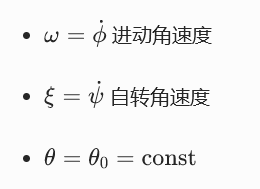

**教材**：高等教育出版社《朗道理论物理教程 卷1 力学》+《朗道〈力学〉解读》
**标注**：🔴 必考推导 | 🟡 高频计算 | 🟢 概念简答
# 第1章 运动方程（核心满分章）
### 1.1 基本定义
- **广义坐标**：唯一确定系统位形的独立变量 $q_1,\dots,q_s$
- **自由度**：完整约束 $s=3N-l$
- **力学状态**：由 $\{q,\dot{q}\}$ 完全确定
### 1.2 🔴 最小作用量原理（哈密顿原理）
$$
\delta S=0,\quad S=\int_{t_1}^{t_2}L(q,\dot{q},t)dt
$$
- 边界条件：$\delta q(t_1)=\delta q(t_2)=0$
- $L=T-V$，仅含 $q,\dot{q}$，不含高阶导数
### 1.3 🔴 拉格朗日方程
$$
\frac{d}{dt}\frac{\partial L}{\partial \dot{q}_i}-\frac{\partial L}{\partial q_i}=0
$$
**L 的三大性质**
1. 可加性：无相互作用系统 $L=L_A+L_B$
2. 乘任意常数不改变方程
3. 加全导数 $\dfrac{d}{dt}f(q,t)$ 不改变方程
### 1.4 自由质点拉格朗日函数
$$
L=\frac12mv^2
$$
- 由时空均匀各向同性+伽利略相对性导出
### 1.5 质点系拉格朗日函数
$$
L=\sum\frac12m_av_a^2-U(r_1,\dots,r_N)
$$
- 牛顿方程等价形式：$m_a\ddot{r}_a=-\dfrac{\partial U}{\partial r_a}$
## 二、第2章 守恒定律（高频考点）
### 2.1 🔴 对称性—守恒律对应表
| 对称性 | 守恒量 | 条件 |
|---|---|---|
| 时间均匀性 | 能量 $E$ | $\partial L/\partial t=0$ |
| 空间均匀性 | 动量 $\vec{P}$ | $\partial L/\partial \vec{r}=0$ |
| 空间各向同性 | 角动量 $\vec{M}$ | $\partial L/\partial \vec{\varphi}=0$ |
### 2.2 哈密顿函数
$$
H=\sum p_i\dot{q}_i-L,\quad p_i=\frac{\partial L}{\partial \dot{q}_i}
$$
- 定常约束：$H=T+V=E$
- 非定常约束：$H\neq E$
## 三、第3~5章 有心力场、小振动、刚体（计算主力）
### 3.1 🟡 有心力场
- 运动在平面内，角动量守恒
- 有效势能：$U_\text{eff}(r)=U(r)+\dfrac{M^2}{2mr^2}$
### 3.2 🟡 小振动
- 拉格朗日：$L=\frac12\sum a_{ik}\dot{q}_i\dot{q}_k-\frac12\sum k_{ik}q_iq_k$
- 本征频率：$|\omega^2a-k|=0$
### 3.3 🟡 刚体运动
- 欧拉方程：$I\dot{\vec{\Omega}}+\vec{\Omega}\times(I\vec{\Omega})=\vec{M}$
- 对称陀螺：进动–自转关系
## 四、第7章 哈密顿力学（压轴推导）
### 4.1 🔴 哈密顿正则方程
$$
\dot{q}_i=\frac{\partial H}{\partial p_i},\quad \dot{p}_i=-\frac{\partial H}{\partial q_i}
$$
### 4.2 🔴 勒让德变换步骤
1. 广义动量：$p_i=\dfrac{\partial L}{\partial \dot{q}_i}$
2. 解出：$\dot{q}_i=\dot{q}_i(q,p)$
3. 哈密顿量：$H=p\dot{q}-L$
### 4.3 作用量变量
$$
J=\oint p dq
$$
- 绝热不变量，对应旧量子论量子化条件
### 🔴 期末必背8道原题
1. **最小作用量原理→拉格朗日方程→哈密顿正则方程**
2. **一维谐振子：Lagrange + Hamilton 双解法**
3. **中心力场 $V(r)$：写 $L$、$H$、有效势能**
4. **带电粒子在磁场中**：$L=\frac12m\dot{x}^2+qA\dot{x}\Rightarrow H=\dfrac{(p-qA)^2}{2m}$
5. **对称陀螺**：$\omega,\xi,\theta_0$ 关系
6. **斜面–弹簧–滑块系统**：写 $L$、运动方程、振动频率
7. **杆下滑脱离墙面**：Lagrange+能量守恒求临界角
8. **索末菲量子化**：氢原子轨道与能量量子化
## 朗道《力学》期末 8 道必背题
---
## 1️⃣ 最小作用量原理 ⇒ 拉格朗日方程 ⇒ 哈密顿正则方程
### （1）最小作用量原理
$$
\delta S=0,\quad S=\int_{t_1}^{t_2}L(q,\dot{q},t)dt,\quad \delta q(t_1)=\delta q(t_2)=0
$$
### （2）推导拉格朗日方程
$$
\delta S=\int\left(\frac{\partial L}{\partial q}\delta q+\frac{\partial L}{\partial\dot{q}}\delta\dot{q}\right)dt
=\left.\frac{\partial L}{\partial\dot{q}}\delta q\right|_{t_1}^{t_2}+\int\left(\frac{\partial L}{\partial q}-\frac{d}{dt}\frac{\partial L}{\partial\dot{q}}\right)\delta qdt=0
$$
$$
\Rightarrow\quad \frac{d}{dt}\frac{\partial L}{\partial\dot{q}_i}-\frac{\partial L}{\partial q_i}=0
$$
### （3）推导哈密顿正则方程
定义：
$$
p_i=\frac{\partial L}{\partial\dot{q}_i},\quad H=\sum p_i\dot{q}_i-L
$$
全微分：
$$
dH=\sum\dot{q}_idp_i-\sum\frac{\partial L}{\partial q_i}dq_i-\frac{\partial L}{\partial t}dt
$$
对比：
$$
dH=\sum\frac{\partial H}{\partial q_i}dq_i+\sum\frac{\partial H}{\partial p_i}dp_i+\frac{\partial H}{\partial t}dt
$$
得：
$$
\dot{q}_i=\frac{\partial H}{\partial p_i},\quad \dot{p}_i=-\frac{\partial H}{\partial q_i}
$$
---
## 2️⃣ 一维谐振子：Lagrange + Hamilton 双解
$$
T=\frac12m\dot{x}^2,\quad V=\frac12m\omega^2x^2,\quad \omega=\sqrt{\frac km}
$$
### Lagrange
$$
L=\frac12m\dot{x}^2-\frac12m\omega^2x^2
$$
$$
\frac{d}{dt}\frac{\partial L}{\partial\dot{x}}-\frac{\partial L}{\partial x}=0
\Rightarrow m\ddot{x}+m\omega^2x=0
\Rightarrow \ddot{x}+\omega^2x=0
$$
### Hamilton
$$
p=\frac{\partial L}{\partial\dot{x}}=m\dot{x}
$$
$$
H=p\dot{x}-L=\frac{p^2}{2m}+\frac12m\omega^2x^2
$$
$$
\dot{x}=\frac{\partial H}{\partial p}=\frac{p}{m},\quad \dot{p}=-\frac{\partial H}{\partial x}=-m\omega^2x
$$
$$
\Rightarrow \ddot{x}+\omega^2x=0
$$
---
## 3️⃣ 中心力场 \(V(r)\)：写 \(L\)、\(H\)、有效势能
平面运动：
$$
L=\frac12m(\dot{r}^2+r^2\dot{\phi}^2)-V(r)
$$
$$
p_r=\frac{\partial L}{\partial\dot{r}}=m\dot{r},\quad p_\phi=\frac{\partial L}{\partial\dot{\phi}}=mr^2\dot{\phi}=M=\text{const}
$$
$$
H=\frac{p_r^2}{2m}+\frac{p_\phi^2}{2mr^2}+V(r)
$$
**有效势能**：
$$
U_\text{eff}(r)=V(r)+\frac{M^2}{2mr^2}
$$
---
## 4️⃣ 带电粒子在磁场中：$$L\Rightarrow H$$
已知：
$$
L=\frac12m\dot{x}^2+qA(x)\dot{x}
$$

1. 广义动量
$$
p=\frac{\partial L}{\partial\dot{x}}=m\dot{x}+qA
$$

2. 解速度
$$
\dot{x}=\frac{p-qA}{m}
$$

3. 哈密顿量
$$
H=p\dot{x}-L=\frac{(p-qA(x))^2}{2m}
$$
---
## 5️⃣ 对称陀螺：$$\omega,\xi,\theta_0\ $$关系

角动量守恒：
$$
I_3(\omega\cos\theta_0+\xi)=I_1\omega\cos\theta_0
$$
整理：
$$
(I_1-I_3)\omega\cos\theta_0=I_3\xi
$$
## 6️⃣ 斜面–弹簧–滑块系统（无摩擦）
广义坐标：\(X\)（斜面位移），\(x\)（滑块相对斜面位移）

### （1）拉格朗日量
$$
L=\frac12(M+m)\dot{X}^2+\frac12m\dot{x}^2+m\dot{X}\dot{x}\cos\alpha
-\frac12kx^2+mgx\sin\alpha
$$

### （2）运动方程
$$
(M+m)\ddot{X}+m\ddot{x}\cos\alpha=0
$$
$$
m\ddot{x}+m\ddot{X}\cos\alpha+kx=mg\sin\alpha
$$

### （3）振动频率
$$
\omega=\sqrt{\frac{k(M+m)}{m(M+m\sin^2\alpha)}}
$$
## 7️⃣ 杆下滑脱离墙面（光滑）
脱离条件：墙面支持力 \(N_x=0\Rightarrow \ddot{x}_c=0\)

广义坐标：杆与水平面夹角 \(\alpha\)

### 能量守恒
$$
\frac16ML^2\dot{\alpha}^2+\frac12MgL\sin\alpha
=\frac12MgL\sin\alpha_0
$$
$$
\dot{\alpha}^2=\frac{3g}{L}(\sin\alpha_0-\sin\alpha)
$$

### 角加速度
$$
\ddot{\alpha}=-\frac{3g}{2L}\cos\alpha
$$

### 临界条件
$$
\cos\alpha\cdot\dot{\alpha}^2+\sin\alpha\cdot\ddot{\alpha}=0
$$
得：
$$
\sin\alpha=\frac23\sin\alpha_0
$$
## 8️⃣ 氢原子：索末菲量子化
### 1）向心力
$$
\frac{mv^2}{r}=\frac{e^2}{r^2}
$$

### 2）量子化条件
$$
\oint p_\phi d\phi=nh\Rightarrow L=mvr=n\hbar
$$

### 3）轨道半径
$$
r_n=\frac{n^2\hbar^2}{me^2}=n^2a_0
$$

### 4）能量量子化
$$
E_n=-\frac{me^4}{2\hbar^2n^2}=-\frac{R_H}{n^2}
$$
# 快速记忆对照表

| 体系 | 变量 | 方程阶数 | 核心公式 |
|---|---|---|---|
| 拉格朗日 | $q,\dot{q}$ | 二阶 | $L=T-V,\ \delta S=0$ |
| 哈密顿 | $q,p$ | 一阶 | $H=p\dot{q}-L$ |

---
# 第二章 守恒定律
## 一、核心框架：三大公理 → 两套方程
### 1. 最小作用量原理（🔴 必考推导）
$$
\delta S=0,\quad S=\int_{t_1}^{t_2}L(q,\dot{q},t)dt,\quad \delta q(t_1)=\delta q(t_2)=0
$$
$$
L=T-V
$$
### 2. 拉格朗日方程（🔴 必考）
$$
\frac{d}{dt}\frac{\partial L}{\partial\dot{q}_i}-\frac{\partial L}{\partial q_i}=0
$$
### 3. 哈密顿正则方程（🔴 必考）
$$
\dot{q}_i=\frac{\partial H}{\partial p_i},\quad \dot{p}_i=-\frac{\partial H}{\partial q_i},\quad H=\sum p_i\dot{q}_i-L
$$
## 二、对称性—守恒律对照表（🔴 必考）
| 对称性 | 守恒量 | 条件 |
|---|---|---|
| 时间均匀性 | 能量 $E$ | $\partial L/\partial t=0$ |
| 空间均匀性 | 动量 $\vec{P}$ | $\partial L/\partial\vec{r}=0$ |
| 空间各向同性 | 角动量 $\vec{M}$ | $\partial L/\partial\vec{\varphi}=0$ |
## 三、第1章 运动方程·高频考点
1. **广义坐标/自由度**：唯一确定位形的独立变量
2. **L 的三大性质**
    - 可加性
    - 乘常数不改变方程
    - 加全导数 $df(q,t)/dt$ 不改变方程
3. **自由质点**：$L=\frac12mv^2$
## 四、第2章 守恒定律·核心结论
1. **能量**
    $$
    E=\sum\dot{q}_i\frac{\partial L}{\partial\dot{q}_i}-L=T+U\quad(\text{定常约束})
    $$
2. **动量**
    $$
    \vec{P}=\sum\frac{\partial L}{\partial\vec{v}_a},\quad \dot{\vec{P}}=0
    $$
3. **角动量**
    $$
    \vec{M}=\sum\vec{r}_a\times\vec{p}_a,\quad \dot{\vec{M}}=0
    $$
4. **质心**：匀速直线运动
5. **位力定理**（🟡 高频）
    $$
    2\overline{T}=k\overline{U}
    $$
## 五、第3–5章 有心力场、小振动、刚体
1. **有心力场**
    - 平面运动 + 角动量守恒
    - 有效势能：$U_\text{eff}=U(r)+\dfrac{M^2}{2mr^2}$
2. **小振动**
    - 本征频率：$|\omega^2a-k|=0$
3. **刚体**
    - 欧拉方程
    - 对称陀螺：$\omega,\xi,\theta_0$ 关系（🟡）
## 六、第7章 哈密顿力学·压轴
1. **勒让德变换三步**
    1. $p_i=\partial L/\partial\dot{q}_i$
    2. 解 $\dot{q}_i(q,p)$
    3. $H=p\dot{q}-L$
2. **作用量变量**
    $$
    J=\oint p dq
    $$
# 🔴 期末必背 8 题（一页默写版）
## 1. 最小作用量→拉格朗日→哈密顿
$$
\delta S=0\Rightarrow \frac{d}{dt}\frac{\partial L}{\partial\dot{q}}-\frac{\partial L}{\partial q}=0
$$
$$
p=\frac{\partial L}{\partial\dot{q}},\quad H=p\dot{q}-L\Rightarrow \dot{q}=\frac{\partial H}{\partial p},\dot{p}=-\frac{\partial H}{\partial q}
$$

## 2. 一维谐振子
$$
L=\frac12m\dot{x}^2-\frac12m\omega^2x^2,\quad \ddot{x}+\omega^2x=0
$$
$$
H=\frac{p^2}{2m}+\frac12m\omega^2x^2
$$

## 3. 中心力场 $V(r)$
$$
L=\frac12m(\dot{r}^2+r^2\dot{\phi}^2)-V(r),\quad U_\text{eff}=V+\frac{M^2}{2mr^2}
$$

## 4. 带电粒子在磁场中
$$
L=\frac12m\dot{x}^2+qA\dot{x}\Rightarrow H=\frac{(p-qA)^2}{2m}
$$

## 5. 对称陀螺
$$
(I_1-I_3)\omega\cos\theta_0=I_3\xi
$$

## 6. 斜面–弹簧–滑块
$$
L=\frac12(M+m)\dot{X}^2+\frac12m\dot{x}^2+m\dot{X}\dot{x}\cos\alpha-\frac12kx^2+mgx\sin\alpha
$$
$$
\omega=\sqrt{\frac{k(M+m)}{m(M+m\sin^2\alpha)}}
$$

## 7. 杆脱离墙面
$$
\sin\alpha=\frac23\sin\alpha_0
$$

## 8. 氢原子索末菲量子化
$$
r_n=\frac{n^2\hbar^2}{me^2},\quad E_n=-\frac{me^4}{2\hbar^2n^2}
$$

---

# ✅ 课本指定习题·详细解答（朗道原版）
## 1. §15 习题 2（有心力场：轨道与周期）
**题意**：质点在势场 $U=-\frac{\alpha}{r}$ 中运动，已知角动量 $M$，求轨道方程与周期。

**解**
有效势能：
$$
U_\text{eff}=-\frac{\alpha}{r}+\frac{M^2}{2mr^2}
$$
比耐变量 $u=1/r$，轨道方程：
$$
\frac{d^2u}{d\phi^2}+u=\frac{m\alpha}{M^2}
$$
通解：
$$
u=\frac{m\alpha}{M^2}(1+e\cos\phi)
$$
轨道：圆锥曲线
$$
r=\frac{p}{1+e\cos\phi},\quad p=\frac{M^2}{m\alpha}
$$
椭圆周期（开普勒第三定律）：
$$
T^2=\frac{4\pi^2m}{\alpha}a^3
$$

---

## 2. §18 习题 4（两体问题：约化质量）
**题意**：两体系统，求相对运动方程。

**解**
质心坐标：
$$
\vec{R}=\frac{m_1\vec{r}_1+m_2\vec{r}_2}{m_1+m_2}
$$
相对坐标：
$$
\vec{r}=\vec{r}_2-\vec{r}_1
$$
约化质量：
$$
\mu=\frac{m_1m_2}{m_1+m_2}
$$
相对运动方程：
$$
\mu\ddot{\vec{r}}=-\frac{\partial U}{\partial\vec{r}}
$$
总能量：
$$
E=\frac12(m_1+m_2)\dot{\vec{R}}^2+\frac12\mu\dot{\vec{r}}^2+U(r)
$$

---

## 3. §21 习题 4（耦合振动：简正模）
**题意**：双摆小振动，求频率。

**解**
拉格朗日量：
$$
L=\frac12(m_1+m_2)l_1^2\dot{\varphi}_1^2+\frac12m_2l_2^2\dot{\varphi}_2^2+m_2l_1l_2\dot{\varphi}_1\dot{\varphi}_2-(m_1+m_2)gl_1\frac{\varphi_1^2}{2}-m_2gl_2\frac{\varphi_2^2}{2}
$$
简正频率满足：
$$
\begin{vmatrix}
(m_1+m_2)l_1^2\omega^2-(m_1+m_2)gl_1 & m_2l_1l_2\omega^2 \\
m_2l_1l_2\omega^2 & m_2l_2^2\omega^2-m_2gl_2
\end{vmatrix}=0
$$

---

## 4. §24 习题 2（散射：偏转角）
**题意**：势场 $U=\frac{\alpha}{r}$ 排斥散射，求偏转角。

**解**
瞄准距离 $\rho$，角动量 $M=m\rho v_\infty$
轨道方程：双曲线
偏转角：
$$
\cot\frac{\theta}{2}=\frac{Mv_\infty}{\alpha}
$$
$$
\theta=2\arccos\left(\frac{1}{\sqrt{1+\left(\frac{m\rho v_\infty^2}{\alpha}\right)^2}}\right)
$$

---

要不要我把这份提纲**再压缩成「考前5分钟速背版」**，只留公式和关键词？