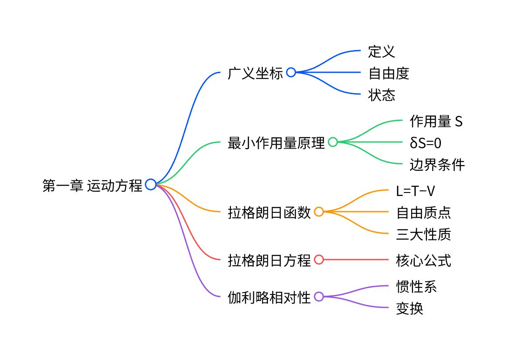

**教材**：高等教育出版社《朗道理论物理教程 卷1 力学》+《朗道〈力学〉解读》
**标注**：🔴 必考推导 | 🟡 核心概念 | ✅ 押题重点（来自考点整理）
# 朗道《力学》第一章 运动方程 

## 一、本章核心框架（一句话）
**广义坐标 → 拉格朗日函数 L → 最小作用量原理 → 拉格朗日方程**
## 二、必背核心定义（🟡 概念题）
1. **广义坐标**
唯一确定系统位形的**独立变量**，记为 $q_1,q_2,…,q_s$
2. **自由度**
完整约束：$s=3N-l$
3. **力学状态**
由 $\{q,\dot{q}\}$ **完全确定**
## 三、最小作用量原理（🔴 必考推导）
作用量：
$$
S=\int_{t_1}^{t_2}L(q,\dot{q},t)dt
$$
原理：**真实运动使作用量取极值**
$$
\delta S=0
$$
边界条件：
$$
\delta q(t_1)=\delta q(t_2)=0
$$
## 四、拉格朗日方程（🔴 必考）
$$
\frac{d}{dt}\frac{\partial L}{\partial\dot{q}_i}-\frac{\partial L}{\partial q_i}=0
$$
## 五、拉格朗日函数 L（🟡 必背）
1. **定义**
$$
L=T-V
$$
2. **自由质点**
$$
L=\frac{1}{2}mv^2
$$
3. **质点系**
$$
L=\sum\frac{1}{2}m_av_a^2-U(r_1,…,r_N)
$$
## 六、L 的三大性质（🟡 简答）
1. **可加性**：无相互作用系统 $L=L_A+L_B$
2. **乘任意常数**：不改变运动方程
3. **加全导数**：$L'=L+\dfrac{df(q,t)}{dt}$，方程不变
## 七、伽利略相对性原理（🟡）
- 惯性系：时空**均匀、各向同性**
- 伽利略变换：
$$
r=r'+Vt,\quad t=t'
$$
- 规律：**力学规律在所有惯性系中相同**
## 八、✅ 押题重点（来自考点整理·必考）
### 1. 最小作用量原理 ⇒ 拉格朗日方程（完整默写）
$$
\delta S=\int\left(\frac{\partial L}{\partial q}\delta q+\frac{\partial L}{\partial\dot{q}}\delta\dot{q}\right)dt=0
$$
$$
\delta\dot{q}=\frac{d}{dt}\delta q
$$
分部积分 + 边界条件 $\delta q=0$：
$$
\int\left(\frac{\partial L}{\partial q}-\frac{d}{dt}\frac{\partial L}{\partial\dot{q}}\right)\delta qdt=0
$$
得：
$$
\frac{d}{dt}\frac{\partial L}{\partial\dot{q}}-\frac{\partial L}{\partial q}=0
$$
## 九、✅ 押题重点（来自考点整理·原题级）
### 1. 一维谐振子（Lagrange + Hamilton）
$$
T=\frac12m\dot{x}^2,\quad V=\frac12m\omega^2x^2
$$
$$
L=\frac12m\dot{x}^2-\frac12m\omega^2x^2
$$
代入方程：
$$
\ddot{x}+\omega^2x=0
$$
## 十、⭐ 第一章 习题详解（朗道+解读）
### 习题1 平面双摆
广义坐标：$\varphi_1,\varphi_2$
$$
\begin{aligned}
L=&\frac12(m_1+m_2)l_1^2\dot{\varphi}_1^2+\frac12m_2l_2^2\dot{\varphi}_2^2\\
&+m_2l_1l_2\dot{\varphi}_1\dot{\varphi}_2\cos(\varphi_1-\varphi_2)\\
&+(m_1+m_2)gl_1\cos\varphi_1+m_2gl_2\cos\varphi_2
\end{aligned}
$$
### 习题2 悬挂点可动单摆
$$
L=\frac12(m_1+m_2)\dot{x}^2+\frac12m_2(l^2\dot{\varphi}^2+2l\dot{x}\dot{\varphi}\cos\varphi)+m_2gl\cos\varphi
$$
### 习题3 悬挂点做周期运动
a) 圆周运动
$$
L=\frac12ml^2\dot{\varphi}^2+mla\gamma^2\sin(\varphi-\gamma t)+mgl\cos\varphi
$$
b) 水平振动
$$
L=\frac12ml^2\dot{\varphi}^2+mla\gamma^2\cos\gamma t\sin\varphi+mgl\cos\varphi
$$
c) 竖直振动
$$
L=\frac12ml^2\dot{\varphi}^2+mla\gamma^2\cos\gamma t\cos\varphi+mgl\cos\varphi
$$
### 习题4 旋转对称系统
$$
L=(m_1+2m_2\sin^2\theta)a^2\dot{\theta}^2+m_1a^2\Omega^2\sin^2\theta+2ga(m_1+m_2)\cos\theta
$$
## 十一、本章考试万能解题步骤
1. 选广义坐标 $q$
2. 写动能 $T$、势能 $V$
3. 构造 $$L=T-V$$
4. 代入拉格朗日方程
5. 化简得运动微分方程
## 十二、快速对照表

| 内容 | 公式 |
|---|---|
| 作用量 | $S=\int Ldt$ |
| 最小作用量 | $\delta S=0$ |
| 拉格朗日方程 | $\dfrac{d}{dt}\dfrac{\partial L}{\partial\dot{q}}-\dfrac{\partial L}{\partial q}=0$ |
| 拉格朗日函数 | $L=T-V$ |
| 自由质点 L | $L=\dfrac12mv^2$ |

---
# 朗道《力学》第二章 守恒定律

## 一、本章完整知识框架

## 二、对称性—守恒律 必考对照表（直接背诵）
| 时空对称性 | 守恒物理量 | 判定条件（$L$ 不显含） | 核心方程 |
|---|---|---|---|
| 时间均匀性 | 能量 $E$ | 时间 $t$ | $\dfrac{dE}{dt}=0$ |
| 空间均匀性 | 动量 $\vec{P}$ | 坐标 $\vec{r}$ | $\dfrac{d\vec{P}}{dt}=0$ |
| 空间各向同性 | 角动量 $\vec{M}$ | 转角 $\varphi$ | $\dfrac{d\vec{M}}{dt}=0$ |
## 三、§6 能量守恒（🔴必考）
### 1. 能量的定义
$$
E=\sum_{i}\dot{q}_i\frac{\partial L}{\partial\dot{q}_i}-L
$$
### 2. 定常约束（坐标变换不显含 $t$）
动能是广义速度的**二次齐次函数**，由欧拉定理：
$$
\sum_{i}\dot{q}_i\frac{\partial L}{\partial\dot{q}_i}=2T
$$
因此：
$$
E=T+U
$$
### 3. 守恒条件
$L$ 不显含时间 $t$ ⇒ $E=\text{常数}$
### 4. 非定常约束
$T=T_0+T_1+T_2$，此时 $E=T_2-T_0+U$（**广义能量守恒**）
## 四、§7 动量守恒（🔴必考）
### 1. 系统总动量
$$
\vec{P}=\sum_a \frac{\partial L}{\partial\vec{v}_a}=\sum_a m_a\vec{v}_a
$$
### 2. 广义动量
$$
p_i=\frac{\partial L}{\partial\dot{q}_i}
$$
### 3. 守恒定律
- 封闭系统：$\vec{P}=\text{常矢量}$
- 某方向 $L$ 不含对应坐标：该方向动量分量守恒
### 4. 物理意义
封闭系统内力之和为零：$\sum \vec{F}_a=0$（牛顿第三定律）
## 五、§8 质心（🟡高频考点）
### 1. 质心位矢
$$
\vec{R}=\frac{\sum m_a\vec{r}_a}{\sum m_a}
$$
### 2. 质心速度
$$
\vec{V}=\dot{\vec{R}}=\frac{\vec{P}}{\sum m_a}
$$
### 3. 核心定理
**封闭系统的质心做匀速直线运动**
### 4. 能量分解
$$
E=\frac12\mu V^2+E_{\text{int}}
$$
$\mu=\sum m_a$ 为总质量，$E_{\text{int}}$ 为内能（相对运动能量）
## 六、§9 角动量守恒（🔴必考）
### 1. 角动量定义
$$
\vec{M}=\sum_a \vec{r}_a\times\vec{p}_a
$$
### 2. 柱坐标分量（常用）
$$
M_x=m\sin\varphi(r\dot{z}-z\dot{r})-mrz\dot{\varphi}\cos\varphi
$$
$$
M_y=m\cos\varphi(z\dot{r}-r\dot{z})-mrz\dot{\varphi}\sin\varphi
$$
$$
M_z=mr^2\dot{\varphi}
$$
### 3. 球坐标分量
$$
M_z=mr^2\sin^2\theta\,\dot{\varphi}
$$
$$
M^2=m^2r^4\left(\dot{\theta}^2+\sin^2\theta\,\dot{\varphi}^2\right)
$$
### 4. 守恒条件
- 有心力场 $U=U(r)$ ⇒ $\vec{M}=\text{常矢量}$
- 场具有对称轴 ⇒ 该轴上角动量分量守恒
### 5. 角动量变换关系
原点平移 $\vec{a}$：
$$
\vec{M}=\vec{M}\,'+\vec{a}\times\vec{P}
$$
## 七、§10 力学相似性与位力定理（✅押题重点）
### 1. 齐次势能
$$
U(\alpha\vec{r}_1,\dots,\alpha\vec{r}_n)=\alpha^k U
$$

### 2. 标度关系
$$
\frac{t'}{t}=\left(\frac{l'}{l}\right)^{1-k/2}
$$

### 3. 位力定理（🔴必考推导）
有限运动、有界系统：
$$
2\overline{T}=\sum_a\overline{\vec{r}_a\cdot\frac{\partial U}{\partial\vec{r}_a}}
$$
若 $U$ 为 $k$ 次齐次函数：
$$
2\overline{T}=k\overline{U}
$$
### 4. 典型特例
- 谐振子 $k=2$：$\overline{T}=\overline{U}$
- 库仑/引力场 $k=-1$：$2\overline{T}=-\overline{U}$
# ✅ 考点整理标注：本章押题重点
1. **由时空对称性推导能量、动量、角动量守恒**
2. **位力定理的推导与应用**
3. **有心力场中角动量守恒 + 有效势能**
4. **质心运动定理与能量分解**
5. **柱/球坐标下角动量分量计算**
# ⭐ 本章教材习题详解（朗道原书+解读）
## 习题1 质点穿越势能分界面
已知：势能从 $U_1\to U_2$，分界面为平面
- 切向动量守恒：
$$
v_1\sin\theta_1=v_2\sin\theta_2
$$
- 能量守恒：
$$
\frac12mv_1^2+U_1=\frac12mv_2^2+U_2
$$
- 偏折关系：
$$
\frac{\sin\theta_1}{\sin\theta_2}=\sqrt{1+\frac{2}{mv_1^2}(U_1-U_2)}
$$
## 习题2 柱坐标表示角动量
$$
M_x=m\sin\varphi(r\dot{z}-z\dot{r})-mrz\dot{\varphi}\cos\varphi
$$
$$
M_y=m\cos\varphi(z\dot{r}-r\dot{z})-mrz\dot{\varphi}\sin\varphi
$$
$$
M_z=mr^2\dot{\varphi}
$$
## 习题3 不同场中守恒分量
- 无限大平面场：$P_x,P_y,M_z$ 守恒
- 无限长圆柱场：$P_z,M_z$ 守恒
- 均匀圆锥/圆环场：$M_z$ 守恒
- 螺旋场：$P_z\dfrac{h}{2\pi}+M_z=\text{常数}$
## 习题4 作用量变换关系
$$
S=S'+\mu V\cdot\vec{R}\,'+\frac12\mu V^2 t
$$
# 🔴 必背精简公式（考前5分钟版）
1. 能量：$E=\sum\dot{q}\dfrac{\partial L}{\partial\dot{q}}-L=T+U$
2. 动量：$\vec{P}=\sum m_a\vec{v}_a$
3. 角动量：$\vec{M}=\sum\vec{r}\times\vec{p}$
4. 质心：$\vec{R}=\dfrac{\sum m_a\vec{r}_a}{\sum m_a}$
5. 位力定理：$2\overline{T}=k\overline{U}$
