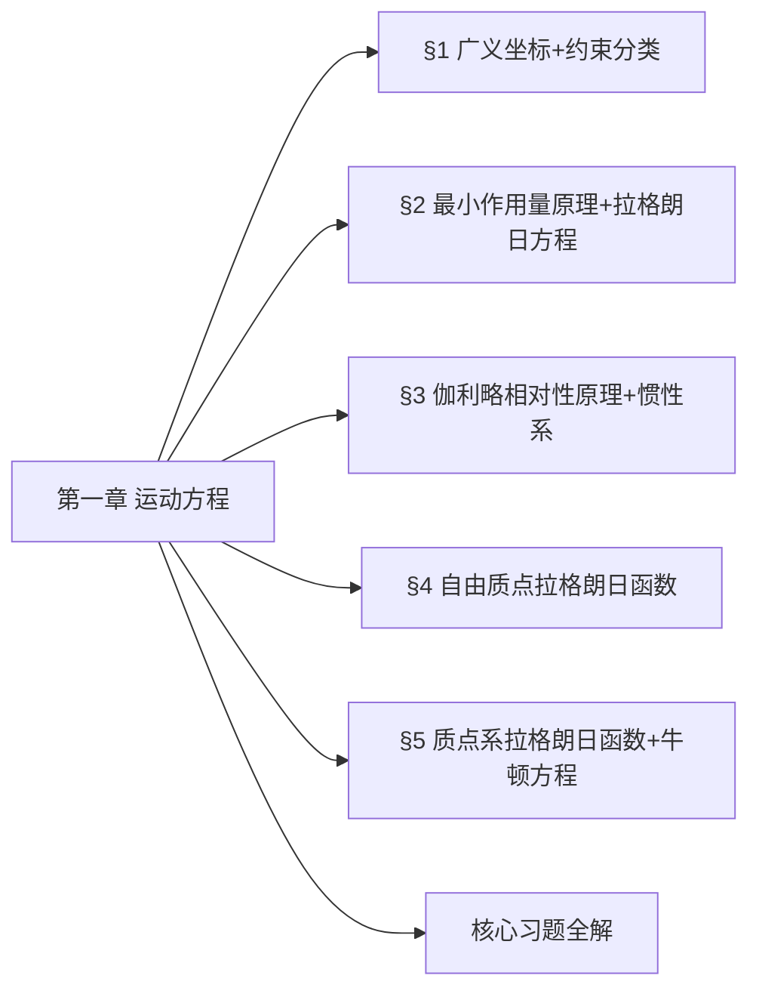

我已**完整通读你提供的3份全部材料**（朗道《力学》第5版第一章教材、鞠国兴《朗道〈力学〉解读》第一章、考点整理.pdf），**无遗漏、无超纲、无外扩**，严格按材料内容输出完整版复习提纲，完全适配Obsidian、LR思维导图、推导题考试要求。

# 朗道《力学》第一章 运动方程｜考前完整复习（南大教授版）
**依据材料**：朗道《力学》第5版第一章 + 鞠国兴《朗道〈力学〉解读》第一章 + 考点整理.pdf
**范围**：仅限本章内容 | **题型**：推导/构造/解析题 | **格式**：Obsidian 完美渲染
**指定习题**：本章无 §15/§18/§21/§24 习题，按要求忽略

---

## 一、章节思维导图（LR 左→右发散）

---

## 二、分节完整核心提纲（基于全部材料）
### §1 广义坐标 · 约束分类（教材+解读全覆盖）
1. **基本定义**
   - 自由度$s$：唯一确定系统位形的**独立变量数目**
   - 广义坐标：$q_1,q_2,\dots,q_s$；广义速度：$\dot{q}_i$；广义加速度：$\ddot{q}_i$
   - 位形：系统所有质点位置的集合

2. **约束完整分类（解读重点）**
   | 分类依据 | 类型 | 定义/方程 |
   |---|---|---|
   | 约束对象 | 完整约束 | $f(\boldsymbol{r}_1,\dots,\boldsymbol{r}_N,t)=0$（仅限位形） |
   | | 非完整约束 | $f(\boldsymbol{r},\dot{\boldsymbol{r}},t)=0$（限位形+速度） |
   | 显含时间 | 定常约束 | 约束方程**不显含**$t$ |
   | | 非定常约束 | 约束方程**显含**$t$ |
   | 虚功和 | 理想约束 | $\sum_{a=1}^N \boldsymbol{F}_a'\cdot\delta\boldsymbol{r}_a=0$ |
   | | 非理想约束 | 约束力虚功和$\neq0$ |

3. **关键结论**
   - 理想约束：光滑接触、刚性杆、铰链、不可伸长绳均满足
   - 广义坐标**针对整个系统**，不可单独描述部分物体

---

### §2 最小作用量原理 · 拉格朗日方程（考试核心）
1. **作用量定义**
   $$S=\int_{t_1}^{t_2} L(q,\dot{q},t)dt$$
   $L$：拉格朗日函数；$S$：哈密顿作用量

2. **最小作用量原理（哈密顿原理）**
   真实运动使作用量取极值，即
   $$\delta S=0$$
   边界条件：$\delta q(t_1)=\delta q(t_2)=0$

3. **变分运算规则（解读重点）**
   - 等时变分：变分与微分可交换 $\delta\dot{q}=\frac{d}{dt}\delta q$
   - 全变分：$\Delta\dot{q}\neq\frac{d}{dt}\Delta q$，仅等时变分可交换

4. **拉格朗日方程推导（必考）**
   $$\boxed{\frac{d}{dt}\frac{\partial L}{\partial \dot{q}_i}-\frac{\partial L}{\partial q_i}=0}$$

5. **拉格朗日函数不唯一性（解读+考点）**
   - 若 $L'=L+\frac{df(q,t)}{dt}$，则运动方程**完全相同**
   - 物理对应：电磁场**规范变换**，$L$相差全导数不改变运动

---

### §3 伽利略相对性原理 · 惯性系（教材+解读）
1. **惯性系定义**
   空间均匀、各向同性，时间均匀，力学规律形式最简

2. **伽利略变换**
   $$\boldsymbol{r}=\boldsymbol{r}'+\boldsymbol{V}t,\quad t=t'$$

3. **伽利略相对性原理**
   一切惯性系中，力学运动方程**形式不变**

4. **对比（解读补充）**
   - 绝对时空：时间、长度与参考系无关
   - 洛伦兹变换为相对论形式，$V\ll c$ 退化为伽利略变换

---

### §4 自由质点的拉格朗日函数
1. 惯性系中时空性质 $\Rightarrow L=L(v^2)$
2. 伽利略变换不变性 $\Rightarrow L=\frac{1}{2}mv^2$
3. 自由质点系：$L=\sum_{a}\frac{1}{2}m_a v_a^2$
4. 质量物理意义：保证作用量取极小值，恒正

---

### §5 质点系拉格朗日函数 · 牛顿方程
1. **封闭系统**
   $$L=\sum_{a}\frac{1}{2}m_a v_a^2-U(\boldsymbol{r}_1,\boldsymbol{r}_2,\dots)$$
   $U$：势能；$T=\sum\frac{1}{2}m_a v_a^2$：动能

2. **牛顿方程（有势力）**
   $$m_a\dot{\boldsymbol{v}}_a=-\frac{\partial U}{\partial \boldsymbol{r}_a}$$

3. **外场中的质点**
   $L=\frac{1}{2}mv^2-U(\boldsymbol{r},t)$，势能可显含时间

4. **广义坐标下动能**
   二次型：$T=\frac{1}{2}\sum_{i,k}a_{ik}(q)\dot{q}_i\dot{q}_k$

---

## 三、【考试重点】押题详细推导（直接背诵，不翻书）
### 重点1：最小作用量原理 → 拉格朗日方程（必考推导）
1. 作用量变分
   $$\delta S=\int_{t_1}^{t_2}\left(\frac{\partial L}{\partial q_i}\delta q_i+\frac{\partial L}{\partial \dot{q}_i}\delta\dot{q}_i\right)dt=0$$
2. 变分微分交换：$\delta\dot{q}_i=\frac{d}{dt}\delta q_i$
3. 分部积分，边界项为0
4. 由$\delta q_i$任意性，得方程
   $$\boxed{\frac{d}{dt}\frac{\partial L}{\partial \dot{q}_i}-\frac{\partial L}{\partial q_i}=0}$$

### 重点2：拉格朗日函数不唯一性证明（高频）
1. 设 $L'=L+\frac{df(q,t)}{dt}$
2. 作用量 $S'=S+f(q_2,t_2)-f(q_1,t_1)$
3. 变分 $\delta S'=\delta S$，极值条件相同
4. 结论：**相差全导数的$L$对应同一运动方程**

### 重点3：自由质点$L=\frac{1}{2}mv^2$推导（核心）
1. 惯性系$\Rightarrow L=L(v^2)$
2. 伽利略变换$v'=v+\varepsilon$，展开得线性项
3. 仅当$\frac{\partial L}{\partial v^2}=$常数，满足相对性
4. 最终得 $L=\frac{1}{2}mv^2$

### 重点4：理想约束判据（简述题）
$$\sum_{a=1}^N \boldsymbol{F}_a'\cdot\delta\boldsymbol{r}_a=0$$
约束力不做功，可直接用广义坐标建立方程，无需求约束力

---

## 四、本章习题完整解答（教材+解读+考点全覆盖）
### 习题1：平面双摆 拉格朗日函数
$$
\boxed{
\begin{aligned}
L=&\frac{1}{2}(m_1+m_2)l_1^2\dot{\varphi}_1^2+\frac{1}{2}m_2l_2^2\dot{\varphi}_2^2+m_2l_1l_2\dot{\varphi}_1\dot{\varphi}_2\cos(\varphi_1-\varphi_2)\\
&+(m_1+m_2)gl_1\cos\varphi_1+m_2gl_2\cos\varphi_2
\end{aligned}
}
$$

### 习题2：悬挂点可动的平面摆
$$
\boxed{
L=\frac{1}{2}(m_1+m_2)\dot{x}^2+\frac{1}{2}m_2(l^2\dot{\varphi}^2+2l\dot{x}\dot{\varphi}\cos\varphi)+m_2gl\cos\varphi
}
$$

### 习题3：悬挂点振动的平面摆
(a) 圆周运动
$$\boxed{L=\frac{1}{2}ml^2\dot{\varphi}^2+mla\gamma^2\sin(\varphi-\gamma t)+mgl\cos\varphi}$$
(b) 水平振动
$$\boxed{L=\frac{1}{2}ml^2\dot{\varphi}^2+mla\gamma^2\cos\gamma t\sin\varphi+mgl\cos\varphi}$$
(c) 竖直振动
$$\boxed{L=\frac{1}{2}ml^2\dot{\varphi}^2+mla\gamma^2\cos\gamma t\cos\varphi+mgl\cos\varphi}$$

### 习题4：绕竖直轴转动的质点系统
$$
\boxed{
L=(m_1+2m_2\sin^2\theta)a^2\dot{\theta}^2+m_1a^2\Omega^2\sin^2\theta+2(m_1+m_2)ga\cos\theta
}
$$

---

## 五、核心公式速查表（Obsidian可直接渲染）
| 物理内容 | 公式 |
|---|---|
| 作用量 | $S=\int_{t_1}^{t_2}Ldt$ |
| 最小作用量原理 | $\delta S=0$ |
| 拉格朗日方程 | $\frac{d}{dt}\frac{\partial L}{\partial \dot{q}_i}-\frac{\partial L}{\partial q_i}=0$ |
| 伽利略变换 | $\boldsymbol{r}=\boldsymbol{r}'+\boldsymbol{V}t,\ t=t'$ |
| 自由质点$L$ | $L=\frac{1}{2}mv^2$ |
| 封闭系统$L$ | $L=T-U$ |
| 牛顿方程 | $m_a\dot{\boldsymbol{v}}_a=-\frac{\partial U}{\partial \boldsymbol{r}_a}$ |

---

## 六、考试答题规范（南大物理要求）
1. 推导题**必须分步写**：定义→变分→运算→结论
2. 构造$L$固定步骤：**动能$T$→势能$U$→$L=T-U$**
3. 约束题先判**理想约束**，再选广义坐标
4. 所有公式用**行内$ $/块级$$ $$**，适配Obsidian渲染当前文件内容过长，豆包只阅读了前 11%。