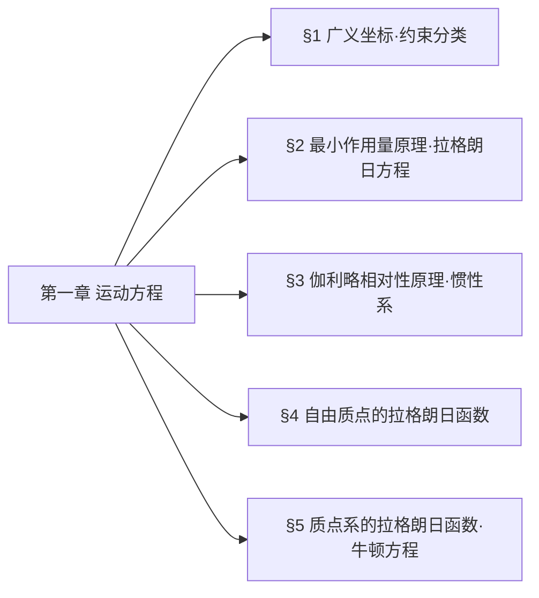

## 一、章节思维导图

## 二、分节极简核心提纲
### §1 广义坐标·约束分类
1. **自由度**：唯一确定系统位形的**独立变量数**，记为 $s$
2. **广义坐标**：$q_1,q_2,\dots,q_s$；广义速度：$\dot{q}_i$；广义加速度：$\ddot{q}_i$
3. **约束分类**
    - 完整约束：仅限制位形 $f(\boldsymbol{r}_a,t)=0$
    - 非完整约束：限制位形+速度 $f(\boldsymbol{r}_a,\dot{\boldsymbol{r}}_a,t)=0$
    - 理想约束：约束力虚功和为零 $\sum \boldsymbol{F}_a'\cdot\delta\boldsymbol{r}_a=0$
### §2 最小作用量原理·拉格朗日方程
1. **作用量**：$S=\int_{t_1}^{t_2} L(q,\dot{q},t)dt$
2. **最小作用量原理**：真实运动满足 $\delta S=0$，边界条件 $\delta q(t_1)=\delta q(t_2)=0$
3. **拉格朗日方程**：$\frac{d}{dt}\frac{\partial L}{\partial \dot{q}_i}-\frac{\partial L}{\partial q_i}=0$
4. **L的不唯一性**：$L'=L+\frac{df(q,t)}{dt}$，运动方程不变
### §3 伽利略相对性原理·惯性系
1. **惯性系**：时空均匀、各向同性，力学规律形式最简
2. **伽利略变换**：$\boldsymbol{r}=\boldsymbol{r}'+\boldsymbol{V}t,\ t=t'$
3. **相对性原理**：惯性系中力学方程形式不变
### §4 自由质点的拉格朗日函数
1. 由时空性质得：$L=L(v^2)$
2. 伽利略变换要求：$L=\frac{1}{2}mv^2$
3. 质点系：$L=\sum \frac{1}{2}m_av_a^2$
### §5 质点系的拉格朗日函数·牛顿方程
1. 封闭系统：$L=\sum \frac{1}{2}m_av_a^2-U(\boldsymbol{r}_1,\boldsymbol{r}_2,\dots)$
2. 牛顿方程：$m_a\dot{\boldsymbol{v}}_a=-\frac{\partial U}{\partial \boldsymbol{r}_a}$
3. 外场中质点：$L=\frac{1}{2}mv^2-U(\boldsymbol{r},t)$
## 三、【考试重点】押题详细推导
### 重点1：最小作用量原理 → 拉格朗日方程（必考推导）
1. 作用量变分
$$\delta S=\delta\int_{t_1}^{t_2}Ldt=\int_{t_1}^{t_2}\left(\frac{\partial L}{\partial q_i}\delta q_i+\frac{\partial L}{\partial \dot{q}_i}\delta\dot{q}_i\right)dt=0$$
2. 变分与微分可交换：$\delta\dot{q}_i=\frac{d}{dt}\delta q_i$
3. 分部积分
$$\int_{t_1}^{t_2}\frac{\partial L}{\partial \dot{q}_i}\frac{d\delta q_i}{dt}dt=\left.\frac{\partial L}{\partial \dot{q}_i}\delta q_i\right|_{t_1}^{t_2}-\int_{t_1}^{t_2}\left(\frac{d}{dt}\frac{\partial L}{\partial \dot{q}_i}\right)\delta q_idt$$
4. 边界条件 $\delta q(t_1)=\delta q(t_2)=0$，边界项为0
5. 由$\delta q_i$任意性，得**拉格朗日方程**
$$\boxed{\frac{d}{dt}\frac{\partial L}{\partial \dot{q}_i}-\frac{\partial L}{\partial q_i}=0}$$
### 重点2：拉格朗日函数不唯一性证明（高频考点）
1. 设 $L'=L+\frac{df(q,t)}{dt}$，作用量
$$S'=\int_{t_1}^{t_2}L'dt=\int_{t_1}^{t_2}Ldt+\int_{t_1}^{t_2}\frac{df}{dt}dt=S+f(q^{(2)},t_2)-f(q^{(1)},t_1)$$
2. 变分后 $\delta S'=\delta S$，故$\delta S'=0$与$\delta S=0$等价
3. 结论：**相差全导数的拉格朗日函数对应相同运动方程**

### 重点3：自由质点拉格朗日函数推导（核心考点）
1. 惯性系中时空均匀各向同性 $\Rightarrow L=L(v^2)$
2. 伽利略变换 $v'=v+\boldsymbol{\varepsilon}$，展开
$$L(v'^2)=L(v^2)+2\frac{\partial L}{\partial v^2}\boldsymbol{v}\cdot\boldsymbol{\varepsilon}$$
3. 仅当$\frac{\partial L}{\partial v^2}=$常数时，第二项为全导数，满足相对性原理
4. 最终得
$$\boxed{L=\frac{1}{2}mv^2}$$

### 重点4：理想约束的物理意义（常考简述）
1. 定义：$\sum_{a=1}^N \boldsymbol{F}_a'\cdot\delta\boldsymbol{r}_a=0$
2. 适用场景：光滑接触、刚性杆、铰链、不可伸长绳
3. 核心作用：**无需考虑约束力，直接用广义坐标建立拉格朗日方程**
## 四、核心公式对照表

| 物理内容 | 公式 |
| :--- | :--- |
| 作用量定义 | $S=\int_{t_1}^{t_2}L(q,\dot{q},t)dt$ |
| 最小作用量原理 | $\delta S=0$ |
| 拉格朗日方程 | $\frac{d}{dt}\frac{\partial L}{\partial \dot{q}_i}-\frac{\partial L}{\partial q_i}=0$ |
| 伽利略变换 | $\boldsymbol{r}=\boldsymbol{r}'+\boldsymbol{V}t,\ t=t'$ |
| 自由质点拉格朗日函数 | $L=\frac{1}{2}mv^2$ |
| 封闭质点系拉格朗日函数 | $L=\sum\frac{1}{2}m_av_a^2-U$ |
| 牛顿方程（有势力） | $m_a\dot{\boldsymbol{v}}_a=-\frac{\partial U}{\partial \boldsymbol{r}_a}$ |
## 五、本章教材习题完整解答（按《朗道〈力学〉解读》）
### 习题1：平面双摆的拉格朗日函数
1. 广义坐标：$\varphi_1,\varphi_2$
2. 动能
$$T=\frac{1}{2}(m_1+m_2)l_1^2\dot{\varphi}_1^2+\frac{1}{2}m_2l_2^2\dot{\varphi}_2^2+m_2l_1l_2\dot{\varphi}_1\dot{\varphi}_2\cos(\varphi_1-\varphi_2)$$
3. 势能
$$U=-(m_1+m_2)gl_1\cos\varphi_1-m_2gl_2\cos\varphi_2$$
4. 拉格朗日函数
$$\boxed{
\begin{aligned}
L=&\frac{1}{2}(m_1+m_2)l_1^2\dot{\varphi}_1^2+\frac{1}{2}m_2l_2^2\dot{\varphi}_2^2+m_2l_1l_2\dot{\varphi}_1\dot{\varphi}_2\cos(\varphi_1-\varphi_2)\\
&+(m_1+m_2)gl_1\cos\varphi_1+m_2gl_2\cos\varphi_2
\end{aligned}
}$$
### 习题2：悬挂点可动的平面摆
1. 广义坐标：$x,\varphi$
2. 动能：$T=\frac{1}{2}(m_1+m_2)\dot{x}^2+\frac{1}{2}m_2(l^2\dot{\varphi}^2+2l\dot{x}\dot{\varphi}\cos\varphi)$
3. 势能：$U=-m_2gl\cos\varphi$
4. 拉格朗日函数
$$\boxed{L=\frac{1}{2}(m_1+m_2)\dot{x}^2+\frac{1}{2}m_2(l^2\dot{\varphi}^2+2l\dot{x}\dot{\varphi}\cos\varphi)+m_2gl\cos\varphi}$$
### 习题3：悬挂点振动的平面摆
#### (a) 悬挂点沿圆周运动
$$\boxed{L=\frac{1}{2}ml^2\dot{\varphi}^2+mla\gamma^2\sin(\varphi-\gamma t)+mgl\cos\varphi}$$
#### (b) 悬挂点水平振动
$$\boxed{L=\frac{1}{2}ml^2\dot{\varphi}^2+mla\gamma^2\cos\gamma t\sin\varphi+mgl\cos\varphi}$$
#### (c) 悬挂点竖直振动
$$\boxed{L=\frac{1}{2}ml^2\dot{\varphi}^2+mla\gamma^2\cos\gamma t\cos\varphi+mgl\cos\varphi}$$
### 习题4：绕轴转动的质点系统
1. 广义坐标：$\theta$
2. 动能：$T=(m_1+2m_2\sin^2\theta)a^2\dot{\theta}^2+m_1a^2\Omega^2\sin^2\theta$
3. 势能：$U=-2(m_1+m_2)ga\cos\theta$
4. 拉格朗日函数
$$\boxed{L=(m_1+2m_2\sin^2\theta)a^2\dot{\theta}^2+m_1a^2\Omega^2\sin^2\theta+2(m_1+m_2)ga\cos\theta}$$
## 六、考试答题技巧
1. 推导题**先写定义/原理**，再分步演算，步骤不能跳
2. 构造拉格朗日函数：**先写动能→再写势能→$L=T-U$**
3. 约束问题：优先判断**理想约束**，直接用广义坐标
4. 验证技巧：自由质点$L=\frac{1}{2}mv^2$是所有推导的基础
