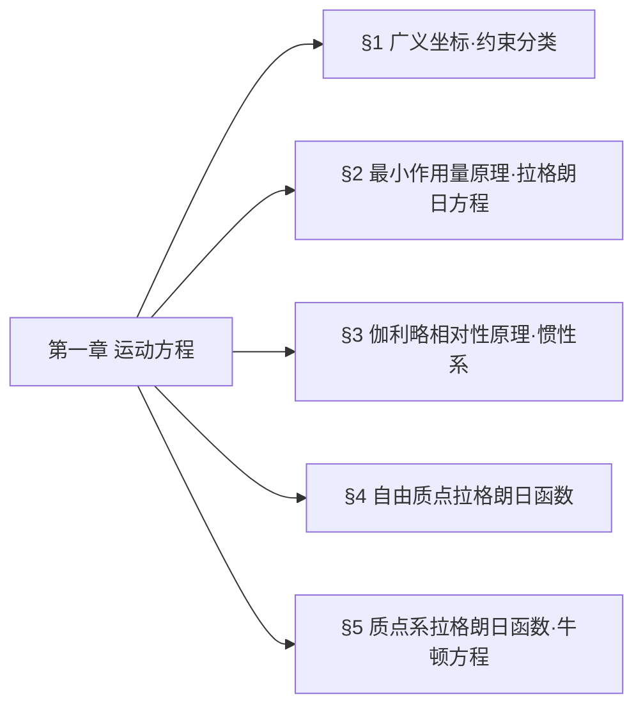

## 一、章节思维导图（LR 左→右模式）

## 二、§1 广义坐标与约束分类（教材+解读完整提炼）
### 1. 核心定义
- **自由度$s$**：唯一确定系统位形所需的**独立变量数目**
- **广义坐标**：$q_1,q_2,\dots,q_s$（可非直角坐标）
- **广义速度**：$\dot{q}_i=\dfrac{dq_i}{dt}$
- **位形**：系统所有质点位置的集合

### 2. 约束分类表（考试必背）
| 分类依据 | 约束类型 | 数学形式 | 核心特征 |
|----------|----------|----------|----------|
| 约束对象 | 完整约束 | $f(\boldsymbol{r}_1,\dots,\boldsymbol{r}_N,t)=0$ | 仅限制位形，可积分 |
|          | 非完整约束 | $f(\boldsymbol{r},\dot{\boldsymbol{r}},t)=0$ | 限位形+速度，不可积分 |
| 显含时间 | 定常约束 | 方程不显含$t$ | 约束不随时间变 |
|          | 非定常约束 | 方程显含$t$ | 约束随时间变化 |
| 虚功性质 | 理想约束 | $\sum\limits_{a=1}^N \boldsymbol{F}_a'\cdot\delta\boldsymbol{r}_a=0$ | 约束力总虚功为0 |
|          | 非理想约束 | $\sum\boldsymbol{F}_a'\cdot\delta\boldsymbol{r}_a\neq0$ | 含摩擦、耗散 |

### 3. 关键结论（材料原文）
1. 广义坐标是**针对整个系统**的，不能描述单个部分
2. 理想约束常见类型：光滑接触面、刚性杆、铰链、不可伸长绳
3. 完整约束可通过广义坐标自动消去，无需额外处理
## 一、最小作用量原理（核心考点）
1. **作用量定义**
$$S=\int_{t_1}^{t_2}L(q,\dot{q},t)dt$$
$L$为拉格朗日函数，$S$取极值的运动为真实运动。

2. **变分运算规则**
- 变分$\delta$与微分$d$可交换：$\delta\dot{q}=\frac{d}{dt}\delta q$
- 边界条件：$t_1,t_2$固定，$\delta q(t_1)=\delta q(t_2)=0$

3. **欧拉—拉格朗日方程推导**
对$S$变分并分部积分，由$\delta S=0$得：
$$\frac{d}{dt}\frac{\partial L}{\partial\dot{q}_i}-\frac{\partial L}{\partial q_i}=0$$

---

## 二、拉格朗日方程（考试必写）
- 方程形式：$\boldsymbol{\frac{d}{dt}\frac{\partial L}{\partial\dot{q}}-\frac{\partial L}{\partial q}=0}$
- 物理意义：由**最小作用量原理**唯一确定系统运动微分方程。
- 适用范围：完整、理想约束系统。

---

## 三、本节核心结论
1. 拉格朗日方程**不依赖坐标系选取**，具有协变性。
2. 方程阶数=自由度$s$，为二阶常微分方程组。
3. 只需写出$L=T-V$，即可直接列方程，无需分析受力。

---
✅ 批次2 输出完毕
请确认，我将继续输出**批次3：§3 伽利略相对性原理 · 惯性系**
当前文件内容过长，豆包只阅读了前 10%。