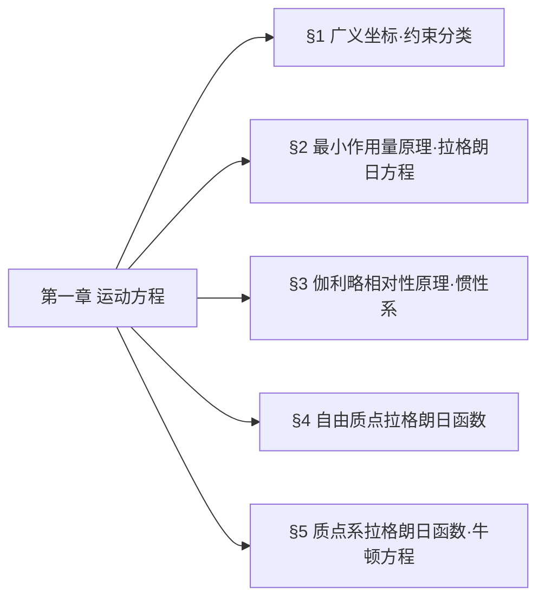

## 章节总览
本章核心：**从最小作用量原理出发，建立完整约束系统的拉格朗日方程**
主线：广义坐标 → 约束分类 → 最小作用量原理 → 拉格朗日方程 → 惯性系与伽利略不变性 → 拉格朗日函数构造
## 章节思维导图

## §1 广义坐标与约束分类
#### 1. 核心定义
- **自由度$s$**：唯一确定系统位形所需的**独立变量数目**
- **广义坐标**：$q_1,q_2,\dots,q_s$（可非直角坐标）
- **广义速度**：$\dot{q}_i=\dfrac{dq_i}{dt}$
- **位形**：系统所有质点位置的集合
#### 2. 约束分类表（考试必背）
| 分类依据 | 约束类型 | 数学形式 | 核心特征 |
|----------|----------|----------|----------|
| 约束对象 | 完整约束 | $f(\boldsymbol{r}_1,\dots,\boldsymbol{r}_N,t)=0$ | 仅限制位形，可积分 |
|          | 非完整约束 | $f(\boldsymbol{r},\dot{\boldsymbol{r}},t)=0$ | 限位形+速度，不可积分 |
| 显含时间 | 定常约束 | 方程不显含$t$ | 约束不随时间变 |
|          | 非定常约束 | 方程显含$t$ | 约束随时间变化 |
| 虚功性质 | 理想约束 | $\sum\limits_{a=1}^N \boldsymbol{F}_a'\cdot\delta\boldsymbol{r}_a=0$ | 约束力总虚功为0 |
|          | 非理想约束 | $\sum\boldsymbol{F}_a'\cdot\delta\boldsymbol{r}_a\neq0$ | 含摩擦、耗散 |
#### 3. 关键结论（材料原文）
1. 广义坐标是**针对整个系统**的，不能描述单个部分
2. 理想约束常见类型：光滑接触面、刚性杆、铰链、不可伸长绳
3. 完整约束可通过广义坐标自动消去，无需额外处理
## §2 最小作用量原理 + 拉格朗日方程
### 1、核心定义
- **作用量$S$**：拉格朗日函数对时间的积分
  $$S=\int_{t_1}^{t_2} L(q,\dot{q},t)dt$$
- **最小作用量原理（哈密顿原理）**：真实运动的轨迹是使作用量取极值的轨迹，数学表述为：
  $$\delta S = \delta \int_{t_1}^{t_2} L(q,\dot{q},t)dt = 0$$
- **边界条件**：端点固定，$\delta q(t_1)=\delta q(t_2)=0$
### 2、拉格朗日方程完整推导（考试必考）
#### 步骤1：作用量变分展开
对作用量取变分，将$L$展开到一阶小量：
$$\delta S = \int_{t_1}^{t_2} \left( \frac{\partial L}{\partial q_i}\delta q_i + \frac{\partial L}{\partial \dot{q}_i}\delta \dot{q}_i \right)dt$$
#### 步骤2：变分与微分交换
**等时变分**下，变分与时间微分可交换：
$$\delta \dot{q}_i = \frac{d}{dt}\delta q_i$$
#### 步骤3：分部积分消去速度变分
对第二项做分部积分：
$$\int_{t_1}^{t_2} \frac{\partial L}{\partial \dot{q}_i}\delta \dot{q}_i dt = \left. \frac{\partial L}{\partial \dot{q}_i}\delta q_i \right|_{t_1}^{t_2} - \int_{t_1}^{t_2} \frac{d}{dt}\left( \frac{\partial L}{\partial \dot{q}_i} \right)\delta q_i dt$$
#### 步骤4：边界项消失
根据边界条件$\delta q(t_1)=\delta q(t_2)=0$，边界项为0，因此：
$$\delta S = \int_{t_1}^{t_2} \left( \frac{\partial L}{\partial q_i} - \frac{d}{dt}\left( \frac{\partial L}{\partial \dot{q}_i} \right) \right)\delta q_i dt = 0$$
#### 步骤5：任意变分的结论
由于$\delta q_i$是任意的，被积函数必须恒为0，得到**拉格朗日方程**：
$$\frac{d}{dt}\left( \frac{\partial L}{\partial \dot{q}_i} \right) - \frac{\partial L}{\partial q_i} = 0 \quad (i=1,2,\dots,s)$$
### 3、拉格朗日函数的核心性质
| 性质 | 内容 | 物理意义 |
|------|------|----------|
| 可加性 | 独立子系统的拉格朗日量可叠加：$L=L_A+L_B$ | 各子系统的运动方程互不影响 |
| 常数缩放 | $L\to cL$不改变运动方程 | 仅改变单位，不改变物理规律 |
| 规范变换 | $L\to L+\dfrac{d}{dt}f(q,t)$不改变运动方程 | 作用量仅差边界项，变分后消失 |
### 4、关键补充（解读+考点）
#### 4.1. 等时变分 vs 全变分（易错点）
| 类型 | 定义 | 变分与微分的关系 | 适用场景 |
|------|------|------------------|----------|
| 等时变分$\delta$ | 同一时刻的位形变化 | $\delta\dot{q}=\dfrac{d}{dt}\delta q$ | 哈密顿原理的标准变分 |
| 全变分$\Delta$ | 包含时间变化的位形变化 | $\Delta\dot{q}\neq\dfrac{d}{dt}\Delta q$ | 非等时的轨迹变换 |
#### 4.2. 规范变换的实例（考点）
电磁场中带电粒子的拉格朗日量：
$$L=\frac{1}{2}mv^2 - e\varphi + e\boldsymbol{A}\cdot\boldsymbol{v}$$
当势做规范变换：
$$\boldsymbol{A}\to\boldsymbol{A}+\nabla\psi, \quad \varphi\to\varphi-\frac{\partial\psi}{\partial t}$$
拉格朗日量的变化为：
$$L\to L + e\frac{d\psi}{dt}$$
这正是规范变换，运动方程不变，这就是电磁规范不变性的经典力学基础。
## §3 伽利略相对性原理
### 1. 惯性系的定义
惯性参考系是满足以下条件的参考系：
- 空间是**均匀、各向同性**的
- 时间是**均匀**的
- 力学规律在该参考系中形式最简单
### 2. 时空对称性的推论
在惯性系中，自由质点的拉格朗日量不能显含$\boldsymbol{r}$和$t$（否则时空不均匀），也不能显含速度的方向（否则空间各向异性），因此：
$$L=L(v^2)$$
仅依赖于速度的大小。
### 3. 伽利略变换
两个惯性系$K$和$K'$，$K'$相对$K$以匀速$\boldsymbol{V}$运动，坐标变换为：
$$\boldsymbol{r} = \boldsymbol{r}' + \boldsymbol{V}t, \quad t = t'$$
速度变换为：
$$\boldsymbol{v} = \boldsymbol{v}' + \boldsymbol{V}$$
### 4. 伽利略相对性原理
力学运动方程在伽利略变换下**形式不变**，即所有惯性系中力学规律完全等价，不存在绝对的惯性系。
## §4 自由质点拉格朗日函数
### 1. 完整推导（朗道标准推导，考试必考）
##### 步骤1：无穷小伽利略变换
设$K'$相对$K$以无穷小速度$\boldsymbol{\varepsilon}$运动，则：
$$v'^2 = v^2 + 2\boldsymbol{v}\cdot\boldsymbol{\varepsilon} + \varepsilon^2$$
##### 步骤2：拉格朗日量的变换
根据伽利略不变性，变换后的拉格朗日量$L'$与原$L$仅差一个全导数项：
$$L' = L(v'^2) = L(v^2) + 2\frac{\partial L}{\partial v^2}\boldsymbol{v}\cdot\boldsymbol{\varepsilon}$$
##### 步骤3：线性条件
要让第二项是全导数，必须让$\dfrac{\partial L}{\partial v^2}$是常数（否则会依赖于速度，无法写成全导数），因此：
$$L = \frac{1}{2}mv^2$$
其中$m$是质点的质量。
### 2. 有限伽利略变换的验证
对有限速度$\boldsymbol{V}$，变换后的拉格朗日量：
$$L' = \frac{1}{2}mv'^2 = \frac{1}{2}m(\boldsymbol{v}+\boldsymbol{V})^2 = L + \frac{d}{dt}\left(m\boldsymbol{r}\cdot\boldsymbol{V} + \frac{1}{2}mV^2 t\right)$$
确实仅差一个全导数项，不改变运动方程，符合伽利略不变性。
### 3. 不同坐标系下的拉格朗日量
| 坐标系 | 速度平方展开 | 拉格朗日量 |
|--------|--------------|------------|
| 直角坐标 | $v^2=\dot{x}^2+\dot{y}^2+\dot{z}^2$ | $L=\dfrac{1}{2}m(\dot{x}^2+\dot{y}^2+\dot{z}^2)$ |
| 柱坐标 | $v^2=\dot{r}^2+r^2\dot{\phi}^2+\dot{z}^2$ | $L=\dfrac{1}{2}m(\dot{r}^2+r^2\dot{\phi}^2+\dot{z}^2)$ |
| 球坐标 | $v^2=\dot{r}^2+r^2\dot{\theta}^2+r^2\sin^2\theta\dot{\phi}^2$ | $L=\dfrac{1}{2}m(\dot{r}^2+r^2\dot{\theta}^2+r^2\sin^2\theta\dot{\phi}^2)$ |
### 4. 关键结论（易错点）
- **质量不能为负**：如果$m<0$，作用量$S$可以取任意小的负值，不存在最小值，违反最小作用量原理
- **可加性**：无相互作用的质点系，拉格朗日量可叠加：$L=\sum_a \dfrac{1}{2}m_a v_a^2$
- **质量的比例是物理的**：拉格朗日量的整体缩放仅改变单位，不同质点的质量比是可观测的
## §5 质点系拉格朗日函数 + 牛顿方程 + 考试押题考点
###  1. 封闭质点系的拉格朗日量
对于有相互作用的封闭质点系，拉格朗日量为动能减势能：
$$L = \sum_a \frac{1}{2}m_a v_a^2 - U(\boldsymbol{r}_1,\boldsymbol{r}_2,\dots,\boldsymbol{r}_N)$$
其中：
- $T=\sum_a \dfrac{1}{2}m_a v_a^2$：系统的总动能
- $U$：系统的势能，仅依赖于所有质点的位置
### 2. 牛顿方程的推导
代入拉格朗日方程：
$$\frac{d}{dt}\frac{\partial L}{\partial \boldsymbol{v}_a} = \frac{\partial L}{\partial \boldsymbol{r}_a}$$
左边：$\dfrac{d}{dt}(m_a \boldsymbol{v}_a) = m_a \dot{\boldsymbol{v}}_a$
右边：$-\dfrac{\partial U}{\partial \boldsymbol{r}_a}$
因此得到牛顿第二定律：
$$m_a \ddot{\boldsymbol{r}}_a = -\frac{\partial U}{\partial \boldsymbol{r}_a} = \boldsymbol{F}_a$$
其中$\boldsymbol{F}_a$是作用在第$a$个质点上的力。
### 3. 广义坐标下的动能
当使用广义坐标$q_i$时，坐标变换为：
$$x_a = x_a(q_1,\dots,q_s), \quad \dot{x}_a = \sum_k \frac{\partial x_a}{\partial q_k}\dot{q}_k$$
因此动能可以写成：
$$T = \frac{1}{2}\sum_{i,k} a_{ik}(q)\dot{q}_i\dot{q}_k$$
是广义速度的二次型，系数$a_{ik}$仅依赖于广义坐标。
### 4. 关键结论
- 经典力学中相互作用是**瞬时传递**的，这是绝对时间假设的必然结果
- 时间反演不变性：$t\to-t$时$L$不变，运动可逆
- 势能可加任意常数，不改变运动方程
## 【本章必考】押题考点：斜面滑块系统
#### 系统设定
质量为$M$的光滑斜面，倾角为$\alpha$，放在光滑水平面上；质量为$m$的滑块，通过劲度系数为$k$的弹簧连在斜面顶端，沿斜面运动。
#### 完整推导
##### 步骤1：选取广义坐标
- $X$：斜面在水平面上的位移
- $x$：滑块相对于斜面的位移
##### 步骤2：惯性系下的绝对速度
滑块的绝对速度是斜面速度与相对速度的合成：
$$v_m^2 = (\dot{X} + \dot{x}\cos\alpha)^2 + (\dot{x}\sin\alpha)^2 = \dot{X}^2 + \dot{x}^2 + 2\dot{X}\dot{x}\cos\alpha$$
##### 步骤3：总动能与势能
总动能：
$$T = \frac{1}{2}M\dot{X}^2 + \frac{1}{2}m(\dot{X}^2 + \dot{x}^2 + 2\dot{X}\dot{x}\cos\alpha)$$
势能：
$$U = \frac{1}{2}kx^2 - mgx\sin\alpha$$
##### 步骤4：拉格朗日量
$$L = T-U = \frac{1}{2}(M+m)\dot{X}^2 + \frac{1}{2}m\dot{x}^2 + m\dot{X}\dot{x}\cos\alpha - \frac{1}{2}kx^2 + mgx\sin\alpha$$
##### 步骤5：运动方程
对$X$：$(M+m)\ddot{X} + m\ddot{x}\cos\alpha = 0$（$X$是循环坐标，动量守恒）
对$x$：$m\ddot{x} + m\ddot{X}\cos\alpha + kx = mg\sin\alpha$
##### 步骤6：消元求振动频率
消去$\ddot{X}$，得到振动的微分方程，最终得到：
$$\omega = \sqrt{\frac{k(M+m)}{m(M+m\sin^2\alpha)}}$$
#### 易错提醒
- 绝对不能直接写滑块的动能为$\dfrac{1}{2}m\dot{x}^2$，必须在惯性系下计算绝对速度，这是本题的核心陷阱
- 斜面的运动必须考虑，否则会得到错误的频率
## 第一章 易错点汇总
| 易错点 | 正确结论 |
|--------|----------|
| 把全变分当成等时变分 | 哈密顿原理仅适用于等时变分，全变分下变分与微分不可交换 |
| 正则动量等于机械动量 | 电磁场中，正则动量$p=m\dot{v}+qA$，不等于机械动量 |
| 非惯性系下直接用拉格朗日方程 | 拉格朗日方程的标准形式仅在惯性系中成立 |
| 质量可以为负 | 质量为负会导致作用量无最小值，违反最小作用量原理 |
