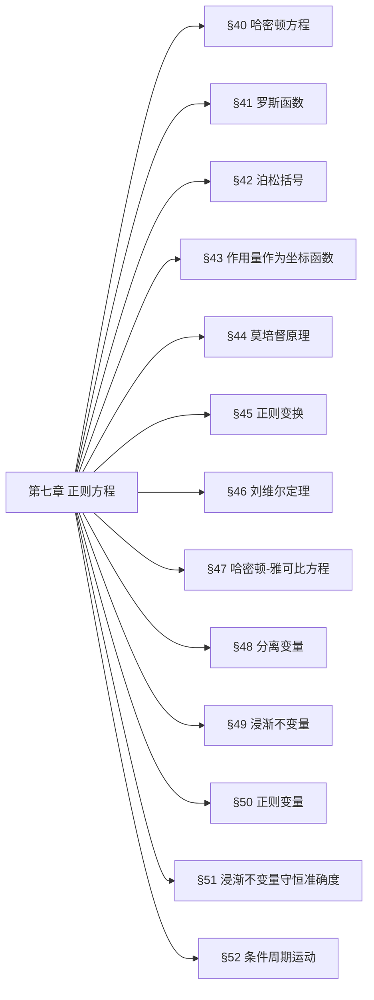

## 一、章节思维导图

## 二、分节极简核心提纲
### §40 哈密顿方程
1. 勒让德变换
$$H(p,q,t)=\sum_i p_i\dot{q}_i-L$$
2. 正则方程
$$\dot{q}_i=\frac{\partial H}{\partial p_i},\quad \dot{p}_i=-\frac{\partial H}{\partial q_i}$$
3. 哈密顿函数时间导数
$$\frac{dH}{dt}=\frac{\partial H}{\partial t}$$
### §41 罗斯函数
1. 定义（部分速度换动量）
$$R=p\dot{q}-L$$
2. 性质：对$q$是哈密顿型，对$\xi$是拉格朗日型
3. 循环坐标：可直接消去，简化方程
### §42 泊松括号
1. 定义
$$\{f,g\}=\sum_k\left(\frac{\partial f}{\partial p_k}\frac{\partial g}{\partial q_k}-\frac{\partial f}{\partial q_k}\frac{\partial g}{\partial p_k}\right)$$
2. 运动积分判定
$$\frac{df}{dt}=\frac{\partial f}{\partial t}+\{H,f\}=0$$
3. 基本性质：反对称、雅可比恒等式、泊松定理
### §43 作用量作为坐标函数
1. 作用量全微分
$$dS=\sum_i p_i dq_i -Hdt$$
2. 偏导数关系
$$p_i=\frac{\partial S}{\partial q_i},\quad \frac{\partial S}{\partial t}=-H$$
### §44 莫培督原理
1. 简约作用量
$$S_0=\int\sum_i p_i dq_i$$
2. 变分原理（能量守恒）
$$\delta S_0=0$$
### §45 正则变换
1. 正则条件
$$dF=\sum_i p_i dq_i-\sum_i P_i dQ_i+(H'-H)dt$$
2. 母函数关系
$$p_i=\frac{\partial F}{\partial q_i},\quad P_i=-\frac{\partial F}{\partial Q_i},\quad H'=H+\frac{\partial F}{\partial t}$$
3. 保泊松括号不变
### §46 刘维尔定理
1. 相空间体积元
$$d\Gamma=dq_1\cdots dq_s dp_1\cdots dp_s$$
2. 核心结论：正则变换下相体积不变
$$\int d\Gamma=\text{const}$$
### §47 哈密顿-雅可比方程
1. 方程形式
$$\frac{\partial S}{\partial t}+H\left(q,\frac{\partial S}{\partial q},t\right)=0$$
2. 不显含时：$S=S_0(q)-Et$，约化方程
$$H\left(q,\frac{\partial S_0}{\partial q}\right)=E$$
### §48 分离变量
1. 可分离条件：坐标与导数成独立组合
2. 解形式：$S=\sum S_i(q_i)-Et$
3. 循环坐标：$S_1=\alpha_1 q_1$
### §49 浸渐不变量
1. 浸渐条件：$T\frac{d\lambda}{dt}\ll\lambda$
2. 作用量变量
$$I=\frac{1}{2\pi}\oint p dq$$
3. 核心结论：$I=\text{const}$
### §50 正则变量
1. 作用变量$I$，角变量$w$
2. 关系：$w=\frac{\partial S_0}{\partial I}$，$\dot{w}=\frac{\partial E(I)}{\partial I}$
### §51 浸渐不变量守恒准确度
1. 差值$\Delta I$指数小
$$\Delta I\sim e^{-\text{Im}w_0}$$
### §52 条件周期运动
1. 可分离系统：运动为条件周期
2. 简并：频率可公度，运动严格周期
## 三、【考试重点】押题详细推导
### 重点1：哈密顿方程的完整推导
1. 拉格朗日函数全微分
$$dL=\sum_i\dot{p}_i dq_i+\sum_i p_i d\dot{q}_i$$
2. 分部积分变换
$$\sum_i p_i d\dot{q}_i=d\left(\sum p_i\dot{q}_i\right)-\sum\dot{q}_i dp_i$$
3. 定义哈密顿函数
$$H=\sum p_i\dot{q}_i-L$$
4. 对比全微分得正则方程
$$\dot{q}_i=\frac{\partial H}{\partial p_i},\quad \dot{p}_i=-\frac{\partial H}{\partial q_i}$$
### 重点2：泊松括号判定运动积分
1. 函数全导数
$$\frac{df}{dt}=\frac{\partial f}{\partial t}+\sum_k\left(\frac{\partial f}{\partial q_k}\dot{q}_k+\frac{\partial f}{\partial p_k}\dot{p}_k\right)$$
2. 代入正则方程
$$\frac{df}{dt}=\frac{\partial f}{\partial t}+\{H,f\}$$
3. **运动积分充要条件**
$$\frac{\partial f}{\partial t}+\{H,f\}=0$$
不显含时则$\{H,f\}=0$
### 重点3：正则变换的判定方法
1. 泊松括号判据
$$\{Q_i,Q_k\}=0,\quad \{P_i,P_k\}=0,\quad \{P_i,Q_k\}=\delta_{ik}$$
2. 母函数微分判据
$$dF=\sum p_i dq_i-\sum P_i dQ_i+(H'-H)dt$$
3. 步骤：计算泊松括号→验证等式→确定母函数
### 重点4：刘维尔定理证明
1. 相体积元等价于雅可比行列式
$$D=\frac{\partial(Q_1\cdots Q_s,P_1\cdots P_s)}{\partial(q_1\cdots q_s,p_1\cdots p_s)}$$
2. 正则变换雅可比行列式$D=1$
3. 结论：多重积分变量替换后体积不变
$$\int d\Gamma=\int dQ_1\cdots dQ_s dP_1\cdots dP_s$$
### 重点5：哈密顿-雅可比方程推导
1. 由作用量偏导
$$p_i=\frac{\partial S}{\partial q_i},\quad \frac{\partial S}{\partial t}=-H$$
2. 代入哈密顿函数
$$H\left(q_1\cdots q_s,\frac{\partial S}{\partial q_1}\cdots\frac{\partial S}{\partial q_s},t\right)+\frac{\partial S}{\partial t}=0$$
3. 不显含时：$S=S_0-Et$，约化为
$$H\left(q,\frac{\partial S_0}{\partial q}\right)=E$$
### 重点6：浸渐不变量的推导
1. 能量变化率
$$\frac{dE}{dt}=\frac{\partial H}{\partial \lambda}\frac{d\lambda}{dt}$$
2. 周期平均
$$\overline{\frac{dE}{dt}}=\frac{d\lambda}{dt}\overline{\frac{\partial H}{\partial \lambda}}$$
3. 定义作用量变量
$$I=\frac{1}{2\pi}\oint p dq$$
4. 得浸渐不变性
$$\frac{dI}{dt}=0$$
### 重点7：分离变量法求解哈密顿-雅可比方程
1. 假设解
$$S=\sum_{i=1}^s S_i(q_i)-Et$$
2. 代入方程拆分为$s$个常微分方程
$$\varphi_i\left(q_i,\frac{dS_i}{dq_i}\right)=\alpha_i$$
3. 积分得$S_i$，叠加得全积分
4. 由$\frac{\partial S}{\partial \alpha_i}=\beta_i$求运动解
## 四、核心公式对照表

| 物理内容 | 公式 |
| :--- | :--- |
| 哈密顿函数 | $H=\sum p_i\dot{q}_i-L$ |
| 正则方程 | $\dot{q}_i=\frac{\partial H}{\partial p_i},\ \dot{p}_i=-\frac{\partial H}{\partial q_i}$ |
| 泊松括号 | $\{f,g\}=\sum\left(\frac{\partial f}{\partial p_k}\frac{\partial g}{\partial q_k}-\frac{\partial f}{\partial q_k}\frac{\partial g}{\partial p_k}\right)$ |
| 作用量微分 | $dS=\sum p_i dq_i-Hdt$ |
| 正则变换条件 | $dF=\sum p_i dq_i-\sum P_i dQ_i+(H'-H)dt$ |
| 刘维尔定理 | $\int dq_1\cdots dp_s=\text{const}$ |
| 哈密顿-雅可比方程 | $\frac{\partial S}{\partial t}+H\left(q,\frac{\partial S}{\partial q},t\right)=0$ |
| 浸渐不变量 | $I=\frac{1}{2\pi}\oint p dq=\text{const}$ |
## 五、考试答题技巧
1. 所有推导题**先写定义/原理**，再分步演算
2. 正则变换优先用**泊松括号判据**，计算最简
3. 哈密顿-雅可比方程先看**是否显含时**，再选解形式
4. 浸渐不变量牢牢抓住**作用量变量$I$**为核心
5. 泊松括号与运动积分：**不显含时+与$H$对易=守恒量**当前文件内容过长，豆包只阅读了前 11%。