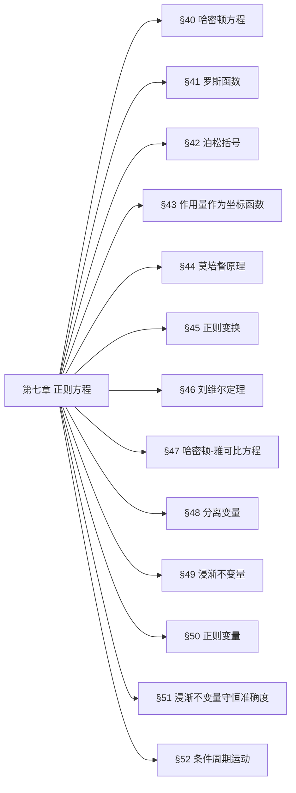

## 一、章节思维导图

## 二、分节极简核心提纲
### §40 哈密顿方程
1. 勒让德变换
$$H(p,q,t)=\sum_i p_i\dot{q}_i-L$$
2. 正则方程
$$\dot{q}_i=\frac{\partial H}{\partial p_i},\quad \dot{p}_i=-\frac{\partial H}{\partial q_i}$$
3. 哈密顿函数时间导数
$$\frac{dH}{dt}=\frac{\partial H}{\partial t}$$
### §41 罗斯函数
1. 定义（部分速度换动量）
$$R=p\dot{q}-L$$
2. 性质：对$q$是哈密顿型，对$\xi$是拉格朗日型
3. 循环坐标：可直接消去，简化方程
### §42 泊松括号
1. 定义
$$\{f,g\}=\sum_k\left(\frac{\partial f}{\partial p_k}\frac{\partial g}{\partial q_k}-\frac{\partial f}{\partial q_k}\frac{\partial g}{\partial p_k}\right)$$
2. 运动积分判定
$$\frac{df}{dt}=\frac{\partial f}{\partial t}+\{H,f\}=0$$
3. 基本性质：反对称、雅可比恒等式、泊松定理
### §43 作用量作为坐标函数
1. 作用量全微分
$$dS=\sum_i p_i dq_i -Hdt$$
2. 偏导数关系
$$p_i=\frac{\partial S}{\partial q_i},\quad \frac{\partial S}{\partial t}=-H$$
### §44 莫培督原理
1. 简约作用量
$$S_0=\int\sum_i p_i dq_i$$
2. 变分原理（能量守恒）
$$\delta S_0=0$$
### §45 正则变换
1. 正则条件
$$dF=\sum_i p_i dq_i-\sum_i P_i dQ_i+(H'-H)dt$$
2. 母函数关系
$$p_i=\frac{\partial F}{\partial q_i},\quad P_i=-\frac{\partial F}{\partial Q_i},\quad H'=H+\frac{\partial F}{\partial t}$$
3. 保泊松括号不变
### §46 刘维尔定理
1. 相空间体积元
$$d\Gamma=dq_1\cdots dq_s dp_1\cdots dp_s$$
2. 核心结论：正则变换下相体积不变
$$\int d\Gamma=\text{const}$$
### §47 哈密顿-雅可比方程
1. 方程形式
$$\frac{\partial S}{\partial t}+H\left(q,\frac{\partial S}{\partial q},t\right)=0$$
2. 不显含时：$S=S_0(q)-Et$，约化方程
$$H\left(q,\frac{\partial S_0}{\partial q}\right)=E$$
### §48 分离变量
1. 可分离条件：坐标与导数成独立组合
2. 解形式：$S=\sum S_i(q_i)-Et$
3. 循环坐标：$S_1=\alpha_1 q_1$
### §49 浸渐不变量
1. 浸渐条件：$T\frac{d\lambda}{dt}\ll\lambda$
2. 作用量变量
$$I=\frac{1}{2\pi}\oint p dq$$
3. 核心结论：$I=\text{const}$
## 考点7号、利用 Sommerfeld（索末菲）量子化条件讨论氢原子圆周运动下能量和轨道的量子化。（Gemini3）
### 知识点归纳与教材对应
本题的核心知识点是**作用量取离散值（作用量量子化）**。
*   **对应教材：**
    *   《朗道理论物理教程 卷1-力学》（第五版）—— **第七章：正则方程（The Canonical Equations）**。
    *   具体涉及：**§49. 绝热不变量（Adiabatic Invariants）** 与 **§50. 作用量和角度变量（Action-angle variables）**。
*   **物理背景：**
    虽然量子力学在朗道教程的第3卷中有专门论述，但在第1卷《力学》的末尾，朗道通过对**作用量 $J = \oint p dq$** 的讨论，实际上暗示了经典体系向旧量子论的演化。在圆周运动这种周期性体系中，相空间轨迹闭合，其包围的面积（作用量）是量子化的。
### 3. 试题解答
我们要讨论的是带电粒子（电子）在库仑场中做匀速圆周运动的量子化。
#### 第一步：设定物理模型
*   电子质量为 $m$，电荷量为 $-e$（原子核电荷为 $+e$）。
*   库仑力提供向心力（采用 CGS 单位制，这是朗道教程的习惯）：
$$\frac{mv^2}{r} = \frac{e^2}{r^2} \quad \text{--- (1)}$$
*   体系的总能量 $E$ 为：
$$E = T + V = \frac{1}{2}mv^2 - \frac{e^2}{r}$$
    将 (1) 式代入得：
$$E = \frac{e^2}{2r} - \frac{e^2}{r} = -\frac{e^2}{2r} \quad \text{--- (2)}$$
#### 第二步：引入 Sommerfeld 量子化条件
对于圆周运动，广义坐标是极角 $\phi$，对应的正则动量是角动量 $L = mvr$。
索末菲量子化条件（也称 Bohr-Sommerfeld 条件）指出，相积分必须是普朗克常数 $h$ 的整数倍：
$$\oint p_{\phi} d\phi = n h \quad (n = 1, 2, 3, \dots)$$
由于圆周运动中角动量 $L$ 是守恒量（常数），积分变为：
$$L \int_{0}^{2\pi} d\phi = 2\pi L = nh$$
由此得到角动量的量子化：
$$L = n \frac{h}{2\pi} = n\hbar \quad \text{--- (3)}$$
#### 第三步：轨道的量子化 ($r_n$)
将角动量定义 $L = mvr$ 代入 (1) 式。首先由 $L = mvr$ 得 $v = \frac{L}{mr}$，代入 (1)：
$$m \frac{(L/mr)^2}{r} = \frac{e^2}{r^2} \implies \frac{L^2}{mr^3} = \frac{e^2}{r^2}$$
解得轨道半径 $r$：
$$r = \frac{L^2}{me^2}$$
将 $L = n\hbar$ 代入：
$$r_n = \frac{n^2\hbar^2}{me^2}$$
这就是著名的 **玻尔半径** 序列。
#### 第四步：能量的量子化 ($E_n$)
将轨道半径 $r_n$ 代入能量表达式 (2)：
$$E_n = -\frac{e^2}{2 \left( \frac{n^2\hbar^2}{me^2} \right)}$$
整理得：
$$E_n = -\frac{me^4}{2\hbar^2 n^2}$$
这就是氢原子的能量级。
### 4. 结论与总结
**通过 Sommerfeld 量子化条件得到：**
1.  **轨道半径量子化：** $r_n = n^2 a_0$，其中 $a_0 = \frac{\hbar^2}{me^2}$ 为第一玻尔半径。
2.  **能量量子化：** $E_n = -\frac{R_H}{n^2}$，其中 $R_H = \frac{me^4}{2\hbar^2}$ 为里德伯能量。
#### 备考建议：
*   **深刻领会：** 同学们，在朗道《力学》§49 中提到的“绝热不变量” $J$，在缓慢变化的参数下保持不变，这正是量子数 $n$ 在扰动下保持不变的经典根源。
*   **考试提醒：** 在推导过程中，一定要明确指出 $p_\phi$ 与 $\phi$ 的对应关系。虽然这是“旧”量子论，但它展示了哈密顿力学中**作用量-角度变量**对于理解微观世界的巨大威力。
*   **计算技巧：** 习惯使用 $\hbar = h/2\pi$，这会使公式显得更加简洁。

### §50 正则变量
1. 作用变量$I$，角变量$w$
2. 关系：$w=\frac{\partial S_0}{\partial I}$，$\dot{w}=\frac{\partial E(I)}{\partial I}$
### §51 浸渐不变量守恒准确度
1. 差值$\Delta I$指数小
$$\Delta I\sim e^{-\text{Im}w_0}$$
### §52 条件周期运动
1. 可分离系统：运动为条件周期
2. 简并：频率可公度，运动严格周期
## 三、【考试重点】押题详细推导
### 考点1号、由 Lagrange 方程推导 Hamilton 正则方程
##### 步骤1：定义广义动量与哈密顿函数
定义广义动量 $p_i$：
$$
p_i = \frac{\partial L}{\partial \dot{q}_i}
$$
通过勒让德变换，将变量从 $(q, \dot{q}, t)$ 转换为 $(q, p, t)$，定义哈密顿函数 $H(q,p,t)$：
$$
H(q,p,t) = \sum_i p_i \dot{q}_i - L(q, \dot{q}(q,p,t), t)
$$
##### 步骤2：对哈密顿函数取全微分
$$
dH = \sum_i \left( p_i d\dot{q}_i + \dot{q}_i dp_i \right) - dL
$$
拉格朗日函数的全微分为：
$$
dL = \sum_i \left( \frac{\partial L}{\partial q_i} dq_i + \frac{\partial L}{\partial \dot{q}_i} d\dot{q}_i \right) + \frac{\partial L}{\partial t} dt
$$
代入 $p_i = \frac{\partial L}{\partial \dot{q}_i}$，得：
$$
dL = \sum_i \left( \frac{\partial L}{\partial q_i} dq_i + p_i d\dot{q}_i \right) + \frac{\partial L}{\partial t} dt
$$
将 $dL$ 代入 $dH$ 的表达式，消去 $p_i d\dot{q}_i$ 项：
$$
dH = \sum_i \left( \dot{q}_i dp_i - \frac{\partial L}{\partial q_i} dq_i \right) - \frac{\partial L}{\partial t} dt
$$
##### 步骤3：对比全微分形式，得到正则方程
另一方面，哈密顿函数 $H(q,p,t)$ 的全微分为：
$$
dH = \sum_i \left( \frac{\partial H}{\partial q_i} dq_i + \frac{\partial H}{\partial p_i} dp_i \right) + \frac{\partial H}{\partial t} dt
$$
对比 $dq_i$ 和 $dp_i$ 的系数：
1.  $dp_i$ 项系数：$\dot{q}_i = \frac{\partial H}{\partial p_i}$
2.  $dq_i$ 项系数：$-\frac{\partial L}{\partial q_i} = \frac{\partial H}{\partial q_i}$

再结合拉格朗日方程 $\frac{d}{dt}\left( \frac{\partial L}{\partial \dot{q}_i} \right) = \frac{\partial L}{\partial q_i}$，即 $\dot{p}_i = \frac{\partial L}{\partial q_i}$，因此：
$$
\dot{p}_i = -\frac{\partial H}{\partial q_i}
$$
综上，得到**哈密顿正则方程（Hamilton正则方程）**：
$$
\begin{cases}
\dot{q}_i = \dfrac{\partial H}{\partial p_i} \\[6pt]
\dot{p}_i = -\dfrac{\partial H}{\partial q_i}
\end{cases}
\quad (i=1,2,\dots,n)
$$
同时，时间偏导数项满足：
$$
\frac{\partial H}{\partial t} = -\frac{\partial L}{\partial t}
$$
## 考点3号、在力场 $V(r)$ 中的 Lagrange 作用量（或 Hamilton 量）（豆包）
### 知识点所属章节
该题目核心知识点属于**朗道《理论物理教程 卷1：力学》**：
- Lagrange 函数与作用量：第1-2节（拉格朗日函数的构造、作用量定义与最小作用量原理）
- 有心力场中的力学系统：第14-15节（有心力场中的运动、守恒定律）
- Hamilton 函数：第40节（哈密顿函数的定义与勒让德变换）
### 解答
#### 一、基本模型设定
考虑质量为 $m$ 的质点，在中心力场 $V(r)$ 中运动，采用球坐标系 $(r, \theta, \phi)$ 描述其位置。
- 动能：$T = \frac{1}{2} m v^2 = \frac{1}{2} m (\dot{r}^2 + r^2 \dot{\theta}^2 + r^2 \sin^2\theta \dot{\phi}^2)$
- 势能：$V(r)$（仅与径向坐标 $r$ 有关，与角度无关）
#### 二、Lagrange 函数与作用量
##### 1. Lagrange 函数 $L$
拉格朗日函数定义为动能减势能：
$$
L(r, \theta, \phi, \dot{r}, \dot{\theta}, \dot{\phi}) = T - V = \frac{1}{2} m \left( \dot{r}^2 + r^2 \dot{\theta}^2 + r^2 \sin^2\theta \dot{\phi}^2 \right) - V(r)
$$
##### 2. Lagrange 作用量 $S$
作用量定义为拉格朗日函数在时间上的积分：
$$
S = \int_{t_1}^{t_2} L(r, \theta, \phi, \dot{r}, \dot{\theta}, \dot{\phi}) \, dt
$$
根据最小作用量原理，真实运动轨迹是使作用量 $S$ 取极值的轨迹，满足 $\delta S = 0$。
##### 3. 利用角动量守恒简化（可选，有心力场的重要性质）
由于势能仅与 $r$ 有关，角向变量为循环坐标，角动量守恒：
- 角动量大小：$L_z = m r^2 \sin^2\theta \dot{\phi} = \text{常数}$
- 角动量守恒要求运动在一个平面内，可设 $\theta = \frac{\pi}{2}$，$\dot{\theta} = 0$，此时拉格朗日函数简化为：
$$
L(r, \phi, \dot{r}, \dot{\phi}) = \frac{1}{2} m \left( \dot{r}^2 + r^2 \dot{\phi}^2 \right) - V(r)
$$
#### 三、Hamilton 函数 $H$
##### 1. 广义动量
对简化后的平面运动模型，定义广义动量：
- 径向动量：$p_r = \frac{\partial L}{\partial \dot{r}} = m \dot{r}$
- 角向动量：$p_\phi = \frac{\partial L}{\partial \dot{\phi}} = m r^2 \dot{\phi}$（即角动量，守恒量）

##### 2. 勒让德变换构造 $H$
哈密顿函数通过勒让德变换定义：
$$
H = p_r \dot{r} + p_\phi \dot{\phi} - L
$$
将 $\dot{r} = \frac{p_r}{m}$、$\dot{\phi} = \frac{p_\phi}{m r^2}$ 代入 $L$，得：
$$
H = p_r \cdot \frac{p_r}{m} + p_\phi \cdot \frac{p_\phi}{m r^2} - \left[ \frac{1}{2} m \left( \left( \frac{p_r}{m} \right)^2 + r^2 \left( \frac{p_\phi}{m r^2} \right)^2 \right) - V(r) \right]
$$
化简后得到：
$$
H(r, p_r, p_\phi) = \frac{p_r^2}{2m} + \frac{p_\phi^2}{2 m r^2} + V(r)
$$
该形式下，$H$ 等于系统的总机械能 $T+V$。

##### 3. 推广到三维球对称情况
三维情况下的哈密顿函数为：
$$
H(r, p_r, p_\theta, p_\phi) = \frac{p_r^2}{2m} + \frac{p_\theta^2}{2 m r^2} + \frac{p_\phi^2}{2 m r^2 \sin^2\theta} + V(r)
$$
其中 $p_\theta = m r^2 \dot{\theta}$，$p_\phi = m r^2 \sin^2\theta \dot{\phi}$。
#### 四、Lagrange 与 Hamilton 形式对比
| 形式 | 变量 | 表达式 | 核心方程 |
| :--- | :--- | :--- | :--- |
| Lagrange | $r, \theta, \phi, \dot{r}, \dot{\theta}, \dot{\phi}$ | $L = T - V$ | $\dfrac{d}{dt}\left( \dfrac{\partial L}{\partial \dot{q}_i} \right) - \dfrac{\partial L}{\partial q_i} = 0$ |
| Hamilton | $r, \theta, \phi, p_r, p_\theta, p_\phi$ | $H = T + V$ | $\dot{q}_i = \dfrac{\partial H}{\partial p_i}, \dot{p}_i = -\dfrac{\partial H}{\partial q_i}$ |

## 考点4号、电子在磁场下运动用 Lagrange 描述 $L = \frac{1}{2}m\dot{x}^2 + q A(x) \dot{x}$，($q$ 为常数)，写出描述该运动的 Hamilton 量。（Gemini3）
### 知识点归纳与教材对应
本题的核心知识点是**从拉格朗日形式到哈密顿形式的转换**。
*   **对应教材：**
    *   《朗道理论物理教程 卷1-力学》（第五版）—— **第七章：正则方程（The Canonical Equations）**。
    *   具体涉及 **§40 哈密顿方程**。
*   **物理背景：**
    *   此题讨论的是带电粒子在矢量势 $A$ 描述的磁场中的一维简化运动。
    *   注意：在朗道《力学》的常规讨论中，势能通常只依赖于坐标，但此题涉及了依赖于速度的项（即相互作用项 $q A \dot{x}$），这正是电磁相互作用的典型特征。
### 解答
我们要通过拉格朗日量 $L(x, \dot{x})$ 求解哈密顿量 $H(p, x)$。请大家严格按照朗道定义的步骤进行：
#### 第一步：计算广义动量 (Generalized Momentum)
根据定义，广义动量 $p$ 是拉格朗日量对广义速度 $\dot{x}$ 的偏导数：
$$p = \frac{\partial L}{\partial \dot{x}}$$
代入本题的 $L = \frac{1}{2}m\dot{x}^2 + q A(x) \dot{x}$：
$$p = m\dot{x} + q A(x)$$

> **教授点评：** 请注意，这里的 $p$ 是**正则动量（Canonical Momentum）**。它不仅包含机械动量 $m\dot{x}$，还包含了电磁场带来的项 $qA$。这是分析电磁场中粒子量子化的关键点。
#### 第二步：将速度 $\dot{x}$ 表示为动量 $p$ 的函数
从上式解出 $\dot{x}$：
$$\dot{x} = \frac{p - q A(x)}{m}$$

#### 第三步：利用勒让德变换定义哈密顿量
哈密顿量的定义为：
$$H = p \dot{x} - L$$
我们将 $L$ 的表达式代入：
$$H = p \dot{x} - \left( \frac{1}{2}m\dot{x}^2 + q A(x) \dot{x} \right)$$
$$H = (p - q A(x))\dot{x} - \frac{1}{2}m\dot{x}^2$$

#### 第四步：代入 $\dot{x}$ 的表达式，消除速度项
将第二步得到的 $\dot{x} = \frac{p - q A(x)}{m}$ 代入：
$$H = (p - q A(x)) \cdot \left( \frac{p - q A(x)}{m} \right) - \frac{1}{2}m \left( \frac{p - q A(x)}{m} \right)^2$$
$$H = \frac{(p - q A(x))^2}{m} - \frac{(p - q A(x))^2}{2m}$$
合并同类项得：
$$H = \frac{(p - q A(x))^2}{2m}$$
### 4. 结论与总结

**该运动的 Hamilton 量为：**
$$H(p, x) = \frac{1}{2m} \left[ p - q A(x) \right]^2$$

#### 备考建议：
1.  **物理意义：** 虽然哈密顿量在数值上等于动能 $\frac{1}{2}m\dot{x}^2$，但作为哈密顿量，它必须写成坐标 $x$ 和正则动量 $p$ 的函数。如果在答案里保留了 $\dot{x}$，在考试中是要扣大分的。
2.  **符号规范：** 朗道在《力学》中强调了从 $L$ 到 $H$ 的转变本质上是变量的更替。
3.  **拓展思考：** 如果再加上标量电势 $\phi(x)$，拉格朗日量会多出一项 $-q\phi$，最终的哈密顿量就会变成 $H = \frac{(p-qA)^2}{2m} + q\phi$。这正是你们在后续《量子力学》课程中处理薛定谔方程时常用的算符基础。

### 1：哈密顿方程的完整推导
1. 拉格朗日函数全微分
$$dL=\sum_i\dot{p}_i dq_i+\sum_i p_i d\dot{q}_i$$
2. 分部积分变换
$$\sum_i p_i d\dot{q}_i=d\left(\sum p_i\dot{q}_i\right)-\sum\dot{q}_i dp_i$$
3. 定义哈密顿函数
$$H=\sum p_i\dot{q}_i-L$$
4. 对比全微分得正则方程
$$\dot{q}_i=\frac{\partial H}{\partial p_i},\quad \dot{p}_i=-\frac{\partial H}{\partial q_i}$$
### 2：泊松括号判定运动积分
1. 函数全导数
$$\frac{df}{dt}=\frac{\partial f}{\partial t}+\sum_k\left(\frac{\partial f}{\partial q_k}\dot{q}_k+\frac{\partial f}{\partial p_k}\dot{p}_k\right)$$
2. 代入正则方程
$$\frac{df}{dt}=\frac{\partial f}{\partial t}+\{H,f\}$$
3. **运动积分充要条件**
$$\frac{\partial f}{\partial t}+\{H,f\}=0$$
不显含时则$\{H,f\}=0$
### 3：正则变换的判定方法
1. 泊松括号判据
$$\{Q_i,Q_k\}=0,\quad \{P_i,P_k\}=0,\quad \{P_i,Q_k\}=\delta_{ik}$$
2. 母函数微分判据
$$dF=\sum p_i dq_i-\sum P_i dQ_i+(H'-H)dt$$
3. 步骤：计算泊松括号→验证等式→确定母函数
### 4：刘维尔定理证明
1. 相体积元等价于雅可比行列式
$$D=\frac{\partial(Q_1\cdots Q_s,P_1\cdots P_s)}{\partial(q_1\cdots q_s,p_1\cdots p_s)}$$
2. 正则变换雅可比行列式$D=1$
3. 结论：多重积分变量替换后体积不变
$$\int d\Gamma=\int dQ_1\cdots dQ_s dP_1\cdots dP_s$$
### 5：哈密顿-雅可比方程推导
1. 由作用量偏导
$$p_i=\frac{\partial S}{\partial q_i},\quad \frac{\partial S}{\partial t}=-H$$
2. 代入哈密顿函数
$$H\left(q_1\cdots q_s,\frac{\partial S}{\partial q_1}\cdots\frac{\partial S}{\partial q_s},t\right)+\frac{\partial S}{\partial t}=0$$
3. 不显含时：$S=S_0-Et$，约化为
$$H\left(q,\frac{\partial S_0}{\partial q}\right)=E$$
### 6：浸渐不变量的推导
1. 能量变化率
$$\frac{dE}{dt}=\frac{\partial H}{\partial \lambda}\frac{d\lambda}{dt}$$
2. 周期平均
$$\overline{\frac{dE}{dt}}=\frac{d\lambda}{dt}\overline{\frac{\partial H}{\partial \lambda}}$$
3. 定义作用量变量
$$I=\frac{1}{2\pi}\oint p dq$$
4. 得浸渐不变性
$$\frac{dI}{dt}=0$$
### 7：分离变量法求解哈密顿-雅可比方程
1. 假设解
$$S=\sum_{i=1}^s S_i(q_i)-Et$$
2. 代入方程拆分为$s$个常微分方程
$$\varphi_i\left(q_i,\frac{dS_i}{dq_i}\right)=\alpha_i$$
3. 积分得$S_i$，叠加得全积分
4. 由$\frac{\partial S}{\partial \alpha_i}=\beta_i$求运动解
## 四、核心公式对照表

| 物理内容 | 公式 |
| :--- | :--- |
| 哈密顿函数 | $H=\sum p_i\dot{q}_i-L$ |
| 正则方程 | $\dot{q}_i=\frac{\partial H}{\partial p_i},\ \dot{p}_i=-\frac{\partial H}{\partial q_i}$ |
| 泊松括号 | $\{f,g\}=\sum\left(\frac{\partial f}{\partial p_k}\frac{\partial g}{\partial q_k}-\frac{\partial f}{\partial q_k}\frac{\partial g}{\partial p_k}\right)$ |
| 作用量微分 | $dS=\sum p_i dq_i-Hdt$ |
| 正则变换条件 | $dF=\sum p_i dq_i-\sum P_i dQ_i+(H'-H)dt$ |
| 刘维尔定理 | $\int dq_1\cdots dp_s=\text{const}$ |
| 哈密顿-雅可比方程 | $\frac{\partial S}{\partial t}+H\left(q,\frac{\partial S}{\partial q},t\right)=0$ |
| 浸渐不变量 | $I=\frac{1}{2\pi}\oint p dq=\text{const}$ |

## 五、考试答题技巧
1. 所有推导题**先写定义/原理**，再分步演算
2. 正则变换优先用**泊松括号判据**，计算最简
3. 哈密顿-雅可比方程先看**是否显含时**，再选解形式
4. 浸渐不变量牢牢抓住**作用量变量$I$**为核心
5. 泊松括号与运动积分：**不显含时+与$H$对易=守恒量**当前文件内容过长，豆包只阅读了前 11%。