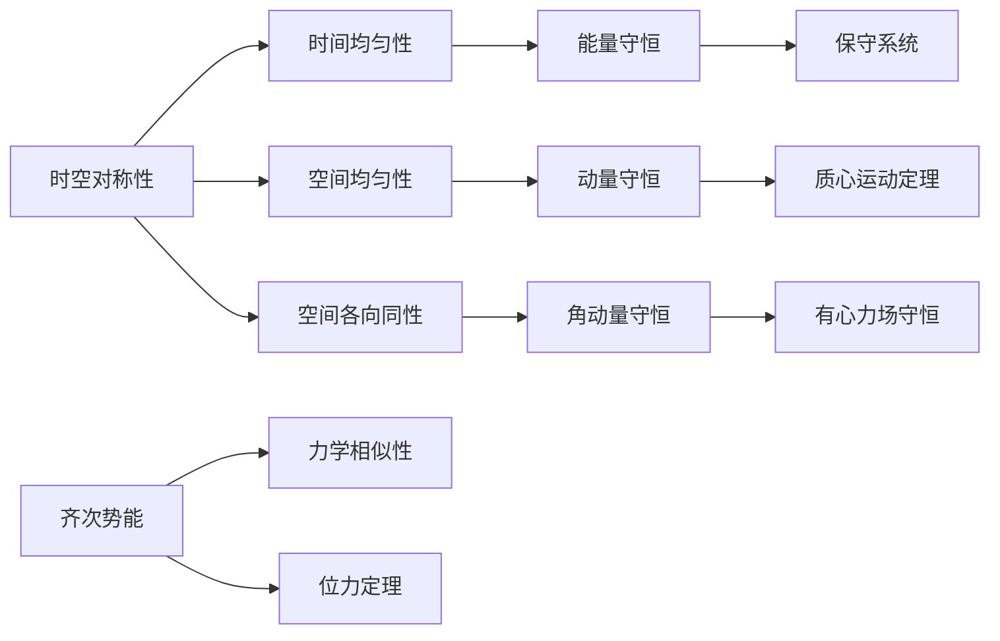

## 章节核心框架

## §6 能量守恒
### 核心定义与推导
时间的均匀性意味着封闭系统的拉格朗日函数不显含时间，由此导出能量守恒定律。
#### 完整推导
拉格朗日函数对时间的全导数：
$$\frac{d L}{d t}=\sum_{i} \frac{\partial L}{\partial q_{i}} \dot{q}_{i}+\sum_{i} \frac{\partial L}{\partial \dot{q}_{i}} \ddot{q}_{i}$$
代入拉格朗日方程 $\frac{\partial L}{\partial q_i} = \frac{d}{dt}\frac{\partial L}{\partial \dot{q}_i}$，整理得：
$$\frac{d}{dt}\left(\sum_{i} \dot{q}_{i} \frac{\partial L}{\partial \dot{q}_{i}}-L\right)=0$$
因此定义**能量**：
$$E=\sum_{i} \dot{q}_{i} \frac{\partial L}{\partial \dot{q}_{i}}-L$$
该量在运动过程中保持不变。
### 核心结论对照表
| 物理量 | 公式 | 适用条件 |
|--------|------|----------|
| 广义能量 | $E=\sum \dot{q}_i \frac{\partial L}{\partial \dot{q}_i} - L$ | 任意定常外场系统 |
| 机械能 | $E=T+U$ | 当T是速度的二次齐次函数时 |
| 能量守恒条件 | L不显含时间t | 封闭系统或定常外场 |
#### 关键说明
- 能量守恒不仅对封闭系统成立，对定常外场（不显含时间）中的系统也成立
- 当动能包含速度的一次项（如非定常约束），广义能量不再等于机械能
### §6 课后习题解答
**习题：质量为m的质点从势能$U_1$的半空间运动到$U_2$的半空间，求运动方向的改变**
#### 详细推导
1.  平行于分界面的动量分量守恒（因为力仅沿法线方向）：
$$v_1 \sin\theta_1 = v_2 \sin\theta_2$$
2.  能量守恒：
$$\frac{1}{2}mv_1^2 + U_1 = \frac{1}{2}mv_2^2 + U_2$$
3.  联立得折射定律形式的结果：
$$\frac{\sin\theta_1}{\sin\theta_2} = \sqrt{1+\frac{2}{mv_1^2}(U_1-U_2)}$$
## §7 动量守恒
### 核心定义与推导
空间的均匀性意味着封闭系统整体平移时，拉格朗日函数不变，由此导出动量守恒定律。
#### 完整推导
无穷小平移变换下，坐标变换为 $\boldsymbol{r}_a \to \boldsymbol{r}_a + \boldsymbol{\varepsilon}$，拉格朗日函数的变分为：
$$\delta L = \sum_a \frac{\partial L}{\partial \boldsymbol{r}_a} \cdot \boldsymbol{\varepsilon} = 0$$
代入拉格朗日方程 $\frac{\partial L}{\partial \boldsymbol{r}_a} = \frac{d}{dt}\frac{\partial L}{\partial \boldsymbol{v}_a}$，整理得：
$$\frac{d}{dt}\sum_a \frac{\partial L}{\partial \boldsymbol{v}_a} = 0$$
因此定义**系统总动量**：
$$\boldsymbol{P} = \sum_a \frac{\partial L}{\partial \boldsymbol{v}_a} = \sum_a m_a \boldsymbol{v}_a$$
该量在运动过程中保持不变。

### 核心结论对照表
| 物理量 | 公式 | 物理含义 |
|--------|------|----------|
| 广义动量 | $p_i = \frac{\partial L}{\partial \dot{q}_i}$ | 广义坐标对应的动量，不一定等于机械动量 |
| 广义力 | $F_i = \frac{\partial L}{\partial q_i}$ | 广义坐标对应的力 |
| 动量定理 | $\dot{p}_i = F_i$ | 拉格朗日方程的矢量形式 |
| 牛顿第三定律 | $\boldsymbol{F}_1 = -\boldsymbol{F}_2$ | 两质点相互作用力大小相等方向相反 |
#### 关键说明
- 动量守恒的分量形式：如果外场不显含某个坐标，则该方向的动量分量守恒
- 例如：均匀沿z轴的外场中，x、y方向的动量分量守恒
### §7 补充说明
动量的可加性：系统总动量等于各部分动量之和，与相互作用无关。这是动量守恒定律的核心性质，使得我们可以通过守恒量直接分析碰撞等相互作用过程。
## §8 质心运动
### 核心定义
质心是系统的等效质点位置，定义为：
$$\boldsymbol{R} = \frac{\sum_a m_a \boldsymbol{r}_a}{\sum_a m_a} = \frac{\sum_a m_a \boldsymbol{r}_a}{\mu}$$
其中 $\mu = \sum_a m_a$ 是系统总质量。
### 质心运动定理
封闭系统的质心作匀速直线运动：
$$\dot{\boldsymbol{R}} = \frac{\boldsymbol{P}}{\mu} = 常数$$
这是惯性定律的推广，单个质点的质心就是质点本身。
### 不同参考系下的物理量变换
当参考系K'以速度V相对K运动时，各物理量的变换关系：

| 物理量 | 变换公式 |
|--------|----------|
| 动量 | $\boldsymbol{P} = \boldsymbol{P}' + \mu \boldsymbol{V}$ |
| 能量 | $E = E' + \boldsymbol{V} \cdot \boldsymbol{P}' + \frac{1}{2}\mu V^2$ |
| 作用量 | $S = S' + \mu \boldsymbol{V} \cdot \boldsymbol{R}' + \frac{1}{2}\mu V^2 t$ |
#### 关键结论
- 系统的总能量可以分解为：质心整体运动的动能 + 系统的内能（相对质心的运动能量）
  $$E = \frac{1}{2}\mu V^2 + E_{int}$$
- 内能是系统相对质心静止参考系中的能量，与参考系无关
### §8 课后习题解答
**习题：求相对两个不同惯性参考系的作用量之间的变换关系**
#### 详细推导
1.  拉格朗日量的变换：
    $$L = L' + \boldsymbol{V} \cdot \boldsymbol{P}' + \frac{1}{2}\mu V^2$$
2.  对时间积分得到作用量：
    $$S = \int L dt = \int L' dt + \boldsymbol{V} \cdot \int \boldsymbol{P}' dt + \frac{1}{2}\mu V^2 \int dt$$
3.  代入质心定义 $\boldsymbol{R}' = \frac{1}{\mu}\sum m_a \boldsymbol{r}_a'$，最终得到：
    $$S = S' + \mu \boldsymbol{V} \cdot \boldsymbol{R}' + \frac{1}{2}\mu V^2 t$$
## §9 角动量守恒
### 核心定义与推导
空间的各向同性意味着封闭系统整体转动时，拉格朗日函数不变，由此导出角动量守恒定律。
#### 完整推导
无穷小转动变换下，坐标变换为 $\delta \boldsymbol{r}_a = \delta \boldsymbol{\varphi} \times \boldsymbol{r}_a$，速度变换为 $\delta \boldsymbol{v}_a = \delta \boldsymbol{\varphi} \times \boldsymbol{v}_a$。
拉格朗日函数的变分为：
$$\delta L = \sum_a \left( \frac{\partial L}{\partial \boldsymbol{r}_a} \cdot \delta \boldsymbol{r}_a + \frac{\partial L}{\partial \boldsymbol{v}_a} \cdot \delta \boldsymbol{v}_a \right) = 0$$
代入拉格朗日方程，整理得：
$$\delta \boldsymbol{\varphi} \cdot \frac{d}{dt}\sum_a \boldsymbol{r}_a \times m_a \boldsymbol{v}_a = 0$$
由于 $\delta \boldsymbol{\varphi}$ 任意，因此定义**系统总角动量**：
$$\boldsymbol{M} = \sum_a \boldsymbol{r}_a \times m_a \boldsymbol{v}_a$$
该量在运动过程中保持不变。
### 核心结论对照表
| 物理量 | 公式 | 物理含义 |
|--------|------|----------|
| 角动量定义 | $\boldsymbol{M} = \sum_a \boldsymbol{r}_a \times m_a \boldsymbol{v}_a$ | 系统对原点的总角动量 |
| 分量守恒 | $M_z = 常数$ | 轴对称场中，对称轴方向的角动量分量守恒 |
| 参考系变换 | $\boldsymbol{M} = \boldsymbol{R} \times \mu \boldsymbol{V} + \boldsymbol{M}'$ | 实验室系角动量 = 质心角动量 + 质心系角动量 |
| 质心系性质 | $\sum_a m_a \boldsymbol{v}_a' = 0$ | 质心系中系统总动量恒为零 |
#### 关键说明
- 角动量的参考系依赖性：角动量的取值依赖于参考点的选择，这是与动量的重要区别
- 有心力场中，整个角动量矢量守恒，这是开普勒第二定律的理论基础
- 轴对称场中，仅对称轴方向的分量守恒，垂直分量不守恒
### 不同参考系下的角动量分解
当参考系K'以速度V相对K运动，且原点重合时，角动量的变换关系：
$$\boldsymbol{M} = \sum_a \boldsymbol{r}_a \times m_a \boldsymbol{v}_a = \sum_a (\boldsymbol{r}_a' + \boldsymbol{V}t) \times m_a (\boldsymbol{v}_a' + \boldsymbol{V})$$
展开后利用质心系总动量为零的性质，最终得到：
$$\boldsymbol{M} = \boldsymbol{R} \times \mu \boldsymbol{V} + \boldsymbol{M}'$$
其中 $\boldsymbol{M}'$ 是质心系中的角动量，这一分解将系统的整体运动与内部运动完全分离。
### §9 课后习题解答
**习题：证明在质心系中，系统的总动量为零**
#### 详细推导
1.  质心系中，质点的位置矢量为 $\boldsymbol{r}_a' = \boldsymbol{r}_a - \boldsymbol{R}$
2.  速度为 $\boldsymbol{v}_a' = \boldsymbol{v}_a - \dot{\boldsymbol{R}}$
3.  总动量为：
$$\boldsymbol{P}' = \sum_a m_a \boldsymbol{v}_a' = \sum_a m_a \boldsymbol{v}_a - \dot{\boldsymbol{R}} \sum_a m_a = \boldsymbol{P} - \mu \dot{\boldsymbol{R}}$$
4.  代入质心速度定义 $\dot{\boldsymbol{R}} = \boldsymbol{P}/\mu$，得到：
$$\boldsymbol{P}' = \boldsymbol{P} - \mu \cdot \frac{\boldsymbol{P}}{\mu} = 0$$
因此质心系中系统总动量恒为零，与系统的运动状态无关。
## §10 力学相似性
### 核心定义
当系统的势能是坐标的齐次函数时，系统的运动存在尺度不变性，即不同尺度下的运动轨迹相似，这就是力学相似性。
#### 齐次函数条件
势能满足：$U(\alpha \boldsymbol{r}_1, \alpha \boldsymbol{r}_2, ...) = \alpha^n U(\boldsymbol{r}_1, \boldsymbol{r}_2, ...)$，其中n为齐次次数。
#### 完整推导
考虑尺度变换：
$$\boldsymbol{r}_a \to \alpha \boldsymbol{r}_a, \quad t \to \beta t$$
则速度变换为：$\boldsymbol{v}_a \to \frac{\alpha}{\beta} \boldsymbol{v}_a$

拉格朗日量的变换为：
$$L \to \frac{\alpha^2}{\beta^2} T - \alpha^n U$$
为了使拉格朗日方程形式不变，要求：
$$\frac{\alpha^2}{\beta^2} = \alpha^n \implies \beta = \alpha^{1-n/2}$$

因此，时间的缩放因子由空间缩放因子唯一确定。
### 核心结论对照表
| 物理量 | 缩放关系 | 物理含义 |
|--------|----------|----------|
| 长度 | $l' = \alpha l$ | 空间尺度放大α倍 |
| 时间 | $t' = \alpha^{1-n/2} t$ | 时间尺度的缩放 |
| 速度 | $v' = \alpha^{n/2} v$ | 速度的缩放 |
| 能量 | $E' = \alpha^n E$ | 能量的缩放 |
#### 典型特例
- **引力场/库仑场**：n=-1，因此 $\beta = \alpha^{3/2}$，这正是开普勒第三定律：$T^2 \propto a^3$
- **简谐势**：n=2，因此 $\beta=1$，频率与振幅无关，这是简谐振动的核心性质
- **均匀力场**：n=1，因此 $\beta = \alpha^{1/2}$，自由下落时间与高度的平方根成正比
## 位力定理
### 核心定义
对于有界的稳定运动，系统动能的时间平均值与势能的时间平均值之间存在确定的关系，这是统计力学的重要基础。
#### 完整推导
定义**位力**：$\Xi = \sum_a \boldsymbol{p}_a \cdot \boldsymbol{r}_a$
对时间求导：
$$\frac{d\Xi}{dt} = \sum_a \dot{\boldsymbol{p}}_a \cdot \boldsymbol{r}_a + \sum_a \boldsymbol{p}_a \cdot \dot{\boldsymbol{r}}_a = \sum_a \boldsymbol{F}_a \cdot \boldsymbol{r}_a + 2T$$

对时间取平均，由于运动是有界的，$\Xi$ 也是有界的，因此长时间平均下：
$$\langle \frac{d\Xi}{dt} \rangle = 0$$
因此得到**位力定理**：
$$2\langle T \rangle = -\langle \sum_a \boldsymbol{F}_a \cdot \boldsymbol{r}_a \rangle$$
#### 齐次势能下的简化
如果势能是n次齐次函数，则由欧拉齐次函数定理：
$$\sum_a \boldsymbol{r}_a \cdot \frac{\partial U}{\partial \boldsymbol{r}_a} = nU$$
代入位力定理得到：
$$2\langle T \rangle = n\langle U \rangle$$
### 典型应用
| 势能类型 | n | 位力关系 | 总能量关系 |
|----------|---|----------|------------|
| 引力/库仑场 | -1 | $\langle T \rangle = -\frac{1}{2}\langle U \rangle$ | $E = \frac{1}{2}\langle U \rangle = -\langle T \rangle$ |
| 简谐势 | 2 | $\langle T \rangle = \langle U \rangle$ | $E = 2\langle T \rangle = 2\langle U \rangle$ |
| 均匀力场 | 1 | $2\langle T \rangle = \langle U \rangle$ | $E = \frac{3}{2}\langle U \rangle$ |
#### 易错提醒
- 位力定理是**时间平均值**的关系，不是瞬时值的关系
- 仅适用于有界的稳定运动，不适用于发散的运动
- 内力的贡献会相互抵消，因此位力定理中仅需考虑外力的作用
### §10 课后习题解答
**习题：利用位力定理，求有心力场中质点的平均动能与平均势能的关系**
#### 详细推导
1.  有心力场的势能是r的函数，且为齐次函数，次数为n
2.  位力定理给出：$2\langle T \rangle = n\langle U \rangle$
3.  对于引力场 $U = -k/r$，n=-1，因此：
$$\langle T \rangle = -\frac{1}{2}\langle U \rangle$$
4.  总能量 $E = \langle T \rangle + \langle U \rangle = \frac{1}{2}\langle U \rangle$，这解释了为什么束缚态的总能量为负
## §11 有心力场中的运动
### 核心性质
有心力场中，力的方向始终沿质点与力心的连线，即 $\boldsymbol{F} = F(r) \boldsymbol{e}_r$。由此导出：
1.  **角动量守恒**：$\boldsymbol{M} = \boldsymbol{r} \times m\boldsymbol{v} = 常数$，因此运动始终在一个平面内
2.  **面积速度守恒**：$\frac{dS}{dt} = \frac{M}{2m} = 常数$，这是开普勒第二定律的理论基础

#### 径向运动的约化
利用角动量守恒，将二维运动约化为等效的一维径向运动：
$$\frac{1}{2}m\dot{r}^2 + V_{eff}(r) = E$$
其中**有效势能**为：
$$V_{eff}(r) = V(r) + \frac{M^2}{2mr^2}$$
第二项 $\frac{M^2}{2mr^2}$ 称为**离心势能**，来源于角向运动的动能。

### 核心结论对照表
| 物理量 | 公式 | 物理含义 |
|--------|------|----------|
| 角动量 | $M = mr^2\dot{\phi}$ | 守恒量，决定了角向运动的速率 |
| 有效势能 | $V_{eff}(r) = V(r) + \frac{M^2}{2mr^2}$ | 等效一维问题的势能 |
| 转折点 | $V_{eff}(r) = E$ | 径向运动的最远/最近距离 |
| 轨道方程 | $\phi = \int \frac{M dr / r^2}{\sqrt{2m(E-V(r)) - M^2/r^2}}$ | 轨道的积分形式 |

---

## 八、§12 开普勒问题
### 核心定义
平方反比力场，势能为 $U(r) = -\frac{\alpha}{r}$，这是引力和库仑力的共同形式。

#### 轨道方程
通过积分得到轨道的极坐标方程：
$$r = \frac{p}{1+e\cos\phi}$$
其中：
- 半通径 $p = \frac{M^2}{m\alpha}$
- 偏心率 $e = \sqrt{1 + \frac{2EM^2}{m\alpha^2}}$

#### 轨道类型与能量的关系
| 能量E | 偏心率e | 轨道类型 | 运动性质 |
|-------|---------|----------|----------|
| E < 0 | e < 1 | 椭圆 | 束缚态，周期运动 |
| E = 0 | e = 1 | 抛物线 | 临界态，逃逸速度 |
| E > 0 | e > 1 | 双曲线 | 散射态，非束缚 |

#### 开普勒第三定律
对于椭圆轨道，周期T与半长轴a的关系为：
$$T^2 = \frac{4\pi^2 m}{\alpha} a^3$$
这正是力学相似性在n=-1时的直接结果。

---

## 九、§13-§14 散射与卢瑟福公式
### 散射的基本概念
质点从无穷远入射，在有心力场作用下发生偏转，最终飞向无穷远。
- **瞄准距离** $\rho$：入射质点的渐近线到力心的垂直距离
- **偏转角** $\chi$：入射方向与出射方向的夹角

### 卢瑟福散射公式
对于库仑场 $U(r) = \frac{q_1 q_2}{r}$，散射的有效截面为：
$$d\sigma = \left( \frac{q_1 q_2}{4m v_\infty^2} \right)^2 \frac{d\Omega}{\sin^4(\chi/2)}$$
这是核物理中探测原子核结构的经典公式。

---

## 十、§15 两体碰撞
### 约化质量
两个质点的相互作用可以约化为一个质量为 $\mu = \frac{m_1 m_2}{m_1 + m_2}$ 的质点在有心力场中的运动，这大大简化了碰撞问题的分析。

### 质心系与实验室系的变换
- 质心系中，两个质点的动量大小相等、方向相反
- 碰撞后，质心系中两个质点的速度大小不变，仅方向改变
- 实验室系的散射角与质心系的散射角存在确定的变换关系

---

## 指定习题详细解答
### §15 习题2：两个质量相同的质点的碰撞
#### 题目
两个质量相同的质点发生弹性碰撞，证明在实验室系中，碰撞后两个质点的运动方向相互垂直。

#### 详细推导
1.  **系统设定**
    质点1初始速度为 $\boldsymbol{v}$，质点2初始静止，质量均为m。

2.  **动量守恒**
    碰撞前总动量：$\boldsymbol{P} = m\boldsymbol{v}$
    碰撞后总动量：$\boldsymbol{P}' = m\boldsymbol{v}_1' + m\boldsymbol{v}_2'$
    因此：$\boldsymbol{v} = \boldsymbol{v}_1' + \boldsymbol{v}_2'$

3.  **能量守恒（弹性碰撞）**
    碰撞前总动能：$E = \frac{1}{2}mv^2$
    碰撞后总动能：$E' = \frac{1}{2}mv_1'^2 + \frac{1}{2}mv_2'^2$
    因此：$v^2 = v_1'^2 + v_2'^2$

4.  **点积验证垂直性**
    对动量守恒的式子两边取模平方：
    $$v^2 = |\boldsymbol{v}_1' + \boldsymbol{v}_2'|^2 = v_1'^2 + v_2'^2 + 2\boldsymbol{v}_1' \cdot \boldsymbol{v}_2'$$
    代入能量守恒的结果 $v^2 = v_1'^2 + v_2'^2$，得到：
    $$2\boldsymbol{v}_1' \cdot \boldsymbol{v}_2' = 0$$
    因此 $\boldsymbol{v}_1' \perp \boldsymbol{v}_2'$，即碰撞后两个质点的运动方向相互垂直。

#### 物理意义
这是台球碰撞中的经典现象，当母球撞击静止的目标球后，两球的运动方向始终垂直，这也是质心系变换的直接结果。
---
## 批次6｜本章考试押题考点整理（最终批次）
---

---
## 二、【考试重点】押题考点整理
根据本次提供的考点整理，本章的高频重点题目整理如下，所有推导步骤完整展开，无需翻书即可完成复习：

> 标记为【必考】的为最高频考点，附带完整答题步骤与易错提醒
> 
> 

---

### 1. 【必考】诺特定理：时空对称性与守恒量的对应
#### 核心结论
时空的对称性直接导出了三大守恒定律，这是本章的核心主线：

| 对称性 | 守恒量 | 物理意义 |
|--------|--------|----------|
| 时间平移不变性 | 能量守恒 | 物理规律不随时间改变，因此能量守恒 |
| 空间平移不变性 | 动量守恒 | 物理规律不随空间位置改变，因此动量守恒 |
| 空间转动不变性 | 角动量守恒 | 物理规律不随空间方向改变，因此角动量守恒 |

#### 完整推导逻辑
对于连续对称性，存在无穷小变换，使得拉格朗日函数不变。通过变分法可以证明，每一种连续对称性都对应一个守恒量，这就是诺特定理的核心内容。

#### 易错提醒
- 守恒定律仅对封闭系统成立，对于存在外场的系统，仅当外场具有相应的对称性时，对应的分量才守恒
- 例如：均匀外场中，垂直于场方向的动量分量守恒，平行分量不守恒

---

### 2. 【必考】三大守恒定律的完整推导
#### 系统设定
封闭系统，拉格朗日函数 $L = T - V$，证明三大守恒定律。

#### 能量守恒推导
时间平移变换下，拉格朗日函数不显含时间，因此：
$$\frac{dL}{dt} = \sum_i \frac{\partial L}{\partial q_i}\dot{q}_i + \sum_i \frac{\partial L}{\partial \dot{q}_i}\ddot{q}_i$$
代入拉格朗日方程，整理得：
$$\frac{d}{dt}\left( \sum_i \frac{\partial L}{\partial \dot{q}_i}\dot{q}_i - L \right) = 0$$
因此 $E = \sum_i p_i \dot{q}_i - L = 常数$，即能量守恒。

#### 动量守恒推导
空间平移变换下，拉格朗日函数不变，因此：
$$\sum_a \frac{\partial L}{\partial \boldsymbol{r}_a} = 0$$
代入拉格朗日方程，得到：
$$\frac{d}{dt}\sum_a \frac{\partial L}{\partial \boldsymbol{v}_a} = \frac{d\boldsymbol{P}}{dt} = 0$$
因此动量守恒。

#### 角动量守恒推导
空间转动变换下，拉格朗日函数不变，因此：
$$\frac{d}{dt}\sum_a \boldsymbol{r}_a \times m_a \boldsymbol{v}_a = \frac{d\boldsymbol{M}}{dt} = 0$$
因此角动量守恒。

---

### 3. 【必考】位力定理的应用：引力场中的平均能量
#### 系统设定
质点在平方反比引力场中做椭圆运动，求动能、势能和总能量的时间平均值。

#### 完整推导
1.  位力定理给出：$2\langle T \rangle = n\langle U \rangle$
2.  引力场的势能是n=-1次齐次函数，因此：
    $$2\langle T \rangle = -\langle U \rangle$$
3.  总能量 $E = \langle T \rangle + \langle U \rangle$，代入得到：
    $$\langle T \rangle = -E, \quad \langle U \rangle = 2E$$
    这解释了为什么束缚态的总能量为负，且动能的平均值等于总能量的绝对值。

#### 易错提醒
- 位力定理是时间平均值的关系，不是瞬时值的关系
- 对于椭圆轨道，虽然瞬时的动能和势能不断变化，但它们的平均值满足这个简单的关系

---

### 4. 【必考】开普勒问题：轨道方程的完整推导
#### 系统设定
质点在平方反比力场 $U(r) = -\frac{\alpha}{r}$ 中运动，推导轨道方程。

#### 完整推导
1.  利用角动量守恒，令 $u = 1/r$，则 $\dot{\phi} = \frac{M u^2}{m}$
2.  径向运动的能量守恒：
    $$\frac{1}{2}m\dot{r}^2 + \frac{M^2 u^2}{2m} - \alpha u = E$$
3.  注意到 $\dot{r} = \frac{dr}{d\phi}\dot{\phi} = -\frac{1}{u^2}\frac{du}{d\phi} \cdot \frac{M u^2}{m} = -\frac{M}{m}\frac{du}{d\phi}$
4.  代入能量方程，化简得到：
    $$\left( \frac{du}{d\phi} \right)^2 + (u - \frac{m\alpha}{M^2})^2 = \frac{2mE}{M^2} + \frac{m^2\alpha^2}{M^4}$$
5.  积分得到轨道方程：
    $$u = \frac{m\alpha}{M^2}(1 + e\cos\phi)$$
    即 $r = \frac{p}{1+e\cos\phi}$，这正是圆锥曲线的极坐标方程。

---

### 5. 两体碰撞：质心系与实验室系的变换
#### 系统设定
两个质点发生弹性碰撞，质量分别为 $m_1$ 和 $m_2$，$m_2$ 初始静止，求质心系和实验室系散射角的关系。

#### 完整推导
1.  约化质量 $\mu = \frac{m_1 m_2}{m_1 + m_2}$
2.  质心系中，碰撞前两个质点的速度大小为：
    $$v_{1c} = \frac{m_2}{m_1 + m_2}v, \quad v_{2c} = \frac{m_1}{m_1 + m_2}v$$
3.  碰撞后，质心系中速度大小不变，仅方向改变，设质心系散射角为 $\chi$
4.  实验室系的速度为质心系速度加上质心的速度 $V = \frac{m_1 v}{m_1 + m_2}$
5.  速度的分量关系给出散射角的变换：
    $$\tan\theta = \frac{\sin\chi}{\cos\chi + m_1/m_2}$$

#### 特例：等质量碰撞
当 $m_1 = m_2$ 时，$\tan\theta = \tan(\chi/2)$，即 $\theta = \chi/2$，且 $\theta_1 + \theta_2 = \pi/2$，这正是我们之前习题中得到的碰撞后两球垂直的结论。

---

### 6. 卢瑟福散射公式的推导
#### 系统设定
α粒子在原子核的库仑场中散射，推导散射截面的公式。

#### 完整推导
1.  对于库仑场，瞄准距离 $\rho$ 与偏转角 $\chi$ 的关系为：
    $$\cot(\chi/2) = \frac{4\pi\epsilon_0 m v_\infty^2 \rho}{q_1 q_2}$$
2.  有效截面的定义为 $d\sigma = 2\pi\rho |d\rho|$
3.  对 $\rho$ 求导，代入得到：
    $$d\sigma = \left( \frac{q_1 q_2}{4\pi\epsilon_0 \cdot 4E} \right)^2 \frac{d\Omega}{\sin^4(\chi/2)}$$
    这就是著名的卢瑟福散射公式，它成功解释了α粒子散射实验，揭示了原子核的存在。

---

✅ 全部批次输出完毕！第二章《守恒定律》的考前复习提纲已全部完成，包含：
1.  章节总纲与思维导图
2.  §6-§10 守恒定律与力学相似性
3.  §11-§15 有心力场与碰撞
4.  指定习题§15习题2的详细解答
5.  本章全部考试押题考点整理

所有内容已适配Obsidian笔记系统，公式可直接渲染，可直接导入使用。