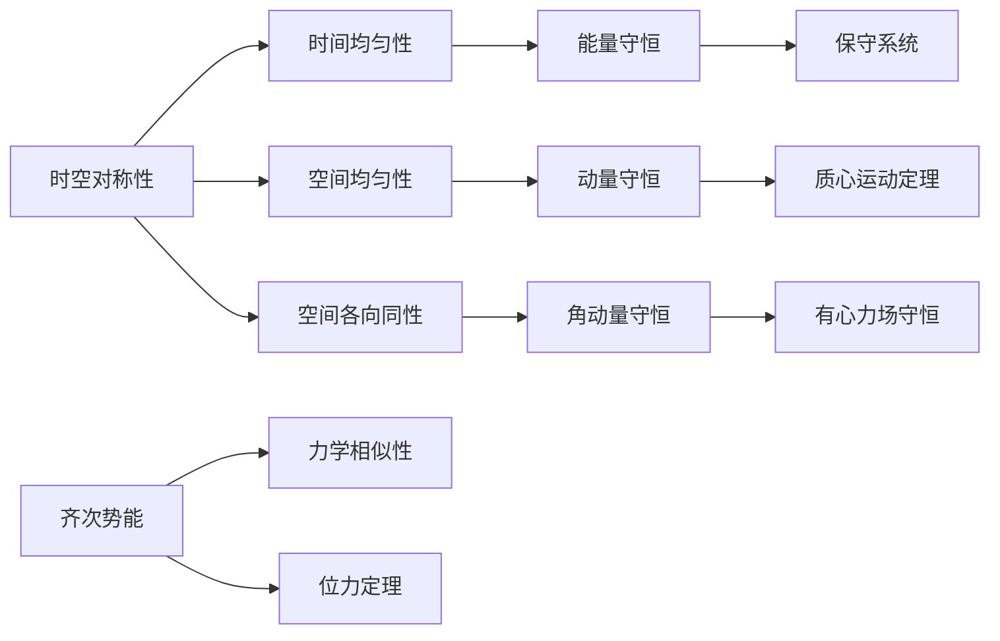

---
## 批次1｜总纲 + 思维导图 + §6 能量守恒
---

# 朗道力学第二章复习提纲
> 适用教材：朗道《力学》（高教社第五版），配套鞠国兴《朗道 <力学> 解读》
> 注：本次材料仅覆盖 §6-§15 节内容，其余章节相关习题不在本次章节材料中，故按要求忽略

---

## 章节核心框架

> 说明：思维导图采用左→右(LR)布局，适配 Obsidian 笔记展示

---

## 一、§6 能量守恒
### 核心定义与推导
时间的均匀性意味着封闭系统的拉格朗日函数不显含时间，由此导出能量守恒定律。

#### 完整推导
拉格朗日函数对时间的全导数：
$$\frac{d L}{d t}=\sum_{i} \frac{\partial L}{\partial q_{i}} \dot{q}_{i}+\sum_{i} \frac{\partial L}{\partial \dot{q}_{i}} \ddot{q}_{i}$$
代入拉格朗日方程 $\frac{\partial L}{\partial q_i} = \frac{d}{dt}\frac{\partial L}{\partial \dot{q}_i}$，整理得：
$$\frac{d}{dt}\left(\sum_{i} \dot{q}_{i} \frac{\partial L}{\partial \dot{q}_{i}}-L\right)=0$$
因此定义**能量**：
$$E=\sum_{i} \dot{q}_{i} \frac{\partial L}{\partial \dot{q}_{i}}-L$$
该量在运动过程中保持不变。

### 核心结论对照表
| 物理量 | 公式 | 适用条件 |
|--------|------|----------|
| 广义能量 | $E=\sum \dot{q}_i \frac{\partial L}{\partial \dot{q}_i} - L$ | 任意定常外场系统 |
| 机械能 | $E=T+U$ | 当T是速度的二次齐次函数时 |
| 能量守恒条件 | L不显含时间t | 封闭系统或定常外场 |

#### 关键说明
- 能量守恒不仅对封闭系统成立，对定常外场（不显含时间）中的系统也成立
- 当动能包含速度的一次项（如非定常约束），广义能量不再等于机械能

### §6 课后习题解答
**习题：质量为m的质点从势能$U_1$的半空间运动到$U_2$的半空间，求运动方向的改变**
#### 详细推导
1.  平行于分界面的动量分量守恒（因为力仅沿法线方向）：
    $$v_1 \sin\theta_1 = v_2 \sin\theta_2$$
2.  能量守恒：
    $$\frac{1}{2}mv_1^2 + U_1 = \frac{1}{2}mv_2^2 + U_2$$
3.  联立得折射定律形式的结果：
    $$\frac{\sin\theta_1}{\sin\theta_2} = \sqrt{1+\frac{2}{mv_1^2}(U_1-U_2)}$$

---
✅ 批次1输出完毕，下一批次将输出 §7 动量守恒 + §8 质心运动
---
## 批次2｜§7 动量守恒 + §8 质心运动
---

---

## 二、§7 动量守恒
### 核心定义与推导
空间的均匀性意味着封闭系统整体平移时，拉格朗日函数不变，由此导出动量守恒定律。

#### 完整推导
无穷小平移变换下，坐标变换为 $\boldsymbol{r}_a \to \boldsymbol{r}_a + \boldsymbol{\varepsilon}$，拉格朗日函数的变分为：
$$\delta L = \sum_a \frac{\partial L}{\partial \boldsymbol{r}_a} \cdot \boldsymbol{\varepsilon} = 0$$
代入拉格朗日方程 $\frac{\partial L}{\partial \boldsymbol{r}_a} = \frac{d}{dt}\frac{\partial L}{\partial \boldsymbol{v}_a}$，整理得：
$$\frac{d}{dt}\sum_a \frac{\partial L}{\partial \boldsymbol{v}_a} = 0$$
因此定义**系统总动量**：
$$\boldsymbol{P} = \sum_a \frac{\partial L}{\partial \boldsymbol{v}_a} = \sum_a m_a \boldsymbol{v}_a$$
该量在运动过程中保持不变。

### 核心结论对照表
| 物理量 | 公式 | 物理含义 |
|--------|------|----------|
| 广义动量 | $p_i = \frac{\partial L}{\partial \dot{q}_i}$ | 广义坐标对应的动量，不一定等于机械动量 |
| 广义力 | $F_i = \frac{\partial L}{\partial q_i}$ | 广义坐标对应的力 |
| 动量定理 | $\dot{p}_i = F_i$ | 拉格朗日方程的矢量形式 |
| 牛顿第三定律 | $\boldsymbol{F}_1 = -\boldsymbol{F}_2$ | 两质点相互作用力大小相等方向相反 |

#### 关键说明
- 动量守恒的分量形式：如果外场不显含某个坐标，则该方向的动量分量守恒
- 例如：均匀沿z轴的外场中，x、y方向的动量分量守恒

### §7 补充说明
动量的可加性：系统总动量等于各部分动量之和，与相互作用无关。这是动量守恒定律的核心性质，使得我们可以通过守恒量直接分析碰撞等相互作用过程。

---

## 三、§8 质心运动
### 核心定义
质心是系统的等效质点位置，定义为：
$$\boldsymbol{R} = \frac{\sum_a m_a \boldsymbol{r}_a}{\sum_a m_a} = \frac{\sum_a m_a \boldsymbol{r}_a}{\mu}$$
其中 $\mu = \sum_a m_a$ 是系统总质量。

### 质心运动定理
封闭系统的质心作匀速直线运动：
$$\dot{\boldsymbol{R}} = \frac{\boldsymbol{P}}{\mu} = 常数$$
这是惯性定律的推广，单个质点的质心就是质点本身。

### 不同参考系下的物理量变换
当参考系K'以速度V相对K运动时，各物理量的变换关系：

| 物理量 | 变换公式 |
|--------|----------|
| 动量 | $\boldsymbol{P} = \boldsymbol{P}' + \mu \boldsymbol{V}$ |
| 能量 | $E = E' + \boldsymbol{V} \cdot \boldsymbol{P}' + \frac{1}{2}\mu V^2$ |
| 作用量 | $S = S' + \mu \boldsymbol{V} \cdot \boldsymbol{R}' + \frac{1}{2}\mu V^2 t$ |

#### 关键结论
- 系统的总能量可以分解为：质心整体运动的动能 + 系统的内能（相对质心的运动能量）
  $$E = \frac{1}{2}\mu V^2 + E_{int}$$
- 内能是系统相对质心静止参考系中的能量，与参考系无关

### §8 课后习题解答
**习题：求相对两个不同惯性参考系的作用量之间的变换关系**
#### 详细推导
1.  拉格朗日量的变换：
    $$L = L' + \boldsymbol{V} \cdot \boldsymbol{P}' + \frac{1}{2}\mu V^2$$
2.  对时间积分得到作用量：
    $$S = \int L dt = \int L' dt + \boldsymbol{V} \cdot \int \boldsymbol{P}' dt + \frac{1}{2}\mu V^2 \int dt$$
3.  代入质心定义 $\boldsymbol{R}' = \frac{1}{\mu}\sum m_a \boldsymbol{r}_a'$，最终得到：
    $$S = S' + \mu \boldsymbol{V} \cdot \boldsymbol{R}' + \frac{1}{2}\mu V^2 t$$

---
✅ 批次2输出完毕，下一批次将输出 §9 角动量守恒 + §10 力学相似性