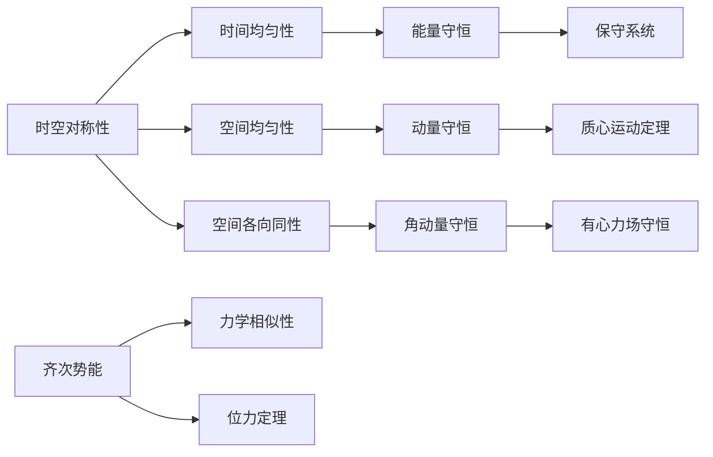

---
## 批次1｜总纲 + 思维导图 + §6 能量守恒
---

# 朗道力学第二章复习提纲
> 适用教材：朗道《力学》（高教社第五版），配套鞠国兴《朗道 <力学> 解读》
> 注：本次材料仅覆盖 §6-§15 节内容，其余章节相关习题不在本次章节材料中，故按要求忽略

---

## 章节核心框架

> 说明：思维导图采用左→右(LR)布局，适配 Obsidian 笔记展示

---

## 一、§6 能量守恒
### 核心定义与推导
时间的均匀性意味着封闭系统的拉格朗日函数不显含时间，由此导出能量守恒定律。

#### 完整推导
拉格朗日函数对时间的全导数：
$$\frac{d L}{d t}=\sum_{i} \frac{\partial L}{\partial q_{i}} \dot{q}_{i}+\sum_{i} \frac{\partial L}{\partial \dot{q}_{i}} \ddot{q}_{i}$$
代入拉格朗日方程 $\frac{\partial L}{\partial q_i} = \frac{d}{dt}\frac{\partial L}{\partial \dot{q}_i}$，整理得：
$$\frac{d}{dt}\left(\sum_{i} \dot{q}_{i} \frac{\partial L}{\partial \dot{q}_{i}}-L\right)=0$$
因此定义**能量**：
$$E=\sum_{i} \dot{q}_{i} \frac{\partial L}{\partial \dot{q}_{i}}-L$$
该量在运动过程中保持不变。

### 核心结论对照表
| 物理量 | 公式 | 适用条件 |
|--------|------|----------|
| 广义能量 | $E=\sum \dot{q}_i \frac{\partial L}{\partial \dot{q}_i} - L$ | 任意定常外场系统 |
| 机械能 | $E=T+U$ | 当T是速度的二次齐次函数时 |
| 能量守恒条件 | L不显含时间t | 封闭系统或定常外场 |

#### 关键说明
- 能量守恒不仅对封闭系统成立，对定常外场（不显含时间）中的系统也成立
- 当动能包含速度的一次项（如非定常约束），广义能量不再等于机械能

### §6 课后习题解答
**习题：质量为m的质点从势能$U_1$的半空间运动到$U_2$的半空间，求运动方向的改变**
#### 详细推导
1.  平行于分界面的动量分量守恒（因为力仅沿法线方向）：
    $$v_1 \sin\theta_1 = v_2 \sin\theta_2$$
2.  能量守恒：
    $$\frac{1}{2}mv_1^2 + U_1 = \frac{1}{2}mv_2^2 + U_2$$
3.  联立得折射定律形式的结果：
    $$\frac{\sin\theta_1}{\sin\theta_2} = \sqrt{1+\frac{2}{mv_1^2}(U_1-U_2)}$$

---
✅ 批次1输出完毕，下一批次将输出 §7 动量守恒 + §8 质心运动