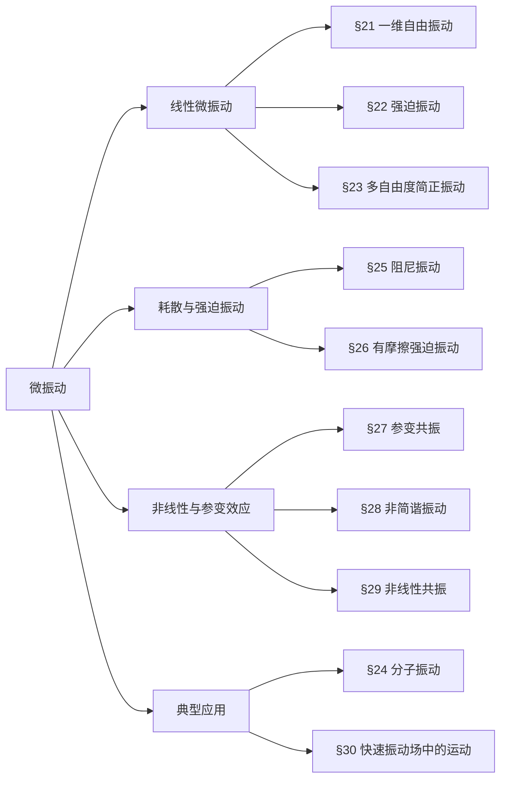

## 一、章节核心框架（思维导图）

## 二、分节核心考点与押题重点
### §21 一维自由振动
#### 核心公式
- 微振动近似：势能展开到二阶 $U(x)\approx\frac{1}{2}kx^2$，动能 $T=\frac{1}{2}m\dot{x}^2$
- 运动方程：$\ddot{x}+\omega^2 x=0$，通解 $x=a\cos(\omega t+\alpha)$
- 初始条件：$a=\sqrt{x_0^2+\frac{v_0^2}{\omega^2}}$，$\tan\alpha=-\frac{v_0}{\omega x_0}$
- 约化质量：双原子分子 $\omega=\sqrt{\frac{k(m_1+m_2)}{m_1m_2}}$
####  考点2号、一维谐振问题（用Lagrange方法和Hamilton方法）（豆包）
#### 一、一维谐振子模型设定
一维谐振子的系统参数：
- 质量：$m$
- 弹性系数：$k$
- 角频率：$\omega = \sqrt{\dfrac{k}{m}}$
- 广义坐标：$x$（位移），广义速度：$\dot{x} = \dfrac{dx}{dt}$

系统的动能和势能分别为：
$$
T = \frac{1}{2} m \dot{x}^2, \quad V = \frac{1}{2} k x^2 = \frac{1}{2} m \omega^2 x^2
$$
#### 二、用 Lagrange 方法求解
##### 步骤1：构造拉格朗日函数
拉格朗日函数定义为 $L = T - V$，代入动能和势能：
$$
L(x, \dot{x}) = \frac{1}{2} m \dot{x}^2 - \frac{1}{2} m \omega^2 x^2
$$

##### 步骤2：代入拉格朗日方程
##### 步骤2：代入拉格朗日方程
拉格朗日方程为：
$$
\frac{d}{dt}\left( \frac{\partial L}{\partial \dot{x}} \right) - \frac{\partial L}{\partial x} = 0
$$

计算偏导数：
$$
\frac{\partial L}{\partial \dot{x}} = m \dot{x}, \quad \frac{\partial L}{\partial x} = -m \omega^2 x
$$

对时间求导：
$$
\frac{d}{dt}\left( \frac{\partial L}{\partial \dot{x}} \right) = m \ddot{x}
$$

代入方程得到运动微分方程：
$$
m \ddot{x} + m \omega^2 x = 0 \quad \Rightarrow \quad \ddot{x} + \omega^2 x = 0
$$

##### 步骤3：求解微分方程
方程的通解为简谐振动形式：
$$
x(t) = A \cos(\omega t + \phi)
$$
其中 $A$ 为振幅，$\phi$ 为初相位，由初始条件确定。
#### 三、用 Hamilton 方法求解
##### 步骤1：定义广义动量与哈密顿函数
广义动量定义为：
$$
p = \frac{\partial L}{\partial \dot{x}} = m \dot{x}
$$

通过勒让德变换构造哈密顿函数 $H(x,p)$：
$$
H = p \dot{x} - L
$$

将 $\dot{x} = \dfrac{p}{m}$ 代入：
$$
H = p \cdot \frac{p}{m} - \left( \frac{1}{2} m \left( \frac{p}{m} \right)^2 - \frac{1}{2} m \omega^2 x^2 \right)
$$
化简得：
$$
H = \frac{p^2}{2m} + \frac{1}{2} m \omega^2 x^2
$$
（注：该系统中 $H$ 等于总机械能 $T+V$）

##### 步骤2：代入Hamilton正则方程
正则方程为：
$$
\begin{cases}
\dot{x} = \dfrac{\partial H}{\partial p} \\[6pt]
\dot{p} = -\dfrac{\partial H}{\partial x}
\end{cases}
$$

计算偏导数：
$$
\frac{\partial H}{\partial p} = \frac{p}{m}, \quad \frac{\partial H}{\partial x} = m \omega^2 x
$$

代入方程得：
$$
\dot{x} = \frac{p}{m}, \quad \dot{p} = -m \omega^2 x
$$

##### 步骤3：消去动量得到运动方程
对第一个方程求导：
$$
\ddot{x} = \frac{\dot{p}}{m}
$$

将 $\dot{p} = -m \omega^2 x$ 代入：
$$
\ddot{x} = -\omega^2 x \quad \Rightarrow \quad \ddot{x} + \omega^2 x = 0
$$

与Lagrange方法得到的微分方程完全一致，通解同样为 $x(t) = A \cos(\omega t + \phi)$。
#### 四、两种方法对比
| 方法 | 核心方程 | 变量 | 特点 |
| :--- | :--- | :--- | :--- |
| Lagrange方法 | $\dfrac{d}{dt}\left( \dfrac{\partial L}{\partial \dot{x}} \right) - \dfrac{\partial L}{\partial x} = 0$ | $x, \dot{x}$ | 二阶微分方程，形式简洁，直接由 $L$ 导出 |
| Hamilton方法 | $\dot{x} = \dfrac{\partial H}{\partial p}, \dot{p} = -\dfrac{\partial H}{\partial x}$ | $x, p$ | 一阶微分方程组，形式对称，便于推广到量子力学 |
### 【作业提及】朗道课本第21节习题4（详细解答）
**题目**：质量为$m$的质点沿着半径为$r$的圆运动，弹簧一端连质点，另一端固定于$A$点，$A$到圆心距离为$l$，弹簧原长为$l$时受力为$F$，求微振动频率。
**解**：
1. 设质点相对平衡位置转过角度$\varphi$（$\varphi\ll1$），弹簧伸长量：
   $$\delta l=\sqrt{(l+r)^2+r^2-2r(l+r)\cos\varphi}-l\approx\frac{r(r+l)}{2l}\varphi^2+\xi_0$$
   其中$\xi_0$为平衡时弹簧伸长量，满足$F=k\xi_0$。
2. 弹性势能（忽略常数项）：
   $$U=\frac{1}{2}k(\delta l)^2\approx\frac{1}{2}k\xi_0\cdot\frac{r(r+l)}{l}\varphi^2=\frac{Fr(r+l)}{2l}\varphi^2$$
3. 质点动能：
   $$T=\frac{1}{2}mr^2\dot{\varphi}^2$$
4. 拉格朗日函数与运动方程：
   $$L=\frac{1}{2}mr^2\dot{\varphi}^2-\frac{Fr(r+l)}{2l}\varphi^2$$
   $$mr^2\ddot{\varphi}+\frac{Fr(r+l)}{l}\varphi=0$$
5. 振动频率：
   $$\omega=\sqrt{\frac{F(r+l)}{rlm}}$$
### §22 强迫振动
#### 核心结论
- 周期性外力$F=f\cos\gamma t$的通解：自由振动（暂态）+ 强迫振动（稳态）
- 共振条件：$\gamma=\omega$，振幅随时间线性增长 $x=\frac{f}{2m\omega}t\sin(\omega t+\beta)$
- 拍现象：$\gamma\approx\omega$时，振幅以频率$|\gamma-\omega|$周期变化
- 有限时间作用力后的振幅：$a=\frac{2F_0}{m\omega^2}\sin\frac{\omega T}{2}$（恒力$F_0$作用时间$T$）
### §23 多自由度系统振动
#### 核心方法
1. 建立拉格朗日函数：$L=\frac{1}{2}\sum_{i,k}(m_{ik}\dot{x}_i\dot{x}_k-k_{ik}x_i x_k)$
2. 设解$x_k=A_k e^{i\omega t}$，代入得特征方程（久期方程）：
   $$\det(-\omega^2 m_{ik}+k_{ik})=0$$
3. 求特征频率$\omega_\alpha$和本征矢量$A_\alpha$，构造简正坐标$Q_\alpha$，使$L$对角化：
   $$L=\frac{1}{2}\sum_\alpha(\dot{Q}_\alpha^2-\omega_\alpha^2 Q_\alpha^2)$$

#### 常考模型
- 耦合振子（习题1）：两个全同振子通过$\alpha xy$耦合，频率$\omega_{1,2}=\sqrt{\omega_0^2\mp\alpha}$
- 平面双摆（习题2）：两个自由度，特征方程解出两个振动频率
- 空间振子（习题3）：轨道为中心在原点的椭圆
## 考点6号、如图所示，一个质量为 $M$ 的斜面体置于光滑水平面上，斜面倾角为 $\alpha$。在斜面上有一个质量为 $m$ 的滑块，滑块通过一根劲度系数为 $k$ 的轻质弹簧与斜面顶端相连。系统（包括水平面与斜面、斜面与滑块之间）**均无摩擦力**。（Gemini3）
**要求：**
1. 写出系统的 **Lagrange 量**；
2. 写出系统的 **运动方程**；
3. 求出系统 **振动频率** 的表达式。

### 2. 知识点归纳与教材对应
本题涵盖了《朗道力学》中最核心的两个部分：
*   **对应教材：**
    *   《朗道理论物理教程 卷1-力学》（第五版）—— **第一章：运动方程（The Equations of Motion）**。
    *   **§4. 拉格朗日函数（The Lagrangian）**：如何选取广义坐标并写出动能与势能。
    *   **§5. 最小作用量原理**：建立欧拉-拉格朗日方程。
    *   **第五章：微振动（Small Oscillations）** —— **§23. 自由的一维振动**。
*   **物理难点：**
    滑块 $m$ 的运动是相对于一个正在运动的参考系（斜面 $M$）进行的。正确写出 $m$ 在**惯性系**中的速度是本题的关键。
### 3. 试题解答
#### 第一步：选取广义坐标
设斜面 $M$ 在水平面上的位移为 $X$；
设滑块 $m$ 相对于斜面的位移为 $x$（以弹簧原长位置为原点，沿斜面向下为正）。
#### 第二步：写出动能 ($T$)
1.  **斜面 $M$ 的动能：** $T_M = \frac{1}{2} M \dot{X}^2$
2.  **滑块 $m$ 的动能：**
    滑块相对于地面的速度矢量 $\vec{v}_m = \vec{v}_M + \vec{v}_{rel}$。
    *   $\vec{v}_M = (\dot{X}, 0)$
    *   $\vec{v}_{rel} = (\dot{x}\cos\alpha, -\dot{x}\sin\alpha)$
    因此，滑块的速度平方为：
    $$v_m^2 = (\dot{X} + \dot{x}\cos\alpha)^2 + (-\dot{x}\sin\alpha)^2 = \dot{X}^2 + \dot{x}^2 + 2\dot{X}\dot{x}\cos\alpha$$
    $$T_m = \frac{1}{2} m (\dot{X}^2 + \dot{x}^2 + 2\dot{X}\dot{x}\cos\alpha)$$
3.  **总动能：**
    $$T = \frac{1}{2}(M+m)\dot{X}^2 + \frac{1}{2}m\dot{x}^2 + m\dot{X}\dot{x}\cos\alpha$$

#### 第三步：写出势能 ($U$)
选取弹簧原长处且 $m$ 在斜面上时的重力势能为零点：
1.  弹簧弹性势能：$\frac{1}{2}kx^2$
2.  滑块重力势能：$-mgx\sin\alpha$
    $$U = \frac{1}{2}kx^2 - mgx\sin\alpha$$
#### 第四步：Lagrange 量 ($L$)
根据 $L = T - U$：
$$L = \frac{1}{2}(M+m)\dot{X}^2 + \frac{1}{2}m\dot{x}^2 + m\dot{X}\dot{x}\cos\alpha - \frac{1}{2}kx^2 + mgx\sin\alpha$$
#### 第五步：运动方程
根据欧拉-拉格朗日方程 $\frac{d}{dt}(\frac{\partial L}{\partial \dot{q}_i}) - \frac{\partial L}{\partial q_i} = 0$：
1.  **对于 $X$ 坐标：**
    $\frac{\partial L}{\partial X} = 0$（$X$ 是循环坐标，动量守恒）
    $$\frac{d}{dt} \left[ (M+m)\dot{X} + m\dot{x}\cos\alpha \right] = 0 \implies (M+m)\ddot{X} + m\ddot{x}\cos\alpha = 0 \quad \text{--- (1)}$$

2.  **对于 $x$ 坐标：**
    $\frac{\partial L}{\partial x} = -kx + mg\sin\alpha$，$\frac{\partial L}{\partial \dot{x}} = m\dot{x} + m\dot{X}\cos\alpha$
    $$m\ddot{x} + m\ddot{X}\cos\alpha + kx = mg\sin\alpha \quad \text{--- (2)}$$
#### 第六步：求解振动频率
为了求振动频率，我们需要消去 $\ddot{X}$。由方程 (1) 得：
$$\ddot{X} = -\frac{m\cos\alpha}{M+m}\ddot{x}$$
代入方程 (2)：
$$m\ddot{x} + m\left( -\frac{m\cos\alpha}{M+m}\ddot{x} \right)\cos\alpha + kx = mg\sin\alpha$$
$$m\left( 1 - \frac{m\cos^2\alpha}{M+m} \right)\ddot{x} + kx = mg\sin\alpha$$
整理括号内的系数：
$$m \left( \frac{M+m - m\cos^2\alpha}{M+m} \right) \ddot{x} + kx = mg\sin\alpha$$
利用 $\sin^2\alpha + \cos^2\alpha = 1$，等式变为：
$$\left( \frac{m(M + m\sin^2\alpha)}{M+m} \right) \ddot{x} + kx = mg\sin\alpha$$

这是一个简谐振动方程（$mg\sin\alpha$ 仅改变平衡位置，不影响频率）。有效质量为 $\mu = \frac{m(M + m\sin^2\alpha)}{M+m}$。
### 4. 结论：输出答案

1.  **Lagrange 量：**
    $$L = \frac{1}{2}(M+m)\dot{X}^2 + \frac{1}{2}m\dot{x}^2 + m\dot{X}\dot{x}\cos\alpha - \frac{1}{2}kx^2 + mgx\sin\alpha$$
2.  **运动方程：**
    $$ \begin{cases} (M+m)\ddot{X} + m\ddot{x}\cos\alpha = 0 \\ m\ddot{x} + m\ddot{X}\cos\alpha + kx = mg\sin\alpha \end{cases} $$
3.  **振动频率 $\omega$：**
    $$\omega = \sqrt{\frac{k(M+m)}{m(M+m\sin^2\alpha)}}$$
#### 备考建议：
*   **坐标系陷阱：** 很多同学会直接写 $T_m = \frac{1}{2}m\dot{x}^2$，这是错误的！因为 $x$ 是相对坐标。在朗道《力学》的体系中，能量必须写在惯性系下。
*   **极限检查：**
    *   若 $M \to \infty$（斜面固定），则 $\omega \to \sqrt{k/m}$，符合预期。
    *   若 $\alpha = 90^\circ$（垂直下落），则 $\omega = \sqrt{k/m}$，此时斜面水平方向不受力。
    这种通过特殊极限验证答案的方法，是咱们南大物理人必备的素养。

### §24 分子振动
#### 核心结论
- 振动自由度：$n$个原子分子，**非线性3n-6个**，**线性3n-5个**
- 约束条件（消除平动+转动）：
  1. 质心不动：$\sum m_a u_a=0$
  2. 总角动量为零：$\sum m_a r_{a0}\times u_a=0$
- 振动分类：线性分子（纵向/横向），平面分子（面内/面外）
#### 【考试重点】朗道课本第24节习题2（详细解答）
**题目**：求三角形$ABA$分子的振动频率，键长$AB=l$，键角$2\alpha$，键伸缩劲度系数$k_1$，弯曲劲度系数$k_2$。
**解**：
1. 坐标设定：$B$在原点，两个$A$原子坐标为$(±l\cos\alpha,l\sin\alpha)$，位移分别为$(x_1,y_1),(x_2,y_2),(x_3,y_3)$。
2. 约束条件：
   $$\begin{cases}
   m_A(x_1+x_3)+m_B x_2=0 \\
   m_A(y_1+y_3)+m_B y_2=0 \\
   (y_1-y_3)\sin\alpha-(x_1+x_3)\cos\alpha=0
   \end{cases}$$
3. 引入简正坐标：
   $$Q_a=x_1+x_3,\quad q_{s1}=x_1-x_3,\quad q_{s2}=y_1+y_3$$
   位移分量：
   $$\begin{cases}
   x_1=\frac{1}{2}(Q_a+q_{s1}),\ x_3=\frac{1}{2}(Q_a-q_{s1}),\ x_2=-\frac{m_A}{m_B}Q_a \\
   y_1=\frac{1}{2}(q_{s2}+Q_a\cot\alpha),\ y_3=\frac{1}{2}(q_{s2}-Q_a\cot\alpha),\ y_2=-\frac{m_A}{m_B}q_{s2}
   \end{cases}$$
4. 键长与键角变化：
   $$\delta l_1=(x_1-x_2)\sin\alpha+(y_1-y_2)\cos\alpha$$
   $$\delta l_2=-(x_3-x_2)\sin\alpha+(y_3-y_2)\cos\alpha$$
   $$\delta=\frac{1}{l}\left[(x_1-x_2)\cos\alpha-(y_1-y_2)\sin\alpha-(x_3-x_2)\cos\alpha-(y_3-y_2)\sin\alpha\right]$$
5. 拉格朗日函数化简（$\mu=2m_A+m_B$）：
   $$\begin{aligned}
   L=&\frac{m_A}{4}\left(\frac{2m_A}{m_B}+\frac{1}{\sin^2\alpha}\right)\dot{Q}_a^2+\frac{m_A}{4}\dot{q}_{s1}^2+\frac{m_A\mu}{4m_B}\dot{q}_{s2}^2 \\
   &-\frac{k_1}{4}\left(\frac{2m_A}{m_B}+\frac{1}{\sin^2\alpha}\right)\left(1+\frac{2m_A}{m_B}\sin^2\alpha\right)Q_a^2 \\
   &-\frac{1}{4}(k_1\sin^2\alpha+2k_2\cos^2\alpha)q_{s1}^2 \\
   &-\frac{\mu^2}{4m_B^2}(k_1\cos^2\alpha+2k_2\sin^2\alpha)q_{s2}^2 \\
   &+\frac{\mu}{2m_B}(2k_2-k_1)\sin\alpha\cos\alpha\cdot q_{s1}q_{s2}
   \end{aligned}$$

6. 频率求解：
   - **反对称振动（$Q_a$）**：无耦合，直接得
     $$\omega_a^2=\frac{k_1}{m_A}\left(1+\frac{2m_A}{m_B}\sin^2\alpha\right)$$
   - **对称振动（$q_{s1},q_{s2}$）**：解二次特征方程
     $$\omega^4-\omega^2\left[\frac{k_1}{m_A}\left(1+\frac{2m_A}{m_B}\cos^2\alpha\right)+\frac{2k_2}{m_A}\left(1+\frac{2m_A}{m_B}\sin^2\alpha\right)\right]+\frac{2\mu k_1k_2}{m_B m_A^2}=0$$
### §25 阻尼振动
#### 核心结论
- 运动方程：$\ddot{x}+2\lambda\dot{x}+\omega_0^2 x=0$，$\lambda=\frac{\alpha}{2m}$（阻尼系数）
- 三种运动状态：

| 状态   | 条件                 | 运动形式                                                                                       |
| ---- | ------------------ | ------------------------------------------------------------------------------------------ |
| 欠阻尼  | $\lambda<\omega_0$ | 振幅衰减振动 $x=ae^{-\lambda t}\cos(\omega t+\alpha)$ $\omega=\sqrt{\omega_0^2-\lambda^2}$ |
| 过阻尼  | $\lambda>\omega_0$ | 单调衰减，无振动                                                                                   |
| 临界阻尼 | $\lambda=\omega_0$ | 最快回到平衡位置                                                                                   |
- 能量耗散：$\frac{dE}{dt}=-2F$，小阻尼下平均能量$\overline{E}=E_0 e^{-2\lambda t}$
### §26 有摩擦的强迫振动
#### 核心公式
- 稳态解：$x=b\cos(\gamma t+\delta)$
- 振幅与相位：
  $$b=\frac{f}{m\sqrt{(\omega_0^2-\gamma^2)^2+4\lambda^2\gamma^2}},\quad \tan\delta=\frac{2\lambda\gamma}{\gamma^2-\omega_0^2}$$
- 共振特性：
  - 振幅最大值在$\gamma=\sqrt{\omega_0^2-2\lambda^2}$
  - 共振曲线半宽度为$\lambda$
  - 相位差从$0$（$\gamma\ll\omega_0$）变到$-\pi$（$\gamma\gg\omega_0$），共振时为$-\pi/2$
- 能量吸收：$I(\gamma)=\lambda mb^2\gamma^2$，共振时吸收最大
### §27 参变共振
#### 核心结论
- 定义：系统参数（如$\omega(t)$）周期性变化导致振幅指数增长
- 典型方程（马蒂厄方程）：$\ddot{x}+\omega_0^2(1+h\cos\gamma t)x=0$（$h\ll1$）
- 最强共振条件：$\gamma\approx2\omega_0$，共振区间
  $$-\frac{h\omega_0}{2}<\varepsilon<\frac{h\omega_0}{2}\quad(\varepsilon=\gamma-2\omega_0)$$
- 有摩擦时：共振区间变窄，存在阈值$h_k=\frac{4\lambda}{\omega_0}$，低于阈值无共振
### §28 非简谐振动
#### 核心结论
- 拉格朗日函数保留到三阶项：$L=\frac{1}{2}(\dot{x}^2-\omega_0^2x^2)-\frac{1}{3}\alpha x^3-\frac{1}{4}\beta x^4$
- 新现象：
  1. 组合频率：$\omega_\alpha\pm\omega_\beta$、$2\omega_\alpha$等
  2. 频率修正：固有频率与振幅有关
     $$\omega=\omega_0+\left(\frac{3\beta}{8\omega_0}-\frac{5\alpha^2}{12\omega_0^3}\right)a^2$$
- 方法：LP逐阶近似，消除共振项（久期项）
### §29 非线性振动中的共振
#### 核心结论
- 杜芬方程：$\ddot{x}+2\lambda\dot{x}+\omega_0^2x=\frac{f}{m}\cos\gamma t-\alpha x^2-\beta x^3$
- 主共振（$\gamma\approx\omega_0$）：
  - 振幅-频率曲线弯曲，存在多值性和滞后现象
  - 阈值振幅：$f_k^2=\frac{32m^2\omega_0^2\lambda^3}{3\sqrt{3}|\kappa|}$（$\kappa$为频率修正系数）
- 其他共振：亚谐波共振（$\gamma\approx\omega_0/2$）、超谐波共振（$\gamma\approx2\omega_0$）
### §30 快速振动场中的运动
#### 核心方法
- 运动分解：$x(t)=X(t)+\xi(t)$（平稳运动+高频微振动）
- 有效势能：$U_{eff}=U+\frac{1}{4m\omega^2}(f_1^2+f_2^2)$
- 经典应用：倒摆稳定（悬挂点竖直高频振动）
  - 稳定条件：$a^2\gamma^2>2gl$（$a$为悬挂点振幅，$\gamma$为振动频率）
## 三、常考题型与知识点对照表
| 题型 | 对应知识点 | 难度 | 易错点 |
|------|------------|------|--------|
| 单自由度频率计算 | §21 微振动近似、拉格朗日方程 | ★★ | 势能展开漏项 |
| 两个自由度耦合振子 | §23 特征方程、简正坐标 | ★★★ | 本征矢量归一化 |
| 分子振动频率 | §24 约束条件、简正振动 | ★★★★ | 约束条件应用错误 |
| 有摩擦强迫振动 | §26 稳态振幅、共振 | ★★★ | 相位差符号 |
| 参变共振条件 | §27 马蒂厄方程 | ★★ | 与普通共振混淆 |
| 快速场有效势能 | §30 平均法 | ★★★ | 有效势能公式记错 |
## 四、考前必背公式速记
1. 简谐振动：$\omega=\sqrt{\frac{k}{m}}$，$E=\frac{1}{2}m\omega^2a^2$
2. 有摩擦强迫振动振幅：$b=\frac{f}{m\sqrt{(\omega_0^2-\gamma^2)^2+4\lambda^2\gamma^2}}$
3. 参变共振最强条件：$\gamma\approx2\omega_0$
4. 非简谐频率修正：$\omega=\omega_0+\left(\frac{3\beta}{8\omega_0}-\frac{5\alpha^2}{12\omega_0^3}\right)a^2$
5. 快速场有效势能：$U_{eff}=U+\frac{1}{4m\omega^2}\overline{f^2}$
## 五、复习建议
1. **优先掌握**：两个自由度系统、线性ABA分子振动、有摩擦强迫振动
2. **重点突破**：21节习题4、24节习题2的完整解题步骤
3. **对比记忆**：普通共振、参变共振、非线性共振的机制和条件
4. **公式推导**：自己推导一遍特征方程、有效势能、频率修正的核心步骤
