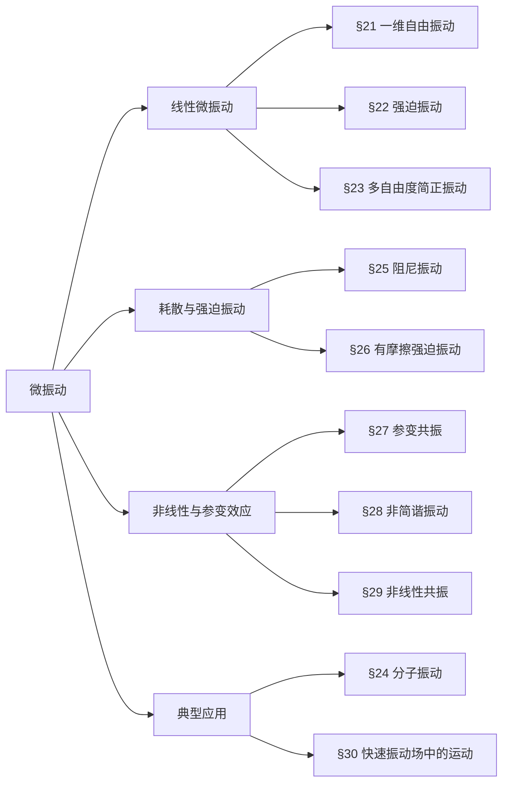

## 一、章节核心框架（思维导图）

## 二、分节核心考点与押题重点
### §21 一维自由振动
#### 核心公式
- 微振动近似：势能展开到二阶 $U(x)\approx\frac{1}{2}kx^2$，动能 $T=\frac{1}{2}m\dot{x}^2$
- 运动方程：$\ddot{x}+\omega^2 x=0$，通解 $x=a\cos(\omega t+\alpha)$
- 初始条件：$a=\sqrt{x_0^2+\frac{v_0^2}{\omega^2}}$，$\tan\alpha=-\frac{v_0}{\omega x_0}$
- 约化质量：双原子分子 $\omega=\sqrt{\frac{k(m_1+m_2)}{m_1m_2}}$
#### 【考试重点】朗道课本第21节习题4（详细解答）
**题目**：质量为$m$的质点沿着半径为$r$的圆运动，弹簧一端连质点，另一端固定于$A$点，$A$到圆心距离为$l$，弹簧原长为$l$时受力为$F$，求微振动频率。
**解**：
1. 设质点相对平衡位置转过角度$\varphi$（$\varphi\ll1$），弹簧伸长量：
   $$\delta l=\sqrt{(l+r)^2+r^2-2r(l+r)\cos\varphi}-l\approx\frac{r(r+l)}{2l}\varphi^2+\xi_0$$
   其中$\xi_0$为平衡时弹簧伸长量，满足$F=k\xi_0$。
2. 弹性势能（忽略常数项）：
   $$U=\frac{1}{2}k(\delta l)^2\approx\frac{1}{2}k\xi_0\cdot\frac{r(r+l)}{l}\varphi^2=\frac{Fr(r+l)}{2l}\varphi^2$$
3. 质点动能：
   $$T=\frac{1}{2}mr^2\dot{\varphi}^2$$
4. 拉格朗日函数与运动方程：
   $$L=\frac{1}{2}mr^2\dot{\varphi}^2-\frac{Fr(r+l)}{2l}\varphi^2$$
   $$mr^2\ddot{\varphi}+\frac{Fr(r+l)}{l}\varphi=0$$
5. 振动频率：
   $$\omega=\sqrt{\frac{F(r+l)}{rlm}}$$
### §22 强迫振动
#### 核心结论
- 周期性外力$F=f\cos\gamma t$的通解：自由振动（暂态）+ 强迫振动（稳态）
- 共振条件：$\gamma=\omega$，振幅随时间线性增长 $x=\frac{f}{2m\omega}t\sin(\omega t+\beta)$
- 拍现象：$\gamma\approx\omega$时，振幅以频率$|\gamma-\omega|$周期变化
- 有限时间作用力后的振幅：$a=\frac{2F_0}{m\omega^2}\sin\frac{\omega T}{2}$（恒力$F_0$作用时间$T$）
### §23 多自由度系统振动
#### 核心方法
1. 建立拉格朗日函数：$L=\frac{1}{2}\sum_{i,k}(m_{ik}\dot{x}_i\dot{x}_k-k_{ik}x_i x_k)$
2. 设解$x_k=A_k e^{i\omega t}$，代入得特征方程（久期方程）：
   $$\det(-\omega^2 m_{ik}+k_{ik})=0$$
3. 求特征频率$\omega_\alpha$和本征矢量$A_\alpha$，构造简正坐标$Q_\alpha$，使$L$对角化：
   $$L=\frac{1}{2}\sum_\alpha(\dot{Q}_\alpha^2-\omega_\alpha^2 Q_\alpha^2)$$

#### 常考模型
- 耦合振子（习题1）：两个全同振子通过$\alpha xy$耦合，频率$\omega_{1,2}=\sqrt{\omega_0^2\mp\alpha}$
- 平面双摆（习题2）：两个自由度，特征方程解出两个振动频率
- 空间振子（习题3）：轨道为中心在原点的椭圆
### §24 分子振动
#### 核心结论
- 振动自由度：$n$个原子分子，**非线性3n-6个**，**线性3n-5个**
- 约束条件（消除平动+转动）：
  1. 质心不动：$\sum m_a u_a=0$
  2. 总角动量为零：$\sum m_a r_{a0}\times u_a=0$
- 振动分类：线性分子（纵向/横向），平面分子（面内/面外）
#### 【考试重点】朗道课本第24节习题2（详细解答）
**题目**：求三角形$ABA$分子的振动频率，键长$AB=l$，键角$2\alpha$，键伸缩劲度系数$k_1$，弯曲劲度系数$k_2$。
**解**：
1. 坐标设定：$B$在原点，两个$A$原子坐标为$(±l\cos\alpha,l\sin\alpha)$，位移分别为$(x_1,y_1),(x_2,y_2),(x_3,y_3)$。
2. 约束条件：
   $$\begin{cases}
   m_A(x_1+x_3)+m_B x_2=0 \\
   m_A(y_1+y_3)+m_B y_2=0 \\
   (y_1-y_3)\sin\alpha-(x_1+x_3)\cos\alpha=0
   \end{cases}$$
3. 引入简正坐标：
   $$Q_a=x_1+x_3,\quad q_{s1}=x_1-x_3,\quad q_{s2}=y_1+y_3$$
   位移分量：
   $$\begin{cases}
   x_1=\frac{1}{2}(Q_a+q_{s1}),\ x_3=\frac{1}{2}(Q_a-q_{s1}),\ x_2=-\frac{m_A}{m_B}Q_a \\
   y_1=\frac{1}{2}(q_{s2}+Q_a\cot\alpha),\ y_3=\frac{1}{2}(q_{s2}-Q_a\cot\alpha),\ y_2=-\frac{m_A}{m_B}q_{s2}
   \end{cases}$$
4. 键长与键角变化：
   $$\delta l_1=(x_1-x_2)\sin\alpha+(y_1-y_2)\cos\alpha$$
   $$\delta l_2=-(x_3-x_2)\sin\alpha+(y_3-y_2)\cos\alpha$$
   $$\delta=\frac{1}{l}\left[(x_1-x_2)\cos\alpha-(y_1-y_2)\sin\alpha-(x_3-x_2)\cos\alpha-(y_3-y_2)\sin\alpha\right]$$
5. 拉格朗日函数化简（$\mu=2m_A+m_B$）：
   $$\begin{aligned}
   L=&\frac{m_A}{4}\left(\frac{2m_A}{m_B}+\frac{1}{\sin^2\alpha}\right)\dot{Q}_a^2+\frac{m_A}{4}\dot{q}_{s1}^2+\frac{m_A\mu}{4m_B}\dot{q}_{s2}^2 \\
   &-\frac{k_1}{4}\left(\frac{2m_A}{m_B}+\frac{1}{\sin^2\alpha}\right)\left(1+\frac{2m_A}{m_B}\sin^2\alpha\right)Q_a^2 \\
   &-\frac{1}{4}(k_1\sin^2\alpha+2k_2\cos^2\alpha)q_{s1}^2 \\
   &-\frac{\mu^2}{4m_B^2}(k_1\cos^2\alpha+2k_2\sin^2\alpha)q_{s2}^2 \\
   &+\frac{\mu}{2m_B}(2k_2-k_1)\sin\alpha\cos\alpha\cdot q_{s1}q_{s2}
   \end{aligned}$$

6. 频率求解：
   - **反对称振动（$Q_a$）**：无耦合，直接得
     $$\omega_a^2=\frac{k_1}{m_A}\left(1+\frac{2m_A}{m_B}\sin^2\alpha\right)$$
   - **对称振动（$q_{s1},q_{s2}$）**：解二次特征方程
     $$\omega^4-\omega^2\left[\frac{k_1}{m_A}\left(1+\frac{2m_A}{m_B}\cos^2\alpha\right)+\frac{2k_2}{m_A}\left(1+\frac{2m_A}{m_B}\sin^2\alpha\right)\right]+\frac{2\mu k_1k_2}{m_B m_A^2}=0$$
### §25 阻尼振动
#### 核心结论
- 运动方程：$\ddot{x}+2\lambda\dot{x}+\omega_0^2 x=0$，$\lambda=\frac{\alpha}{2m}$（阻尼系数）
- 三种运动状态：

| 状态   | 条件                 | 运动形式                                                                                       |
| ---- | ------------------ | ------------------------------------------------------------------------------------------ |
| 欠阻尼  | $\lambda<\omega_0$ | 振幅衰减振动 $x=ae^{-\lambda t}\cos(\omega t+\alpha)$ $\omega=\sqrt{\omega_0^2-\lambda^2}$ |
| 过阻尼  | $\lambda>\omega_0$ | 单调衰减，无振动                                                                                   |
| 临界阻尼 | $\lambda=\omega_0$ | 最快回到平衡位置                                                                                   |
- 能量耗散：$\frac{dE}{dt}=-2F$，小阻尼下平均能量$\overline{E}=E_0 e^{-2\lambda t}$
### §26 有摩擦的强迫振动
#### 核心公式
- 稳态解：$x=b\cos(\gamma t+\delta)$
- 振幅与相位：
  $$b=\frac{f}{m\sqrt{(\omega_0^2-\gamma^2)^2+4\lambda^2\gamma^2}},\quad \tan\delta=\frac{2\lambda\gamma}{\gamma^2-\omega_0^2}$$
- 共振特性：
  - 振幅最大值在$\gamma=\sqrt{\omega_0^2-2\lambda^2}$
  - 共振曲线半宽度为$\lambda$
  - 相位差从$0$（$\gamma\ll\omega_0$）变到$-\pi$（$\gamma\gg\omega_0$），共振时为$-\pi/2$
- 能量吸收：$I(\gamma)=\lambda mb^2\gamma^2$，共振时吸收最大
### §27 参变共振
#### 核心结论
- 定义：系统参数（如$\omega(t)$）周期性变化导致振幅指数增长
- 典型方程（马蒂厄方程）：$\ddot{x}+\omega_0^2(1+h\cos\gamma t)x=0$（$h\ll1$）
- 最强共振条件：$\gamma\approx2\omega_0$，共振区间
  $$-\frac{h\omega_0}{2}<\varepsilon<\frac{h\omega_0}{2}\quad(\varepsilon=\gamma-2\omega_0)$$
- 有摩擦时：共振区间变窄，存在阈值$h_k=\frac{4\lambda}{\omega_0}$，低于阈值无共振
### §28 非简谐振动
#### 核心结论
- 拉格朗日函数保留到三阶项：$L=\frac{1}{2}(\dot{x}^2-\omega_0^2x^2)-\frac{1}{3}\alpha x^3-\frac{1}{4}\beta x^4$
- 新现象：
  1. 组合频率：$\omega_\alpha\pm\omega_\beta$、$2\omega_\alpha$等
  2. 频率修正：固有频率与振幅有关
     $$\omega=\omega_0+\left(\frac{3\beta}{8\omega_0}-\frac{5\alpha^2}{12\omega_0^3}\right)a^2$$
- 方法：LP逐阶近似，消除共振项（久期项）
### §29 非线性振动中的共振
#### 核心结论
- 杜芬方程：$\ddot{x}+2\lambda\dot{x}+\omega_0^2x=\frac{f}{m}\cos\gamma t-\alpha x^2-\beta x^3$
- 主共振（$\gamma\approx\omega_0$）：
  - 振幅-频率曲线弯曲，存在多值性和滞后现象
  - 阈值振幅：$f_k^2=\frac{32m^2\omega_0^2\lambda^3}{3\sqrt{3}|\kappa|}$（$\kappa$为频率修正系数）
- 其他共振：亚谐波共振（$\gamma\approx\omega_0/2$）、超谐波共振（$\gamma\approx2\omega_0$）
### §30 快速振动场中的运动
#### 核心方法
- 运动分解：$x(t)=X(t)+\xi(t)$（平稳运动+高频微振动）
- 有效势能：$U_{eff}=U+\frac{1}{4m\omega^2}(f_1^2+f_2^2)$
- 经典应用：倒摆稳定（悬挂点竖直高频振动）
  - 稳定条件：$a^2\gamma^2>2gl$（$a$为悬挂点振幅，$\gamma$为振动频率）
## 三、常考题型与知识点对照表
| 题型 | 对应知识点 | 难度 | 易错点 |
|------|------------|------|--------|
| 单自由度频率计算 | §21 微振动近似、拉格朗日方程 | ★★ | 势能展开漏项 |
| 两个自由度耦合振子 | §23 特征方程、简正坐标 | ★★★ | 本征矢量归一化 |
| 分子振动频率 | §24 约束条件、简正振动 | ★★★★ | 约束条件应用错误 |
| 有摩擦强迫振动 | §26 稳态振幅、共振 | ★★★ | 相位差符号 |
| 参变共振条件 | §27 马蒂厄方程 | ★★ | 与普通共振混淆 |
| 快速场有效势能 | §30 平均法 | ★★★ | 有效势能公式记错 |
## 四、考前必背公式速记
1. 简谐振动：$\omega=\sqrt{\frac{k}{m}}$，$E=\frac{1}{2}m\omega^2a^2$
2. 有摩擦强迫振动振幅：$b=\frac{f}{m\sqrt{(\omega_0^2-\gamma^2)^2+4\lambda^2\gamma^2}}$
3. 参变共振最强条件：$\gamma\approx2\omega_0$
4. 非简谐频率修正：$\omega=\omega_0+\left(\frac{3\beta}{8\omega_0}-\frac{5\alpha^2}{12\omega_0^3}\right)a^2$
5. 快速场有效势能：$U_{eff}=U+\frac{1}{4m\omega^2}\overline{f^2}$
## 五、复习建议
1. **优先掌握**：两个自由度系统、线性ABA分子振动、有摩擦强迫振动
2. **重点突破**：21节习题4、24节习题2的完整解题步骤
3. **对比记忆**：普通共振、参变共振、非线性共振的机制和条件
4. **公式推导**：自己推导一遍特征方程、有效势能、频率修正的核心步骤
