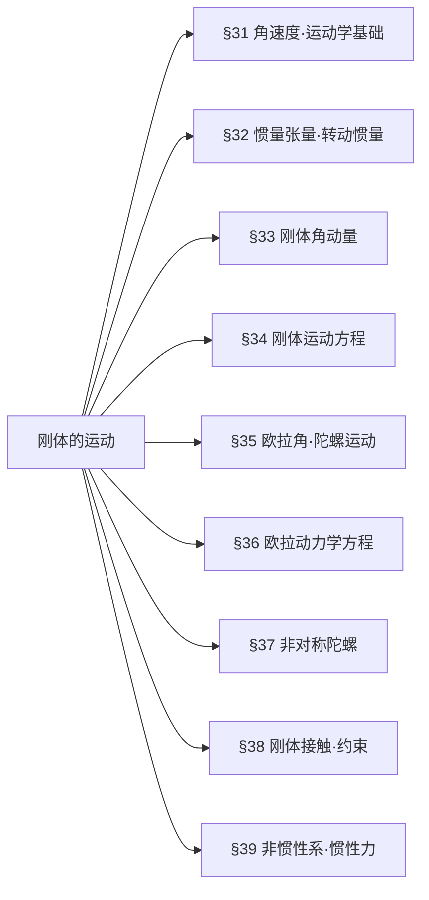

## 一、章节思维导图（LR左→右模式）

## 二、分节核心知识点（极简提纲）
### §31 角速度｜运动学基础
1. 速度公式
$\boldsymbol{v}=\boldsymbol{V}+\boldsymbol{\Omega}\times\boldsymbol{r}$
2. 核心性质
$\boldsymbol{\Omega}$ 是刚体整体属性，与原点选取无关
3. 运动分解
- $\boldsymbol{V}\cdot\boldsymbol{\Omega}=0$：平面平行运动，存在**瞬时转动中心**
- $\boldsymbol{V}\cdot\boldsymbol{\Omega}\neq0$：螺旋运动（转动+沿轴平动）
### §32 惯量张量｜必考基础
1. 定义
$I_{ik}=\sum m\left(x_l^2\delta_{ik}-x_ix_k\right)$
2. 主轴化
对称张量可对角化，得主转动惯量$I_1,I_2,I_3$
3. 平行轴定理
$I'_{ik}=I_{ik}+\mu\left(a^2\delta_{ik}-a_ia_k\right)$
常用：$I'=I+\mu a^2$
4. 转动动能（主轴系）
$T_{\text{rot}}=\frac{1}{2}\left(I_1\Omega_1^2+I_2\Omega_2^2+I_3\Omega_3^2\right)$
### §33 刚体角动量
1. 角动量与角速度关系
$M_i=I_{ik}\Omega_k$，主轴系：$M_1=I_1\Omega_1,M_2=I_2\Omega_2,M_3=I_3\Omega_3$
2. 对称陀螺（$I_1=I_2\neq I_3$）
- $\boldsymbol{M},\boldsymbol{\Omega},$对称轴**三者共面**
- 运动：**规则进动**（自转+绕$\boldsymbol{M}$匀速进动）
### §34 刚体运动方程
1. 质心运动定理
$\dfrac{d\boldsymbol{P}}{dt}=\boldsymbol{F},\ \boldsymbol{P}=\mu\boldsymbol{V}$
2. 角动量定理
$\dfrac{d\boldsymbol{M}}{dt}=\boldsymbol{K}$（$\boldsymbol{K}$为外力矩）
3. 内力性质
矢量和为0、力矩和为0、做功为0
### §35 欧拉角｜陀螺核心工具
1. 欧拉角：$\varphi$进动、$\theta$章动、$\psi$自转
2. 欧拉运动学方程
$$
\begin{cases}
\Omega_1=\dot{\varphi}\sin\theta\sin\psi+\dot{\theta}\cos\psi\\
\Omega_2=\dot{\varphi}\sin\theta\cos\psi-\dot{\theta}\sin\psi\\
\Omega_3=\dot{\varphi}\cos\theta+\dot{\psi}
\end{cases}
$$
3. 对称陀螺动能
$T_{\text{rot}}=\frac{I_1}{2}\left(\dot{\varphi}^2\sin^2\theta+\dot{\theta}^2\right)+\frac{I_3}{2}\left(\dot{\varphi}\cos\theta+\dot{\psi}\right)^2$

### §36 欧拉方程
1. 导数变换
$\dfrac{d\boldsymbol{A}}{dt}=\dfrac{d'\boldsymbol{A}}{dt}+\boldsymbol{\Omega}\times\boldsymbol{A}$
2. 主轴系欧拉方程
$$
\begin{cases}
I_1\dot{\Omega}_1+(I_3-I_2)\Omega_2\Omega_3=K_1\\
I_2\dot{\Omega}_2+(I_1-I_3)\Omega_3\Omega_1=K_2\\
I_3\dot{\Omega}_3+(I_2-I_1)\Omega_1\Omega_2=K_3
\end{cases}
$$
### §37 非对称陀螺
1. 稳定性
绕**最大/最小**主惯量轴转动**稳定**，绕中间轴**不稳定**
2. 几何描述
惯量椭球在**不变平面**上无滑滚动（Poinsot方法）
### §38 刚体接触·约束
1. 平衡条件
$\sum\boldsymbol{F}=0,\ \sum\boldsymbol{r}\times\boldsymbol{F}=0$
2. 纯滚动约束
接触点速度$\boldsymbol{v}_c=0$（非完整约束）
3. 脱离判据
**法向约束力$N=0$**
### §39 非惯性系
1. 拉格朗日函数
$L=\frac{1}{2}mv^2+mv\cdot(\boldsymbol{\Omega}\times\boldsymbol{r})+\frac{1}{2}m(\boldsymbol{\Omega}\times\boldsymbol{r})^2-m\boldsymbol{W}\cdot\boldsymbol{r}-U$
2. 惯性力
- 科里奥利力：$\boldsymbol{F}_c=2m\boldsymbol{v}\times\boldsymbol{\Omega}$
- 离心力：$\boldsymbol{F}_f=m\boldsymbol{\Omega}\times(\boldsymbol{r}\times\boldsymbol{\Omega})$
## 三、【考试重点】押题考点（详细推导版）
### 重点1：最小作用量原理→Lagrange方程→Hamilton正则方程
1. 最小作用量原理
$\delta S=\delta\int_{t_1}^{t_2}Ldt=0,\ L=T-U$
边界条件：$\delta q(t_1)=\delta q(t_2)=0$

2. 推导Lagrange方程
$\delta S=\int_{t_1}^{t_2}\left(\frac{\partial L}{\partial q}\delta q+\frac{\partial L}{\partial\dot{q}}\delta\dot{q}\right)dt=0$
分部积分得：
$\boxed{\dfrac{d}{dt}\left(\dfrac{\partial L}{\partial\dot{q}}\right)-\dfrac{\partial L}{\partial q}=0}$

3. 推导Hamilton方程
定义广义动量：$p_i=\dfrac{\partial L}{\partial\dot{q}_i}$
勒让德变换：$H=\sum p_i\dot{q}_i-L$
全微分对比得：
$\boxed{\dot{q}_i=\dfrac{\partial H}{\partial p_i},\ \dot{p}_i=-\dfrac{\partial H}{\partial q_i}}$

### 重点2：一维谐振子（Lagrange+Hamilton方法）
1. Lagrange方法
$L=\frac{1}{2}m\dot{x}^2-\frac{1}{2}m\omega^2x^2$
代入方程得：$\ddot{x}+\omega^2x=0$

2. Hamilton方法
$p=m\dot{x},\ H=\dfrac{p^2}{2m}+\frac{1}{2}m\omega^2x^2$
正则方程：$\dot{x}=\dfrac{p}{m},\ \dot{p}=-m\omega^2x$
消去$p$得同解。

### 重点3：有心力场Lagrange/Hamilton量
球坐标动能：$T=\frac{1}{2}m(\dot{r}^2+r^2\dot{\theta}^2+r^2\sin^2\theta\dot{\phi}^2)$
Lagrange量：$L=T-V(r)$
Hamilton量：$H=\dfrac{p_r^2}{2m}+\dfrac{p_\theta^2}{2mr^2}+\dfrac{p_\phi^2}{2mr^2\sin^2\theta}+V(r)$

### 重点4：电磁场中带电粒子Hamilton量
Lagrange量：$L=\frac{1}{2}m\dot{x}^2+q\boldsymbol{A}\cdot\dot{\boldsymbol{x}}$
正则动量：$p=m\dot{x}+q\boldsymbol{A}$
Hamilton量：$\boxed{H=\dfrac{(\boldsymbol{p}-q\boldsymbol{A})^2}{2m}}$

### 重点5：对称陀螺$\omega,\xi,\theta_0$关系
已知：进动$\omega$，自转$\xi$，夹角$\theta_0$，$I_1=I_2\neq I_3$
角速度分量：
$\Omega_1=\omega\sin\theta_0\sin\psi,\ \Omega_2=\omega\sin\theta_0\cos\psi,\ \Omega_3=\omega\cos\theta_0+\xi$
角动量守恒联立得：
$\boxed{(I_1-I_3)\omega\cos\theta_0=I_3\xi}$

### 重点6：斜面+滑块+弹簧系统（Lagrange量+频率）
广义坐标：斜面位移$X$，滑块相对位移$x$
总动能：$T=\frac{1}{2}(M+m)\dot{X}^2+\frac{1}{2}m\dot{x}^2+m\dot{X}\dot{x}\cos\alpha$
势能：$U=\frac{1}{2}kx^2-mgx\sin\alpha$
Lagrange量：$L=T-U$
运动方程：
$\begin{cases}(M+m)\ddot{X}+m\ddot{x}\cos\alpha=0\\m\ddot{x}+m\ddot{X}\cos\alpha+kx=mg\sin\alpha\end{cases}$
振动频率：
$\boxed{\omega=\sqrt{\dfrac{k(M+m)}{m(M+m\sin^2\alpha)}}}$

### 重点7：氢原子Sommerfeld量子化
角动量量子化：$\oint p_\phi d\phi=nh\Rightarrow L=n\hbar$
轨道半径：$r_n=\dfrac{n^2\hbar^2}{me^2}$
能量量子化：$E_n=-\dfrac{me^4}{2\hbar^2n^2}$

### 重点8：均质杆光滑下滑脱离墙面（必考推导）
1. 广义坐标：杆与水平面夹角$\alpha$
2. 动能：$T=\frac{1}{6}ML^2\dot{\alpha}^2$（平动+转动）
3. 势能：$U=\frac{1}{2}MgL\sin\alpha$
4. 能量守恒：$\dot{\alpha}^2=\dfrac{3g}{L}(\sin\alpha_0-\sin\alpha)$
5. 脱离判据：$\ddot{x}_c=0\Rightarrow\cos\alpha\dot{\alpha}^2+\sin\alpha\ddot{\alpha}=0$
6. 最终结果：
$\boxed{\sin\alpha=\dfrac{2}{3}\sin\alpha_0}$
## 四、核心公式对照表

| 物理量 | 公式 |
|--------|------|
| 刚体速度 | $\boldsymbol{v}=\boldsymbol{V}+\boldsymbol{\Omega}\times\boldsymbol{r}$ |
| 惯量张量 | $I_{ik}=\sum m(x_l^2\delta_{ik}-x_ix_k)$ |
| 转动动能 | $T_{\text{rot}}=\frac{1}{2}\sum I_i\Omega_i^2$ |
| 角动量 | $M_i=I_{ik}\Omega_k$ |
| 欧拉方程 | $I_i\dot{\Omega}_i+(I_j-I_k)\Omega_j\Omega_k=K_i$ |
| 纯滚动 | $v=\Omega R$ |
| 科里奥利力 | $\boldsymbol{F}_c=2m\boldsymbol{v}\times\boldsymbol{\Omega}$ |
