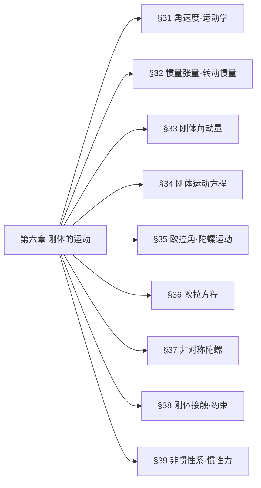

## 一、章节思维导图

## 二、分节极简核心提纲
### §31 角速度｜运动学基础
1. 刚体任意点速度
$$\boldsymbol{v}=\boldsymbol{V}+\boldsymbol{\Omega}\times\boldsymbol{r}$$
2. 核心性质：$\boldsymbol{\Omega}$ 与刚体固连坐标系原点**无关**
3. 运动分类
- $\boldsymbol{V}\cdot\boldsymbol{\Omega}=0$：平面平行运动，存在**瞬时转动中心**
- $\boldsymbol{V}\cdot\boldsymbol{\Omega}\neq0$：螺旋运动（转动+沿轴平动）
### §32 惯量张量｜必考基础
1. 定义
$$I_{ik}=\sum m\left(x_l^2\delta_{ik}-x_ix_k\right)$$
2. 矩阵形式
$$\boldsymbol{I}=\begin{pmatrix}
\sum m(y^2+z^2) & -\sum mxy & -\sum mxz \\
-\sum myx & \sum m(x^2+z^2) & -\sum myz \\
-\sum mzx & -\sum mzy & \sum m(x^2+y^2)
\end{pmatrix}$$
3. 平行轴定理
$$I'_{ik}=I_{ik}+\mu\left(a^2\delta_{ik}-a_ia_k\right),\quad I'=I+\mu a^2$$
4. 转动动能（主轴系）
$$T_{\text{rot}}=\frac{1}{2}\left(I_1\Omega_1^2+I_2\Omega_2^2+I_3\Omega_3^2\right)$$
5. 刚体分类
- 非对称陀螺：$I_1\neq I_2\neq I_3$
- 对称陀螺：$I_1=I_2\neq I_3$
- 球陀螺：$I_1=I_2=I_3$
### §33 刚体角动量
1. 角动量与角速度关系
$$M_i=I_{ik}\Omega_k$$
主轴系：$M_1=I_1\Omega_1,\;M_2=I_2\Omega_2,\;M_3=I_3\Omega_3$
2. 关键结论：一般 $\boldsymbol{M}$ 与 $\boldsymbol{\Omega}$ **不共线**，仅沿主轴时共线
3. 对称陀螺自由转动：**规则进动**（自转+绕$\boldsymbol{M}$匀速进动）
### §34 刚体运动方程
1. 质心运动定理
$$\frac{d\boldsymbol{P}}{dt}=\boldsymbol{F},\quad \boldsymbol{P}=\mu\boldsymbol{V}$$
2. 角动量定理（相对质心）
$$\frac{d\boldsymbol{M}}{dt}=\boldsymbol{K}$$
3. 力矩平移关系
$$\boldsymbol{K}=\boldsymbol{K}'+\boldsymbol{a}\times\boldsymbol{F}$$
4. 内力性质：矢量和=0、力矩和=0、做功=0
### §35 欧拉角｜陀螺核心工具
1. 欧拉角：$\varphi$（进动）、$\theta$（章动）、$\psi$（自转）
2. 欧拉运动学方程
$$
\begin{cases}
\Omega_1=\dot{\varphi}\sin\theta\sin\psi+\dot{\theta}\cos\psi \\
\Omega_2=\dot{\varphi}\sin\theta\cos\psi-\dot{\theta}\sin\psi \\
\Omega_3=\dot{\varphi}\cos\theta+\dot{\psi}
\end{cases}
$$
3. 对称陀螺动能
$$T_{\text{rot}}=\frac{I_1}{2}\left(\dot{\varphi}^2\sin^2\theta+\dot{\theta}^2\right)+\frac{I_3}{2}\left(\dot{\varphi}\cos\theta+\dot{\psi}\right)^2$$
4. 对称重陀螺：3个守恒量（$M_Z$、$M_3$、$E$）
### §36 欧拉方程
1. 矢量导数变换
$$\frac{d\boldsymbol{A}}{dt}=\frac{d'\boldsymbol{A}}{dt}+\boldsymbol{\Omega}\times\boldsymbol{A}$$
2. 主轴系欧拉动力学方程
$$
\begin{cases}
I_1\dot{\Omega}_1+(I_3-I_2)\Omega_2\Omega_3=K_1 \\
I_2\dot{\Omega}_2+(I_1-I_3)\Omega_3\Omega_1=K_2 \\
I_3\dot{\Omega}_3+(I_2-I_1)\Omega_1\Omega_2=K_3
\end{cases}
$$
3. 自由对称陀螺：$\Omega_3=\text{const}$，$\Omega_1,\Omega_2$ 简谐变化
### §37 非对称陀螺
1. 稳定性：绕**最大/最小**主惯量轴转动**稳定**，绕中间轴**不稳定**
2. 守恒律：能量$E$、角动量大小$M$ 守恒
3. 运动描述：惯量椭球在**不变平面**无滑滚动（Poinsot 方法）
### §38 刚体接触·约束
1. 静平衡条件
$$\sum\boldsymbol{F}=0,\quad \sum\boldsymbol{r}\times\boldsymbol{F}=0$$
2. 纯滚动约束（非完整）
$$\boldsymbol{V}+\boldsymbol{\Omega}\times\boldsymbol{R}=0$$
3. 拉格朗日乘子法（约束系统）
$$\frac{d}{dt}\frac{\partial L}{\partial\dot{q}_i}-\frac{\partial L}{\partial q_i}=\sum\lambda_\alpha c_{\alpha i}$$
### §39 非惯性系·惯性力
1. 非惯性系拉格朗日量
$$L=\frac{1}{2}mv^2+mv\cdot(\boldsymbol{\Omega}\times\boldsymbol{r})+\frac{1}{2}m(\boldsymbol{\Omega}\times\boldsymbol{r})^2-m\boldsymbol{W}\cdot\boldsymbol{r}-U$$
2. 惯性力
- 科里奥利力：$\boldsymbol{F}_C=2m\boldsymbol{v}\times\boldsymbol{\Omega}$
- 离心力：$\boldsymbol{F}_f=m\boldsymbol{\Omega}\times(\boldsymbol{r}\times\boldsymbol{\Omega})$

## 三、核心公式速查表

| 物理内容 | 公式 |
|---------|------|
| 刚体速度 | $\boldsymbol{v}=\boldsymbol{V}+\boldsymbol{\Omega}\times\boldsymbol{r}$ |
| 惯量张量 | $I_{ik}=\sum m(x_l^2\delta_{ik}-x_ix_k)$ |
| 平行轴定理 | $I'=I+\mu a^2$ |
| 转动动能 | $T_{\text{rot}}=\frac{1}{2}\sum I_i\Omega_i^2$ |
| 角动量 | $M_i=I_{ik}\Omega_k$ |
| 欧拉运动学方程 | $\Omega_1=\dot{\varphi}\sin\theta\sin\psi+\dot{\theta}\cos\psi$ |
| 欧拉动力学方程 | $I_i\dot{\Omega}_i+(I_j-I_k)\Omega_j\Omega_k=K_i$ |
| 平衡条件 | $\sum\boldsymbol{F}=0,\;\sum\boldsymbol{r}\times\boldsymbol{F}=0$ |
| 科里奥利力 | $\boldsymbol{F}_C=2m\boldsymbol{v}\times\boldsymbol{\Omega}$ |
## 四、押题详细推导
## 考点5号、对称陀螺绕 $z$ 和 $z'$ 轴旋转运动，角速度分别为 $\omega$ 和 $\xi$。$z$ 轴和 $z'$ 轴间的夹角固定为 $\theta_0$。请讨论 $\omega, \theta_0, \xi$ 所满足的关系。（Gemini3）
*   **已知条件：**
    *   $z$ 轴：空间固定坐标系的轴（通常对应总角动量 $\vec{M}$ 的方向）。
    *   $z'$ 轴：陀螺的自转对称轴（对应体坐标系中的 $x_3$ 轴）。
    *   $\omega$：进动角速度（Precession rate，即 $\dot{\phi}$）。
    *   $\xi$：自转角速度（Intrinsic rotation rate，即 $\dot{\psi}$）。
    *   $\theta_0$：章动角（Nutation angle），此处为常数，表示陀螺做**等速进动**。

### 知识点归纳与教材对应
本题的核心知识点属于刚体运动学与动力学的结合，特别是关于**自由对称陀螺**的运动描述。
*   **对应教材：**
    *   《朗道理论物理教程 卷1-力学》（第五版）—— **第六章：刚体的运动（The Motion of a Rigid Body）**。
    *   具体涉及：
        *   **§33 角速度（Angular Velocity）**：欧拉角（Euler angles）与角速度分量的关系。
        *   **§35 陀螺（Tops）**：对称陀螺的自由运动，角动量分量。
*   **物理背景：**
    在没有外力矩（或力矩平衡）的情况下，对称陀螺绕其对称轴 $z'$ 旋转，同时对称轴绕空间固定方向 $z$ 旋转。我们需要建立进动速率、自转速率与几何角度之间的动力学联系。
### 3. 试题解答
我们要习惯用朗道的视角，通过分量合成与角动量守恒来解决。
#### 第一步：建立坐标系与欧拉角描述
设 $z$ 轴为空间固定轴，并取总角动量 $\vec{M}$ 沿 $z$ 轴方向。
按照欧拉角的定义（参考朗道图 47）：
*   进动角速度 $\dot{\phi} = \omega$。
*   自转角速度 $\dot{\psi} = \xi$。
*   章动角 $\theta = \theta_0$（常数），故 $\dot{\theta} = 0$。
#### 第二步：写出角速度在体坐标系（$x_1, x_2, x_3$）中的分量
根据朗道教材式 (33.5)，在体坐标系中（$x_3$ 与 $z'$ 重合）：
$$
\begin{cases}
\Omega_1 = \omega \sin \theta_0 \sin \psi \\
\Omega_2 = \omega \sin \theta_0 \cos \psi \\
\Omega_3 = \omega \cos \theta_0 + \xi
\end{cases}
$$
其中 $\Omega_3$ 是总角速度在对称轴方向的分量。
#### 第三步：建立动力学关系（角动量法）
对于对称陀螺，其转动惯量主值为 $I_1 = I_2 \neq I_3$。
角动量 $\vec{M}$ 在体坐标系中的分量为：
$$
\begin{cases}
M_1 = I_1 \Omega_1 = I_1 \omega \sin \theta_0 \sin \psi \\
M_2 = I_1 \Omega_2 = I_1 \omega \sin \theta_0 \cos \psi \\
M_3 = I_3 \Omega_3 = I_3 (\omega \cos \theta_0 + \xi)
\end{cases}
$$

由于 $M_z$ 是总角动量，根据几何关系，$\vec{M}$ 在垂直于 $z'$ 轴平面上的分量大小应为 $M \sin \theta_0$：
$$ M_{\perp} = \sqrt{M_1^2 + M_2^2} = I_1 \omega \sin \theta_0 $$
从这里我们可以得到总角动量的大小：
$$ M = \frac{M_{\perp}}{\sin \theta_0} = I_1 \omega $$

同时，角动量在对称轴 $z'$ 上的分量 $M_3$ 满足：
$$ M_3 = M \cos \theta_0 $$
#### 第四步：推导最终关系式
将上述式子联立：
$$ I_3 (\omega \cos \theta_0 + \xi) = (I_1 \omega) \cos \theta_0 $$

整理该等式：
$$ I_3 \xi = I_1 \omega \cos \theta_0 - I_3 \omega \cos \theta_0 $$
$$ I_3 \xi = (I_1 - I_3) \omega \cos \theta_0 $$

或者写成关于进动角速度 $\omega$ 的表达式：
$$ \omega = \frac{I_3 \xi}{(I_1 - I_3) \cos \theta_0} $$
### 4. 结论与总结

**该对称陀螺运动中 $\omega, \theta_0, \xi$ 所满足的关系式为：**
$$ (I_1 - I_3) \omega \cos \theta_0 = I_3 \xi $$
#### 备考建议：
1.  **物理直观：** 这个公式揭示了，对于**扁平对称陀螺**（$I_1 < I_3$），自转 $\xi$ 与进动 $\omega$ 的方向关系；对于**细长对称陀螺**（$I_1 > I_3$），情况则相反。
2.  **考试陷阱：** 很多同学容易混淆 $\Omega_3$（总角速度分量）和 $\xi$（自转速率）。在朗道的框架下，$\Omega_3 = \dot{\psi} + \dot{\phi}\cos\theta$，一定要分清。
3.  **延伸：** 如果题目给定的是重力场中的重陀螺（Heavy Top），则需要引入 $mgl$ 项，关系式会变为二次方程（参考朗道 §35 式 35.6）。但在本题未给出质量参数的情况下，我们按自由陀螺处理。

## 其他考点关注
### 1：惯量张量 + 平行轴定理（必考推导）
**推导目标**：证明平行轴定理 $I'_{ik}=I_{ik}+\mu\left(a^2\delta_{ik}-a_ia_k\right)$
1. 坐标变换：$x_i'=x_i+a_i$，质心条件 $\sum m x_i=0$
2. 代入惯量张量定义
$$
\begin{aligned}
I'_{ik}&=\sum m\left(x_l'^2\delta_{ik}-x_i'x_k'\right) \\
&=\sum m\left[(x_l+a_l)^2\delta_{ik}-(x_i+a_i)(x_k+a_k)\right] \\
&=I_{ik}+\mu\left(a^2\delta_{ik}-a_ia_k\right)
\end{aligned}
$$
3. 标量形式：$I'=I+\mu a^2$（两轴平行）
### 2：欧拉运动学方程（必背推导）
**推导思路**：将$\dot{\varphi},\dot{\theta},\dot{\psi}$向体轴投影
1. $\dot{\theta}$沿节线：$\Omega_{1\theta}=\dot{\theta}\cos\psi,\;\Omega_{2\theta}=-\dot{\theta}\sin\psi$
2. $\dot{\varphi}$沿固定Z轴：分解得$\Omega_{1\varphi}=\dot{\varphi}\sin\theta\sin\psi,\;\Omega_{2\varphi}=\dot{\varphi}\sin\theta\cos\psi,\;\Omega_{3\varphi}=\dot{\varphi}\cos\theta$
3. $\dot{\psi}$沿体$x_3$轴：$\Omega_{3\psi}=\dot{\psi}$
4. 分量叠加得完整方程
### 3：欧拉动力学方程（必考推导）
1. 固定系→体系导数：$\frac{d\boldsymbol{M}}{dt}=\frac{d'\boldsymbol{M}}{dt}+\boldsymbol{\Omega}\times\boldsymbol{M}$
2. 角动量定理：$\frac{d\boldsymbol{M}}{dt}=\boldsymbol{K}$
3. 主轴系代入$M_i=I_i\Omega_i$，分量展开得欧拉方程
### 4：对称陀螺规则进动关系（高频推导）
已知：$I_1=I_2\neq I_3$，进动$\omega=\dot{\varphi}$，自转$\xi=\dot{\psi}$，章动角$\theta_0$
1. 角速度分量：$\Omega_3=\omega\cos\theta_0+\xi$
2. 角动量守恒：$M_3=M\cos\theta_0,\;M=I_1\omega$
3. 联立得核心关系
$$\boxed{(I_1-I_3)\omega\cos\theta_0=I_3\xi}$$
### 5：刚体纯滚动约束（高频解析）
1. 约束条件：接触点速度$\boldsymbol{v}_c=0$
2. 公式：$\boldsymbol{V}+\boldsymbol{\Omega}\times\boldsymbol{R}=0$
3. 标量形式：$V=\Omega R$（平面纯滚动）
4. 约束性质：**非完整约束**（不可积分）
### 6：非惯性系惯性力（推导）
1. 非惯性系拉格朗日量代入拉格朗日方程
2. 导出附加惯性力：
- 科里奥利力：与速度成正比，$\boldsymbol{F}_C=2m\boldsymbol{v}\times\boldsymbol{\Omega}$
- 离心力：背离转轴，$\boldsymbol{F}_f=m\Omega^2\boldsymbol{\rho}$
### 7：对称重陀螺稳定条件（考点）
1. 小角度$\theta\approx0$，有效势能展开
$$U_{\text{eff}}\approx\left(\frac{M_3^2}{8I_1'}-\frac{\mu gl}{2}\right)\theta^2$$
2. 稳定条件：$U_{\text{eff}}''(\theta)>0$
$$\boxed{M_3^2>4I_1'\mu gl}$$
## 五、本章典型习题解答（教材+解读）
### 习题1：常见刚体主转动惯量（§32 习题2）
- 细杆（长$l$）：$I_1=I_2=\frac{1}{12}\mu l^2,\;I_3=0$
- 球体（半径$R$）：$I_1=I_2=I_3=\frac{2}{5}\mu R^2$
- 圆柱体（$R,h$）：$I_1=I_2=\frac{\mu}{4}\left(R^2+\frac{h^2}{3}\right),\;I_3=\frac{1}{2}\mu R^2$
### 习题2：对称重陀螺运动约化（§35 习题1）
1. 拉格朗日量
$$L=\frac{I_1'}{2}\left(\dot{\theta}^2+\dot{\varphi}^2\sin^2\theta\right)+\frac{I_3}{2}\left(\dot{\psi}+\dot{\varphi}\cos\theta\right)^2-\mu gl\cos\theta$$
2. 守恒量：$M_3=I_3(\dot{\psi}+\dot{\varphi}\cos\theta),\;M_Z=(I_1'\sin^2\theta+I_3\cos^2\theta)\dot{\varphi}+I_3\dot{\psi}\cos\theta$
3. 约化为$\theta$的一维运动：$E'=\frac{I_1'}{2}\dot{\theta}^2+U_{\text{eff}}(\theta)$
### 习题3：刚体纯滚动动力学（§38 习题）
均质球沿平面纯滚动，约束$\boldsymbol{V}=a(\boldsymbol{\Omega}\times\boldsymbol{n})$
运动方程：
$$\frac{dV_x}{dt}=\frac{5}{7\mu}\left(F_x+\frac{K_y}{a}\right),\quad \frac{dV_y}{dt}=\frac{5}{7\mu}\left(F_y-\frac{K_x}{a}\right)$$
