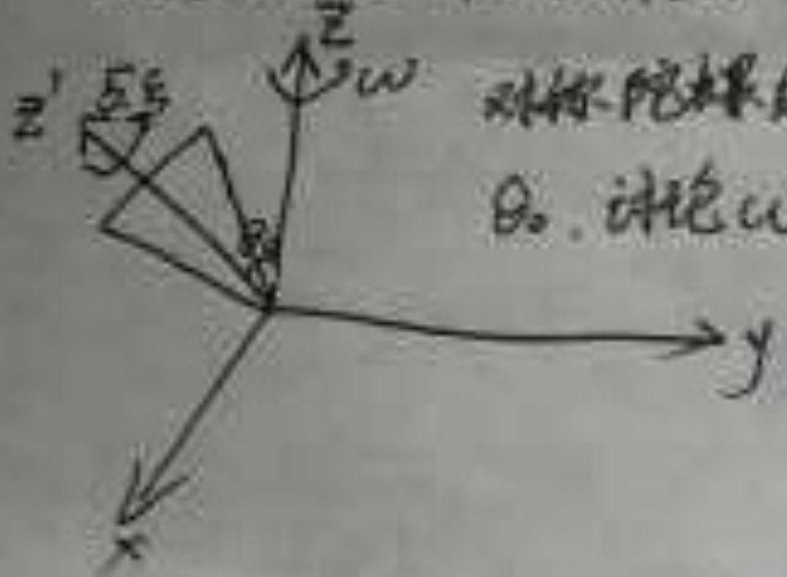

## 1、简述、推导或阐述：最小作用量原理、Lagrange方程和Hamilton正则方程（豆包）
结合朗道《力学》的考点要求，完整题意为：阐述最小作用量原理，并由其推导出Lagrange方程，再进一步推导出Hamilton正则方程。
### 知识点所属章节
该题目核心知识点属于**朗道《理论物理教程 卷1：力学》**的核心章节：
- 最小作用量原理：第2节、第10节（作用量、哈密顿主函数）
- Lagrange方程：第1-3节（拉格朗日函数、欧拉-拉格朗日方程）
- Hamilton正则方程：第40-41节（哈密顿方程、正则变换）
### 解答
#### 一、最小作用量原理（哈密顿原理）
**定义**：对于一个力学系统，其真实运动轨迹是使作用量 $S$ 取极值（通常为极小值）的轨迹。
作用量 $S$ 的定义为：
$$
S = \int_{t_1}^{t_2} L(q, \dot{q}, t) \, dt
$$
其中 $L(q, \dot{q}, t) = T - V$ 为拉格朗日函数，$T$ 为系统动能，$V$ 为势能，$q$ 为广义坐标，$\dot{q} = \frac{dq}{dt}$ 为广义速度。
原理的数学表述为：真实运动对应的轨迹满足作用量的变分为零：
$$
\delta S = \delta \int_{t_1}^{t_2} L(q, \dot{q}, t) \, dt = 0
$$
变分的边界条件：轨迹在端点固定，即 $\delta q(t_1) = \delta q(t_2) = 0$。
#### 二、由最小作用量原理推导 Lagrange 方程
对作用量 $S$ 取变分：
$$
\delta S = \int_{t_1}^{t_2} \left( \frac{\partial L}{\partial q} \delta q + \frac{\partial L}{\partial \dot{q}} \delta \dot{q} \right) dt
$$
其中 $\delta \dot{q} = \frac{d}{dt}(\delta q)$，对第二项做分部积分：
$$
\int_{t_1}^{t_2} \frac{\partial L}{\partial \dot{q}} \delta \dot{q} dt = \left. \frac{\partial L}{\partial \dot{q}} \delta q \right|_{t_1}^{t_2} - \int_{t_1}^{t_2} \frac{d}{dt}\left( \frac{\partial L}{\partial \dot{q}} \right) \delta q \, dt
$$
根据边界条件 $\delta q(t_1) = \delta q(t_2) = 0$，分部积分的边界项为零，因此：
$$
\delta S = \int_{t_1}^{t_2} \left[ \frac{\partial L}{\partial q} - \frac{d}{dt}\left( \frac{\partial L}{\partial \dot{q}} \right) \right] \delta q \, dt = 0
$$
由于变分 $\delta q$ 是任意的，被积函数必须为零，得到：
$$
\frac{d}{dt}\left( \frac{\partial L}{\partial \dot{q}} \right) - \frac{\partial L}{\partial q} = 0
$$
此即**拉格朗日方程（Lagrange方程）**，对于多自由度系统，每个广义坐标 $q_i$ 对应一个方程：
$$
\frac{d}{dt}\left( \frac{\partial L}{\partial \dot{q}_i} \right) - \frac{\partial L}{\partial q_i} = 0 \quad (i=1,2,\dots,n)
$$
#### 三、由 Lagrange 方程推导 Hamilton 正则方程
##### 步骤1：定义广义动量与哈密顿函数
定义广义动量 $p_i$：
$$
p_i = \frac{\partial L}{\partial \dot{q}_i}
$$
通过勒让德变换，将变量从 $(q, \dot{q}, t)$ 转换为 $(q, p, t)$，定义哈密顿函数 $H(q,p,t)$：
$$
H(q,p,t) = \sum_i p_i \dot{q}_i - L(q, \dot{q}(q,p,t), t)
$$
##### 步骤2：对哈密顿函数取全微分
$$
dH = \sum_i \left( p_i d\dot{q}_i + \dot{q}_i dp_i \right) - dL
$$
拉格朗日函数的全微分为：
$$
dL = \sum_i \left( \frac{\partial L}{\partial q_i} dq_i + \frac{\partial L}{\partial \dot{q}_i} d\dot{q}_i \right) + \frac{\partial L}{\partial t} dt
$$
代入 $p_i = \frac{\partial L}{\partial \dot{q}_i}$，得：
$$
dL = \sum_i \left( \frac{\partial L}{\partial q_i} dq_i + p_i d\dot{q}_i \right) + \frac{\partial L}{\partial t} dt
$$
将 $dL$ 代入 $dH$ 的表达式，消去 $p_i d\dot{q}_i$ 项：
$$
dH = \sum_i \left( \dot{q}_i dp_i - \frac{\partial L}{\partial q_i} dq_i \right) - \frac{\partial L}{\partial t} dt
$$
##### 步骤3：对比全微分形式，得到正则方程
另一方面，哈密顿函数 $H(q,p,t)$ 的全微分为：
$$
dH = \sum_i \left( \frac{\partial H}{\partial q_i} dq_i + \frac{\partial H}{\partial p_i} dp_i \right) + \frac{\partial H}{\partial t} dt
$$
对比 $dq_i$ 和 $dp_i$ 的系数：
1.  $dp_i$ 项系数：$\dot{q}_i = \frac{\partial H}{\partial p_i}$
2.  $dq_i$ 项系数：$-\frac{\partial L}{\partial q_i} = \frac{\partial H}{\partial q_i}$

再结合拉格朗日方程 $\frac{d}{dt}\left( \frac{\partial L}{\partial \dot{q}_i} \right) = \frac{\partial L}{\partial q_i}$，即 $\dot{p}_i = \frac{\partial L}{\partial q_i}$，因此：
$$
\dot{p}_i = -\frac{\partial H}{\partial q_i}
$$
综上，得到**哈密顿正则方程（Hamilton正则方程）**：
$$
\begin{cases}
\dot{q}_i = \dfrac{\partial H}{\partial p_i} \\[6pt]
\dot{p}_i = -\dfrac{\partial H}{\partial q_i}
\end{cases}
\quad (i=1,2,\dots,n)
$$
同时，时间偏导数项满足：
$$
\frac{\partial H}{\partial t} = -\frac{\partial L}{\partial t}
$$
#### 四、三者关系总结
| 理论 | 核心形式 | 核心变量 | 方程特点 |
| :--- | :--- | :--- | :--- |
| 最小作用量原理 | $\delta S = 0$，$S = \int L dt$ | 广义坐标 $q(t)$ | 变分原理，描述真实运动的极值性 |
| Lagrange方程 | $\dfrac{d}{dt}\left( \dfrac{\partial L}{\partial \dot{q}_i} \right) - \dfrac{\partial L}{\partial q_i} = 0$ | $q_i, \dot{q}_i$ | 二阶微分方程，$n$ 个方程对应 $n$ 个自由度 |
| Hamilton正则方程 | $\dot{q}_i = \dfrac{\partial H}{\partial p_i}, \dot{p}_i = -\dfrac{\partial H}{\partial q_i}$ | $q_i, p_i$ | 一阶微分方程组，$2n$ 个方程，形式对称 |
## 2、一维谐振问题（用Lagrange方法和Hamilton方法）（豆包）
### 知识点所属章节
该题目核心知识点属于**朗道《理论物理教程 卷1：力学》**：
- Lagrange方法：第1-5节（拉格朗日函数、拉格朗日方程）
- Hamilton方法：第40-41节（哈密顿函数、正则方程）
- 一维谐振子：第21节（简谐振动、小振动问题）
### 解答
#### 一、一维谐振子模型设定
一维谐振子的系统参数：
- 质量：$m$
- 弹性系数：$k$
- 角频率：$\omega = \sqrt{\dfrac{k}{m}}$
- 广义坐标：$x$（位移），广义速度：$\dot{x} = \dfrac{dx}{dt}$

系统的动能和势能分别为：
$$
T = \frac{1}{2} m \dot{x}^2, \quad V = \frac{1}{2} k x^2 = \frac{1}{2} m \omega^2 x^2
$$
#### 二、用 Lagrange 方法求解
##### 步骤1：构造拉格朗日函数
拉格朗日函数定义为 $L = T - V$，代入动能和势能：
$$
L(x, \dot{x}) = \frac{1}{2} m \dot{x}^2 - \frac{1}{2} m \omega^2 x^2
$$

##### 步骤2：代入拉格朗日方程
拉格朗日方程为：
$$
\frac{d}{dt}\left( \frac{\partial L}{\partial \dot{x}} \right) - \frac{\partial L}{\partial x} = 0
$$

计算偏导数：
$$
\frac{\partial L}{\partial \dot{x}} = m \dot{x}, \quad \frac{\partial L}{\partial x} = -m \omega^2 x
$$

对时间求导：
$$
\frac{d}{dt}\left( \frac{\partial L}{\partial \dot{x}} \right) = m \ddot{x}
$$

代入方程得到运动微分方程：
$$
m \ddot{x} + m \omega^2 x = 0 \quad \Rightarrow \quad \ddot{x} + \omega^2 x = 0
$$

##### 步骤3：求解微分方程
方程的通解为简谐振动形式：
$$
x(t) = A \cos(\omega t + \phi)
$$
其中 $A$ 为振幅，$\phi$ 为初相位，由初始条件确定。
#### 三、用 Hamilton 方法求解
##### 步骤1：定义广义动量与哈密顿函数
广义动量定义为：
$$
p = \frac{\partial L}{\partial \dot{x}} = m \dot{x}
$$

通过勒让德变换构造哈密顿函数 $H(x,p)$：
$$
H = p \dot{x} - L
$$

将 $\dot{x} = \dfrac{p}{m}$ 代入：
$$
H = p \cdot \frac{p}{m} - \left( \frac{1}{2} m \left( \frac{p}{m} \right)^2 - \frac{1}{2} m \omega^2 x^2 \right)
$$
化简得：
$$
H = \frac{p^2}{2m} + \frac{1}{2} m \omega^2 x^2
$$
（注：该系统中 $H$ 等于总机械能 $T+V$）

##### 步骤2：代入Hamilton正则方程
正则方程为：
$$
\begin{cases}
\dot{x} = \dfrac{\partial H}{\partial p} \\[6pt]
\dot{p} = -\dfrac{\partial H}{\partial x}
\end{cases}
$$

计算偏导数：
$$
\frac{\partial H}{\partial p} = \frac{p}{m}, \quad \frac{\partial H}{\partial x} = m \omega^2 x
$$

代入方程得：
$$
\dot{x} = \frac{p}{m}, \quad \dot{p} = -m \omega^2 x
$$

##### 步骤3：消去动量得到运动方程
对第一个方程求导：
$$
\ddot{x} = \frac{\dot{p}}{m}
$$

将 $\dot{p} = -m \omega^2 x$ 代入：
$$
\ddot{x} = -\omega^2 x \quad \Rightarrow \quad \ddot{x} + \omega^2 x = 0
$$

与Lagrange方法得到的微分方程完全一致，通解同样为 $x(t) = A \cos(\omega t + \phi)$。
#### 四、两种方法对比
| 方法 | 核心方程 | 变量 | 特点 |
| :--- | :--- | :--- | :--- |
| Lagrange方法 | $\dfrac{d}{dt}\left( \dfrac{\partial L}{\partial \dot{x}} \right) - \dfrac{\partial L}{\partial x} = 0$ | $x, \dot{x}$ | 二阶微分方程，形式简洁，直接由 $L$ 导出 |
| Hamilton方法 | $\dot{x} = \dfrac{\partial H}{\partial p}, \dot{p} = -\dfrac{\partial H}{\partial x}$ | $x, p$ | 一阶微分方程组，形式对称，便于推广到量子力学 |
## 3、在力场 $V(r)$ 中的 Lagrange 作用量（或 Hamilton 量）（豆包）
### 知识点所属章节
该题目核心知识点属于**朗道《理论物理教程 卷1：力学》**：
- Lagrange 函数与作用量：第1-2节（拉格朗日函数的构造、作用量定义与最小作用量原理）
- 有心力场中的力学系统：第14-15节（有心力场中的运动、守恒定律）
- Hamilton 函数：第40节（哈密顿函数的定义与勒让德变换）
### 解答
#### 一、基本模型设定
考虑质量为 $m$ 的质点，在中心力场 $V(r)$ 中运动，采用球坐标系 $(r, \theta, \phi)$ 描述其位置。
- 动能：$T = \frac{1}{2} m v^2 = \frac{1}{2} m (\dot{r}^2 + r^2 \dot{\theta}^2 + r^2 \sin^2\theta \dot{\phi}^2)$
- 势能：$V(r)$（仅与径向坐标 $r$ 有关，与角度无关）
#### 二、Lagrange 函数与作用量
##### 1. Lagrange 函数 $L$
拉格朗日函数定义为动能减势能：
$$
L(r, \theta, \phi, \dot{r}, \dot{\theta}, \dot{\phi}) = T - V = \frac{1}{2} m \left( \dot{r}^2 + r^2 \dot{\theta}^2 + r^2 \sin^2\theta \dot{\phi}^2 \right) - V(r)
$$
##### 2. Lagrange 作用量 $S$
作用量定义为拉格朗日函数在时间上的积分：
$$
S = \int_{t_1}^{t_2} L(r, \theta, \phi, \dot{r}, \dot{\theta}, \dot{\phi}) \, dt
$$
根据最小作用量原理，真实运动轨迹是使作用量 $S$ 取极值的轨迹，满足 $\delta S = 0$。
##### 3. 利用角动量守恒简化（可选，有心力场的重要性质）
由于势能仅与 $r$ 有关，角向变量为循环坐标，角动量守恒：
- 角动量大小：$L_z = m r^2 \sin^2\theta \dot{\phi} = \text{常数}$
- 角动量守恒要求运动在一个平面内，可设 $\theta = \frac{\pi}{2}$，$\dot{\theta} = 0$，此时拉格朗日函数简化为：
$$
L(r, \phi, \dot{r}, \dot{\phi}) = \frac{1}{2} m \left( \dot{r}^2 + r^2 \dot{\phi}^2 \right) - V(r)
$$
#### 三、Hamilton 函数 $H$
##### 1. 广义动量
对简化后的平面运动模型，定义广义动量：
- 径向动量：$p_r = \frac{\partial L}{\partial \dot{r}} = m \dot{r}$
- 角向动量：$p_\phi = \frac{\partial L}{\partial \dot{\phi}} = m r^2 \dot{\phi}$（即角动量，守恒量）

##### 2. 勒让德变换构造 $H$
哈密顿函数通过勒让德变换定义：
$$
H = p_r \dot{r} + p_\phi \dot{\phi} - L
$$
将 $\dot{r} = \frac{p_r}{m}$、$\dot{\phi} = \frac{p_\phi}{m r^2}$ 代入 $L$，得：
$$
H = p_r \cdot \frac{p_r}{m} + p_\phi \cdot \frac{p_\phi}{m r^2} - \left[ \frac{1}{2} m \left( \left( \frac{p_r}{m} \right)^2 + r^2 \left( \frac{p_\phi}{m r^2} \right)^2 \right) - V(r) \right]
$$
化简后得到：
$$
H(r, p_r, p_\phi) = \frac{p_r^2}{2m} + \frac{p_\phi^2}{2 m r^2} + V(r)
$$
该形式下，$H$ 等于系统的总机械能 $T+V$。

##### 3. 推广到三维球对称情况
三维情况下的哈密顿函数为：
$$
H(r, p_r, p_\theta, p_\phi) = \frac{p_r^2}{2m} + \frac{p_\theta^2}{2 m r^2} + \frac{p_\phi^2}{2 m r^2 \sin^2\theta} + V(r)
$$
其中 $p_\theta = m r^2 \dot{\theta}$，$p_\phi = m r^2 \sin^2\theta \dot{\phi}$。
#### 四、Lagrange 与 Hamilton 形式对比
| 形式 | 变量 | 表达式 | 核心方程 |
| :--- | :--- | :--- | :--- |
| Lagrange | $r, \theta, \phi, \dot{r}, \dot{\theta}, \dot{\phi}$ | $L = T - V$ | $\dfrac{d}{dt}\left( \dfrac{\partial L}{\partial \dot{q}_i} \right) - \dfrac{\partial L}{\partial q_i} = 0$ |
| Hamilton | $r, \theta, \phi, p_r, p_\theta, p_\phi$ | $H = T + V$ | $\dot{q}_i = \dfrac{\partial H}{\partial p_i}, \dot{p}_i = -\dfrac{\partial H}{\partial q_i}$ |
## 4、电子在磁场下运动用 Lagrange 描述 $L = \frac{1}{2}m\dot{x}^2 + q A(x) \dot{x}$，($q$ 为常数)，写出描述该运动的 Hamilton 量。（Gemini3）
### 知识点归纳与教材对应
本题的核心知识点是**从拉格朗日形式到哈密顿形式的转换**。
*   **对应教材：**
    *   《朗道理论物理教程 卷1-力学》（第五版）—— **第七章：正则方程（The Canonical Equations）**。
    *   具体涉及 **§40 哈密顿方程**。
*   **物理背景：**
    *   此题讨论的是带电粒子在矢量势 $A$ 描述的磁场中的一维简化运动。
    *   注意：在朗道《力学》的常规讨论中，势能通常只依赖于坐标，但此题涉及了依赖于速度的项（即相互作用项 $q A \dot{x}$），这正是电磁相互作用的典型特征。
### 解答
我们要通过拉格朗日量 $L(x, \dot{x})$ 求解哈密顿量 $H(p, x)$。请大家严格按照朗道定义的步骤进行：
#### 第一步：计算广义动量 (Generalized Momentum)
根据定义，广义动量 $p$ 是拉格朗日量对广义速度 $\dot{x}$ 的偏导数：
$$p = \frac{\partial L}{\partial \dot{x}}$$
代入本题的 $L = \frac{1}{2}m\dot{x}^2 + q A(x) \dot{x}$：
$$p = m\dot{x} + q A(x)$$

> **教授点评：** 请注意，这里的 $p$ 是**正则动量（Canonical Momentum）**。它不仅包含机械动量 $m\dot{x}$，还包含了电磁场带来的项 $qA$。这是分析电磁场中粒子量子化的关键点。
#### 第二步：将速度 $\dot{x}$ 表示为动量 $p$ 的函数
从上式解出 $\dot{x}$：
$$\dot{x} = \frac{p - q A(x)}{m}$$

#### 第三步：利用勒让德变换定义哈密顿量
哈密顿量的定义为：
$$H = p \dot{x} - L$$
我们将 $L$ 的表达式代入：
$$H = p \dot{x} - \left( \frac{1}{2}m\dot{x}^2 + q A(x) \dot{x} \right)$$
$$H = (p - q A(x))\dot{x} - \frac{1}{2}m\dot{x}^2$$

#### 第四步：代入 $\dot{x}$ 的表达式，消除速度项
将第二步得到的 $\dot{x} = \frac{p - q A(x)}{m}$ 代入：
$$H = (p - q A(x)) \cdot \left( \frac{p - q A(x)}{m} \right) - \frac{1}{2}m \left( \frac{p - q A(x)}{m} \right)^2$$
$$H = \frac{(p - q A(x))^2}{m} - \frac{(p - q A(x))^2}{2m}$$
合并同类项得：
$$H = \frac{(p - q A(x))^2}{2m}$$
### 4. 结论与总结

**该运动的 Hamilton 量为：**
$$H(p, x) = \frac{1}{2m} \left[ p - q A(x) \right]^2$$

#### 备考要点：
1.  **物理意义：** 虽然哈密顿量在数值上等于动能 $\frac{1}{2}m\dot{x}^2$，但作为哈密顿量，它必须写成坐标 $x$ 和正则动量 $p$ 的函数。如果在答案里保留了 $\dot{x}$，在考试中是要扣大分的。
2.  **符号规范：** 朗道在《力学》中强调了从 $L$ 到 $H$ 的转变本质上是变量的更替。
3.  **拓展思考：** 如果再加上标量电势 $\phi(x)$，拉格朗日量会多出一项 $-q\phi$，最终的哈密顿量就会变成 $H = \frac{(p-qA)^2}{2m} + q\phi$。这正是你们在后续《量子力学》课程中处理薛定谔方程时常用的算符基础。

## 5、对称陀螺绕 $z$ 和 $z'$ 轴旋转运动，角速度分别为 $\omega$ 和 $\xi$。$z$ 轴和 $z'$ 轴间的夹角固定为 $\theta_0$。请讨论 $\omega, \theta_0, \xi$ 所满足的关系。（Gemini3）
*   **已知条件：**
    *   $z$ 轴：空间固定坐标系的轴（通常对应总角动量 $\vec{M}$ 的方向）。
    *   $z'$ 轴：陀螺的自转对称轴（对应体坐标系中的 $x_3$ 轴）。
    *   $\omega$：进动角速度（Precession rate，即 $\dot{\phi}$）。
    *   $\xi$：自转角速度（Intrinsic rotation rate，即 $\dot{\psi}$）。
    *   $\theta_0$：章动角（Nutation angle），此处为常数，表示陀螺做**等速进动**。

### 知识点归纳与教材对应
本题的核心知识点属于刚体运动学与动力学的结合，特别是关于**自由对称陀螺**的运动描述。
*   **对应教材：**
    *   《朗道理论物理教程 卷1-力学》（第五版）—— **第六章：刚体的运动（The Motion of a Rigid Body）**。
    *   具体涉及：
        *   **§33 角速度（Angular Velocity）**：欧拉角（Euler angles）与角速度分量的关系。
        *   **§35 陀螺（Tops）**：对称陀螺的自由运动，角动量分量。
*   **物理背景：**
    在没有外力矩（或力矩平衡）的情况下，对称陀螺绕其对称轴 $z'$ 旋转，同时对称轴绕空间固定方向 $z$ 旋转。我们需要建立进动速率、自转速率与几何角度之间的动力学联系。
### 3. 试题解答
我们要习惯用朗道的视角，通过分量合成与角动量守恒来解决。
#### 第一步：建立坐标系与欧拉角描述
设 $z$ 轴为空间固定轴，并取总角动量 $\vec{M}$ 沿 $z$ 轴方向。
按照欧拉角的定义（参考朗道图 47）：
*   进动角速度 $\dot{\phi} = \omega$。
*   自转角速度 $\dot{\psi} = \xi$。
*   章动角 $\theta = \theta_0$（常数），故 $\dot{\theta} = 0$。
#### 第二步：写出角速度在体坐标系（$x_1, x_2, x_3$）中的分量
根据朗道教材式 (33.5)，在体坐标系中（$x_3$ 与 $z'$ 重合）：
$$
\begin{cases}
\Omega_1 = \omega \sin \theta_0 \sin \psi \\
\Omega_2 = \omega \sin \theta_0 \cos \psi \\
\Omega_3 = \omega \cos \theta_0 + \xi
\end{cases}
$$
其中 $\Omega_3$ 是总角速度在对称轴方向的分量。
#### 第三步：建立动力学关系（角动量法）
对于对称陀螺，其转动惯量主值为 $I_1 = I_2 \neq I_3$。
角动量 $\vec{M}$ 在体坐标系中的分量为：
$$
\begin{cases}
M_1 = I_1 \Omega_1 = I_1 \omega \sin \theta_0 \sin \psi \\
M_2 = I_1 \Omega_2 = I_1 \omega \sin \theta_0 \cos \psi \\
M_3 = I_3 \Omega_3 = I_3 (\omega \cos \theta_0 + \xi)
\end{cases}
$$

由于 $M_z$ 是总角动量，根据几何关系，$\vec{M}$ 在垂直于 $z'$ 轴平面上的分量大小应为 $M \sin \theta_0$：
$$ M_{\perp} = \sqrt{M_1^2 + M_2^2} = I_1 \omega \sin \theta_0 $$
从这里我们可以得到总角动量的大小：
$$ M = \frac{M_{\perp}}{\sin \theta_0} = I_1 \omega $$

同时，角动量在对称轴 $z'$ 上的分量 $M_3$ 满足：
$$ M_3 = M \cos \theta_0 $$
#### 第四步：推导最终关系式
将上述式子联立：
$$ I_3 (\omega \cos \theta_0 + \xi) = (I_1 \omega) \cos \theta_0 $$

整理该等式：
$$ I_3 \xi = I_1 \omega \cos \theta_0 - I_3 \omega \cos \theta_0 $$
$$ I_3 \xi = (I_1 - I_3) \omega \cos \theta_0 $$

或者写成关于进动角速度 $\omega$ 的表达式：
$$ \omega = \frac{I_3 \xi}{(I_1 - I_3) \cos \theta_0} $$
### 4. 结论与总结

**该对称陀螺运动中 $\omega, \theta_0, \xi$ 所满足的关系式为：**
$$ (I_1 - I_3) \omega \cos \theta_0 = I_3 \xi $$
#### 教授讲评：
1.  **物理直观：** 这个公式揭示了，对于**扁平对称陀螺**（$I_1 < I_3$），自转 $\xi$ 与进动 $\omega$ 的方向关系；对于**细长对称陀螺**（$I_1 > I_3$），情况则相反。
2.  **考试陷阱：** 很多同学容易混淆 $\Omega_3$（总角速度分量）和 $\xi$（自转速率）。在朗道的框架下，$\Omega_3 = \dot{\psi} + \dot{\phi}\cos\theta$，一定要分清。
3.  **延伸：** 如果题目给定的是重力场中的重陀螺（Heavy Top），则需要引入 $mgl$ 项，关系式会变为二次方程（参考朗道 §35 式 35.6）。但在本题未给出质量参数的情况下，我们按自由陀螺处理。
## 
如图所示，一个质量为 $M$ 的斜面体置于光滑水平面上，斜面倾角为 $\alpha$。在斜面上有一个质量为 $m$ 的滑块，滑块通过一根劲度系数为 $k$ 的轻质弹簧与斜面顶端相连。系统（包括水平面与斜面、斜面与滑块之间）**均无摩擦力**。
**要求：**
1. 写出系统的 **Lagrange 量**；
2. 写出系统的 **运动方程**；
3. 求出系统 **振动频率** 的表达式。

---

### 2. 知识点归纳与教材对应

本题涵盖了《朗道力学》中最核心的两个部分：

*   **对应教材：**
    *   《朗道理论物理教程 卷1-力学》（第五版）—— **第一章：运动方程（The Equations of Motion）**。
    *   **§4. 拉格朗日函数（The Lagrangian）**：如何选取广义坐标并写出动能与势能。
    *   **§5. 最小作用量原理**：建立欧拉-拉格朗日方程。
    *   **第五章：微振动（Small Oscillations）** —— **§23. 自由的一维振动**。
*   **物理难点：**
    滑块 $m$ 的运动是相对于一个正在运动的参考系（斜面 $M$）进行的。正确写出 $m$ 在**惯性系**中的速度是本题的关键。

---

### 3. 试题解答

#### 第一步：选取广义坐标
设斜面 $M$ 在水平面上的位移为 $X$；
设滑块 $m$ 相对于斜面的位移为 $x$（以弹簧原长位置为原点，沿斜面向下为正）。

#### 第二步：写出动能 ($T$)
1.  **斜面 $M$ 的动能：** $T_M = \frac{1}{2} M \dot{X}^2$
2.  **滑块 $m$ 的动能：**
    滑块相对于地面的速度矢量 $\vec{v}_m = \vec{v}_M + \vec{v}_{rel}$。
    *   $\vec{v}_M = (\dot{X}, 0)$
    *   $\vec{v}_{rel} = (\dot{x}\cos\alpha, -\dot{x}\sin\alpha)$
    因此，滑块的速度平方为：
    $$v_m^2 = (\dot{X} + \dot{x}\cos\alpha)^2 + (-\dot{x}\sin\alpha)^2 = \dot{X}^2 + \dot{x}^2 + 2\dot{X}\dot{x}\cos\alpha$$
    $$T_m = \frac{1}{2} m (\dot{X}^2 + \dot{x}^2 + 2\dot{X}\dot{x}\cos\alpha)$$
3.  **总动能：**
    $$T = \frac{1}{2}(M+m)\dot{X}^2 + \frac{1}{2}m\dot{x}^2 + m\dot{X}\dot{x}\cos\alpha$$

#### 第三步：写出势能 ($U$)
选取弹簧原长处且 $m$ 在斜面上时的重力势能为零点：
1.  弹簧弹性势能：$\frac{1}{2}kx^2$
2.  滑块重力势能：$-mgx\sin\alpha$
    $$U = \frac{1}{2}kx^2 - mgx\sin\alpha$$

#### 第四步：Lagrange 量 ($L$)
根据 $L = T - U$：
$$L = \frac{1}{2}(M+m)\dot{X}^2 + \frac{1}{2}m\dot{x}^2 + m\dot{X}\dot{x}\cos\alpha - \frac{1}{2}kx^2 + mgx\sin\alpha$$

#### 第五步：运动方程
根据欧拉-拉格朗日方程 $\frac{d}{dt}(\frac{\partial L}{\partial \dot{q}_i}) - \frac{\partial L}{\partial q_i} = 0$：

1.  **对于 $X$ 坐标：**
    $\frac{\partial L}{\partial X} = 0$（$X$ 是循环坐标，动量守恒）
    $$\frac{d}{dt} \left[ (M+m)\dot{X} + m\dot{x}\cos\alpha \right] = 0 \implies (M+m)\ddot{X} + m\ddot{x}\cos\alpha = 0 \quad \text{--- (1)}$$

2.  **对于 $x$ 坐标：**
    $\frac{\partial L}{\partial x} = -kx + mg\sin\alpha$，$\frac{\partial L}{\partial \dot{x}} = m\dot{x} + m\dot{X}\cos\alpha$
    $$m\ddot{x} + m\ddot{X}\cos\alpha + kx = mg\sin\alpha \quad \text{--- (2)}$$

#### 第六步：求解振动频率
为了求振动频率，我们需要消去 $\ddot{X}$。由方程 (1) 得：
$$\ddot{X} = -\frac{m\cos\alpha}{M+m}\ddot{x}$$
代入方程 (2)：
$$m\ddot{x} + m\left( -\frac{m\cos\alpha}{M+m}\ddot{x} \right)\cos\alpha + kx = mg\sin\alpha$$
$$m\left( 1 - \frac{m\cos^2\alpha}{M+m} \right)\ddot{x} + kx = mg\sin\alpha$$
整理括号内的系数：
$$m \left( \frac{M+m - m\cos^2\alpha}{M+m} \right) \ddot{x} + kx = mg\sin\alpha$$
利用 $\sin^2\alpha + \cos^2\alpha = 1$，等式变为：
$$\left( \frac{m(M + m\sin^2\alpha)}{M+m} \right) \ddot{x} + kx = mg\sin\alpha$$

这是一个简谐振动方程（$mg\sin\alpha$ 仅改变平衡位置，不影响频率）。有效质量为 $\mu = \frac{m(M + m\sin^2\alpha)}{M+m}$。

---

### 4. 结论：输出答案

1.  **Lagrange 量：**
    $$L = \frac{1}{2}(M+m)\dot{X}^2 + \frac{1}{2}m\dot{x}^2 + m\dot{X}\dot{x}\cos\alpha - \frac{1}{2}kx^2 + mgx\sin\alpha$$
2.  **运动方程：**
    $$ \begin{cases} (M+m)\ddot{X} + m\ddot{x}\cos\alpha = 0 \\ m\ddot{x} + m\ddot{X}\cos\alpha + kx = mg\sin\alpha \end{cases} $$
3.  **振动频率 $\omega$：**
    $$\omega = \sqrt{\frac{k(M+m)}{m(M+m\sin^2\alpha)}}$$

---

#### 教授讲评（备考建议）：
*   **坐标系陷阱：** 很多同学会直接写 $T_m = \frac{1}{2}m\dot{x}^2$，这是错误的！因为 $x$ 是相对坐标。在朗道《力学》的体系中，能量必须写在惯性系下。
*   **极限检查：**
    *   若 $M \to \infty$（斜面固定），则 $\omega \to \sqrt{k/m}$，符合预期。
    *   若 $\alpha = 90^\circ$（垂直下落），则 $\omega = \sqrt{k/m}$，此时斜面水平方向不受力。
    这种通过特殊极限验证答案的方法，是咱们南大物理人必备的素养。

祝大家复习顺利！
