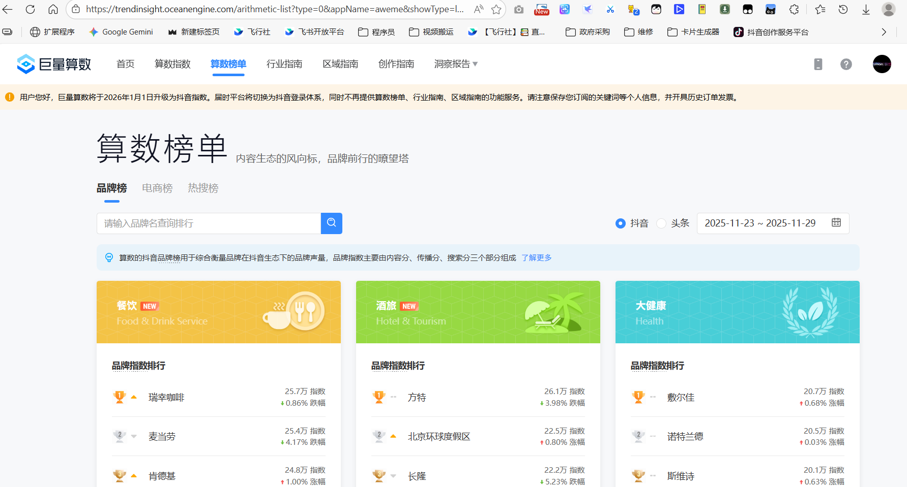

1.用AI策略
1) 用AI锁定高增长蓝海市场
●蓝海市场定义：高增长、低竞争的新兴市场
●市场选择策略：避开停滞/衰退市场，选择年增长率11.5%的领域
●趋势验证工具：使用**谷歌趋势**分析关键词搜索量持续增长【问题是我怎么能想到一个“**有效关键词**”】
### 💡 如何选择与使用建议

- **明确分析目标**：如果是分析**公众的主动搜索意愿和长期趋势**，首选**百度指数**。如果是追踪**社交媒体上的实时爆点**，**微博热搜**和**抖音热榜**更直接。如果是做**电商决策**，则需要**生意参谋**这类专业工具。
- **交叉验证**：没有单一工具能反映全貌。例如，一个品牌可以同时查看它在**百度指数**（搜索热度）、**微信指数**（生态内热度）、**抖音热榜**（年轻用户关注度）上的不同表现。
- **关注数据报告**：许多平台（如巨量算数、新榜、QuestMobile）会定期发布免费的**行业洞察报告**，是了解宏观趋势的优质资源。

### ⚠️ 重要注意事项

- **数据局限性**：所有工具的数据都来自其自身生态，有局限性。例如，百度指数无法反映微信内的私域讨论。
    
- **平台规则变化**：热搜榜等榜单可能受平台运营策略影响。
    
- **付费与免费**：基础趋势查看功能通常是免费的，但深度数据（如详细的用户画像、竞品数据）一般需要付费。

| 工具名称          | 所属公司 | 主要特点与数据维度                                                                           | 适用场景                                    | 访问方式                                                                                    |
| ------------- | ---- | ----------------------------------------------------------------------------------- | --------------------------------------- | --------------------------------------------------------------------------------------- |
| **百度指数**      | 百度   | 基于**百度搜索**数据，反映关键词的**搜索热度、地域分布、人群画像**及关联搜索。                                         | 分析公众对某个**话题、品牌、产品**的主动关注度变化和地域渗透情况。     | 网站：[index.baidu.com](https://index.baidu.com/)                                          |
| **微信指数**      | 腾讯   | 基于**微信**生态内搜索、公众号文章、视频号等内容的整体热度。                                                    | 洞察在**微信生态内**的流行趋势和话题发酵情况。               | 微信内搜索“微信指数”小程序                                                                          |
| **微博热搜/微热点**  | 新浪微博 | **微博热搜榜**反映实时话题讨论热度；**微热点**提供更详细的事件传播分析。                                            | 追踪**社会热点、娱乐事件、突发新闻**的传播速度和广度。           | 微博App内“热搜”板块；网站：[wr.weibo.com](https://wr.weibo.com/)                                   |
| **抖音热榜/巨量算数** | 字节跳动 | **抖音热榜**是实时内容热度榜单；**巨量算数**提供基于抖音、今日头条等平台的深度趋势洞察和行业报告。                               | 把握**短视频平台**的内容流行趋势，了解年轻用户兴趣点，进行行业研究。    | **抖音App内“热榜”；网站：[trendinsight.oceanengine.com](https://trendinsight.oceanengine.com/)** |
| **生意参谋**      | 阿里巴巴 | 阿里巴巴官方**电商数据分析**平台，提供行业大盘、搜索词分析、店铺流量等深度数据（主要为付费服务）。                                 | 用于**电商运营**，分析品类趋势、竞品动态、关键词优化。           | 需订购阿里相关商家服务                                                                             |
| **飞瓜数据/新榜**   | 第三方  | **飞瓜数据**侧重**抖音、快手、B站**等短视频/直播平台的数据和带货分析。   **新榜**侧重**微信公众号、视频号、小红书**等内容平台的数据和榜单。 | **内容营销**和**直播电商**从业者用于追踪达人、分析爆款内容、监控竞品。 | 网站：飞瓜数据（[feigua.cn](https://feigua.cn/)）；新榜（[newrank.cn](https://newrank.cn/)）          |

●AI应用场景：通过AI工具快速识别蓝海市场特征
●产品设计原则：根据目标用户精准需求开发产品
●成功案例指标：30天创造270万美元收益的可行性
●关键增长特征：普拉提市场年增长率达11.5%
●风险规避要点：避免内卷和亏损的市场环境
2) 确定卖什么
将关键字的热点视频、字幕全部拔下来，发给chatGPT，然后询问提及所有商品的名称。ChatGPT可以列出一份完整的**产品清单**。
●市场调研方法：利用AI分析高点赞视频字幕获取商品清单
●关键工具：YouTube视频字幕提取结合ChatGPT数据处理
●产品筛选策略：通过搜索量趋势验证商品市场潜力
●效率优势：AI处理速度比人工快100倍且客观
●典型案例：普拉提防滑袜的发现与趋势验证流程
●操作步骤：**视频筛选→字幕提取→AI分析→趋势验证**
●核心技巧：用"列出视频中所有提及商品"精准提问AI
3) 发现**品牌真空**🌟
根据上一步的产品清单再次回到趋势分析，在列表中探寻这些产品的搜索量**哪一个是持续上升**的。
接着再去看这一类商品的分享视频中，有没有品牌壁垒。比如例子中的防滑袜，在分享视频中有没有说XXX品牌的防滑袜。如果没有，就是品牌真空。**当一个产品还没有强势品牌的时候，这就叫品牌真空。** 这就是最好的机会。——市场上有明确的需求，但是却还没有占据心智的品牌。
●品牌真空定义：市场上存在明确需求但缺乏强势品牌占据用户心智的状态
●识别方法：观察消费者使用品类通用词而非品牌词表达需求（如"防滑袜"而非"耐克防滑袜"）
●市场机会：品牌真空期是抢占用户心智成为品类代名词的最佳时机
●验证条件：消费者有明确购买意愿但无特定品牌指向性
●成功策略：在真空期快速推出产品建立品牌与品类的强关联
4) 设计品牌🌟🌟🌟
他用ChatGPT提取文案，然后分析用户的核心身份标签，我理解就叫用户画像。然后再问ChatGPT：有哪些品牌符合这些标签的调性。然后再去这些品牌拔官网等，了解这些品牌的风格。直接抄过来。
●品牌定位：分析目标用户核心身份标签（that girl形象）
●竞品分析：使用AI工具研究调性相符品牌（如glossier）
●视觉风格：借鉴高端品牌美学（粉白色系/云彩天空背景）
●命名策略：功能性+情感价值双关（grounded=防滑+扎根理念）
●执行步骤：**身份分析→竞品研究→风格移植→品牌命名**
5) 找供应商生产
●设计方案确认：完成产品设计方案后进入生产阶段。
●供应商寻找：通过**阿里巴巴国际站**等平台直接联系供应商。
●AI辅助工具：利用AI生成产品图片和品牌网站。
●生产下单流程：直接向供应商提交设计方案并下单生产。
●效率提升：AI工具加速产品展示和网站建设流程。
6) 获取流量🌟🌟
●三秒病毒法则:快速吸引用户注意力的短视频创作方法
●精准广告投放:**针对观看视频95%以上进度的用户定向投放**
●高转化率:7.19%的广告转化率，远超行业平均2%
# 总结
●AI电商方法论:AI+数据分析寻找蓝海市场
●用户需求分析:通过AI识别品牌真空地带
●全流程AI辅助:从选品到生产各环节AI提效
●可复制性:普通人都能应用的AI电商实战策略

# 视频完整文案
我的天呐，这条视频我看了整整五遍，这个叫s in a race大胡子老外用AI在30天内赚了270万美元。但这不是重点，重点是他用的方法，90%的人可以复制，看完后我真的是心潮澎湃。在视频中，他分享了如何用AI策略去找到一个稳健上升。同时又没有龙头品牌的蓝海市场以及更重要的是如何找到你精准的营销对象，并根据他们的需求去设计产品，最终卖爆我连夜翻译了视频，把它整套AI赚钱的流程都拆解出来。这条视频价值1000万啊，点赞收藏第一步，用AI锁定高增长蓝海市场这个大胡子，
说你要找到一个不断增长的蓝海市场，绝对不能去进入一个停滞不前或者衰退的市场。在那里，你只会迎来内卷和亏损，而它之所以选中普拉提市场，是因为在谷歌趋势上，他发现普拉提这个关键词的搜索量一年比一年高。普拉提市场的年增长率达到百分之十一点五。确定了大方向，接下来就是最关键的第二步。在这个市场里，到底卖什么？他对AI的用法真的绝了，他直接去油管搜索普拉提女孩的，一天找那些点赞高的博主视频注意。
他根本没有自己去看完这些视频，而是把那些长视频的字幕文案全部扒下来，一股脑丢给ChatGPT，然后他问了一个神级问题，列出这些视频中。所有被提及的商品名称就这一个提示词ChatGPT，直接给它列出了一份完整的产品清单，其中一个产品引起了他的注意。普拉提防滑袜，它立马回到股的趋势，发现普拉提防滑袜这个词儿的搜索量也是持续上升的，我看到这里真的是贵了啊，这种用AI进行市场调研的方法。效率比人工高100倍，而且完全客观，
不带任何的主观偏见，第三步发现品牌真空，这个就是印钞机密码，接下来它做了一件更聪明的事儿。他去看那些精致女孩儿，对普拉提防滑袜的评价，我把原视频放出来，你仔细听听他们是怎么说的？like I need some griff pi socks or something like that，and then I'm going to have to buy like some of the grip socks that they have forgot my socks。try to buy socks at the steep price of eighteen dollars听出来吗？女孩儿们说的是我需要防滑袜，我要买防滑袜，而不是我要买lulu demo的防滑袜，我要买耐克的防滑袜。
看到这里，这哥们儿直接兴奋了。他当时就说了一句话，我建议你要记在手机的备忘录里，当一个产品在市场上还没有强势品牌的时候，这就叫品牌真空，这就是最好的机会，什么意思？就是消费者有这个明确需求，但市场上还没有一个占据心智的品牌。这个时候谁先做出来，谁就能抢占用户心智，成为这个品类的代言词。那现在问题来了，怎么设计一个让这些女孩儿疯狂下单的品牌AI再次派上用场？
她用ChatGPT去分析那些视频文案，然后提取目标用户的核心身份标签。ChatGPT告诉她。这群女孩的身份认同是that girl，就是一些生活精致自律，喝着健康的果，昔坚持健身的理想女性形象，接着她又问了ChatGPT，一个绝妙的问题，有哪些品牌？符合**that girl**的调性ChatGPT给出了答案。glossier这是一个高端的护肤品牌，他二话不说立马去扒glossier的官网让。然后发现他们的视觉风格是梦幻的云彩天空背景配色呢，是温柔的粉白色系，
他就直接把这套美学风格抄过来，用在了自己的防滑袜设计和品牌网站上。然后他给这个品牌取了个名字，叫grounded，这个词儿太妙了，既代表袜子的功能，防滑踩在地上，踏实又暗示了普拉提运动的扎根和稳定的理念，一个名字。把产品功能和情感价值全说清楚了，我还自己问了一下，如果把grounded翻译成中文，你应该怎么翻译？他给我的答案非常绝，但是我不告诉你，
你可以自己试一下第五步，找供应商生产，有了设计方案之后。下一步就是找供应商来生产，去哪儿找阿里巴巴国际站没有拿广告费啊，他拿着AI帮他设计的防滑滑方案找供应商直接下单生产。同时，用AI快速生成的产品图片和品牌网站，连网站都是AI做的产品和网站都有了最后一步，就是获取流量。他没有像大部分人那样上来就砸钱去投广泛流量，而是先用三秒病毒法则。做了一条短视频，就是这条结果，这条视频呢，
直接爆了，拿到了210万的播放视频，火了之后，他做了一个超级精准的操作。只针对观看了它爆款视频超过95%进度的人去打定向广告，结果呢，广告转化率直接飙升到了百分之七点一九。要知道，电商行业的平均转化率也才100%分之二。他直接干到了别人的三到五倍，仅仅四月份，一个月销售额就高达271万美元，这绝对是我今年看到的最好的AI电商实战案例，也是艺人公司的经典打法。它的方法论核心就三点，
首先是用AI加数据去找到蓝海市场，而不是凭借个人的感觉或者喜好。第二，用AI去分析用户需求，找到品牌真空。第三，用AI提效。从选品到投流到生产，全程AI辅助，而最关键的是这套方法，普通人完全可以复制。我坚信AI绝对是我们这个时代普通人最大的红利。翻身的力气。