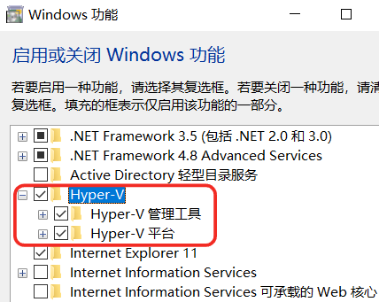
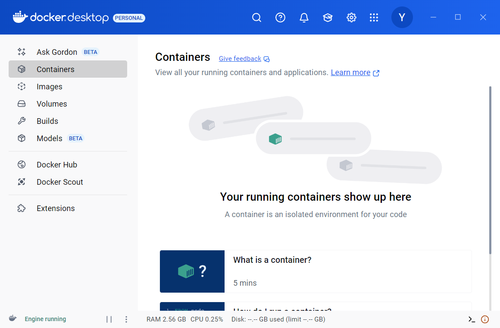
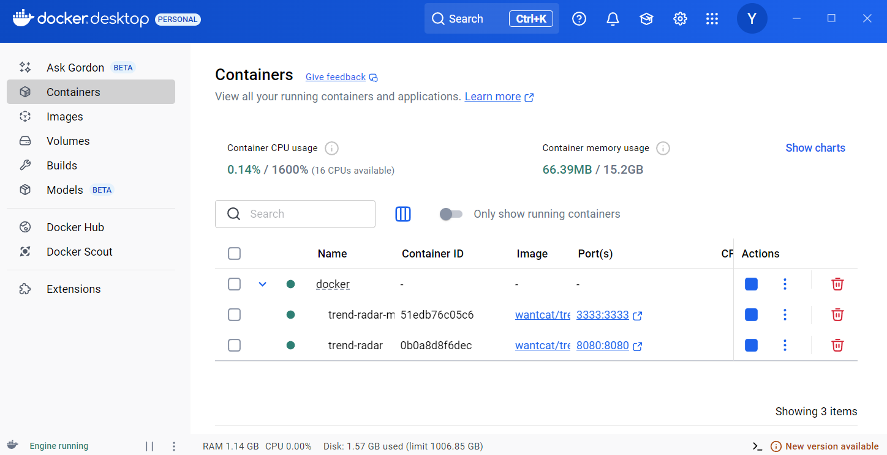
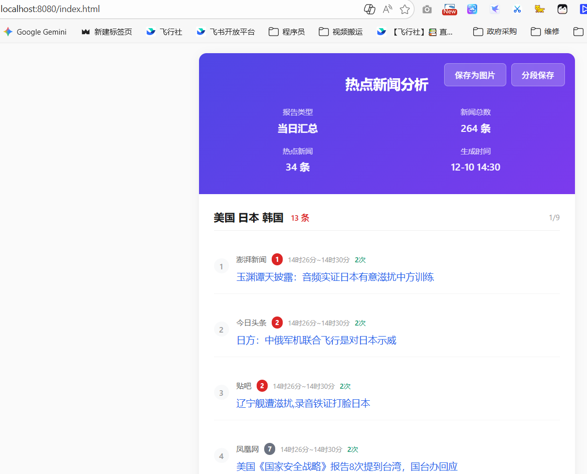

开源项目地址[sansan0/TrendRadar: 🎯 告别信息过载，AI 助你看懂新闻资讯热点，简单的舆情监控分析 - 多平台热点聚合+基于 MCP 的AI分析工具。监控35个平台（抖音、知乎、B站、华尔街见闻、财联社等），智能筛选+自动推送+AI对话分析（用自然语言深度挖掘新闻：趋势追踪、情感分析、相似检索等13种工具）。支持企业微信/个人微信/飞书/钉钉/Telegram/邮件/ntfy/bark/slack 推送，1分钟手机通知，无需编程。支持Docker部署⭐ 让算法为你服务，用AI理解热点](https://github.com/sansan0/TrendRadar)


# 1、安装windows Hyper-V组件


# 2、安装Docker Desktop


# 3、获取代码
```
git clone https://github.com/sansan0/TrendRadar.git
``` 
但是，git失败，所以我用的方法是到## [Releases](https://github.com/sansan0/TrendRadar/releases)下载了最新版本到本地，解压到文件夹D:\TrendRadar-3.5.0

# 4、获取飞书`Webhook URL` 测试使用
- 在飞书上新建一个群组——创建群组
	- **群模式**：选择对话
	- **群名称**：可以简单命名为 `TrendRadar测试群`。
	- **添加成员**：为了测试不打扰他人，**在搜索框中搜索并添加自己的名字**，创建一个只有一个人的群即可。
	- 创建完成后，就可以在群设置里添加“自定义机器人”,- 给机器人起个名字，例如 “热点雷达”。并获取 `Webhook URL` 。
` https://open.feishu.cn/open-apis/bot/v2/hook/a6d65e5f-0003-43b7-a8ea-26bf83281543`

#  🎛️5、检查设置环境变量
来到代码的目录下，使用记事本查看`.env`文件。
- **开启核心开关**（如果还没开启）：
```
    # 是否启用爬虫 (true/false)
    ENABLE_CRAWLER=true
    # 是否启用通知 (true/false)
    ENABLE_NOTIFICATION=true
```
- 将飞书机器人**webhook URL**添加到指定位置：
```
# 飞书机器人 webhook URL（多账号用 ; 分隔）
FEISHU_WEBHOOK_URL=https://open.feishu.cn/open-apis/bot/v2/hook/a6d65e5f-0003-43b7-a8ea-26bf83281543
```
保存。

# 6、装载Docker镜像并运行
- 在D:\TrendRadar-3.5.0\docker地址栏输入CMD回车进入命令窗口。
目录中的 `docker-compose.yml` 和 `docker-compose-build.yml` 区别在于：
- `docker-compose.yml`：**直接使用线上编译好的镜像**，启动最快，是常规选择。
- `docker-compose-build.yml`：**从源代码重新构建镜像**，仅在你想修改代码或Dockerfile，需要自定义构建时使用。
**使用docker-compose up -d命令**，它会默认读取 `docker-compose.yml` 文件。

此时Docker Desktop上随即运行起trend-rad，单击后可查看运行日志详情。


飞书上也随即收到机器人发来的信息。

# 7、设置搜索的热点关键词
在D:\TrendRadar-3.5.0\config目录下，打开frequency_words.txt文件，修改你所需要的关键词。

# 8、**Web 服务器支持**
- 新增内置 Web 服务器，支持通过浏览器访问生成的报告
- 通过 `manage.py` 命令控制启动/停止：`docker exec -it trend-radar python manage.py start_webserver`
- 访问地址：`http://localhost:8080`（端口可配置）

当日汇总 HTML 同时生成到两个位置
- `index.html`（项目根目录）：供 GitHub Pages 访问
- `output/index.html`：通过 Docker Volume 挂载，宿主机可直接访问

# 9、报告配置
**配置位置：** `config/config.yaml` 的 `report` 部分
```
report:
  mode: "daily"                    # 推送模式
  rank_threshold: 5                # 排名高亮阈值
  sort_by_position_first: false    # 排序优先级
  max_news_per_keyword: 0          # 每个关键词最大显示数量
  reverse_content_order: false     # 内容顺序配置
```
#### 配置项详解

|配置项|类型|默认值|说明|
|---|---|---|---|
|`mode`|string|`daily`|推送模式，可选 `daily`/`incremental`/`current`，详见 [推送模式详解](https://github.com/sansan0/TrendRadar?tab=readme-ov-file#3-%E6%8E%A8%E9%80%81%E6%A8%A1%E5%BC%8F%E8%AF%A6%E8%A7%A3)|
|`rank_threshold`|int|`5`|排名高亮阈值，排名 ≤ 该值的新闻会加粗显示|
|`sort_by_position_first`|bool|`false`|排序优先级：`false`=按热点条数排序，`true`=按配置位置排序|
|`max_news_per_keyword`|int|`0`|每个关键词最大显示数量，`0`=不限制|
|`reverse_content_order`|bool|`false`|内容顺序：`false`=热点词汇统计在前，`true`=新增热点新闻在前|
#### 内容顺序配置（v3.5.0 新增）
控制推送消息和 HTML 报告中两部分内容的显示顺序：

|配置值|显示顺序|
|---|---|
|`false`（默认）|① 热点词汇统计 → ② 新增热点新闻|
|`true`|① 新增热点新闻 → ② 热点词汇统计|

**适用场景：**
- `false`（默认）：适合关注关键词匹配结果的用户，先看分类统计
- `true`：适合关注最新动态的用户，优先查看新增热点

# 10、执行频率配置
**配置位置：** `.github/workflows/crawler.yml` 的 `schedule` 部分

```yaml
on:
  schedule:
    - cron: "0 * * * *"  # 每小时运行一次
```

#### 什么是 Cron 表达式？
Cron 是一种定时任务格式，由 5 个部分组成：`分 时 日 月 周`
```
┌───────────── 分钟 (0-59)
│ ┌───────────── 小时 (0-23)
│ │ ┌───────────── 日期 (1-31)
│ │ │ ┌───────────── 月份 (1-12)
│ │ │ │ ┌───────────── 星期 (0-6，0=周日)
│ │ │ │ │
* * * * *
```
#### 常用配置示例

|想要的效果|Cron 表达式|说明|
|---|---|---|
|每小时运行|`0 * * * *`|每小时的第 0 分钟运行（默认）|
|每 30 分钟运行|`*/30 * * * *`|每隔 30 分钟运行一次|
|每天早 8 点运行|`0 0 * * *`|UTC 0:00 = 北京时间 8:00|
|工作时间运行|`*/30 0-14 * * *`|北京 8:00-22:00，每 30 分钟|
|每天 3 次|`0 0,6,12 * * *`|北京 8:00、14:00、20:00|

#### 重要提示

> ⚠️ **时区注意**：GitHub Actions 使用 **UTC 时间**，北京时间需要 **减 8 小时**
> 
> - 想要北京时间 8:00 运行 → 设置 UTC 0:00
> - 想要北京时间 20:00 运行 → 设置 UTC 12:00

> ⚠️ **频率限制**：GitHub 对每个账号的 Actions 运行次数有限额
> 
> - **建议**：不要设置比 30 分钟更短的间隔
> - **原因**：过于频繁可能被判定为滥用，面临封号风险
> - **实际情况**：GitHub Actions 执行时间本身就有偏差，设置太精确意义不大

#### 修改方法
1. 打开你 fork 的仓库
2. 找到 `.github/workflows/crawler.yml` 文件
3. 点击编辑（铅笔图标）
4. 修改 `cron: "0 * * * *"` 中的表达式
5. 点击 "Commit changes" 保存

## 🤖 AI 智能分析

[](https://github.com/sansan0/TrendRadar?tab=readme-ov-file#-ai-%E6%99%BA%E8%83%BD%E5%88%86%E6%9E%90)

TrendRadar v3.0.0 新增了基于 **MCP (Model Context Protocol)** 的 AI 分析功能，让你可以通过自然语言与新闻数据对话，进行深度分析。

### ⚠️ 使用前必读

[](https://github.com/sansan0/TrendRadar?tab=readme-ov-file#%EF%B8%8F-%E4%BD%BF%E7%94%A8%E5%89%8D%E5%BF%85%E8%AF%BB)

**重要提示：AI 功能需要本地新闻数据支持**

AI 分析功能**不是**直接查询网络实时数据，而是分析你**本地已积累的新闻数据**（存储在 `output` 文件夹中）

#### 使用说明：

[](https://github.com/sansan0/TrendRadar?tab=readme-ov-file#%E4%BD%BF%E7%94%A8%E8%AF%B4%E6%98%8E)

1. **项目自带测试数据**：`output` 目录默认包含 **2025年11月1日～11月15日** 的新闻数据，可用于快速体验 AI 功能
    
2. **查询限制**：
    
    - ✅ 只能查询已有日期范围内的数据（11月1-15日）
    - ❌ 无法查询实时新闻或未来日期
3. **获取最新数据**：
    
    - 测试数据仅供快速体验，**建议自行部署项目**获取实时数据
    - 按照 [快速开始](https://github.com/sansan0/TrendRadar?tab=readme-ov-file#-%E5%BF%AB%E9%80%9F%E5%BC%80%E5%A7%8B) 部署运行项目
    - 等待至少 1 天积累新闻数据后，即可查询最新热点

### 1. 快速部署

[](https://github.com/sansan0/TrendRadar?tab=readme-ov-file#1-%E5%BF%AB%E9%80%9F%E9%83%A8%E7%BD%B2)

Cherry Studio 提供 GUI 配置界面，5 分钟快速部署，复杂的部分是一键安装的。

**图文部署教程**：现已更新到我的[公众号](https://github.com/sansan0/TrendRadar?tab=readme-ov-file#%E9%97%AE%E9%A2%98%E7%AD%94%E7%96%91%E4%B8%8E%E4%BA%A4%E6%B5%81)，回复 "mcp" 即可

**详细部署教程**：[README-Cherry-Studio.md](https://github.com/sansan0/TrendRadar/blob/master/README-Cherry-Studio.md)

**部署模式说明**：

- **STDIO 模式（推荐）**：一次配置后续无需重复配置，**图文部署教程**中仅以此模式的配置为例。
- **HTTP 模式（备选）**：如果 STDIO 模式配置遇到问题，可使用 HTTP 模式。此模式的配置方式与 STDIO 基本一致，但复制粘贴的内容就一行，不易出错。唯一需要注意的是每次使用前都需要手动启动一下服务。详细请参考 [README-Cherry-Studio.md](https://github.com/sansan0/TrendRadar/blob/master/README-Cherry-Studio.md) 底部的 HTTP 模式说明。

### 2. 学习与 AI 对话的姿势

[](https://github.com/sansan0/TrendRadar?tab=readme-ov-file#2-%E5%AD%A6%E4%B9%A0%E4%B8%8E-ai-%E5%AF%B9%E8%AF%9D%E7%9A%84%E5%A7%BF%E5%8A%BF)

**详细对话教程**：[README-MCP-FAQ.md](https://github.com/sansan0/TrendRadar/blob/master/README-MCP-FAQ.md)

👉 点击展开：**查看 AI 对话示例图**  

> 💡 **提示**：实际不建议一次性问多个问题。如果你选择的 AI 模型连下图的按顺序调用都无法做到，建议换一个。

[](https://github.com/sansan0/TrendRadar/blob/master/_image/ai3.png)  

## 🔌 MCP 客户端

[](https://github.com/sansan0/TrendRadar?tab=readme-ov-file#-mcp-%E5%AE%A2%E6%88%B7%E7%AB%AF)

TrendRadar MCP 服务支持标准的 Model Context Protocol (MCP) 协议，可以接入各种支持 MCP 的 AI 客户端进行智能分析。

### 支持的客户端

[](https://github.com/sansan0/TrendRadar?tab=readme-ov-file#%E6%94%AF%E6%8C%81%E7%9A%84%E5%AE%A2%E6%88%B7%E7%AB%AF)

**注意事项**：

- 将 `/path/to/TrendRadar` 替换为你的项目实际路径
- Windows 路径使用双反斜杠：`C:\\Users\\YourName\\TrendRadar`
- 保存后记得重启

👉 点击展开：**Claude Desktop**👉 点击展开：**Cursor**👉 点击展开：**VSCode (Cline/Continue)**👉 点击展开：**Claude Code CLI**👉 点击展开：**MCP Inspector**（调试工具）👉 点击展开：**其他支持 MCP 的客户端**

### 常见问题

[](https://github.com/sansan0/TrendRadar?tab=readme-ov-file#%E5%B8%B8%E8%A7%81%E9%97%AE%E9%A2%98-2)

👉 点击展开：**Q1: HTTP 服务无法启动？**👉 点击展开：**Q2: 客户端无法连接到 MCP 服务？**👉 点击展开：**Q3: 工具调用失败或返回错误？**  

## ☕问题答疑与交流

[](https://github.com/sansan0/TrendRadar?tab=readme-ov-file#%E9%97%AE%E9%A2%98%E7%AD%94%E7%96%91%E4%B8%8E%E4%BA%A4%E6%B5%81)

> 如果你想支持本项目，可通过微信搜索**腾讯公益**，对里面的**助学**相关的项目随心捐助
> 
> 感谢参与过**一元点赞**的朋友，已收录至顶部**致谢名单**！你们的支持让开源维护更有动力，个人打赏码现已移除。

- **GitHub Issues**：适合针对性强的解答。提问时请提供完整信息（截图、错误日志、系统环境等）。
- **公众号交流**：适合快速咨询。建议优先在相关文章下的公共留言区交流，如私信，请文明礼貌用语😉
- 💡 部署成功了？来公众号说说感受吧，你的点赞和留言都是我继续更新的动力~

|公众号关注|
|:-:|
|[](https://github.com/sansan0/TrendRadar/blob/master/_image/weixin.png)|

  

## 🪄 赞助商

[](https://github.com/sansan0/TrendRadar?tab=readme-ov-file#-%E8%B5%9E%E5%8A%A9%E5%95%86)

> **302.AI** 是按用量付费的企业级 AI 资源平台  
> 提供市场上最新、最全面的 **AI 模型**和 **API**，以及多种开箱即用的在线 AI 应用

[](https://share.302.ai/mEOUzG) [](https://share.302.ai/mEOUzG)

👉 点击展开：**302.AI 使用教程**  

> 领取的 1 美元可用于调用各种 AI 大模型（如 Claude、GPT 等） 本项目 AI 分析功能需配置大模型使用，配置教程详见 [AI 智能分析](https://github.com/sansan0/TrendRadar?tab=readme-ov-file#-ai-%E6%99%BA%E8%83%BD%E5%88%86%E6%9E%90)

### 第 1 步：获取 API Key

[](https://github.com/sansan0/TrendRadar?tab=readme-ov-file#%E7%AC%AC-1-%E6%AD%A5%E8%8E%B7%E5%8F%96-api-key)

1. 注册后，进入右上角 [管理后台](https://302.ai/dashboard/overview)
2. 点击左侧 [API Keys](https://302.ai/apis/list)
3. 在页面下方找到默认 API KEY，**点击眼睛图标查看**，然后复制 （⚠️ 注意：不是点最右侧的复制按钮）

### 第 2 步：在 Cherry Studio 中配置

[](https://github.com/sansan0/TrendRadar?tab=readme-ov-file#%E7%AC%AC-2-%E6%AD%A5%E5%9C%A8-cherry-studio-%E4%B8%AD%E9%85%8D%E7%BD%AE)

1. 打开 Cherry Studio，进入设置
2. 模型提供商选择 **"302.AI"**
3. 粘贴刚才复制的 API Key
4. 点击**管理**，现在可以使用所有支持的 AI 模型了

**提示：** Cherry Studio 已原生集成 302.AI，配置后即可看到完整模型列表。

**Q: 1 美元免费额度能用多久？** A: 取决于使用频率和模型选择，可以进行多次测试体验。

**Q: 免费额度用完后怎么办？** A: 可以按需充值，按量付费。目前大厂模型价格已相对亲民。

> 每天追踪这么多热点，写报告、回复消息是否让手腕疲惫？  
> 试试「闪电说」AI 语音输入法 —— 用说的，比打字快 4 倍 ⚡ 。从看热点到输出内容，让效率翻倍 👇

[](https://shandianshuo.cn/) [](https://shandianshuo.cn/) [](https://shandianshuo.cn/)

---

  

## 📚 项目相关

[](https://github.com/sansan0/TrendRadar?tab=readme-ov-file#-%E9%A1%B9%E7%9B%AE%E7%9B%B8%E5%85%B3)

> **4 篇文章**：

- [可在该文章下方留言，方便项目作者用手机答疑](https://mp.weixin.qq.com/s/KYEPfTPVzZNWFclZh4am_g)
- [2个月破 1000 star，我的GitHub项目推广实战经验](https://mp.weixin.qq.com/s/jzn0vLiQFX408opcfpPPxQ)
- [github fork 运行本项目的注意事项](https://mp.weixin.qq.com/s/C8evK-U7onG1sTTdwdW2zg)
- [基于本项目，如何开展公众号或者新闻资讯类文章写作](https://mp.weixin.qq.com/s/8ghyfDAtQZjLrnWTQabYOQ)

> **AI 开发**：

- 如果你有小众需求，完全可以基于我的项目自行开发，零编程基础的也可以试试
- 我所有的开源项目或多或少都使用了自己写的**AI辅助软件**来提升开发效率，这款工具已开源
- **核心功能**：迅速筛选项目代码喂给AI，你只需要补充个人需求即可
- **项目地址**：[https://github.com/sansan0/ai-code-context-helper](https://github.com/sansan0/ai-code-context-helper)

### 其余项目

[](https://github.com/sansan0/TrendRadar?tab=readme-ov-file#%E5%85%B6%E4%BD%99%E9%A1%B9%E7%9B%AE)

> 📍 毛主席足迹地图 - 交互式动态展示1893-1976年完整轨迹。欢迎诸位同志贡献数据

- [https://github.com/sansan0/mao-map](https://github.com/sansan0/mao-map)

> 哔哩哔哩(bilibili)评论区数据可视化分析软件

- [https://github.com/sansan0/bilibili-comment-analyzer](https://github.com/sansan0/bilibili-comment-analyzer)

### 本项目流程图

[](https://github.com/sansan0/TrendRadar?tab=readme-ov-file#%E6%9C%AC%E9%A1%B9%E7%9B%AE%E6%B5%81%E7%A8%8B%E5%9B%BE)

[](https://www.star-history.com/#sansan0/TrendRadar&Date)

  

## 📄 许可证

[](https://github.com/sansan0/TrendRadar?tab=readme-ov-file#-%E8%AE%B8%E5%8F%AF%E8%AF%81)

GPL-3.0 License

---

[🔝 回到顶部](https://github.com/sansan0/TrendRadar?tab=readme-ov-file#trendradar)

## About

🎯 告别信息过载，AI 助你看懂新闻资讯热点，简单的舆情监控分析 - 多平台热点聚合+基于 MCP 的AI分析工具。监控35个平台（抖音、知乎、B站、华尔街见闻、财联社等），智能筛选+自动推送+AI对话分析（用自然语言深度挖掘新闻：趋势追踪、情感分析、相似检索等13种工具）。支持企业微信/个人微信/飞书/钉钉/Telegram/邮件/ntfy/bark/slack 推送，1分钟手机通知，无需编程。支持Docker部署⭐ 让算法为你服务，用AI理解热点

[github.com/sansan0](https://github.com/sansan0 "https://github.com/sansan0")

### Topics

[python](https://github.com/topics/python "Topic: python") [slack](https://github.com/topics/slack "Topic: slack") [docker](https://github.com/topics/docker "Topic: docker") [mail](https://github.com/topics/mail "Topic: mail") [news](https://github.com/topics/news "Topic: news") [telegram-bot](https://github.com/topics/telegram-bot "Topic: telegram-bot") [mcp](https://github.com/topics/mcp "Topic: mcp") [bark](https://github.com/topics/bark "Topic: bark") [wechat](https://github.com/topics/wechat "Topic: wechat") [data-analysis](https://github.com/topics/data-analysis "Topic: data-analysis") [trending-topics](https://github.com/topics/trending-topics "Topic: trending-topics") [wework](https://github.com/topics/wework "Topic: wework") [wechat-robot](https://github.com/topics/wechat-robot "Topic: wechat-robot") [dingtalk-robot](https://github.com/topics/dingtalk-robot "Topic: dingtalk-robot") [ntfy](https://github.com/topics/ntfy "Topic: ntfy") [hot-news](https://github.com/topics/hot-news "Topic: hot-news") [feishu-robot](https://github.com/topics/feishu-robot "Topic: feishu-robot") [wework-bot](https://github.com/topics/wework-bot "Topic: wework-bot") [mcp-server](https://github.com/topics/mcp-server "Topic: mcp-server")

### Resources

 [Readme](https://github.com/sansan0/TrendRadar?tab=readme-ov-file#readme-ov-file)

### License

 [GPL-3.0 license](https://github.com/sansan0/TrendRadar?tab=readme-ov-file#GPL-3.0-1-ov-file)

 [Activity](https://github.com/sansan0/TrendRadar/activity)

### Stars

 [**38.5k** stars](https://github.com/sansan0/TrendRadar/stargazers)

### Watchers

 [**143** watching](https://github.com/sansan0/TrendRadar/watchers)

### Forks

 [**20.2k** forks](https://github.com/sansan0/TrendRadar/forks)

[Report repository](https://github.com/contact/report-content?content_url=https%3A%2F%2Fgithub.com%2Fsansan0%2FTrendRadar&report=sansan0+%28user%29)

## [Releases](https://github.com/sansan0/TrendRadar/releases)

 [24 tags](https://github.com/sansan0/TrendRadar/tags)

## [Packages](https://github.com/users/sansan0/packages?repo_name=TrendRadar)

No packages published  

## [Contributors2](https://github.com/sansan0/TrendRadar/graphs/contributors)

- [](https://github.com/actions-user)[**actions-user**](https://github.com/actions-user)
- [](https://github.com/sansan0)[**sansan0** sansan](https://github.com/sansan0)

## [Deployments500+](https://github.com/sansan0/TrendRadar/deployments)

-  [github-pages 18 hours ago](https://github.com/sansan0/TrendRadar/deployments/github-pages)

[+ more deployments](https://github.com/sansan0/TrendRadar/deployments)

## Languages

- [Python91.0%](https://github.com/sansan0/TrendRadar/search?l=python) 
- [HTML5.3%](https://github.com/sansan0/TrendRadar/search?l=html) 
- [Batchfile2.0%](https://github.com/sansan0/TrendRadar/search?l=batchfile) 
- [Shell1.2%](https://github.com/sansan0/TrendRadar/search?l=shell) 
- [Dockerfile0.5%](https://github.com/sansan0/TrendRadar/search?l=dockerfile)

## Footer

[](https://github.com/)© 2025 GitHub, Inc.

### Footer navigation

- [Terms](https://docs.github.com/site-policy/github-terms/github-terms-of-service)
- [Privacy](https://docs.github.com/site-policy/privacy-policies/github-privacy-statement)
- [Security](https://github.com/security)
- [Status](https://www.githubstatus.com/)
- [Community](https://github.community/)
- [Docs](https://docs.github.com/)
- [Contact](https://support.github.com/?tags=dotcom-footer)
- Manage cookies
- Do not share my personal information

## 🤖 AI 智能分析
TrendRadar v3.0.0 新增了基于 **MCP (Model Context Protocol)** 的 AI 分析功能，让你可以通过自然语言与新闻数据对话，进行深度分析。
详细情况见readme。